##	矩阵求导/矩阵微分

###	*Layout Conventions*

矩阵求导：在矩阵空间的多元微积分

> - *numerator layout*：分子布局，微分分子的维数决定微分结果
	的高维度结构（行优先，如：微分矩阵行数等于分子维数）
> - *denominator layout*：分母布局，微分分母的维数为微分结果
	的高维度结构（行优先）

-	两种布局方式相差转置
-	与微分分子、分母为行、或列向量无关
	（即当微分分子、分母为向量时，行、列向量结果相同，只与
	维度有关）
-	此布局模式仅讨论**简单单因子微分**时布局模式，复合多因子
	应使用**维度分析**考虑
	（即若严格按照计算规则，结果应该满足布局）

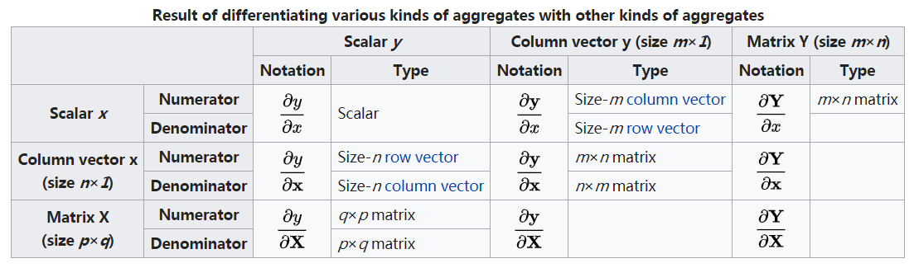

> - 数分中Jaccobi行列式采用分子布局，以下默认为分子布局

###	维度分析

维度分析：对求导结果的维度进行分析，得到矩阵微分结果

-	维度一般化：将向量、矩阵**维度置不同值**，便于考虑转置
-	拆分有关因子：利用**求导乘法公式**（一般标量求导）拆分
	因子，分别考虑各因子微分结果
-	变换微分因子、剩余因子（可能有左右两组），以满足矩阵运算
	维度要求
	-	微分因子：**按布局模式考虑维度、不转置**
	-	剩余因子：为满足最终结果符合维度布局，考虑转置
	-	若维度一般化也无法唯一确定剩余因子形式，再考虑行、列
		內积对应关系

> - 考虑到矩阵乘法定义（左乘矩阵行数为乘法结果行数），则在
	分子布局（分子行优先），简单微分中若微分因子为右乘矩阵、
	剩余因子为左乘矩阵，则类似标量**系数在前**求微分，否则
	结果需转置

####	例

-	考虑$\frac {\partial x^T A x} {\partial x}$，其中
	$A \in R^{n*n}, x \in R^n$

-	维度一般化：$\frac {\partial u^T A v} {\partial x}$，
	其中$A \in R^{a * b}, x \in R^n$

-	拆分有关因子，变换微分、剩余因子

	$$\begin{align*}
	\frac {\partial (u^T A) v} {\partial x} & = u^T A \frac
		{\partial v} {\partial x} \\
	\frac {\partial u^T (A v)} {\partial x} & = v^T A^T \frac
		{\partial u} {\partial x}
	\end{align*}$$

-	则有

	$$
	\frac {\partial x^T A x} {\partial x} = x^T (A^T + A)
	$$

##	关于标量导数

###	标量对标量

标量$y$对标量$x$求导：$\frac {\partial y} {\partial x}$

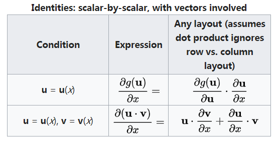

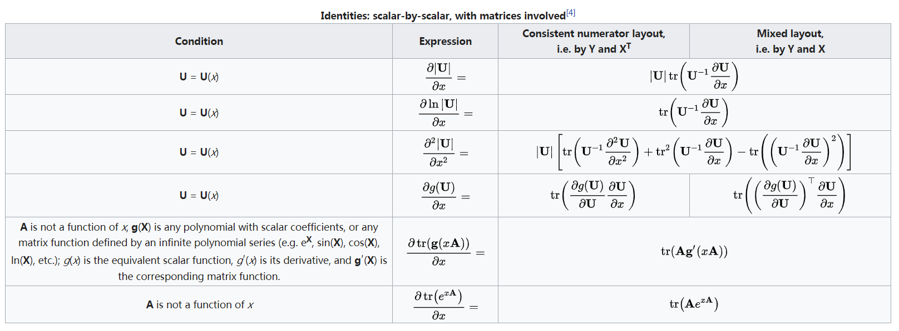

###	向量对标量

向量$Y$关于标量$x$求导（$Y$为行、列向量均如此）

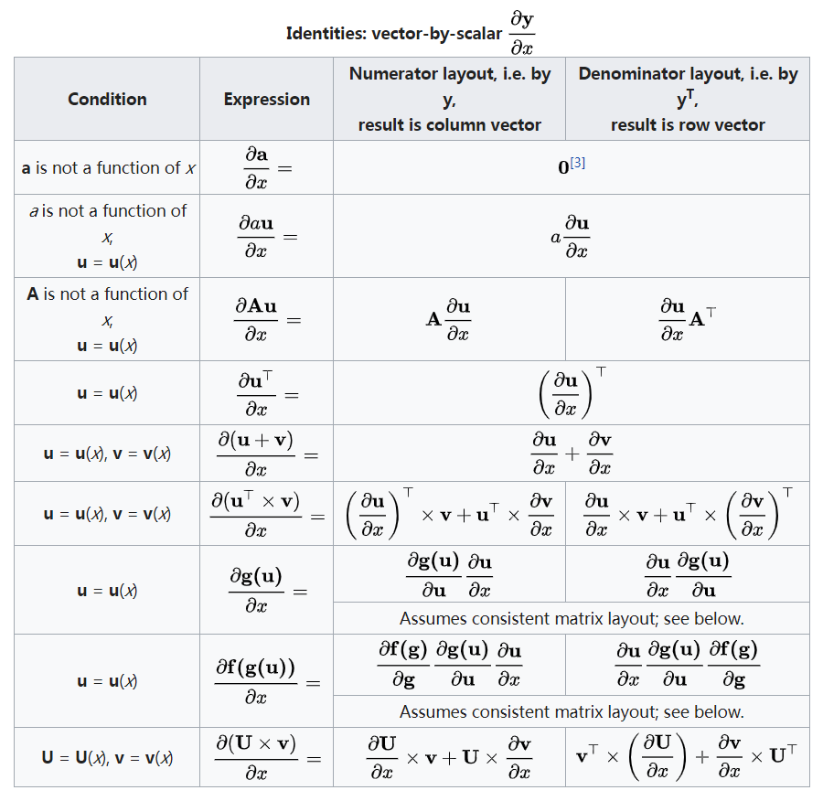

$$
\frac {\partial Y} {\partial x} = \begin{bmatrix}
	\frac {\partial y_1} {\partial x} \\
	\frac {\partial y_2} {\partial x} \\
	\vdots \\
	\frac {\partial y_n} {\partial x}
\end{bmatrix}
$$

###	矩阵对标量

矩阵$Y$关于标量$x$求导

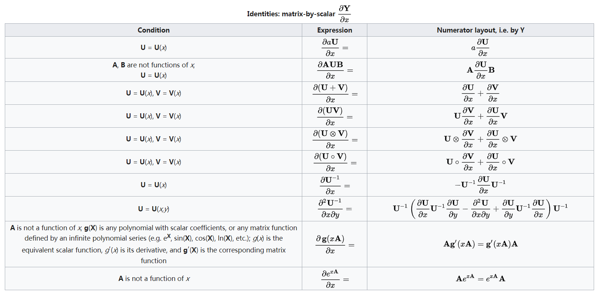

$$
\frac {\partial Y} {\partial x} = \begin{bmatrix}
	\frac {\partial y_{11}} {\partial x} & \frac
		{\partial y_{12}} {\partial x} & \cdots & \frac
		{\partial y_{1n}} {\partial x} \\
	\frac {\partial y_{21}} {\partial x} & \frac
		{\partial y_{22}} {\partial x} & \cdots & \frac
		{\partial y_{2n}} {\partial x} \\
	\vdots & \vdots & \ddots & \vdots \\
	\frac {\partial y_{n1}} {\partial x} & \frac
		{\partial y_{n2}} {\partial x} & \cdots & \frac
		{\partial y_{nn}} {\partial x} \\
\end{bmatrix}
$$

##	关于向量导数

###	标量对向量

标量$y$关于向量$X$求导

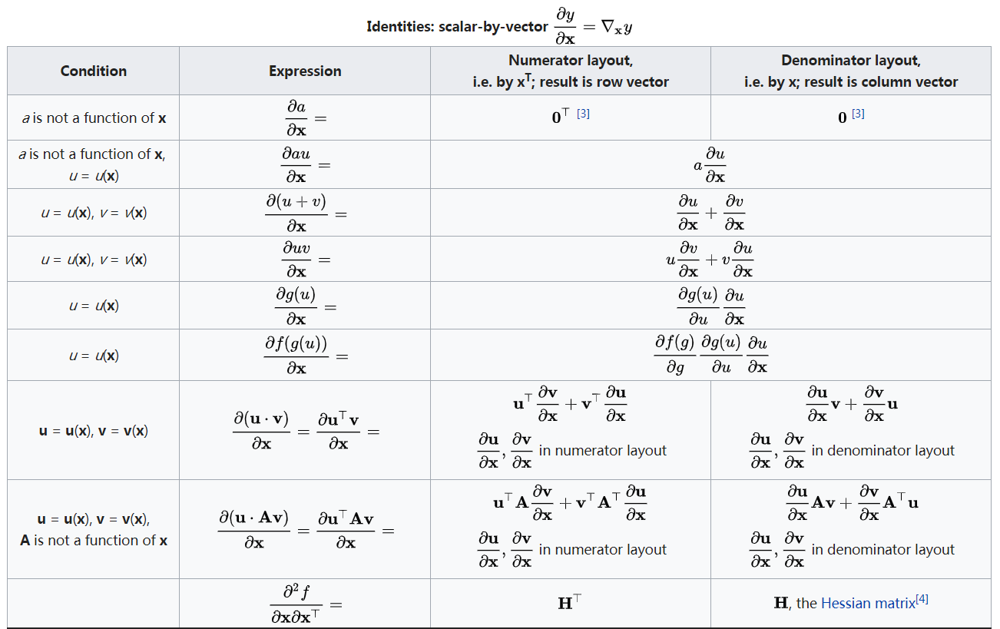
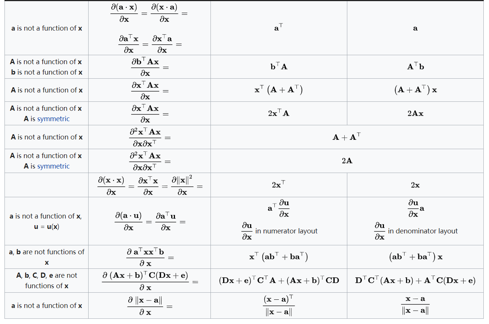

$$
\frac {\partial y} {\partial X} = [\frac {\partial y} 
	{\partial x_1}, \frac {\partial y} {\partial x_1},
	\cdots, \frac {\partial y} {\partial x_n}]
$$

###	向量对向量

向量$Y$关于向量$X$求导

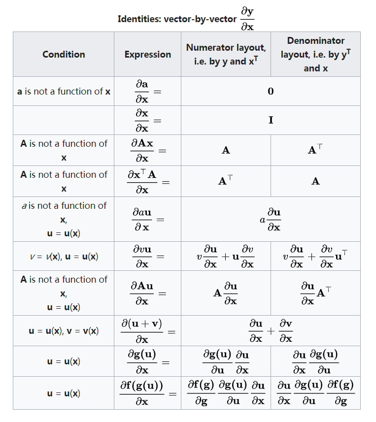

$$
\frac {\partial Y} {\partial X} = \begin{bmatrix}
	\frac {\partial y_1} {\partial x_1} & \frac
		{\partial y_1} {\partial x_2} & \cdots & \frac
		{\partial y_1} {\partial x_n} \\
	\frac {\partial y_2} {\partial x_1} & \frac
		{\partial y_2} {\partial x_2} & \cdots & \frac
		{\partial y_2} {\partial x_n} \\
	\vdots & \vdots & \ddots & \vdots \\
	\frac {\partial y_m} {\partial x_1} & \frac
		{\partial y_m} {\partial x_2} & \cdots & \frac
		{\partial y_m} {\partial x_n}
\end{bmatrix}
$$

> - $Y$、$X$为行、列向量均如此

##	关于矩阵导数

###	标量对矩阵求导

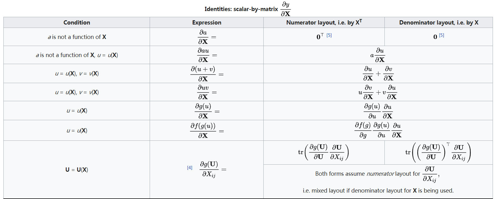
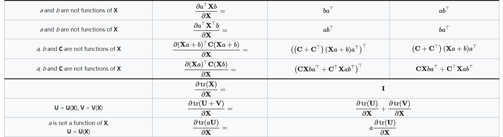
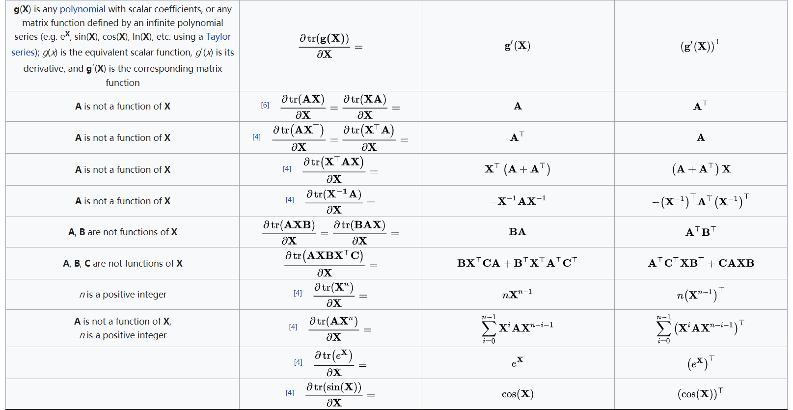
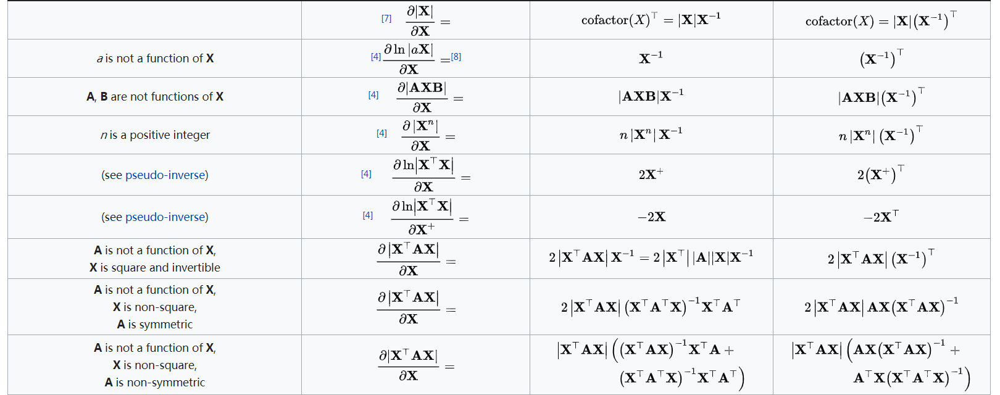

##	微分

###	微分形式

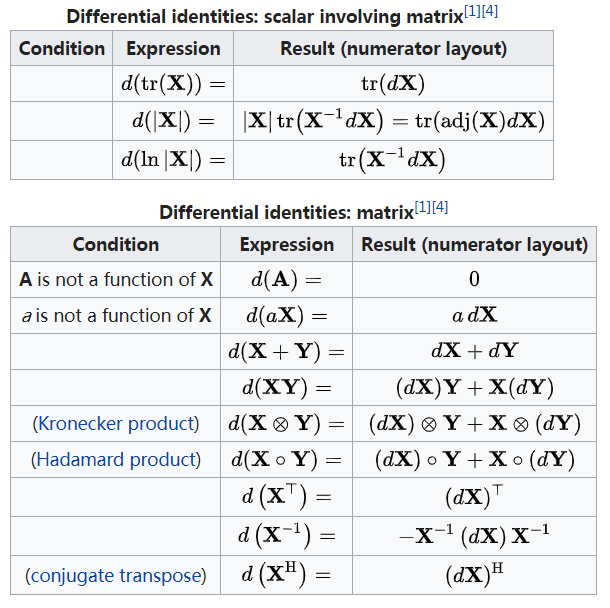

###	导数、微分转换

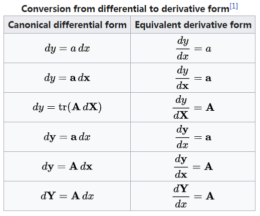

