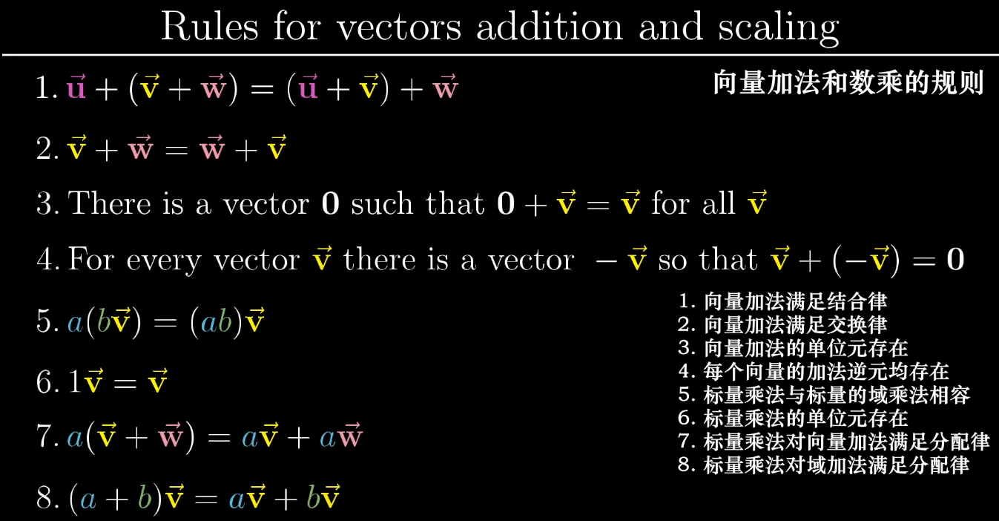
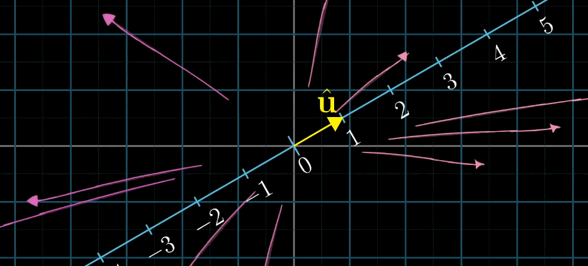
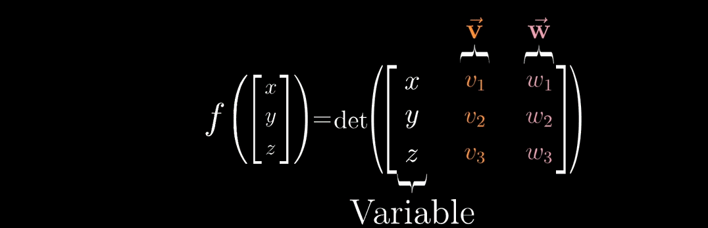
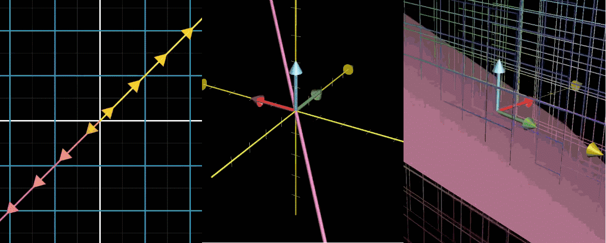
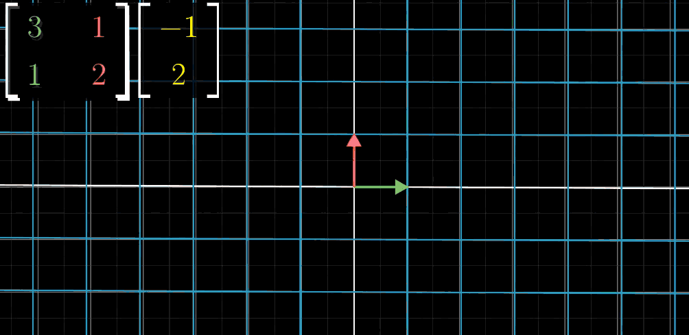
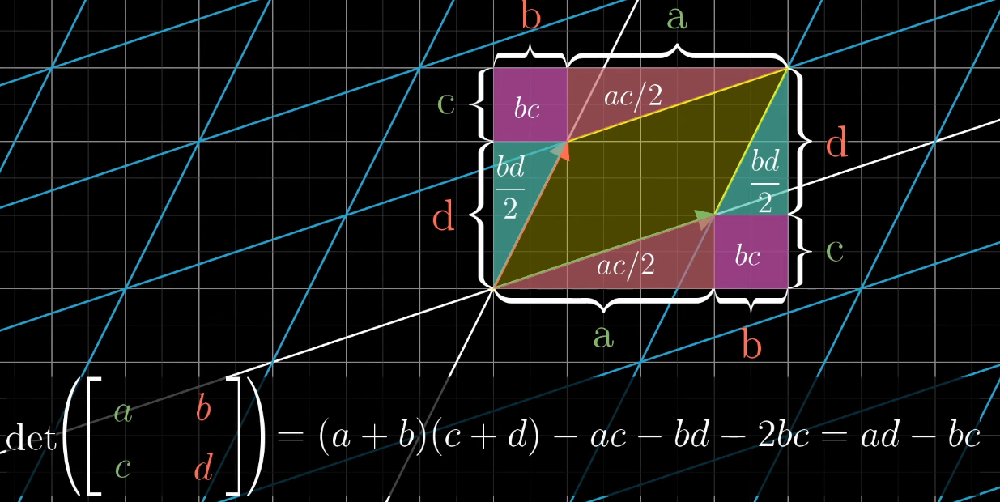

##	向量

-	线性组合
-	向量空间
-	空间的基：向量空间的一组基是张成该空间的一个线性无关向量集
-	线性相关

###	向量点积

-	向量点积性质
	-	向量的数乘等比例影响点积，则可为每个向量找到共线单位向量满足 $u \cdot u=1$

		

	-	点积等同于向量 $b$ 左乘矩阵 $a^T$，即把向量 $b$ 压缩（线性变换）至向量 $a$ 方向上

		

-	点积 $a \cdot b$ 与投影关系（假设向量 $a$ 为单位向量）
	-	投影，即将向量 $b$ **线性变换** 至 $a$ 方向上的标量
		-	则投影可以用 $1 * n$ 矩阵表示
		-	投影代表的矩阵则可通过利用基向量的变换结果求解

		

	-	向量 $a$ 本身作为单位向量
		-	坐标轴上单位向量与 $a$ 的内积即为 $a$ 该方向分量，也即 $a$ 在该轴上投影
		-	由对称性显然，坐标轴在 $a$ 方向投影等于 $a$ 在轴方向投影
		-	则投影到向量 $a$ 代表的线性变换矩阵即为 $a^T$

		

	-	扩展到一般情况
		-	考虑标量乘法对点积影响，坐标轴上向量与任意向量 $a$ 内积等价于投影
		-	投影是线性变换，则对空间一组基的变换可以推导到空间中任意向量 $b$

> - 高维空间到标量的线性变换与空间中一个向量对应，即应用线性变换等价于同该向量点积 

####	点积用途

-	向量证明基本都是都转换到点积上
	-	正定：行列式恒>0
	-	下降方向：内积<0
	-	方向（趋于）垂直：内积趋于0

####	求和、积分、点积、卷积

||连续（函数）|离散（向量）|
|-----|-----|-----|
|单元累计|积分：按值出现频率加权求和|求和：向量视为分段函数积分|
|二元累计|卷积：连续卷积|点积：离散卷积的特殊情况，即仅向量对应位置分量乘积有定义|

> - 卷积：累计中各点的值变为需累计的值，即二次累计

###	向量叉积

-	向量叉积意义
	-	向量叉积即寻找向量（到标量的线性变换），满足与其点积结果为张成的体积

		

	-	考虑点积性质，则向量叉积的方向与向量构成超平面垂直、模为超平面大小

		

###	一些规定

-	正交方向：向量空间 $R^n$ 中 $k, k \leq n$ 个向量 $q^{(1)}, \cdots, q^{(k)}$ 两两正交，则称其为 $k$ 个正交方向，若满足所有向量非 0，则称为 $k$ 个非 0 正交方向

-	向量左右
	-	左侧：向量逆时针旋转 $[0, \pi]$ 内
	-	右侧：反左侧

##	矩阵

-	矩阵（乘法）：对向量的变换
	-	对 $m * n$ 矩阵，即将 $n$ 维空间映射至 $m$ 维空间

-	矩阵相关概念
	-	（矩阵）秩：空间维数
	-	（矩阵）零空间/核：变换（左乘矩阵）后落在原点的向量的集合

	

> - 线性变换：保持空间中坐标轴仍为直线且原点保持不变的变换
> - 此处若无特殊说明，向量均以列向量作为基础

###	特殊矩阵

> - 其中正交矩阵、三角阵、对角阵也被成为因子矩阵

-	*Orthogonal Matrix* 正交矩阵：和其转置乘积为单位阵的方阵
	-	左乘正交矩阵几何意义：等价于旋转

		

	> - 酉矩阵/幺正矩阵：$n$ 个列向量是 $U$ 空间标准正交基的 $n$ 阶复方阵，是正交矩阵往复数域上的推广

-	*Diagonal Matrix* 对角阵：仅对角线非0的矩阵
	-	左乘对角阵矩阵几何意义：等价于对坐标轴缩放

		

-	*Triangular Matrix* 上/下三角矩阵：左下/右上角全为0的方阵
	-	三角阵是高斯消元法的中间产物，方便进行化简、逐层迭代求解线性方程组
	-	左乘上三角阵几何意义：等价于进行右上切变（水平斜拉）

		

	-	左乘下三角阵几何意义：等价于进行左下切变（竖直斜拉）

		

-	*Transposation Matrix* 置换矩阵：系数只由 0、1 组成，每行、列恰好有一个 1 的方阵

###	矩阵常用公式

###	*Sherman-Morrison* 公式

> - 设A是n阶可逆矩阵，$u, v$均为n为向量，若
	$1 + v^T A^{-1} u \neq 0$，则扰动后矩阵$A + u v^T$可逆
	$$
	(A + u v^T)^{-1} = A^{-1} - \frac {A^{-1} u v^T A^{-1}}
		{1 + v^T A^{-1} u}
	$$

##	矩阵乘法

-	矩阵乘法

	-	向量左乘矩阵：即是对向量进行变换

		

	-	矩阵乘积：复合变换

		

> - 矩阵乘法应按照从右往左阅读，右侧矩阵为输入、左侧矩阵为变换（向量默认为列向量时）

###	*Affline Transformation*

仿射变换：对向量空间进行线性变换、平移得到另一个向量空间

$$\begin{align*}
y &= Ax + b \\
y &= (A|b^T) \begin {bmatrix} x \\ 1 \end {bmatrix}
\end{align*}$$

> - $y \in R^n, x \in R^n$
> - $A \in R^{n * n}$：可视为产生旋转、放缩
> - $b \in R^n$：可视为产生平移

-	仿射变换可以理解为：放缩、旋转、平移

-	从仿射变换的角度，对向量空间进行仿射变换
	-	$n+1$ 对变换前、变换后向量坐标即可以求解仿射变换的全部参数
	-	变换后的向量之间仍然保留某种相关性，所以 $n+1$ 对向量坐标可以完全确定仿射变换

-	从仿射变换几何含义，将向量空间中向量统一变换
	-	$n+1$ 个不共线 $n$ 维向量即唯一确定n维空间
	-	若所有向量变换均遵循同一“线性”变换规则，即进行相同放缩、旋转、平移，则这样的变换可以使用仿射变换表示

-	说明
	-	$n$ 变换前、变换后向量坐标可以求解 $A$（不考虑 $b$），但第 $n+1$ 对向量坐标未必满足 $A$ 变换
	-	若 $n+2$ 对向量坐标不满足 $(A|b)$ 的解，则表示不是进行仿射变换

###	*Perspective Transformation*

透视变换：将向量空间映射到更高维度，再降维到另一向量空间

$$\begin{align*}
y &= P \begin {bmatrix} x \\ 1 \end {bmatrix} \\
y &= \begin {bmatrix} A & b \\ c & p_{n+1,n+1} \end {bmatrix}
	\begin {bmatrix} x \\ 1 \end {bmatrix}
\end{align*}$$

> - $P \in R^{(n+1) * (n+1)}, A \in R^{n * n}$
> - $x \in R^n, y \in R^{n+1}$：这里默认$x$第$n+1$维为1
> - $c$：可视为产生透视，若其为0向量，则退化为仿射变换
> - $p_{n+1,n+1}$：可视为决定透视放缩，所以若是已确定新向量空间的“位置”，此参数无效，即 $n+2$ 对向量坐标即可求解变换

-	透视变换虽然是向量空间变换至另一向量空间，但仍然存在一个透视“灭点”，作为所有透视线的交点
	-	对平面成像而言，“灭点”是成像平面、视角决定

-	变换后 $y$ 维数增加，一般会再次投影、缩放回原维度空间，如原向量空间 $(R^n,1)$

> - 仿射变换可以视为是新的向量空间和原始空间“平行”的透视变换特例

####	变换矩阵求解

$$\begin{align*}
\begin {bmatrix} P & b \\ c & p_{n+1,n+1} \end {bmatrix}
	\begin {bmatrix} x \\ 1 \end {bmatrix} &=
	\gamma \begin {bmatrix} x^{'} \\ 1 \end {bmatrix} \\
\Rightarrow Px + b &= \gamma x^{'} \\
	c^Tx + p_{n+1,n+1} &= \gamma \\
\Rightarrow Px + b &= (c^Tx + p_{n+1,n+1}) x^{'}
\end{align*}$$

> - 考虑变换后再次缩放回更低维 $(R^n,1)$ 向量空间
> - $\gamma$：变换后向量缩放比例

-	可解性
	-	共 $n+2$ 对变换前、后向量坐标，即 $n*(n+2)$ 组方程
	-	对每对向量，其中 $n$ 组方程如上可以看出是齐次方程组，**不包含常数项**
	-	则对 $P \in R^{(n+1) * (n+1)}$ 中除 $p_{n+1,n+1}$ 其他项均可被其比例表示（不含常数项）

> - 当然 $p_{n+1,n+1}$ 可以置 1 参加运算，不影响结果

##	*Determinant*

-	矩阵行列式几何意义：线性变换对空间的拉伸比例
	-	行列式绝对值：拉伸的比例的绝对大小
		-	行列式为 0 时则表示空间降维
		-	则显然应有 $det(M_1 * M_2) = det(M_1) det(M_2)$
	-	行列式正负号：拉伸的方向

	

-	矩阵行列式的用途
	-	行列式为 0 意味着矩阵表示降维变换，则对应线性方程组仅在方程组右侧在矩阵张成空间内，即扩展矩阵秩不增时有解

###	特别的

-	$2 * 2$ 矩阵 $\begin{vmatrix} a & b \\ c & d \end{vmatrix} = ad - bc$
	-	$a, d$ 分别表示 $(1,0)$、$(0,1)$ 正向放缩比例
	-	而 $b, c$ 则相应的为逆向放缩比例

	

-	二维三点：行列式绝对值为三点构成三角形面积两倍

	$$
	\begin{vmatrix}
		x_1 & y_1 & 1 \\
		x_2 & y_2 & 1 \\
		x_3 & y_3 & 1 \\
	\end{vmatrix} = 
	x_1y_2 + x_3y_1 + x_2y_3 - x_3y_2 - x_2y_1 - x_1y_3
	$$

	> - $q_3$ 位于 $\overrightarrow{q_1q_2}$ 左侧：行列式大于0
	> - $q_3q_1q_2$ 共线：行列式值为 0

-	三维三点：行列式为三个向量张成的平行六面体体积

##	*Eigen Value*、*Eigen Vector*

-	矩阵（变换）特征向量、特征值几何意义
	-	特征向量：在线性变换后仍然在自身生成空间中，即保持方向不变，仅是模变化的向量
	-	特征值：对应特征向量模变化的比例

-	特殊变换中的特征向量、特征值情况
	-	旋转变换：特征值为 $\pm i$，没有特征向量，即特征值为复数表示某种旋转
	-	剪切变换（$\begin{vmatrix} A^{'} & 0 \\ 0 & 1 \end{vmatrix}$$：必然有特征值为 1，且对应特征向量在坐标轴上
	-	伸缩变换（$\lambda E$）：所有向量都是特征向量

-	矩阵对角化
	-	矩阵对角化：即寻找一组基，使得线性变换对该组基向量仅引起伸缩变换
	-	定理：当且仅当 $n$ 阶矩阵 $A$ 有 $n$ 个线性无关的特征向量时，其可以对角化
		-	即变换后有 $n$ 个线性无关向量在自身生成空间中
		-	也即矩阵对应变换为线性变换

##	线性方程组

###	Gaussian Elimination

高斯消元法：初等变换n个线性方程组为等价方程组，新方程组系数矩阵为上三角矩阵

-	三角系数矩阵可以方便的递推求解
-	初等变换可将系数矩阵变换为上三角矩阵，而不影响方程解

##	参考资料

-	<https://www.bilibili.com/video/av6731067/>
-	<https://charlesliuyx.github.io/2017/10/06/%E3%80%90%E7%9B%B4%E8%A7%82%E8%AF%A6%E8%A7%A3%E3%80%91%E7%BA%BF%E6%80%A7%E4%BB%A3%E6%95%B0%E7%9A%84%E6%9C%AC%E8%B4%A8/>

