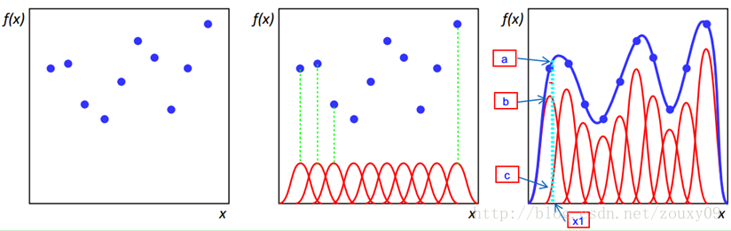

###	*Radial Basis Function*

-	*RBF* 径向基函数：取值仅依赖到原点距离的实值函数，即 $\phi(x) = \phi(\|x\|)$
	-	也可以按照距离某中心点 $c$ 的距离定义，即 $\phi(x) = \phi(\|x-c\|)$
	-	其中距离一般为使用 $L_2$ 范数，即欧式距离
	-	函数 $\phi$ 一般与 $\|x\|$ 负相关

-	径向基函数最初用于解决多变量插值问题
	-	即以各样本为中心创建多个径向基函数
	-	多个径向基函数加权加和即得到拟合的函数曲线，可用于函数插值

	

####	常见径向基函数

> - 定义 $r=\|x-x_i\|$

-	高斯函数

	$$\phi(r) = e^{-(\epsilon r)^2}$$

-	*Multiquadric*多二次函数：

	$$\phi(r) = \sqrt {1 + (\epsilon r)^2}$$

-	*Inverse Quadric*逆二次函数：

	$$\phi(r) = \frac 1 {1 + (\epsilon r)^2}$$

-	*Polyharmonic Spline*多重调和样条：

	$$\begin{align*}
	\phi(r) &= r^k, & k=1,3,5,\cdots \\
	\phi(r) &= r^k (ln(r))^{}, & k=2,4,6,\cdots  \\
	\end{align*}$$

-	*Thin Plate Spline*薄板样条（多重调和样条特例）：

	$$\phi(r) = r^2 ln(r)$$

