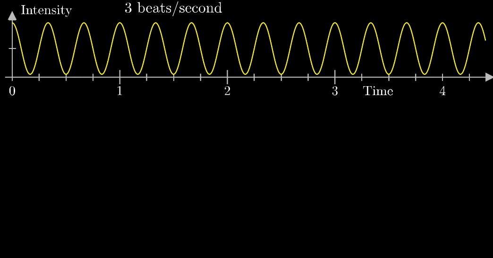
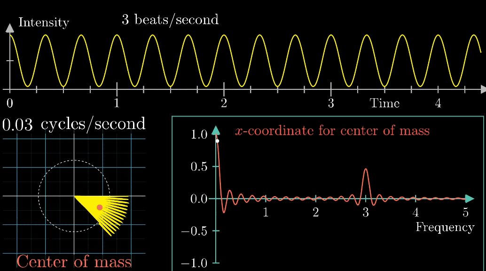

##	*Fourier Transformation*

（连续）傅里叶变换：将时域映射到频域的变换

$$
F(\xi) = \int_{-\infty}^{+\infty} f(x) e^{-2\pi ix \xi} dx
$$

> - $x$：自变量，多表示时间
> - $F(\xi)$：频率

###	傅里叶变换理解

-	将自变量 $x$ 线性映射为极坐标系中角度，调整线性映射的比例（即频率），即可绘制出不同的曲线

	

-	计算不同频率下曲线围成的图像的质心（径向）坐标
	-	质心的角度坐标只需原函数沿 $x$ 轴平移即可改变
	-	若原图像不关于 $x$ 轴对称，则质心在频率 0 点处有较大值

	

-	据以上：周期函数映射在极坐标系下图像，其质心位置在对应频率下取波峰值

> - <https://charlesliuyx.github.io/2018/02/18/%E3%80%90%E7%9B%B4%E8%A7%82%E8%AF%A6%E8%A7%A3%E3%80%91%E8%AE%A9%E4%BD%A0%E6%B0%B8%E8%BF%9C%E5%BF%98%E4%B8%8D%E4%BA%86%E7%9A%84%E5%82%85%E9%87%8C%E5%8F%B6%E5%8F%98%E6%8D%A2%E8%A7%A3%E6%9E%90/>

###	傅里叶变换计算

-	利用复数项 $e^{-2\pi ix \xi}$ 表示在复平面中的旋转角度
	-	$x$ 为函数自变量，$\xi$ 为频率（即自变量映射比例）
	-	傅里叶变换中旋转为缺省为顺时针，所以补足负号
	-	函数在复平面中则表示为 $f(x) e^{-2\pi ix \xi}$

-	函数围成的曲线质心则为 $\frac 1 {x_2 - x_1} \int_{x_1}^{x_2} f(x) e^{-2\pi ix \xi} dx$
	-	系数 $\frac 1 {x_2 - x_1}$ 将积分结果放缩回质心，可省略
	-	将原积分区域外函数值定为 0，积分上下限扩展至 $-\infty, \infty$ 不影响积分结果
	-	函数有效取值部分越长，质心波动约迅速

##	傅里叶变换

###	*Discrete Fourier Transformation*

*DFT*：归一化二维离散傅里叶变换

$$\begin{align*}
F(u,v) & = \frac 1 {\sqrt{NM}} \sum_{x=0}^{N-1}
	\sum_{y=0}^{M-1} f(x,y) e^{-\frac {2\pi i} N ux}
	e^{-\frac {2\pi i} M vy} \\
f(x,y) & = \frac 1 {\sqrt{NM}} \sum_{u=0}^{N-1}
	\sum_{v=0}^{M-1} F(u,v) e^{\frac {2\pi i} N ux}
	e^{\frac {2\pi i} M vy} \\
\end{align*}$$

###	*Discrete Consine Transformation*

余弦变换

> - 在给定区间为满足狄利克雷条件的连续实对称函数，可以展开为
	仅含余弦项的傅里叶级数

-	对于定义在正实数域上的函数，可以通过偶延拓、或奇延拓满足
	上述条件

###	离散余弦变换

-	$(x,y) or (u,v) = (0,0)$时

	$$\begin{align*}
	F(u,v) & = \frac 1 N \sum_{x=0}^{N-1} \sum_{y=0}^{N-1}
		f(x,y) cos[\frac \pi N u(x + \frac 1 2)]
		cos[\frac \pi N v(y + \frac 1 2)] \\
	f(x,y) & = \frac 1 N \sum_{u=0}^{N-1} \sum_{v=0}{N-1}
		F(u,v) cos[\frac \pi N u(x + frac 1 2)]
		cos[\frac \pi N v(y + \frac 1 2)]
	\end{align*}$$

-	其他

	$$\begin{align*}
	F(u,v) & = \frac 1 {2N} \sum_{x=0}^{N-1} \sum_{y=0}^{N-1}
		f(x,y) cos[\frac \pi N u(x + \frac 1 2)]
		cos[\frac \pi N v(y + \frac 1 2)] \\
	f(x,y) & = \frac 1 {2N} \sum_{u=0}^{N-1} \sum_{v=0}{N-1}
		F(u,v) cos[\frac \pi N u(x + frac 1 2)]
		cos[\frac \pi N v(y + \frac 1 2)]
	\end{align*}$$

