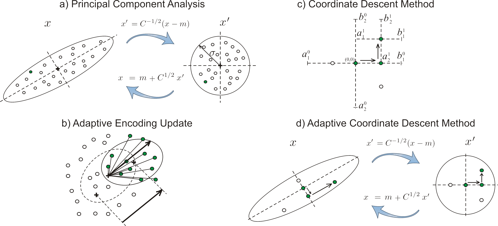
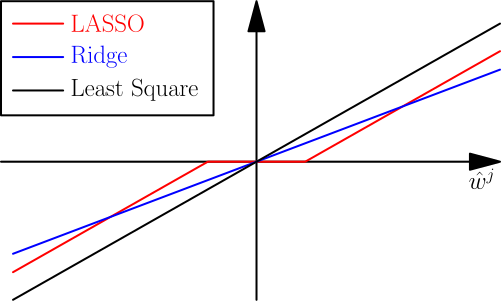

##	坐标下降

坐标下降法：在当前点处延一个坐标方向进行一维搜索以求得函数
的局部极小值

-	非梯度优化算法，但能提供超过一阶的信息
	-	SMO算法就是两块贪心坐标下降

###	说明

-	优化方向从算法一开始就固定，如：选择线性空间中一组基作为
	搜索方向

-	循环极小化各坐标方向上目标函数值，即：若$x^k$给定，则

	$$
	x_i^{(k+1)} = \arg\min_{x \in R} f(x_1^{k+1}, \cdots,
		x_{i-1}^{k+1}, x, x_{i+1}^{k}, \cdots, x_n^k)
	$$

	> - $k$：第k轮迭代
	> - $i$：某轮迭代中更新第i个方向

-	对初始值为$X_0$得到迭代序列$X_1, \cdots, X_n$，对精确
	一维搜索类似最速下降有

	$$
	F(X_0) \geq F(X_1) \geq \cdots \geq F(x_n)
	$$

-	若某轮迭代中目标函数无法被有优化，说明已经达到驻点

###	Adaptive Coordinate Descent

自适应坐标下降：变换坐标系使得在考虑目标函数的情况下，新坐标
间尽可能不相关

-	对非可拆分函数（可加？），算法可能无法在较小迭代步数中
	求得最优解
	-	可采用适当坐标系加速收敛，如：主成分分析进行自适应
		编码
	-	性能远超过传统坐标下降算法，甚至可以达到梯度下降的
		性能

	

-	自适应坐标下降具有以下特性，和最先进的进化算法相当
	-	缩放不变性
	-	旋转不变性

###	Block Coordinate Descent

块坐标下降：在当前点处在一个超平面内方向进行搜索以求得函数
的局部极小值

-	即同时更新一组坐标的坐标下降

###	例

####	Lasso求解

-	目标函数

	$$
	L(x) = RSS(x) + \lambda \|x\|_1 = \frac 1 2 (Ax - y)^T(Ax - y)
		+ \lambda \|x\|_1
	$$

-	RSS求导

	$$\begin{align*}
	\frac {\partial RSS} {\partial x} & = (Ax - y)^T A \\
	(\frac {\partial RSS} {\partial x})_i & = (Ax - y)^T A_{:i} \\
	& = (Ax_{i0} - y)^T A_{:i} + x_i A_{:i}^T A_{:i} \\
	& = z_i + \rho_i x_i
	\end{align*}$$

	> - $(\frac {\partial RSS} {\partial x})_i$：RSS对$x$
		导数第$i$分量，即对$x_i$偏导
	> - $A_{:i}$：$A$第$i$列
	> - $x_{i0}$：$x$第$i$分量置零
	> - $z_i = (Ax_{i0} - y)^T A_{:i}$
	> - $\rho_i = A_{:i}^T A_{:i}$

-	则$x_i$整体次梯度为

	$$
	\frac {\partial L} {\partial x_i} = z_i + \rho_i x_i +
		\left \{ \begin{array}{l}
			-\lambda, & x_i < 0 \\
			[-\lambda, \lambda], & x_i = 0 \\
			\lambda, & x_i > 0
		\end{array} \right.
	$$

-	分类讨论：令整体次梯度为0求解$x_i$、回带确定参数条件

	$$
	x_i = \left \{ \begin{array}{l}
		\frac {-z_i + \lambda} {\rho_i}, & z_i > \lambda \\
		0 , & -\lambda < z_i < \lambda \\
		\frac {-z_i - \lambda} {\rho_i}, & z_i < -\lambda
	\end{array} \right.
	$$

	> - 此算子也称*soft threshholding*

	

