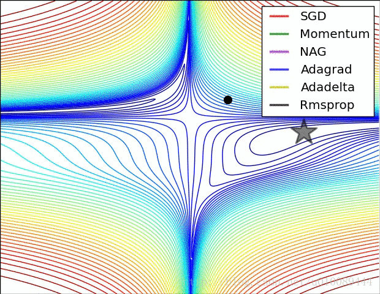

##	思想：最速下降&牛顿

对目标函数$f(x)$在$x^{(1)}$进行展开

$$
f(x) = f(x^{(1)}) + \nabla f(x^{(1)})(x - x^{(1)})+
	\frac 1 2 \nabla^2 f(x^{(1)})(x - x^{(1)})^2 +
	o((x - x^{(1)})^2)
$$

> - 最速下降法：只保留一阶项，即使用线性函数近似原目标函数
> - Newton法：保留一阶、二阶项，即使用二次函数近似

-	利用近似函数求解元素问题极小值
	-	最速下降法：**线性函数无极值，需要确定步长、迭代**
	-	Newton法：**二次函数有极值，直接求导算出极值、迭代**

-	最速下降法
	-	只考虑一阶导：甚至说根本没有考虑拟合原目标函数

-	Newton法
	-	考虑二阶导：每步迭代还考虑了二阶导，即当前更新完毕
		后，下一步能够更好的更新（二阶导的意义）
	-	甚至从后面部分可以看出，Newton法甚至考虑是全局特征，
		不只是局部性质（前提目标函数性质足够好）
	-	二次函数拟合更接近函数极值处的特征

##	最速下降算法

###	思想

-	设$x=x(t)$为最优点$x$从初始点、沿负梯度方向经过的曲线，
	则有

	$$\left \{ \begin{array}{l}
	& \frac {dx(t)} {dt} = -\nabla f(x(t)) \\
	& x(t_1) = x^{(1)}
	\end{array} \right.$$

	> - $t_1, x^{(1)}$：初始时刻、初始位置

-	可以证明，$x(t)$解存在，且$t \rightarrow \infty$时，有
	$x(t) \rightarrow x^{ * }$，即得到无约束问题最优解

-	但微分方程组求解可能很麻烦，可能根本无法求解
	-	考虑将以上曲线离散化，每次前进到“不应该”前进为止
	-	然后更换方向，逐步迭代得到最优解

###	算法

> - 搜索方向最速下降方向：负梯度方向
> - 终止准则：$\nabla f(x^{(k)})=0$

1.	取初始点$x^{(1)}$，置k=1

2.	若$\nabla f(x^{(k)})=0$，则停止计算，得到最优解，
	否则置
	$$d^{(k)} = -\nabla f(x^{(k)})$$
	以负梯度作为前进方向

3.	一维搜索，求解一维问题
	$$
	\arg\min_{\alpha} \phi(\alpha) =
		f(x^{(k)} + \alpha d^{(k)})
	$$
	得$\alpha_k$前进步长，置
	$$
	x^{(k+1)} = x^{(k)} + \alpha_k d^{(k)}
	$$

4.	置k=k+1，转2

> - 最速下降算法不具有二次终止性

##	叠加惯性

模拟物体运动时惯性：指数平滑更新步长

###	*Momentum*

冲量方法：在**原始更新步**上叠加上次更新步，类似指数平滑

$$
v^{(t)} = \gamma v^{(t-1)} + (1 - \gamma) \eta
	\bigtriangledown_\theta L(\theta^{(t-1)}) \\
\theta^{(t)} = \theta^{(t-1)} - v^{(t)}
$$

> - $v^{(t)}$：第$t$步时第k个参数更新步
> - $L(\theta)$：往往是batch损失函数

-	更新参数时，一定程度**保持**上次更新方向
-	可以在一定程度上保持稳定性，学习速度更快
-	能够越过部分局部最优解

###	*Nesterov Momentum*

*NGA*：在使用冲量修正最终方向基础上，使用冲量对当前
**参数位置**进行修正，即使用“未来”位置计算梯度

-	先使用冲量更新一步
-	再在更新后位置计算新梯度进行第二步更新

$$
v^{(t)} = \gamma v^{(t-1)} + \eta \bigtriangledown_\theta
	L(\theta^{(t-1)} - \gamma v^{(t-1)}) \\

\theta^{(t)} = \theta^{(t-1)} - v^{(t)}
$$

##	动态学习率

-	学习率太小收敛速率缓慢、过大则会造成较大波动
-	在训练过程中动态调整学习率大小较好

> - 模拟退火思想：达到一定迭代次数、损失函数小于阈值时，减小
	学习速率

###	*Vanilla Gradient Descent*

每次迭代减小学习率$\eta$

$$
\eta^{(t)} = \frac \eta {\sqrt {t+1}} \\

\theta^{(t)} = \theta^{(t-1)} - \eta^{(t)}
	\bigtriangledown_\theta L(\theta^{(t-1)})
$$

-	学习率逐渐减小，避免学习后期参数在最优解附近反复震荡

###	*Adagrad*

*adaptive gradient*：训练中**不同参数**学习率随着迭代次数、
梯度动态变化，使得参数收敛更加平稳

$$
v^{(t)}_k = \bigtriangledown_{\theta_k} L(\theta^{(t-1)}) \\

\theta^{(t)}_k = \theta^{(t-1)}_k - \frac \eta
	{\sqrt {\sum_{i=0}^{t-1} (v^{(i)}_k)^2 + \epsilon}}
	v^{(t)}_k
$$

> - $\epsilon$：fuss factor，避免分母为0
> - $\theta^{(t)}_k$：第t轮迭代完成后待估参数第k个分量
	（之前未涉及参数间不同，统一为向量）

-	特点

	-	较大梯度参数真正学习率会被拉小；较小梯度真正学习率
		参数被拉小幅度较小
	-	可以和异步更新参数结合使用，给不常更新参数更大学习率

-	缺点

	-	在训练后期，分母中梯度平方累加很大，学习步长趋于0，
		收敛速度慢（可能触发阈值，提前结束训练）

###	*RMSprop*

*root mean square prop*：指数平滑更新学习率分母

$$
v^{(t)}_k = \bigtriangledown_{\theta_k} L(\theta^{(t-1)}) \\

\theta^{(t)}_k = \theta^{(t-1)}_k - \frac \eta
	{\sqrt { \gamma \sum_{i=1}^{t-1}(v^{(i)}_k)^2 +
		(1 - \gamma)((v^{(t)})^2 + \epsilon}
	} v^{(t)}
$$

-	赋予当前梯度更大权重，减小学习率分母，避免学习速率下降
	太快

###	*Adam*

*adptive moment estimation*：指数平滑更新步、学习率分母

$$
\begin{align*}
v^{(t)}_k & = \gamma_1 v^{(t-1)}_k + (1 - \gamma_1)
	\bigtriangledown_{\theta_k} L(\theta^{(t-1)}) \\
s^{(t)}_k & = \gamma_2 s^{(t-1)}_k + (1 - \gamma_2)
	\bigtriangledown_{\theta_k} L(\theta^{(t-1)})^2 \\

\hat{v^{(t)}_k} & = \frac {v^{(t)}_k} {1 - \gamma_1^t} \\
\hat{s^{(t)}_k} & = \frac {s^{(t)}_k} {1 - \gamma_2^t} \\

\theta^{(t)}_k & = \theta^{(t-1)}_k - \frac \eta
	{\sqrt{\hat{s^{(t)}_k} + \epsilon}} \hat{v^{(t)}_k}
\end{align*}
$$

> - $\gamma_1$：通常为0.9
> - $\gamma_2$：通常为0.99
> - $\hat{v^{(t)}_k} = \frac {v^{(t)}_k} {1 - \gamma_1^t}$
	：权值修正，使得过去个时间步，小批量随机梯度权值之和为1

-	利用梯度的一阶矩$v^{(t)}$、二阶矩$s^{(t)}$动态调整每个
	参数学习率

-	类似于*mommentum*、*RMSprop*结合

-	经过偏执矫正后，每次迭代学习率都有确定范围，参数比较平稳

###	*Adadelta*

指数平滑更新学习率（分子）、学习率分母

$$
\begin{align*}
s^{(t)}_k & = \gamma_1 s^{(t-1)}_k + (1 - \gamma_1)
	\bigtriangledown_{\theta_k} L(\theta^{(t-1)})^2 \\

\hat{v^{(t)}_k} & = \sqrt {\frac {\Delta \theta^{(t-1)}_k + \epsilon}
	{s^{(t)}_k + \epsilon}}
	\bigtriangledown_{\theta_k} L(\theta^{(t-1)})^2 \\

\Delta \theta^{(t)}_k & = \gamma_1 \Delta \theta^{(t-1)}_k +
	(1 - \gamma_1) \hat{v^{(t)}_k}^2 \\

\theta^{(t)}_k & = \theta^{(t)}_k - \hat{v^{(t)}_k}
\end{align*}
$$

> - $s, \Delta \theta$共用超参$\gamma_1$

-	在*RMSprop*基础上，使用$\sqrt {\Delta \theta}$作为学习率
-	$\hat v$：中超参$\gamma_1$在分子、分母“抵消”，模型对
	超参不敏感

##	样本量

###	Singular Loss/Stocastic Gradient Descent

*SGD*：用模型在某个样本点上的损失极小化目标函数、计算梯度、
更新参数

-	单点损失度量模型“一次”预测的好坏
	-	代表模型在单点上的优劣，无法代表模型在总体上性质
	-	具有很强随机性

-	单点损失不常用，SGD范围也不局限于单点损失

> - 损失函数具体参见*ml_xxxxx*

###	全局估计

全局损失：用模型在全体样本点上损失极小化目标函数、计算梯度、
更新参数

$$
\theta^{(t)} = \theta^{(t-1)} - \eta \bigtriangledown_\theta
	L_{total}(\theta_{(t-1)})
$$

> - $\theta^{(t)}$：第t步迭代完成后待估参数
> - $\eta$：学习率
> - $L_{total}(\theta) = \sum_{i=1}^N L(\theta, x_i, y_i)$：
	训练样本整体损失
> - $N$：训练样本数量

-	若损失函数有解析解、样本量不大，可**一步更新（计算）**
	完成（传统参数估计场合）
	-	矩估计
	-	最小二乘估计
	-	极大似然估计

-	否则需要迭代更新参数
	-	样本量较大场合
	-	并行计算

###	Mini-Batch Loss

*mini-batch loss*：用模型在某个batch上的损失极小化目标函数、
计算梯度、更新参数

$$
\theta^{(t)} = \theta^{(t-1)} - \eta \bigtriangledown_\theta
	L_{batch}(\theta^{(t-1)})
$$

> - $L_{batch}(\theta)=\sum_{i \in B} L(\theta, x_i, y_i)$：
	当前batch整体损失
> - $B$：当前更新步中，样本组成的集合batch

-	batch-loss是模型在batch上的特征，对整体的代表性取决于
	batch大小
	-	batch越大对整体代表性越好，越稳定；越小对整体代表
		越差、不稳定、波动较大、难收敛
	-	batch大小为1时，就是SGD
	-	batch大小为整个训练集时，就是经验（结构）风险

-	batch-loss是学习算法中最常用的loss，SGD优化常指此
	-	实际中往往是使用batch-loss替代整体损失，表示经验风险
		极小化
	-	batch-loss同样可以带正则化项，表示结构风险极小化
	-	损失极值：SVM（几何间隔最小）

####	优点

-	适合样本量较大、无法使用样本整体估计使用
-	一定程度能避免局部最优（随机batch可能越过局部极值）
-	开始阶段收敛速度快

####	缺点

-	限于每次只使用单batch中样本更新参数，batch-size较小时，
	结果可能不稳定，往往很难得到最优解

-	无法保证良好的收敛性，学习率小收敛速度慢，学习率过大
	则损失函数可能在极小点反复震荡

-	对所有参数更新应用相同学习率，没有对低频特征有优化
	（更的学习率）

-	依然容易陷入局部最优点

