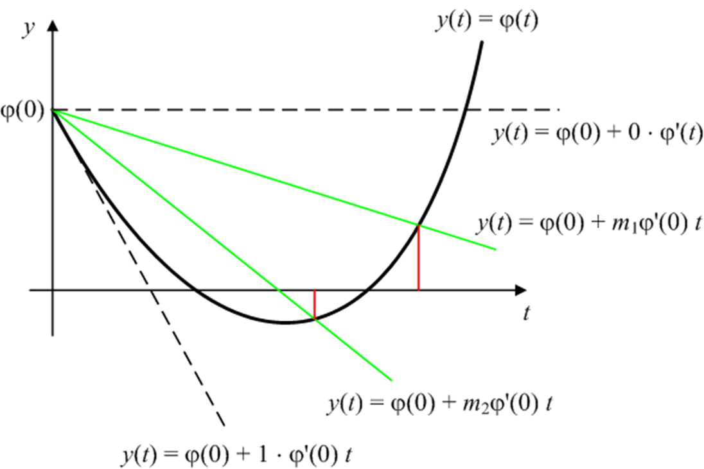
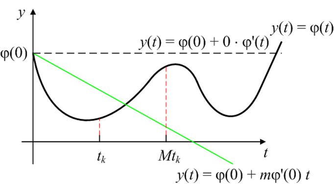

##	综述

一维搜索/线搜索：单变量函数最优化，即求一维问题
$$
\arg\min _ {\alpha} \phi(\alpha) = f(x^{(k)} +
	\alpha d^{(k)})
$$
最优解的$\alpha_k$的数值方法

-	*exact line search*：精确一维搜索，求得**最优步长**
	$\alpha_k$使得目标函数沿着$d^{(k)}$方向达到极小，即

-	*inexact line search*：非精确一维搜索，求得$\alpha_k$
	使得
	$$\begin{align*}
	f(x^{(k)} + \alpha_k d^{(k)}) & < f(x^{(k)}) \\
	\phi(\alpha_k) & < \phi(0)
	\end{align*}$$

###	一维搜索基本结构

-	确定搜索区间
-	用某种方法缩小搜索区间
-	得到所需解

###	搜索区间

> - 搜索区间：设$\alpha^{ * }$是$\phi(\alpha)$极小点，若存在
	**闭区间**$[a, b]$使得$\alpha^{ * } \in [a, b]$，则称
	$[a, b]$是$phi(\alpha)$的搜索区间

####	确定搜索区间的进退法

1.	取初始步长$\alpha$，置初始值

	$$
	\mu_3 = 0, \phi_3 = \phi(\mu_3), k = 0
	$$

2.	置

	$$
	\mu = \mu_3 + \alpha, \phi = \phi(\mu), k = k+1
	$$

3.	若$\phi < \phi_3$，置

	$$
	\mu_2 = \mu_3, \phi_2 = \phi_3 \\
	\mu_3 = \mu, \phi_3 = \phi \\
	\alpha = 2\alpha, k = k+1
	$$

4.	若k =1，置

	$$
	\mu_2 = mu, \phi_2 = \phi, \alpha = -\alpha
	$$

	转2，否则置

	$$
	\mu_1 = \mu_2, \phi_1 = \phi_2 \\
	\mu_2 = \mu_3, \phi_2 = \phi_3 \\
	\mu_3 = \mu, \phi_3 = \phi
	$$
	并令$a=min\{\mu_1,\mu_3\}, b=max\{\mu_1,\mu_3\}$，停止搜索

> - 通常认为目标函数此算法得到搜索区间就是单峰函数

##	试探法

-	在搜索区间内选择**两个点**，计算目标函数值
	-	需要获得两个点取值才能判断极值点的所属区间
-	去掉**函数值较大者至离其较近端点**段

###	0.618法

1.	置初始搜索区间$[a, b]$，置精度要求$\epsilon$，计算左右
	试探点

	$$\begin{align*}
	a_l & = a + (1 - \tau)(b - a) \\
	a_r & = a + \tau(b - a)
	\end{align*}$$

	其中$\tau = \frac {\sqrt 5 - 1} 2$，及相应函数值

	$$\begin{align*}
	\phi_l & = \phi(a_l) \\
	\phi_r & = \phi(a_r)
	\end{align*}$$

2.	若$\phi_l<\phi_r$，置

	$$
	b= a_r, a_r = a_l, \phi_l = \phi_l
	$$

	并计算
	$$
	a_l = a + (1 - \tau)(b - a), \phi_l = \phi(a_l)
	$$

	否则置

	$$
	a = a_l, a_l = a_r, \phi_l = \phi_r
	$$

	并计算
	$$
	a_r = a + \tau(b - a), \phi_r = \phi(a_r)
	$$

3.	若$\|b - a\| \geq \epsilon$
	-	若$\phi_l < \phi_r$，置$\mu = a_l$
	-	否则置$\mu = \alpha_r$
	得到问题解$\mu$，否则转2

-	0.618法除第一次外，每次只需要计算一个新试探点、一个新
	函数值，大大提高了算法效率
-	收敛速率线性，收敛比为$\tau = \frac {\sqrt 5 - 1} 2$常数

###	Fibonacci方法

1.	置初始搜索区间$[a, b]$，置精度要求$\epsilon$，选取分离
	间隔$\sigma < \epsilon$，求最小正整数n，使得
	$F_n > \frac {b - a} \epsilon$，计算左右试探点

	$\begin{align*}
	a_l & = a + \frac {F_{n-2}} {F_n} (b - a)\\
	a_r & = a + \frac {F_{n-1}} {F_n} (b - a)
	\end{align*}

2.	置n=n-1

3.	若$\phi_l < \phi_r$，置

	$$
	b = a_r, a_r = a_l , \phi_r = \phi_l
	$$

	-	若n>2，计算

		$$\begin{align*}
		a_l & = a + \frac {F_{n-2}} {F_n} (b - a) \\
		\phi_r & = \phi(a_l)
		\end{align*}$$

	-	否则计算

		$$\begin{align*}
		a_l & = a_r - \sigma \\
		\phi_l & = \phi(a_l)
		\end{align*}$$

4.	若$\phi_l \geq \phi_r$，置

	$$
	a = a_l, a_l = a_r , \phi_l = \phi_r
	$$

	-	若n>2，计算

		$$\begin{align*}
		a_l & = a + \frac {F_{n-1}} {F_n} (b - a) \\
		\phi_r & = \phi(a_r)
		\end{align*}$$

	-	否则计算

		$$\begin{align*}
		a_r & = a_l + \sigma \\
		\phi_r & = \phi(a_r)
		\end{align*}$$

5.	若n=1

	-	若$\phi_l < \phi_r$，置$\mu = a_r$
	-	否则置$\mu = a_r$

	得到极小点$\mu$，停止计算，否则转2

-	Finonacci方法是选取实验点的最佳策略，即在实验点个数相同
	情况下，最终的极小区间最小的策略

> - Finonacci法最优性质可通过设最终区间长度为1，递推使得原始
	估计区间最大的取实验点方式，得出

##	插值法

-	利用搜索区间上某点的信息构造插值多项式（通常不超过3次）
	$\hat \phi(\alpha)$
-	逐步用$\hat \phi(\alpha)$的极小点逼近$\phi(\alpha)$
	极小点$\alpha^{*}$

> - $\phi^{ * }$解析性质比较好时，插值法较试探法效果好

###	三点二次插值法

####	思想

以过三个点$(\mu_1,\phi_1), (\mu_2,\phi_2), (\mu_3,\phi_3)$
的二次插值函数逼近目标函数

$$\begin{align*}
\hat \phi(\alpha) & = \phi_1 \frac {(\alpha - \mu_2)
	(\alpha - \mu_3)} {(\mu_1 - \mu_2)(\mu_1 - \mu_3)} \\
& + \phi_2 \frac {(\alpha - \mu_1) (\alpha - \mu_3)}
	{(\mu_2 - \mu_1)(\mu_2 - \mu_3)} \\
& + \phi_3 \frac {(\alpha - \mu_1) (\alpha - \mu_2)}
	{(\mu_3 - \mu_1)(\mu_3 - \mu_2)}
\end{align*}$$

-	求导，得到$\hat \phi(\alpha)$的极小点

	$$
	\mu = \frac {2[\phi_1(\mu_2-\mu_3) + \phi_2(\mu_3-\mu_1)
		+ \phi_3(\mu_1 - \mu_2)]}
		{[\phi_1 (\mu_2^2-\mu_3^2) + \phi_2(\mu_3^2-\mu_1^2)
		+ \phi_3(\mu_1^2 - \mu_2^2)]}
	$$

-	若插值结果不理想，继续构造插值函数求极小点近似值

####	算法

1.	取初始点$\mu_1<\mu_2<\mu_3$，计算$\phi_i=\phi(\mu_i)$，
	且满足$\phi_1 > \phi_2, \phi_3 > \phi_2$，置精度要求
	$\epsilon$

2.	计算

	$$
	A = 2[\phi_1(\mu_2 - \mu_3) + \phi_2(\mu_3 - \mu_1) +
		\phi_3(\mu_1 - \mu_2)]
	$$

	-	若A=0，置$\mu = \mu_2, \phi = \phi_2$，停止计算，
		输出$\mu, \phi$

3.	计算

	$$
	\mu = [\phi_1 (\mu_2^2 - \mu_3^2) + \phi_2(\mu_3^2 -
		\mu_1^2) + \phi_3(\mu_1^2 - \mu_2^2)] / A
	$$

	-	若$\mu<\mu_1 或 \mu>\mu_3,\mu \notin (\mu_1,\mu_3)$
		，停止计算，输出$\mu, \phi$

4.	计算$\phi = \phi(\mu)$，若$|\mu - \mu_2| < \epsilon$，
	停止计算，得到极小点$\mu$

5.	若$\mu \in (\mu_2, \mu_3)$

	-	若$\phi < \phi_2$，置
		$$
		\mu_1=\mu_2, \phi_1=\phi_2, \mu_2=\mu, \phi_2=\phi
		$$
	-	否则置
		$$\mu_3 = \mu, \phi_3 = \phi$$

	否则

	-	若$\phi < \phi_2$，置
		$$
		\mu_3=\mu_2, \phi_3=\phi_2, \mu_2=\mu, \phi_2=\phi
		$$

	-	否则置
		$$
		\mu_1 = \mu, \phi_1 = \phi
		$$

6.	转2

###	两点二次插值法

####	思想

以$\phi(\alpha)$在两点处$\mu_1, \mu_2$函数值
$\phi_1=\phi(\mu_1)$、一点处导数值
$\phi_1^{'}=\phi^{'}(\mu_1) < 0$构造二次函数逼近原函数

$$\begin{align*}
\hat \phi(\alpha) & = A(\alpha - \mu_1)^2 + B(\alpha - \mu_1)
	+ C \\
A & = \frac {\phi_2 - \phi_1 - \phi_1^{'}(\mu_2 - \mu_1)}
	{(\mu_2 - \mu_1)^2} \\
B & = \phi_1^{'} \\
C & = \phi_1
\end{align*}$$

-	为保证$[\mu_1, \mu_2]$中极小点，须有
	$\phi_2 > \phi_1 + \phi_1^{'}(\mu_2 - \mu_1)$

-	求解，得到$\hat \phi (\mu)$极小值为

	$$
	\mu = \mu_1 - \frac {\phi_1^{'}(\mu_2 - \mu_1)^2}
		{2[\phi_2 - \phi_1 - \phi_1^{'}(\mu_2 - \mu_1)]}
	$$

-	若插值不理想，继续构造插值函数求极小点的近似值

####	算法

1.	初始点$\mu_1$、初始步长$d$、步长缩减因子$\rho$、精度要求
	$\epsilon$，计算
	$$\phi_1 = \phi(\mu_1), \phi_2 = \phi_(\mu_2)$$

2.	若$\phi_1^{'} < 0$，置$d = |d|$，否则置$d = -|d|$

3.	计算
	$$\mu_2 = \mu_1 + d, \phi_2 = \phi(\mu_2)$$

4.	若$\phi_2 \leq \phi_1 + \phi_1^{'}(\mu_2 - \mu_1)$，置
	$d = 2d$，转3

5.	计算
	$$
	\mu = \mu_1 - \frac {\phi_1^{'}(\mu_2 - \mu_1)^2}
		{2[\phi_2 - \phi_1 - \phi_1^{'}(\mu_2 - \mu_1)]} \\
	\phi = \phi(\mu), \phi^{'} = \phi^{'}(\mu)
	$$

6.	若$|phi^{'}| \leq \epsilon$，停止计算，得到极小点$\mu$，
	否则置
	$$\mu_1 = \mu, \phi_1 = \phi, \phi_1^{'} = \phi^{'},
		\alpha = \rho \alpha$$

> - 其中通常取$d = 1, \rho = 0.1$

###	两点三次插值法

####	原理

以两点$\mu_1, \mu_2$处函数值$\phi_i = \phi(\mu_i)$和其导数值
$\phi_i^{'} = \phi^{'}(\mu_i)$，由*Himiter*插值公式可以构造
三次插值多项式$\hat \phi(\alpha)$

-	求导置0，得到$\hat \phi(\alpha)$极小点

	$$\begin{align*}
	\mu & = \mu_1 + (\mu_2 - \mu_1)(1 - \frac {\phi_2^{'}
		+ w + z} {\phi_2^{'} - \phi_1^{'} + 2w}) \\
	z & = \frac {3(\phi_2 - \phi_1)} {\mu_2 - \mu_1} -
		\phi_1^{'} - \phi_2^{'} \\
	w & = sign(\mu_2 - \mu_1) \sqrt {z^2 -
		\phi_1^{'} \phi_2^{'}}
	\end{align*}$$

####	算法

1.	初始值$\mu_1$、初始步长$d$、步长缩减因子$\rho$、精度要求
	$\epsilon$，计算
	$$\phi_1 = \phi(\mu_1), \phi_1^{'} = \phi^{'}(\mu_1)$$

2.	若$\phi_1^{'} > 0$，置$d = -|d|$，否则置$d = |d|$

3.	置$\mu_2 = \mu_1 + \alpha$，计算
	$$\phi_2 = \phi(\mu_2), \phi_2^{'} = \phi^{'}(\mu_2)$$

4.	若$\phi_1^{'} \phi_2{'} > 0$，置

	$$
	d = 2d, \mu_1 = \mu_2, \phi_1 = \phi_2,
		\phi_1^{'} = \phi_2^{'}
	$$

	转3

5.	计算

	$$\begin{align*}
	\mu & = \mu_1 + (\mu_2 - \mu_1)(1 - \frac {\phi_2^{'}
		+ w + z} {\phi_2^{'} - \phi_1^{'} + 2w}) \\
	z & = \frac {3(\phi_2 - \phi_1)} {\mu_2 - \mu_1} -
		\phi_1^{'} - \phi_2^{'} \\
	w & = sign(\mu_2 - \mu_1) \sqrt {z^2 -
		\phi_1^{'} \phi_2^{'}} \\
	\phi & = \phi(\mu) \\
	\phi^{'} = \phi^{'}(\mu)
	\end{align*}$$

6.	若$|\phi^{'}| < \epsilon$，停止计算，得到极小点$\mu$，
	否则置

	$$
	d = \rho d, \mu_1 = \mu, \phi_1 = \phi,
		\phi_1^{'} = \phi^{'}
	$$

	转2

> - 通常取$d = 1, \rho = 0.1$

##	非精确一维搜索

-	对无约束问题整体而言，又是不要求得到极小点，只需要一定
	下降量，缩短一维搜索时间，使整体效果最好

-	求满足$\phi(\mu) < \phi(0)$、大小合适的$\mu$
	-	$\mu$过大容易不稳定
	-	$\mu$过小速度慢

###	GoldStein方法

####	原理

-	预先指定精度要求$0< \beta_1 < \beta_2 < 1$

-	以以下不等式限定步长
	$$\begin{align*}
	\phi(\mu) & \leq \phi(0) + \mu\beta_1 \phi^{'}(0) \\
	\phi(\mu) & \geq \phi(0) + \mu\beta_2 \phi^{'}(0)
	\end{align*}$$

####	算法

1.	初始试探点$\mu$，置$\mu_{min} = 0, \mu_{max} = \infty$，
	置精度要求$0 < \beta_1 < \beta_2 < 1$

2.	对$\phi(mu)$

	-	若$\phi(\mu) > \phi(0) + \beta_1 \phi^{'}(0) \mu$，
		置$\mu_{max} = \mu$

	-	否则若$\phi(\mu) > \phi(0) + \beta_2 \phi^{'}(0)\mu$
		，则停止计算，得到非精确最优解$\mu$

	-	否则置$\mu_{min} = \mu$

3.	若$\mu_{max} < \infty$，置
	$\mu = \frac 1 2 (\mu_{min} + \mu_{max})$，否则置
	$\mu = 2 \mu_{min}$

4.	转2

###	Armijo方法

Armijo方法是Goldstein方法的变形

-	预先取$M > 1, 0 < \beta_1 < 1$

-	选取$\mu$使得其满足以下，而$M\mu$不满足
	$$ \phi(\mu) \leq \phi(0) + \mu \beta_1 \phi^{'}(0)$$

> - M通常取2至10

###	Wolfe-Powell方法

-	预先指定参数$0 < \beta_1 < \beta_2 <1$

-	选取$\mu$满足
	$$\begin{align*}
	\phi(\mu) & \leq \phi(0) + \mu \beta_1 \phi^{'}(0) \\
	\phi^{'}(\mu) & \geq \beta_2 \phi^{'}(0)
	\end{align*}$$

> - 能保证可接受解中包含最优解，而Goldstein方法不能保证

