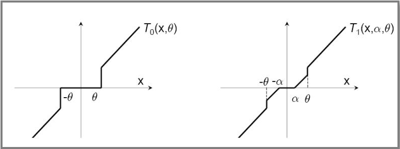

##	Truncated Gradient

###	L1正则化法

L1正则化

$$
w^{(t+1)} = w^{(t)} - \eta^{(t)}g^{(t)} - \eta^{(t)} \lambda sgn(w^{(t)})
$$

> - $\lambda$：正则化项参数
> - $sgn$：符号函数
> - $g^{(t)}=\nabla_w L(w^{(t)}, Z^{(t)})$：损失函数对参数梯度

-	L1正则化项在0处不可导，每次迭代使用次梯度计算正则项梯度
-	OGD中每次根据观测到的一个样本进行权重更新
	（所以后面正则项次梯度只考虑非0处？？？）

###	简单截断法

简单截断法：以$k$为窗口，当$t/k$非整数时，使用标准SGD迭代，
否则如下更新权重

$$\begin{align*}
w^{(t+1)} & = T_0 (w^{(t)} - \eta^{(t)} G^{(t)}, \theta) \\

T_0(v_i, \theta) & = \left \{ \begin{array}{l}
	0, & |v_i| \leq \theta \\
	v_i, & otherwise
\end{array} \right.
\end{align*}$$

> - $w^{(t)}$：模型参数
> - $g^{(t)}$：损失函数对模型参数梯度
> - $T_0$：截断函数
> - $\theta$：控制参数稀疏性

###	截断梯度法

截断梯度法：以$k$为窗口，当$t/k$非整数时，使用标准SGD迭代，
否则如下更新权重

$$\begin{align*}
w^{(t+1)} & = T_1(w^{(t)} - \eta^{(t)} g^{(t)}, \lambda^{(t)} \eta^{(t)},
	\theta) \\

T_1(v_i, \alpha, \theta) & = \left \{ \begin{array}{l}
	max(0, v_i - \alpha), & v_i \in [0, \theta] \\
	min(0, v_1 + \alpha), & v_i \in [-\theta, 0] \\
	v_i, & otherwise
\end{array} \right.
\end{align*}$$

> - $\lambda, \theta$：控制参数$w$稀疏性

-	对简单截断的改进，避免在实际（OgD）中参数因训练不足过小
	而被错误截断，造成特征丢失

	

##	Forward-Backward Spliting

FOBOS：前向后向切分，权重更新方式为*proximal method*如下

$$\begin{align*}
w^{(t.5)} & = w^{(t)} - \eta^{(t)} g^{(t)} \\
w^{(t+1)} & = \arg\min_w \{ \frac 1 2 \|w - w^{(t.5)}\|
	+ \eta^{(t+0.5)} \Phi(w) \} \\
& = \arg\min_w \{ \frac 1 2 \|w - w^{(t)} + \eta^{(t)} g^{(t)}\|
	+ \eta^{(t+0.5)} \Phi(w) \}
\end{align*}$$

###	L1-FOBOS

L1-FOBOS：即令$Phi(w)=\lambda \|w\|_1$，则根据可加性如下

$$\begin{align*}
w^{(t+1)} & = \arg\min_w \sum_{i=1}^N (\frac 1 2 (w_i - v_i)^2
	+ \tilde \lambda |w_i|)
w_i^{(t+1)} = \arg\min_{w_i} (\frac 1 2 (w_i - v_i)^2
	+ \tilde \lambda |w_i|)
\end{align*}$$

> - $V=[v_1, v_2, \cdots, v_N]:=w^{(t.5)}$：为方便
> - $\tilde \lambda := \eta^{t.5} \lambda$：为方便
> - $\eta^{t.5}$：学习率，常取
	$\eta^{(t)} \in \theta(\frac 1 {\sqrt t})$

-	则对$w_i$求次梯度、分类讨论，解得

	$$
	w_i^{(t+1)} = \left \{ \begin{array}{l}
		v_i - \tilde \lambda, & v_i > \tilde \lambda \\
		0, & |v_i| < \tilde \lambda \\
		v_i + \tilde \lambda, & v_i < -\tilde \lambda
	\end{array} \right.
	$$

	-	可以理解为：到当前样本为止，维度权重小于阈值
		$\eta^{(t.5)} \lambda$）时，认为该维度不够重要，
		权重置为0

	-	可视为$k=1, \theta=\infty$的Tg算法

-	另外，显然有$w_i^{(t+1)} v_i \geq 0$

	$$\begin{align*}
	\frac 1 2 (w_i^{(t+1)} - v_i)^2 + \tilde \lambda |w_i^{(t+1)}|
	& = \frac 1 2((w_i^{(t+1)})^2 - 2 w_i^{(t+1)} v_i + v_i^2)
		+ \tilde \lambda |w_i^{(t+1)}| \\
	& \leq \frac 1 2 v_i^2
	\end{align*}$$

	> - 考虑$w_i^{(t+1)}$使得目标函数最小，带入$w=0$则得

##	Regularized Dual Averaging

RDA算法：正则对偶平均算法，权重更新方式为
**包含[增广]正则项的最速下降**

$$
w^{(t+1)} = \arg\min_w {\frac 1 t \sum_{r=1}^t g^{(r)} w + \Phi(w)
	+ \frac {\beta^{(t)}} t h(w)}
$$

-	目标函数包括三个部分
	-	$\frac 1 t \sum_{r=1}^t g^{(r)} w$：包含之前所有梯度
		均值
	-	$\Phi(w)$：正则项
	-	$\frac {\beta^{(t)}} t h(w)$：额外正则项，严格凸，且
		不影响稀疏性

-	相较于TG、FOBOS是从另一方面求解在线最优化，更有效地提升
	特征权重稀疏性

###	L1 RDA

L1 RDA：令$\Phi(w) := \lambda \|w\|_1$，
再设$h(w) := \|w\|_2^2$，根据可加性则有

$$\begin{align*}
w^{(t+1)} & = \arg\min_w \{ \frac 1 t \sum_{r=1}^t <g^{(t)}, w>
	+ \lambda \|w\|_1 + \frac {\gamma} {2\sqrt t} \|w\|_2^2 \} \\
w_i^{(t+1)} & = \arg\min_{w_i} \{bar g_i^{(t)} w_i + \lambda |w_i|
	\frac {\gamma} {2 \sqrt t} w_i^2 \}
\end{align*}$$

> - $\lambda > 0, \gamma > 0$
> - $\bar g_i^{(t)} = \frac 1 t \sum_{r=1}^t g_i^{(r)}$

-	对$w_i$求次梯度、置零、求解得

	$$
	w_i^{(t+1)} = \left \{ \begin{array}{l}
		-\frac {\sqrt t} {\gamma} (\bar g^{(t)} - \lambda),
			& \bar g_i^{(t)} > \lambda \\
		0, & |\bar g_i^{(t)}| \leq \lambda \\
		-\frac {\sqrt t} {\gamma} (\bar g^{(t)} + \lambda),
			& \bar g_i^{(t)} < -\lambda \\
	\end{array} \right.
	$$

	-	可以理解为：某维度梯度累计均值绝对值$|bar g_i^{(t)}$
		小于阈值$\lambda$时，对应权重被置零、产生稀疏性

-	相较于L1-FOBOS的截断
	-	截断阈值为常数，更加激进、容易产生稀疏性
	-	截断判断对象为梯度累加均值，避免由于训练不足而产生
		截断
	-	只需条件$\lambda$参数，容易权衡精度、稀疏性

##	Follow the Regularized Leader

FTRL：综合考虑L1-RDA、L1-FOBOS

###	L1-FOBOS、L1-RDA变换

-	将L1-FOBOS类似近端算法收敛证明中展开、去除无关项、放缩，
	得到类似L1-RDA目标函数

	$$\begin{align*}
	w^{(t+1)} & = \arg\min_w \{ \frac 1 2 \|w - w^{(t)} +
		\eta^{(t)} g^{(t)}\| + \eta^{(t)} \lambda \|w\|_1 \} \\
	& = \arg\min_w \{ g^{(t)} w + \lambda \|w\|_1 +
		\frac 1 {2 \eta^{(t)}} \|w - w^{(t)}\|_2^2 \}
	\end{align*}$$

-	将L1-RDA目标函数整体整体放缩，得到

	$$
	w^{(t+1)} = \arg\min_w \{ g^{(1:t)} w + t \lambda \|w\|_1
		+ \frac 1 {2\eta^{(t)}} \|w - 0\|_2^2 \}
	$$

	> - $g^{(1:t)} := \sum_{r=1}^t g^{(r)}$

-	FTRL综合考虑L1-FOBOS、L1-RDA，得到目标函数

	$$
	w^{(t+1)} = \arg\min_w \{ g^{(1:t)} W + \lambda_1 \|w\|_1
		+ \frac {\lambda_2} 2 \|w\|_2^2 + \frac 1 2
		\sum_{r=1}^t \sigma^{(r)} \|w - w^{(r)}\|_2^2 \}
	$$

	-	使用累加梯度更新，避免因训练不充分错误截断
	-	包含L1-FOBOS、L1-RDA全部正则化项

###	求解

-	将FTRL中最后一项拆分、去除无关项

	$$\begin{align*}
	w^{(t+1)} & = \arg\min_w \{(g^{(1:t)} - \sum_{r=1}^t
		\sigma^{(r)} w^{(r)})w + \lambda_1 \|w\|_1 +
		\frac 1 2 (\lambda_2 + \sum_{r=1}^t \sigma^{(r)})
		\|w\|_2^2 + \frac 1 2 \sum_{r=1}^t \sigma^{(r)}
		\|w^{(r)}\|_2^2 \} \\
	& = \arg\min_w \{ z^{(t)} w + \lambda_1 \|w\|_1
		+ \frac 1 2 (\lambda_2 + \sum_{r=1}^t \sigma^{(r)})
		\|w\|_2^2 \} \\
	z^{(t)} &= g^{(1:t)} - \sum_{r=1}^t \sigma^{(r)} w^{(r)}
	\end{align*}$$

-	则同样根据可加性，对各分量求次梯度、置零、求解得

	$$
	w_i^{(t+1)} = \left \{ \begin{array}{l}
		\frac 1 {\lambda_1 + \sum_{r=1}^t \sigma^{(r)}}
			(z_i^{(t)} - \lambda_1 z_i), & z_i > \lambda_1 \\
		0, & |z_i^{(t)}| \leq \lambda_1 \\
		\frac 1 {\lambda_1 + \sum_{r=1}^t \sigma^{(r)}}
			(z_i^{(t)} + \lambda_1 z_i), & z_i < -\lambda_1 \\
	\end{array} \right.
	$$

-	其中学习率$\eta$为类似Adagrad优化器的学习率，但包括可学习
	参数$\alpha, \beta$

	$$
	\eta_i^{(t)} = \frac {\alpha} {\beta + \sqrt{\sum_{r=1}^t
		(g_i^{(r)})^2}}
	$$

