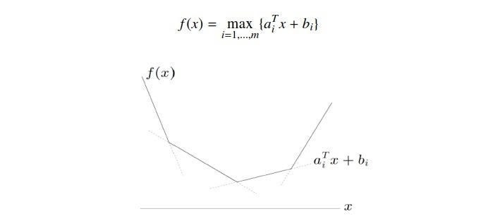
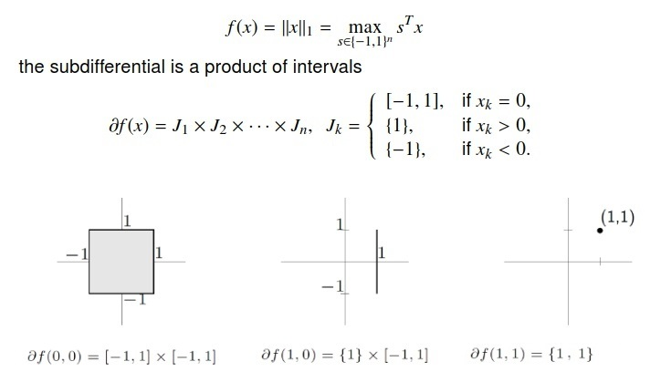

##	次梯度

> - 次梯度：实变量凸函数$f$在点$x_0$的次梯度$c$满足
	$$
	\forall x, f(x) - f(x_0) \geq c(x - x_0)
	$$

-	可以证明凸函数$f$在$x_0$处所有次梯度的集合是非空凸紧集
	$\partial f(x) = [a, b]$，其中$a, b$为单侧极限

	$$\begin{align*}
	a & = lim_{x \rightarrow x_0^{-}} \frac {f(x) - f_0(x)} {x - x_0} \\
	b & = lim_{x \rightarrow x_0^{+}} \frac {f(x) - f_0(x)} {x - x_0}
	\end{align*}$$

	> - （下）凸函数梯度不减

###	次梯度性质

####	运算性质

-	数乘性质

	$$
	\partial(\alpha f)(x) = \alpha \partial f(x), \alpha > 0
	$$

-	加法性质

	$$\begin{align*}
	f &= f_1 + f_2 + \cdots + f_m, \\
	\partial f &= \partial f_1 + \cdots + \partial f_m
	\end{align*}$$

-	仿射性质：$f$为凸函数

	$$\begin{align*}
	h(x) &=  f(Ax + b) \\
	\partial h(x) &= A^T \partial f(Ax + b)
	\end{align*}$$

####	优化性质

-	凸函数$f$在点$x_0$可导，当且仅当次梯度仅包含一个点，
	即该点导数

-	点$x_0$是凸函数$f$最小值，当且仅当次微分中包含0
	（此性质为“可导函数极小点导数为0”推广）

-	负次梯度方向不一定是下降方法

##	次梯度求解

-	逐点（分段）极值的函数求次梯度，求出该点相应极值函数，
	求出对应梯度即为次梯度

###	*Pointwise Maximum*

逐点最大函数：目标函数为

$$\begin{align*}
f(x) & = max \{f_1(x), f_2(x), \cdots, f_m(x)\} \\
I(x) & = \{i | f_i(x) = f(x)\}
\end{align*}$$

> - $I(x)$：保存$x$处取值最大的函数下标

-	弱结果：$I(x)$中随机抽取，以$f_i(x)$在该处梯度作为次梯度

-	强结果：
	$\partial f(x) = conv \cup_{i \in I(x)} \partial f_i(x)$
	-	先求支撑平面，再求所有支撑平面的凸包
	-	可导情况实际上是不可导的特殊情况

####	分段函数

-	折点处：
	$\partial f(x) = conv\{a_i, a_{i+1}\} = [a_i, a_{i+1}]$
-	非折点处：$\partial f(x) = {a_i}$

####	$L_1$范数

###	*PointWise Supremum*

逐点上确界：目标函数为

$$\begin{align*}
f(x) &= \sup_{\alpha \in A} f_{\alpha}(x) \\
I(x) &= \{\alpha \in A | f_{\alpha}(x) = f(x)\}
\end{align*}$$

> - 弱结果：可行梯度为
	$\partial (\max_{\alpha} f_{\alpha}(x)) \in partial f(x)$
> - 强结果：$\partial f(x) = conv \cup_{\alpha \in I(x)} \partial f_{alpha}(x) \subseteq \partial f(x)$

####	最大特征值

$$\begin{align*}
f(x) & = \lambda_{max}(A(x)) = \sup_{\|y\|_2 = 1} \\
A(x) & = A_0 + x_1 A_1 + \cdots + x_n A_n
\end{align*}$$

> - $A_n$：对称矩阵

-	对确定$\hat {x}$，$A(x)$最大特征值$\lambda_{max}$、
	对应特征向量$y$，则该点此梯度为
	$(y^T A_0 y, \cdots, y^T A_n y)$

###	*Pointwise Inferior*

逐点下确界：目标函数为

$$
f(x) = \inf_y h(x, y)
$$

> - $h$：凸函数

-	弱结果：给定$x = \hat x$，可行次梯度为
	$(\partial h(x, \hat y)|_{x=\hat x}, 0) \in \partial f(x)$

###	复合函数

$$
f(x) = h(f_1(x), \cdots, f_n(x))
$$

> - $h$：凸、不降函数
> - $f_i$：凸函数

-	弱结果：给定$x = \hat x$，可行次梯度为

	$$
	g = z_1 g_1 + \cdots + z_k g_k \in \partial f(\hat x)
	$$

	> - $z \in \partial h(f_1(\hat x), \cdots, f_k(\hat x))$
	> - $g_i \in \partial f_i(\hat x)$

	-	证明
	$$\begin{align*}
		f(x) \geq h(f_1(\hat x) + g_1^T(x - \hat x), \cdots,
			f_k(\hat x) + g_k^T(x - \hat x) \
		& \geq h(f_1(\hat x), \cdots, f_k(\hat x)) +
			z^T(g_1^T(x - \hat x), \cdots, g_k^T(x - \hat x)) \\
		& = f(\hat x) + g^T(x - \hat x)
		\end{align*}$$

##	次梯度法

$$\begin{align*}
x^{(k+1)} & = x^{(k)} + \alpha_k g^{(k)} \\
f_{best}^{(k+1)} & = min{f_{best}^{(k)}, f(x^{(k+1)})}
\end{align*}$$

> - $g^{(k)}$：函数$f$在$x^{(k)}$处次梯度

-	求解凸函数最优化的问题的一种迭代方法

-	相较于较内点法、牛顿法慢
	-	应用范围更广泛：能够用于不可微目标函数，目标函数可微
		时，无约束问题次梯度与梯度下降法有同样搜索方向
	-	空间复杂度更小
	-	可以和分解技术结合，得到简单分配算法
	-	通常不会产生稀疏解

###	步长选择

> - 次梯度法选取步长方法很多，以下为保证收敛步长规则

-	恒定步长：$\alpha_k = \alpha$
-	恒定间隔：$\alpha_k = \gamma / \|g^{(k)}\|_2$
-	步长平方可加、步长不可加
	$\sum_{k=1}^{\infty} \alpha_k^2 < \infty, \sum_{k=1}^{\infty} \alpha_k = \infty$
-	步长不可加、但递减：
	$lim_{k \rightarrow \infty} \alpha_k = 0$
-	间隔不可加、但递减：
	$lim_{k \rightarrow \gamma_k} \gamma_k = 0$

