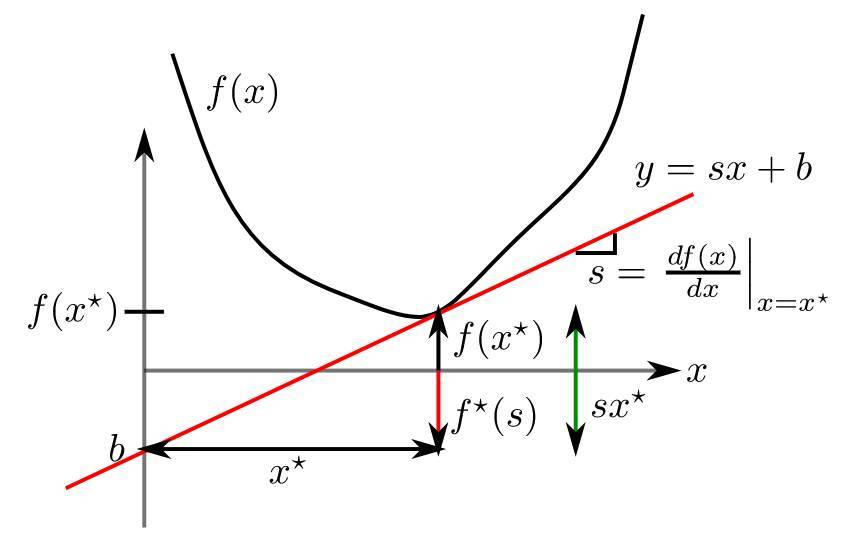
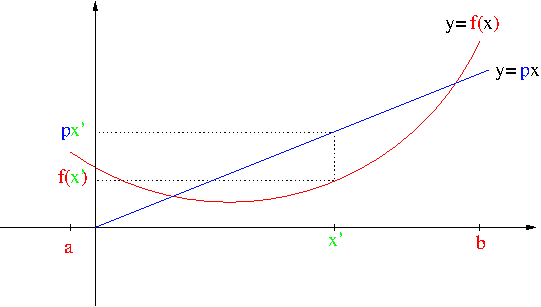
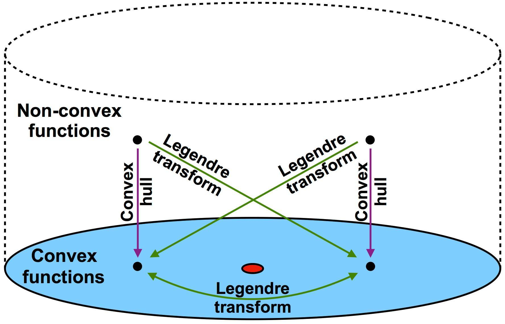
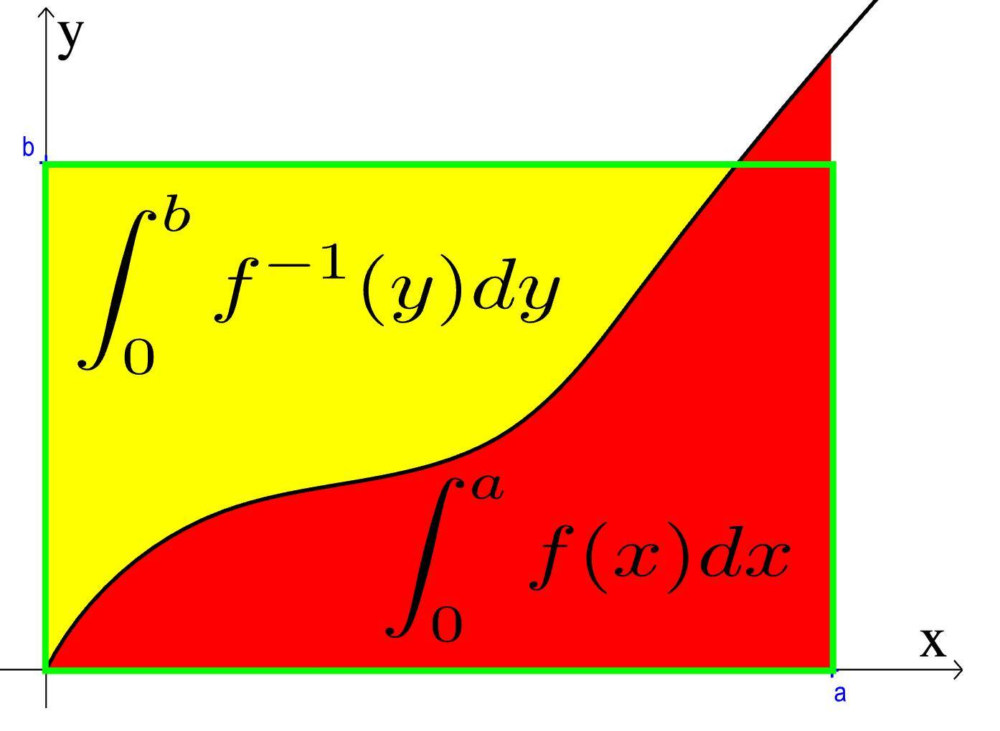
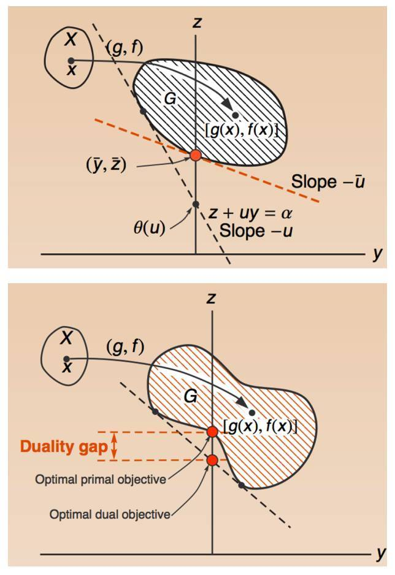
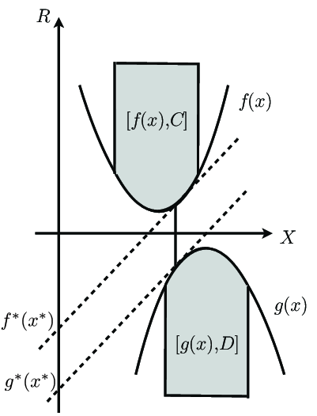

##	*Legendre Transformation*

勒让德变换：用$f^{*}(p)$表示凸、可导函数$f(x)$的转换，其中
$p$是$f(x)$导数

$$
f^{*}(p) = p^T u - f(u)|_{\frac {d(p^T u - f(u))} {du} = 0}
$$

> - $u$：参数，满足$\frac {d(p^T u - f(u))} {du} = 0$
> - 可导：有导数，凸：导数唯一

-	实变量的实值凸函数的对合变换
	-	把定义在线性空间上的函数对应至其对偶空间的函数
	-	是点、（切）线之间对偶关系的应用

> - 对合[函数]：反函数的等于自身的函数，即$f(f(x))=x$
> - 函数$f(x)$表示的函数关系可使用$(x, y=f(x))$点集合表示，
	也可以用**切线集合**表示
	（严格凸函数下，切线、导数一一对应）

###	理解（按Fenchel共轭）

-	$f^{*}(p)$：可理解为斜率为$p$、同$f(x)$有交点$x_0$的直线
	在零点处值（截距）和$f(x_0)$的最大差

	

-	$x$：可以理解为函数$f(x)$上距离给定斜率为$p$、过原点的
	直线$f(x)=px$**竖直**距离最大的点

	

	> - 类似Bregman散度

-	Legendre变换的变换得到原函数

	

	$$\begin{align*}
	f^{**}(x) & = \sup_{p \in dom(f^{*})} [x^T p - f^{*}(p)] \\
	& = \sup_{u \in dom(f)}[x^T \nabla f(u) -
		\nabla f(u)^T u + f(u)] \\
	& = \sup_{u \in dom(f)}[f(u) + \nabla f(u)^T (x-u)]
	& = f(x)
	\end{align*}$$

-	凸函数$f(x)$视为积分，则其共轭$f^{*}(x)$为对另一轴积分，
	即二者导函数互为反函数

	$$
	f(x) + f^{*}(p) = xp, p = \frac {df(x)} {dx}
	$$

> - 以上性质均按Fenchel共轭，但要求$f(x)$为凸、可导函数，故
	等价于Legendre变换

###	最大值式定义

$$\begin{align*}
& L(p, x) & = px - f(x) \\
& \frac {\partial (px - f(x))} {\partial x} & = p - 
	\frac {df(x)} {dx} = 0 \\
\Rightarrow & p = \frac {df(x)} {dx}
\end{align*}$$

> - 考虑到$f(x)$为凸函数，则$p=\frac {df(x)} {dx}$是最大值
> - 则计算$f(x)$的勒让德变换只需求$f(x)$导函数的反函数带入
	即可

###	数学性质

-	标度性质

	$$\begin{align*}
	f(x) & = a g(x) \rightarrow f^{*}(p) = a g^{*}(\frac p a) \\
	f(x) & = g(ax) \rightarrow f^{*}(p) = g^{*}(\frac p a)
	\end{align*}$$

	由此，$r$次齐次函数的勒让德变换是$s$次齐次函数，满足

	$$
	\frac 1 r + \frac 1 s = s
	$$

-	平移性质

	$$\begin{align*}
	f(x) & = g(x) + b \rightarrow f^{*}(p) = g^{*}(p) - b
	f(x) & = g(x+y) \rightarrow f*^{*}(p) = g^{*}(p) - py
	\end{align*}$$

-	反演性质

	$$
	f(x) = g^{-1}(x) \rightarrow f^{*}(p) = -p g^{*}(\frac 1 p)
	$$

-	线性变换性质

	$$
	(Af)^{*} = f^{*}A^{*}
	$$

	> - $f$：$R^n$上的凸函数
	> - $A$：$R^n \rightarrow R^m$的线性变换
	> - $A^{*}: <Ax, y^{*}> = <x, A^{*}y^{*}>$：$A$伴随算子

##	Fenchel Conjugate

Fenchel共轭

$$
f^{*}(p) = \sup_{x \in R}{px - f(x)}
$$

-	Fenchel共轭是对Legendre变换的扩展，不再局限于凸、可导
	函数
	-	Fenchel共轭可类似Legendra理解，但是范围更广
	-	对凸函数Fenchel共轭的共轭即为原函数，对非凸函数
		Fenchel共轭得到**原函数凸包**

-	Fenchel共轭
	-	用罗尔中值定理描述极值、导数关系：兼容Legendre导数
		支撑面
	-	用上确界保证函数唯一性

> - 非凸函数线性外包络是凸函数

###	*Fenchel-Young*不等式

$$
f(x) + f^{*}(p) \geq <p, x>
$$

-	证明

	$$\begin{align*}
	f(x) + f^{*}(p) & = f(x) + \sup_{u \in dom(f)} {u^T p - f(u)} \\
	& \geq f(x) + x^T p - f(x) = x^T p
	\end{align*}$$

-	按积分理解，仅$p$为$x$共轭时取等号

	

###	推导*Lagrange Duality*

-	原问题Prime、等价形式如下

	$$\begin{array}{l}
	&min f(x) \\
	s.t. & g(x) \leq 0 \\
	p(0) & = \inf_{x \in X, g(x) \leq 0} f(x)
	\end{array}$$

-	函数化、Fenchel共轭

	$$\begin{align*}
	p(u) & = \inf_{x \in X, g(x) \leq u} f(x) \\
	p^{*}(y) & = \sup_{y \in R^r} \{u^T y - p(u)\}
	\end{align*}$$

-	替换对偶中$p(u)$

	$$\begin{align*}
	-p^{*}(y) & = \inf_{u \in R^r} \{p(u) - u^T y\} \\
	d(\lambda) & = \inf_{u \in R^r} \{p(u) + u^T \lambda\} \\
	& = \inf_{u \in R^r} \{\inf_{x \in X, g(x) \leq u} f(x)
		+ \lambda^T u\}
	\end{align*}$$

	> - $\lambda = -y$

-	考虑到约束$g(x) \leq u$，则

	$$\begin{align*}
	\lambda \geq 0 & \Rightarrow \lambda^T g(x) \leq \lambda u \\
	d(\lambda) & = \left \{ \begin{array}{l}
			\inf_{x \in X} \{f(x) + \lambda^T g(x)\},
				& \lambda \geq 0 \\
			-\infty, & otherwise
		\end{array} \right.
	\end{align*}$$

-	考虑Fenchel不等式

	$$\begin{align*}
	p(u) + p^{*}(-y) & \geq u^T (-y) \\
	p(0) + p^{*}(-y) & \geq 0 \\
	p(0) & \geq -p^{*}(-y) \\
	p(0) & \geq d(\lambda)
	\end{align*}$$

-	则可得Lagrange对偶Prime、Dual最优关系

	$$
	L(x, \lambda) = f(x) + \lambda^T g(x), \lambda \geq 0 \\
	D^{*} := \max_{\lambda \geq 0} \min_x L(x, \lambda) \leq
		\min_x \max_{\lambda \geq 0} L(x, \lambda) =: P^{*}
	$$

	

###	Lagrange Duality推导Fenchel对偶

> - Fenchel对偶可以视为Lagrange对偶的应用

-	原问题、等价问题

	$$\begin{align*}
	& \min_x & f(x) - g(x) \\
	\Leftrightarrow & \min_{x,z} & f(x) - g(z) \\
	& s.t. & x = z
	\end{align*}$$

-	对上式取Lagrange对偶$L(u)$、等价得到

	$$\begin{align*}
	L(u) = \min_{x,z} f(x) - g(z) + u^T(z-x) \\
	& = -(f^{*}(u) - g^{(-u)})
	\begin{align*}$$

> - Fenchel对偶：寻找截距差值最大的平行切线

