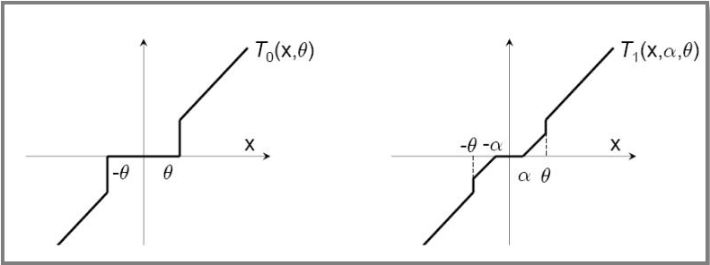

##	Truncated Gradient

###	L1正则化法

L1正则化

$$
w^{(t+1)} = w^{(t)} - \eta^{(t)}g^{(t)} - \eta^{(t)} \lambda sgn(w^{(t)})
$$

> - $\lambda$：正则化项参数
> - $sgn$：符号函数
> - $g^{(t)}=\nabla_w L(w^{(t)}, Z^{(t)})$：损失函数对参数梯度

-	L1正则化项在0处不可导，每次迭代使用次梯度计算正则项梯度
-	OGD中每次根据观测到的一个样本进行权重更新
	（所以后面正则项次梯度只考虑非0处？？？）

###	简单截断法

简单截断法：以$k$为窗口，当$t/k$非整数时，使用标准SGD迭代，
否则如下更新权重

$$\begin{align*}
w^{(t+1)} & = T_0 (w^{(t)} - \eta^{(t)} G^{(t)}, \theta) \\

T_0(v_i, \theta) & = \left \{ \begin{array}{l}
	0, & |v_i| \leq \theta \\
	v_i, & otherwise
\end{array} \right.
\end{align*}$$

> - $w^{(t)}$：模型参数
> - $g^{(t)}$：损失函数对模型参数梯度
> - $T_0$：截断函数
> - $\theta$：控制参数稀疏性

###	截断梯度法

截断梯度法：以$k$为窗口，当$t/k$非整数时，使用标准SGD迭代，
否则如下更新权重

$$\begin{align*}
w^{(t+1)} & = T_1(w^{(t)} - \eta^{(t)} g^{(t)}, \lambda^{(t)} \eta^{(t)},
	\theta) \\

T_1(v_i, \alpha, \theta) & = \left \{ \begin{array}{l}
	max(0, v_i - \alpha), & v_i \in [0, \theta] \\
	min(0, v_1 + \alpha), & v_i \in [-\theta, 0] \\
	v_i, & otherwise
\end{array} \right.
\end{align*}$$

> - $\lambda, \theta$：控制参数$w$稀疏性

-	对简单截断的改进，避免在实际（OgD）中参数因训练不足过小
	而被错误截断，造成特征丢失

	

##	Forward-Backward Spliting

FOBOS：前向后向切分，权重更新方式为*proximal method*如下

$$\begin{align*}
w^{(t.5)} & = w^{(t)} - \eta^{(t)} g^{(t)} \\
w^{(t+1)} & = \arg\min_w \{ \frac 1 2 \|w - w^{(t.5)}\|
	+ \eta^{(t+0.5)} \Phi(w) \} \\
& = \arg\min_w \{ \frac 1 2 \|w - w^{(t)} + \eta^{(t)} g^{(t)}\|
	+ \eta^{(t+0.5)} \Phi(w) \}
\end{align*}$$

###	L1-FOBOS

L1-FOBOS：即令$Phi(w)=\lambda \|w\|_1$，则根据可加性如下

$$\begin{align*}
w^{(t+1)} & = \arg\min_w \sum_{i=1}^N (\frac 1 2 (w_i - v_i)^2
	+ \tilde \lambda |w_i|)
w_i^{(t+1)} = \arg\min_{w_i} (\frac 1 2 (w_i - v_i)^2
	+ \tilde \lambda |w_i|)
$$

> - $V=[v_1, v_2, \cdots, v_N]:=w^{(t.5)}$：为方便
> - $\tilde \lambda := \eta^{t.5} \lambda$：为方便

-	则对$w_i$求次梯度、分类讨论，解得

	$$
	w_i^{(t+1)} = \left \{ \begin{array}{l}
		v_i - \tilde \lambda, & v_i > \tilde \lambda \\
		0, & |v_i| < \tilde \lambda \\
		v_i + \tilde \lambda, & v_i < -\tilde \lambda
	\end{array} \right.
	$$

	-	可以理解为：到当前样本为止，维度权重小于阈值
		$\eta^{(t.5)} \lambda$）时，认为该维度不够重要，
		权重置为0

	-	可视为$k=1, \theta=\infty$的Tg算法

-	另外，显然有$w_i^{(t+1)} v_i \geq 0$

	$$\begin{align*}
	\frac 1 2 (w_i^{(t+1)} - v_i)^2 + \tilde \lambda |w_i^{(t+1)}|
	& = \frac 1 2((w_i^{(t+1)})^2 - 2 w_i^{(t+1)} v_i + v_i^2)
		+ \tilde \lambda |w_i^{(t+1)}| \\
	& \leq \frac 1 2 v_i^2
	\end{align*}$$

	> - 考虑$w_i^{(t+1)}$使得目标函数最小，带入$w=0$则得

##	Regularized Dual Averaging

RDA算法：正则对偶平均算法

$$
w^{(t+1)} = \arg\min_w {\frac 1 t \su_{r=1}^t g^{(r)} w + \Phi(w)
	+ \frac {\beta^{(t)}} t h(w)}
$$

