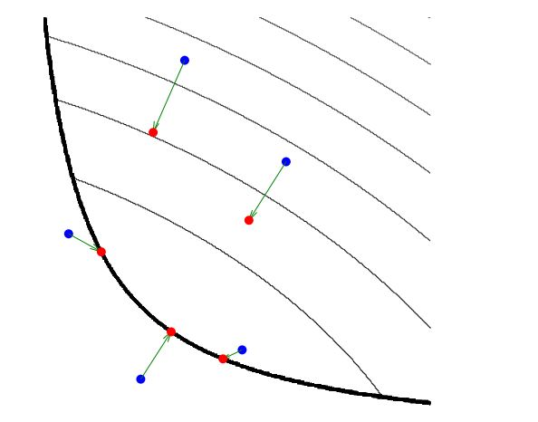

#	Proximal Gredient Method

##	*Proximal Operator*

$$
prox_{f}(x) = \arg\min_u (f(u) + \frac 1 2 \|u - x\|^2)
$$

> - $f(x)$：凸函数

-	由于$L_2$范数的强凸性，近端算子也强凸，解总是唯一存在
-	直观理解：寻找距离点$x$不太远、$f(u)$尽可能小的$u$
-	以下算法都是近端算法的特例
	-	*shrinkage thresholding algorithm*
	-	*projected Landweber*
	-	*projected gradient*
	-	*alternating projections*
	-	*alternating-directions method of multipliers*
	-	*alternating split Bregman*

> - 近端算子连续可微

###	*Moreau Envolop*

$$\begin{align*}
M_{\gamma, f}(x) & = prox_{\gamma, f}(x) \\
&= \arg\min_u (f(u) + \frac 1 {2\gamma} \|u - x\|^2) \\
\nabla prox_{\gamma, f}(x) & = \frac 1 {\gamma}(x - prox_f(x))
\end{align*}$$

-	$\gamma > 0$：平衡参数，$\gamma = 1$即为普通近端算子

###	近端算子求解

-	对一般凸函数$f(x)$，通常使用次梯度进行的优化，其近端算子
	解为

	$$
	p = prox_f(x) \Leftrightarrow x - p \in \partial f(p)
		\quad (\forall (x,p) \in R^N * R^N)
	$$

-	对光滑凸函数$f$，上述等式对其近端算子约简为

	$$
	p = prox_f(x) \Leftrightarrow x-p = \bigtriangledown f(p)
	$$

###	性质

####	分离函数

$$\begin{align*}
f(x_1, \cdots, x_m) & = \sum_{i=1}^m f_i(x_i) \\
prox_f(x_1, \cdots, x_m) & = [prox_{f_1}(x_1), \cdots, prox_{fm}(x_m)]
\end{align*}$$

-	取$f(x) = \|x\|_1$，即可得即软阈值算子

	$$
	(prox_{\gamma, f}(x))_i = \left \{ \begin{array}{l}
		x_i - \gamma, & x_i \geq \gamma \\
		0, & |x_i| < \gamma \\
		x_i + \gamma, & x_i \leq -\gamma
	\end{array} \right.
	$$

	> - 参考坐标下降：近端算子中二次项中各分量无关，所以一轮
		迭代即为最优解

####	仿射函数分解

$$\begin{align*}
f(x) & = g(Ax + b) \\
prox_f(x) & = x + \frac 1 {\alpha} A^T (prox_{\alpha g}(Ax + b) - Ax - b)
\end{align*}$$

> - $A^T A = \alpha I, \alpha > 0$：线性变换
> - $g$：良好闭凸函数

####	第一投影定理

> - 取$f(x)$为示性函数、约束条件，即得到投影算子

$$\begin{align*}
prox_{\gamma, f}(x) & = proj_C(x) = \arg\min_{u \in C}
	\|u - x\|_2^2 \\
f(x) & = I_C(x) = \left \{ \begin{array}{l}
		0, x \in C \\
		\infty, x \notin C
	\end{array} \right.
\end{align*}$$

####	第二临近定理

> - $f$为良好闭凸函数，则以下三条等价
> > -	$y = prox_f(x)$
> > -	$x - y \in \partial f(y)$：由近端算子定义即得
> > -	$\forall z, <x - y, z - y> \leq f(z) - f(y)$

####	*Moreau Decomposition*

$$\begin{align*}
prox_f(x) + prox_{f^{*}}(x) & = x \\
prox_{\lambda f}(x) + \lambda prox_{f^{*}/lambda}(x/\lambda) & = x,
	\lambda > 0
\end{align*}$$

####	最小值

$$\begin{align*}
\min_x prox_f(x) & = \min_x f(x) \\
\arg\min_x prox_f(x) & = \arg\min_x f(x)
\end{align*}$$

证明

$$\begin{align*}
f(x_f) & = f(x_f) + \frac 1 2 \|x_f - x_f\|_2^2 \\
& \geq \min_u {f(u) + \frac 1 2 \|u - x_f\|_2^2} \\
& = prox_f(x_f) \\
& \geq prox_f(x_p) \\
& = f(x_p) + \frac 1 2 \|x_p - x_f\|_2^2 \\
& \geq f(x_p) \geq f(x_f)
\end{align*}$$

> - $x_f = \arg\min_x f(x)$
> - $x_p = \arg\min_x prox_f(x)$

###	例

-	$f(x)=c$：$$prox_{f}(x) = x$$

####	*Projection Operator*

投影算子

$$\begin{align*}
proj_C(x) & = \arg\min_{y \in C} \|y - x\|^2 \\
& = \arg\min_{y \in R^N} l_C(x) + \frac 1 2 \|y-x\|^2
\end{align*}$$

-	点$x$在凸集$C$上的投影：$X$上距离$x$的欧式距离最近的点

####	*Alternating Projection Method*

*POCS/project onto convex sets method*：用于解同时满足多个
凸约束的算法

-	$f_i$作为非空闭凸集$C_i$示性函数，表示一个约束，则整个
	问题约简为*convex feasibility problem*

-	只需要找到位于所有$C_i$交集的解即可

-	每次迭代

	$$
	x^{(k+1)} = P_{C_1}P_{C_2} \cdots P_{C_n}x_k
	$$

> - 在其他问题中投影算子不再适合，需要更一般的算子，在其他
	各种同样的凸投影算子中，近端算子最合适

##	*Proximal Gradient Method*

目标函数

$$
\min_{x \in \mathcal{H}}F(x) + R(x)
$$

> - $F(x)$：可微、凸函数
> - $\nabla F(x)$：*Lipschitz continous*、利普希茨常数为$L$
> - $R(x)$：下半连续凸函函数，可能不光滑
> - $\mathcal{H}$：目标函数定义域集合，如：希尔伯特空间

$$\begin{align*}
prox_{\gamma R}(x - \gamma \nabla F(x)) & = \arg\min_u
	(R(u) + \frac 1 {2\gamma} \|u - x + \gamma \nabla F(x)\|_2^2) \\
& = \arg\min_u (R(u) + \frac {\gamma} 2 \|\nabla F(x)\|_2^2 +
	\nabla F(x)^T (u-x) + \frac 1 {2\gamma} \|u-x\|_2^2) \\
& = \arg\min_u (R(u) + F(x) + \nabla F(x)^T (u-x) +
	\frac 1 {2\gamma} \|u - x\|_2^2) \\
& \approx \arg\min_u(R(u) + F(u))
\end{align*}$$

> - $\frac {\gamma} 2 \|\nabla F(x)\|_2^2, F(x)$：与$u$无关
	，相互替换不影响极值
> - $0 < \gamma \geq \frac 1 L$：保证最后反向泰勒展开成立

-	则$prox_{\gamma R}(x-\gamma \nabla F(x))$解即为
	“原问题最优解”（若泰勒展开完全拟合$F(x)$）

-	考虑泰勒展开是局部性质，$u$作为极小值只能保证在$x$附近
	领域成立

	-	可直接将近端算子解作为下个迭代点

		$$
		x^{(k+1)} = prox_{\gamma R}(x^{(k)} - \gamma \nabla
			F(x^{(k)}))
		$$

		-	*gredient step*：
			$x^{(k.5)} = x^{(k)} - \gamma \nabla F(x^{(k)})$
		-	*proximal operator step*：
			$x^{(k+1)} = prox_{\gamma R}(x^{(k.5)})$

	-	$L$已知时，可直接确定$\gamma \in (0, \frac 1 L]$，
		否则可迭代搜索$\gamma := \gamma \beta,\beta < 1$，
		直至

		$$
		F(x - PG_{\gamma R}(x)) \leq F(x) - \nabla F(x) PG_{\gamma R}(x)
			+ \frac 1 2 \|PG_{\gamma R}(x)\|_2^2
		$$

		> - $PG_{\gamma R}(x)=x-prox_{\gamma R}(x-\gamma \nabla F(x))$
		> - 直接根据下述利普希茨条件须求Hasse矩阵，计算量较大

	-	迭代终止条件为

		$$
		\hat x = prox_{\gamma R}(\hat x - \gamma \nabla F(\hat x))
		$$

###	二阶近似证明

$$\begin{align*}
F(u) & = F(x) + \nabla F(x)^T (u - x) + \frac 1 2
	(u - x)^T \nabla^2 F(\zeta)(u - x) \\
& \geq F(x) + \nabla F(x)^T (u - x) \\
& \leq F(x) + \nabla F(x)^T (u - x) + \frac L 2 \|u-x\|^2
\end{align*}$$

> - $\nabla^2 F(\zeta)$：凸函数二阶导正定
> - $\|\nabla F(u) - \nabla F(x)\|_2 \leq L \|u-x\|_2$：
	$\nabla F(x)$利普希茨连续性质

###	反向推导

-	对$F(x)+R(x)$在$x_0$附近作泰勒展开

	$$
	F(u)+R(u) \leq F(x) + \nabla F(x)^T (u - x) +
		\frac 1 {2\gamma} \|u - x\|_2^2 + R(x)
	$$

	> - $\lambda \in (0, \frac 1 L]$
	> - $L$：$F(x)$利普希茨常数
	> - $\leq$：由Lipschitz连续可取

	-	则不等式右边就是$F(x)+R(x)$的一个上界，可以对将对其
		求极小化转化对此上界求极小

-	考虑对极小化目标添加常数项不影响极值，对不等式右侧添加
	与$u$无关项$\frac \gamma 2 \|\nabla F(x)\|_2^2$、剔除
	剔除$F(x)$凑出近端算子

	$$\begin{align*}
	prox_{\gamma R} & = \arg\min_u (R(u) + \frac {\gamma} 2
		\|\nabla F(x)\|_2^2 + \nabla F(x)^T (u-x) +
		\frac 1 {2\gamma} \|u-x\|_2^2) \\
	& = \arg\min_u (R(u) + \|u - x + \frac 1 {2\gamma} \nabla F(x)\|_2^2)
	\end{align*}$$

##	近端算法推广

###	问题推广

> - 求解*non-differentiable*凸优化问题的通用投影形式

$$
\min_{x \in R^N} \sum_{i=1}^N f_i(x)
$$

> - $f_i(x)$：凸函数，不一定处处可微

-	目标函数中包含不处处连续可微函数，整个目标函数不光滑

	-	无法使用传统的光滑优化手段，如：最速下降、共轭梯度
	-	极小化条件为$0 \in \partial(F+R)(x)$

-	分开考虑各个函数，对非光滑函数使用近端算子处理

###	算子推广

> - 考虑使用*Bregman Divergence*替代近端算子中欧式距离

$$
prox_{\gamma, f}(x) = \arg\min_u (f(u) + \mu(u) - \mu(x) +
	<\nabla \mu(x), u - x>)
$$

> - 取$\mu(x) = \frac 1 2 \|x\|_2^2$时，即为普通近端算子

