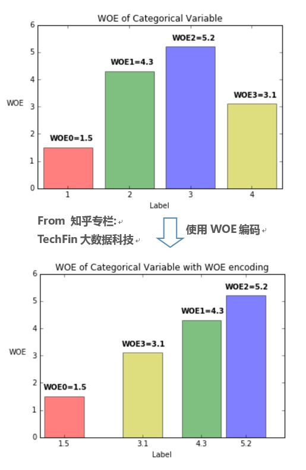

##	统计量

统计量：统计理论中对数据进行分析、检验的变量

-	传统的统计量具有显式解析表达式
	-	均值：数据之和除数量
	-	中位数：数据中间者

-	统计量同样可以理解为和数据相关**优化问题的解**
	-	均值：离差平方和最小
	-	中位数：划分均匀

	> - 优化问题目标本身也是统计量

##	相关系数

###	*Pearson* 积矩相关系数

$$
\rho_{X,Y} = \frac {cov(X, Y)} {\sigma_X \sigma_Y}
$$

> - $cov(X, Y)$：变量 $X, Y$ 协方差
> - $\sigma_X, \sigma_Y$：变量 $X, Y$ 方差

-	*Pearson* 积矩相关系数取值范围为 $[-1, 1]$
	-	$1, -1$ 分别表示变量成正线性、负线性函数关系

####	显著性检验

#####	*Fisher* 变换

$$
z = \frac 1 2 ln(\frac {1+r} {1-r}) = arctanh(r)
$$

> - $z$：*Pearson* 积矩相关系数的 *Fisher* 变换
> - $r$：样本的 *Pearson* 积矩相关系数值

-	当 $(X, Y)$ 为二元正态分布时，$z$ 近似正态分布
	-	均值：$\frac 1 2 ln(\frac {1+\rho} {1-\rho})$
	-	标准差：$\frac 1 {\sqrt {N - 3}}$

#####	基于数学的近似方法

$$
t = r \sqrt{\frac {N - 2} {1 - r^2}}
$$

-	当 $(X, Y)$ 为二元正态分布且不相关时，$t$ 服从自由度为 $n-2$的 *t-分布*

###	*Spearman* 秩相关系数

$$\begin{align*}
\rho_{X, Y} & = \frac {cov(Rank(X) - Rank(Y))}
	{\sigma_{Rank(X)} \sigma_{Rank(Y)}} \\
& = 1 - \frac {6 \sum_i^N d_i^2} {N(N^2-1)} \\
\end{align*}$$

> - $Rank(X), Rank(Y)$：变量 $X, Y$ 的秩（应同序）（相同值秩取均值）
> - $d_i$：变量对 $X, Y$ 中，二者秩差值

-	*Spearman* 秩相关系数被定义为变量秩的 *Pearson* 相关系数

> - *Spearman* 秩相关系数也可以使用 *Fisher* 变换检验显著性

###	*Kendell* 秩相关系数

$$\begin{align*}
\tau_a &= \frac {N_c - N_d} {N_0} \\
\tau_b &= \frac {N_c - N_d} {\sqrt{(N_0 - N_X)(N_0 - N_Y)}} \\
\tau_c &= \frac {2(N_c - N_d)} {N^2 \frac {M-1} M}
\end{align*}$$

> - $N_0 = \frac {N(N-1)} 2$：变量对数量
> - $N_c, N_d$：变量对 $X, Y$ 中有序对数量、无序对数量
> - $N_X, N_Y$：变量对 $X, Y$ 中 $X$ 取值、$Y$ 取值相同对数量
> - $M$：变量 $X, Y$ 中较小取值数量者取值数量

-	*Kendell* 秩相关系数取值范围同样为 $[-1, 1]$
	-	-1 仅在变量 $X, Y$ 取值完全反向取到

-	$\tau_a$ 是 $\tau_b$ 在变量不存在取值相同时的特例

-	$\tau_c$ 适合“层级”数据，即两个变量取值类似划分、内部细分

	||A|B|C|
	|-----|-----|-----|-----|
	|I-1|30|0|0|
	|I-2|30|0|0|
	|II-1|0|30|0|
	|II-1|0|30|0|
	|III-2|0|0|30|
	|III-2|0|0|30|

	-	对以上数据，$\tau_b$ 取值在 0.9 附近，而 $\tau_c$ 取 1

> - 有序对：对 $(X_i, Y_i), (X_j, Y_j)$，满足 $X_i < X_j, Y_i < Y_j$ 或 $X_i > X_j,Y_i > Y_j$ 则为有序对
> - 无序对：对$(X_i, Y_i), (X_j, Y_j)$，满足 $X_i < X_j, Y_i > Y_j$ 或 $X_i > X_j, Y_i < Y_j$ 则为无序对

###	卡方统计量

卡方统计量：通过观察实际与理论值的偏差确定理论正确与否

$$
\chi^2 = \sum \frac {(A - E)^2} E
$$

> - $A$：自变量、因变量组合对应频数观察值
> - $E$：自变量、因变量组合对应频数期望值

-	将模型预测结果视为实际分布、先验分布（均匀分布）视为理论分布

-	卡方检验：检验定性变量之间相关性，假设两个变量确实独立，观察实际值、理论值偏差程度判断变量之间相关性
	-	若偏差足够小，认为误差是自然的样本误差，两者确实独立
	-	若偏差大到一定程度，误差不可能由偶然、测量精度导致，
		认为两者相关

-	若模型预测结果同先验分布差别很大，说明模型有效，且卡方统计量值越大表示预测把握越大

####	特点

-	由于随机误差存在，卡方统计量容易
	-	夸大频数较小的特征影响
	-	相应的，取值数较少（各取值频数相对而言可能较大）特征影响容易被低估

####	分布证明

-	考虑随机变量 $X=(x_1,\cdots,x_D)$ 服从 *Multinomial* 分布，分布参数为 $n, p=(p_1,\cdots,p_D)$

-	考虑服从理论分布的随机变量 $X$ 协方差矩阵

	$$\begin{align*}
	\Sigma = Cov(X) &= \begin{bmatrix}
		np_1(1-p_1) & -np_1p_2 & \cdots & -np_1p_D \\
		np_2p_1 & -np_2(1-p_2) & \cdots & -np_2p_D \\
		\vdots & \vdots & \ddots & \vdots \\
		-np_Dp_1 & -np_Dp_2 & \cdots & np_D(1-p_D)
	\end{bmatrix} \\
	&= n\begin{bmatrix}
		p_1 & 0 & \cdots & 0 \\
		0 & p_2 & \cdots & 0 \\
		\vdots & \vdots & \ddots & \vdots \\
		0 & 0 & \cdots & p_D
	\end{bmatrix} - npp^T \\
	\end{align*}$$

-	则由中心极限定理有，如下依分布收敛的结论

	$$\begin{align*}
	\frac {(X - np)} {\sqrt n} & \overset {D} {\rightarrow} N(0,\Sigma) \\
	\end{align*}$$

-	考虑服从理论分布的随机变量 $X$ 的 $\chi^2$ 参数

	$$\begin{align*}
	\chi^2 &= \frac 1 n (X-np)^T D^2 (X-np) \\
	D &= \begin{bmatrix}
		\frac 1 {\sqrt {p_1}} & 0 & \cdots & 0 \\
		0 & \frac 1 {\sqrt {p_2}} & \cdots & 0 \\
		\vdots & \vdots & \ddots & \vdots \\
		0 & 0 & \cdots & \frac 1 {\sqrt {p_D}}
	\end{bmatrix}
	\end{align*}$$

-	并由连续映射定理可以得到 $D\frac {x-np} {\sqrt n}$ 分布，且其协方差矩阵 $\Sigma_0$ 满足

	$$\begin{align*}
	D\frac {x-np} {\sqrt n} & \overset {D} {\rightarrow} N(0, D \Sigma D^T) \\
	\Sigma_0 &= D \Sigma D^T \\
	\Sigma_0^2 &= (E - \sqrt p {\sqrt p}^T)(E - \sqrt p {\sqrt p}^T) = \Sigma_0 \\
	\end{align*}$$

-	由以上，$\Sigma_0$ 仅有特征值 0，1
	-	特征值 0 对应特征向量有且仅有 $\sqrt p$
	-	特征值 1 对应特征向量有 $D-1$ 个

	$$\begin{align*}
	\Sigma_0 \sqrt p - 0 \sqrt p &= \sqrt p - \sqrt p = 0 \\
	\Sigma_0 \lambda - 1 \lambda &= \lambda - \sqrt p {\sqrt p}^T \lambda
		= \sqrt p {\sqrt p}^T \lambda = 0
	\end{align*}$$

-	则 $\chi^2$ 统计量依分布收敛于自由度为 $D-1$ 的卡方分布

	$$\begin{align*}
	\chi^2 &= \sum_{d=1}^D \frac {(x_d - np_d)^2} {np_d}
		\overset {D} {\rightarrow} \chi_{D-1}
	\end{align*}$$

-	可据此构造统计量进行卡方检验，检验实际值实际分布频率 $(a_1,\cdots,a_D)$ 是否符合该分布
	-	构造卡方统计量 $\chi^2 = \sum_{d=1}^D \frac {(x_d - na_d)^2} {na_d}$
	-	则卡方统计量在随机变量满足多项分布情况下依分布收敛于自由度为 $D-1$ 的卡方分布

> - <https://www.zhihu.com/question/309694332/answer/952401910>
> - <https://zhuanlan.zhihu.com/p/198864907>

##	*Entropy*

> - （信息）熵：在概率分布上对复杂程度/多样性/不确定性/混乱程度的度量

$$
\begin{align*}
HOD(X) & = -E_P log P(x) \\
& = \sum_d^D P(x_d) log \frac 1 {P(x_d)} \\
& = - \sum_d^D p_d log p_d \\
\end{align*}
$$

> - $p_d$：随机变量各取值对应概率
> - 事件 $i$ 发生概率 $p_d=0$：约定 $p_d log(p_d)$ 为 0
> - 其中 $log$ 以 2 为底，单位为 *bit*，以 $e$ 为底，单位为 *nat*

-	信息论中，熵越高能传输越多信息
	-	可携带的信息量 = 单位消息熵 * 消息长度
	-	熵衡量系统复杂程度，提高系统确定性即削弱系统多样性，降低熵

-	概率分布包含的信息即其复杂程度（可能取值数量）
	-	考虑按照 $(p_1,\cdots,p_D)$ 分布、长度为 $N$ 的随机变量序列，其可能排列数为 $\frac {N!} {\prod_d^D (p_d N)!}$
	-	则根据 *Stirling* 公式有

		$$\begin{align*}
		log (\frac {N!} {\prod_d^D (p_d N)!}) & = log(N!)
			- \sum_d^D log((p_d N)!) \\
		& \overset {\lim_{N \rightarrow \infty}} = log(\sqrt {2\pi N}
			({\frac N e})^N) + \sum_d^D log(\sqrt {2\pi p_dN}
			({\frac {p_dN} e})^{p_dN}) \\
		& = log(\sqrt {2\pi N}) + N(logN-1) - \sum_d^D log(\sqrt {2\pi p_dN})
			- \sum_d^D p_dN (log(p_dN) - 1) \\
		& = log(\sqrt {2\pi N} + \sum_d^D log(\sqrt {2\pi p_dN}))
			+ N \sum_d^D p_d log p_d \\
		& \approx N \sum_d^D p_d log p_d
		\end{align*}$$

	-	则长度为 $N$ 的随机变量串的多样性、信息量为 $H * N$，其中 $H=\sum_d^D p_d log p_d$ 概率分布的信息熵

-	某个事件包含的信息可以用编码长度理解
	-	对概率 $p$ 事件，编码 $1/p$ 个需编码（2进制编码）长度 $log_2 \frac 1 p$
	-	则概率 $p$ 事件包含信息量可以定义为 $log \frac 1 p$，即事件包含的信息量可用表示事件需要编码的长度表示
		（底数则取决于编码元，只影响系数）
	-	则整个随机变量的信息为各事件信息量加权和

-	熵可以视为变量取值概率的加权和
	-	只依赖随机变量 $X$ 的分布，与其取值无关，可将其记为 $H(P)$
	-	由定义 $0 \leq H(P) \leq log_2 k$
		-	$H(p) = 0$：$\exists j, p_j=1$，随机变量只能取一个值，无不确定性
		-	$H(p) = log k$：$\forall j, p_j=1/k$，随机变量在任意取值概率相等，不确定性最大

> - *empirical entropy*：经验熵，熵中的概率由数据估计时（尤极大似然估计）
> - 参考链接
> > -	<https://zh.wikipedia.org/wiki/%E7%86%B5_(%E4%BF%A1%E6%81%AF%E8%AE%BA)>
> > -	<https://zhuanlan.zhihu.com/p/27876027>
> > -	<https://zhuanlan.zhihu.com/p/73710585>
> - *Stirling* 公式即用积分近似计算 $\sum logn$：<https://zhuanlan.zhihu.com/p/143992660>

###	熵的性质

-	对称性：事件取值不影响熵

-	极值性

	-	所有符号有同等机会出现的情况下，熵达到极大（琴生不等式）

		$$\begin{align*}
		H(X) & = E[log(\frac 1 {P(X)})] \leq log(E[\frac 1 {P(x)}])
			& = log(n)
		\end{align*}$$

	-	仅有一个符号确定出现的情况下，熵达到极小 0

-	*Continuity*连续性：度量连续，概率微小变化只能引起熵微小变化

-	*Normalization*规范化：$H_2(\frac 1 2, \frac 1 2) = 1$

-	*Grouping*组合法则/可加和性：熵与过程如何划分无关
	（此即要求熵形式为对数）

	-	若子系统间相互作用已知，则可以通过子系统熵值计算系统整体熵

		$$
		H(X) = H(X_1,\cdots,X_K) + \sum_{k=1}^K
			\frac {|X_k|} {|X|} H(X_k)
		$$

		> - $X_1,\cdots,X_K$：$K$ 个子系统，可以理解为将随机变量 $X$ 划分为 $K$ 种情况
		> - $H(X_1,\cdots,X_K)$：子系统相互作用熵

		-	子系统相互作用熵可以认为是，通过已知信息消除的多样性（即信息增益）
		-	子系统熵之和则是利用已知信息消除多样性之后，系统剩余混乱程度

	-	一般的，两个事件 $X,Y$ 熵满足以下计算关系

		$$\begin{align*}
		H(X, Y) & = H(X) + H(Y|X) \\
		& = H(Y) + H(X|Y) \\
		& \leqslant H(X) + H(Y) \\
		H(X|Y) & \leqslant H(X) \\
		\end{align*}$$

	-	特别的，若事件 $X, Y$ 相互独立

		$$\begin{align*}
		H(X|Y) &= H(X) \\
		H(X, Y) &= H(X) + H(Y)
		\end{align*}$$

> - 满足以上特性的熵定义必然为如下形式

	$$
	-K \sum P(x)log(P(x))
	$$

> - 在热力学、信息论等领域，熵有多种不同定义，满足熵性质的测度泛函，只能具有（*Shannon* 熵和 *Hartley* 熵）或（*von Neumann* 熵和 *Shannon* 熵）线性组合的函数形式，若不要求满足组合法则，还有 *Tsallis* 熵等

###	*Conditinal Entropy*

条件熵：随机变量 $X$ 给定条件下，随机变量 $Y$ 的**条件概率分布的熵**对 $X$ 的数学期望

$$\begin{align*}
H(Y|X) & = \sum_{i=1}^N p_i H(Y|X=x_i) \\
H(Y|x=x_i) & = - \sum_j P(y_j|x_i) log P(y_j|x_i)
\end{align*}$$

> - $P(X=x_i, Y=y_j)=p_{i,j}$：随机变量 $(X,Y)$ 联合概率分布
> - $p_i=P(X=x_i)$
> - $H(Y|X=x_i)$：后验熵

-	特别的，考虑数据集 $D$ 被分为 $D_1,\cdots,D_m$，条件经验熵可计算如下

	$$\begin{align*}
	H(D|A) & = \sum_{m=1}^M \frac {|D_m|} {|D|} H(D_m) \\
	& = -\sum_{m=1}^M \frac {|D_m|} {|D|}
		\sum_{k=1}^K \frac {|D_{m,k}|} {|D_m|}
		log_2 \frac {|D_{m,k}|} {|D_m|}
	\end{align*}$$

> - *postorior entropy*：后验熵，随机变量 $X$ 给定条件下，随机变量 $Y$ 的**条件概率分布的熵**
> - *empirical conditional entropy*：经验条件熵，概率由数据估计

###	*Infomation Gain*/*Mutual Infomation*

互信息/信息增益：（经验）熵与（经验）条件熵之差

$$\begin{align*}
g(Y|X) & = H(Y) - H(Y|X) \\
& = \sum_{x \in X} \sum_{y \in Y} P(x,y) log
	\frac {P(x,y)} {P(x)P(y)}
\end{align*}$$

-	与数据集具体分布有关、与具体取值无关
	-	绝对大小同易受熵影响，（经验）熵较大时，互信息也相对较大
	-	由于误差存在，分类取值数目较多者信息增益较大

-	可衡量变量 $X$ 对 $Y$ 预测能力、减少不确定性的能力
	-	信息增益越大，变量之间相关性越强，自变量预测因变量能力越强
	-	只能考察特征对整个系统的贡献，无法具体到特征某个取值
	-	只适合作全局特征选择，即所有类使用相同的特征集合

###	*Infomation Gain Ratio*

信息增益比：信息增益对原始信息熵的比值

$$\begin{align*}
g_R(Y|X) & = \frac {g(Y|X)} {H(X)}
\end{align*}$$

-	考虑熵大小，减弱熵绝对大小的影响

###	*Cross Entropy*

> - 信息论：基于相同事件测度的两个概率分布 $P, Q$，基于非自然（相较于真实分布 $P$）概率分布 $Q$ 进行编码，在事件集合中唯一标识事件所需 *bit*
> - 概率论：概率分布 $P, Q$ 之间差异

$$\begin{align*}
H(P, Q) & = E_P[-log Q] = \left \{ \begin{array}{l}
	-\sum_{X} P(x) logQ(x), & 离散分布 \\
	-\int_X P(x) log(Q(x)) d(r(x)), & 连续分布
\end{array} \right. \\
& = H(P) + D_{KL}(P||Q)
\end{align*}$$

> - $P(x), Q(x)$：概率分布（密度）函数
> - $r(x)$：测度，通常是 $Borel \sigma$ 代数上的勒贝格测度
> - $D_{KL}(P||Q)$：$P$ 到 $Q$ 的 *KL* 散度（$P$ 相对于 $Q$ 的相对熵）

-	信息论中，交叉熵可以看作是信息片段在错误分布 $Q$ 分布下的期望编码长度
	-	信息实际分布实际为 $P$，所以期望基于 $P$

> - 交叉熵是常用的损失函数：效果等价于 *KL* 散度，但计算方便
> - *sigmoid* 激活函数时：相较于二次损失，收敛速度更快

##	*Entropy* 衍生指标

###	*Kullback-Leibler Divergence*

*KL* 散度/相对熵：概率分布 $P, Q$ 之间差异量化指标

$$\begin{align*}
D_{KL}(P||Q) & = E_P[(-log Q(x)) - (-log P(x))] \\
& = E_P[log P(x) - log Q(x)] \\
& = \sum_{d=1}^D P(x_d) (log P(x_d) - log Q(x_d)) \\
& = \sum_{d=1} P(x_d) log \frac {P(x_d)} {Q(x_d)}
\end{align*}$$

-	*KL* 散度含义
	-	原始分布 $P$、近似分布 $Q$ 之间对数差值期望
	-	若使用观察分布 $Q$ 描述真实分布 $P$，还需的额外信息量

-	*KL* 散度不对称，分布 $P$ 度量 $Q$、$Q$ 度量 $P$ 损失信息不同
	-	从计算公式也可以看出
	-	KL散度不能作为不同分布之间距离的度量

###	*Population Stability Index*

*PSI*：衡量分布 $P, Q$ 之间的差异程度

$$\begin{align*}
PSI &= \sum_d^D (P_d - Q_d) * log \frac {P_d} {Q_d} \\
&= \sum_d^D P_d log \frac {P_d} {Q_d} +
	\sum_d^D Q_d log \frac {Q_d} {P_d} \\
&= D_{KL}(P||Q) + D_{KL}(Q||P)
\end{align*}$$

-	是 *KL* 散度的对称操作
	-	更全面的描述两个分布的差异

##	*Gini* 指数

基尼指数：可视为信息熵的近似替代

$$\begin{align*}
Gini(p) & = \sum_{k=1}^K p_k(1-p_k) \\
	& = 1 - \sum_{k=1}^K p_k^2
\end{align*}$$

> - $p$：概率分布
> - 异质性最小：*Gini* 系数为 0
> - 异质性最大：*Gini* 系数为 $1 - \frac 1 k$

-	*Gini* 指数度量分布的不纯度
	-	包含类别越多，*Gini* 指数越大
	-	分布越均匀，*Gini* 指数越大

> - 熵较 *Gini* 指数对不纯度判罚更重

> - 经济学领域的 *Gini* 系数更类似 *AUC* 值

###	与 *Entropy* 关系

$$\begin{align*}
H(X) & = -E_P log P(x) \\
& = - \sum_i^N p_i log p_i \\
& = - \sum_i^N p_i (log (1 + (p_i-1))) \\
& = - \sum_i^N p_i (p_i - 1 + \xi(p_i^{'}-1)) \\
& \approx 1 - \sum_i^N p_i^2
\end{align*}$$

-	*Gini* 指数可以视为是熵在 1 附近的一阶泰勒展开近似

###	条件 *Gini* 指数

$$
Gini(Y|X) = \sum_{k=1}^K P(X=x_k)Gini(Y|X=x_k)
$$

> - 性质类似信息增益

##	*Odds/Odds Ratio*

-	*Odds*：几率/优势，事件发生与不发生的概率比值

	$$
	odds = \frac p {1-p}
	$$

	> - $p$：事件发生概率

-	*Odds Ratio*：优势比，两组事件 *odds* 的比值

	$$
	OR = \frac {odds_1} {odds_0}
	$$

##	*WOE* 值

*WOE* 值：将预测变量（二分类场景中）集中度作为分类变量编码的数值

$$\begin{align*}
WOE_i & = log(\frac {\%B_i} {\%G_i}) \\
& = log(\frac {\#B_i / \#B_T} {\#G_i / \#G_T}) \\
& = log(\frac {\#B_i / \#G_i} {\#B_T / \#G_T}) \\
& = log(\frac {\#B_i} {\#G_i}) - log(\frac {\#B_T} {\#G_T}) \\
& = log(\frac {\#B_i / ({\#B_i + \#G_i})}
	{\#G_i / (\#B_i + \#G_i)}) -
	log(\frac {\#B_T} {\#G_T}) \\
& = log(odds_i) - log(odds_T)
\end{align*}$$

> - $\%B_i, \%G_i$：分类变量取第 $i$ 值时，预测变量为 *B* 类、*G* 类占所有 *B* 类、*G* 类比例
> - $\#B_i, \#B_T$：分类变量取第 $i$ 值时预测变量为 *B* 类数量，所有 *B* 类总数量
> - $\#G_i, \#G_T$：分类变量取第 $i$ 值时预测变量为 *G* 类数量，所有 *G* 类样本总数量
> - $odds_i$：分类变量取第 $i$ 值时，预测变量取 *B* 类优势
> - $odds_T$：所有样本中，预测变量取 *B* 类优势
> - 其中 $log$ 一般取自然对数

-	*WOE* 编码是有监督的编码方式，可以衡量分类变量各取值中
	-	*B* 类占所有 *B* 类样本比例、*G* 类占所有 *G* 类样本比例的差异
	-	*B* 类、*G* 类比例，与所有样本中 *B* 类、*G* 类比例的差异

-	*WOE* 编码值能体现分类变量取值的预测能力，变量各取值 *WOE* 值方差越大，变量预测能力越强
	-	*WOE* 越大，表明该取值对应的取 *B* 类可能性越大
	-	*WOE* 越小，表明该取值对应的取 *G* 类可能性越大
	-	*WOE* 接近 0，表明该取值预测能力弱，对应取 *B* 类、*G* 类可能性相近

###	OR与WOE线性性

$$\begin{align*}
log(OR_{j,i}) &= log(odds_i) - log(odds_j) \\
&= WOE_i - WOE_j
\end{align*}$$

-	即：预测变量对数优势值与 *WOE* 值呈线性函数关系
	-	预测变量在取 $i,j$ 值情况下，预测变量优势之差为取 $i,j$ 值的 *WOE* 值之差
	-	*WOE* 值编码时，分类变量在不同取值间跳转时类似于线性回归中数值型变量

	

-	考虑到对数优势的数学形式，单变量 *LR* 模型中分类型变量 *WOE* 值可以类似数值型变量直接入模
	-	当然，*WOE* 值编码在多元 *LR* 中无法保证单变量分类情况下的线性
	-	或者说多变量 *LR* 中个变量系数值不一定为 1
	-	在基于单变量预测能力优秀在多变量场合也优秀的假设下，*WOE* 值编码（*IV* 值）等单变量分析依然有价值

###	*Bayes Factor*、*WOE* 编码、多元 *LR*

$$\begin{align*}
ln(\frac {P(Y=1|x_1,x_2,\cdots,x_D)}
	{P(Y=0|x_1,x_2,\cdots,x_D)})
	&= ln(\frac {P(Y=1)} {P(Y=0)}) \\
	& \overset {conditionally independent} {=}
		ln (\frac {P(Y=1)} {P(Y=0)}) + 
		\sum_{i=1}^D ln(\frac {P(x_i|Y=1)} {P(x_i|Y=0)}) \\
ln(\frac {P(Y=1|x_1,x_2,\cdots,x_D)} 
	{P(Y=0|x_1,x_2,\cdots,x_D)})
	& \overset {semi} {=} ln (\frac {P(Y=1)} {P(Y=0)}) +
		\sum_{i=1}^D \beta_i ln(\frac {P(x_i|Y=1)}
		{P(x_i|Y=0)})
\end{align*}$$

> - $\frac {P(x_i|Y=1)} {P(x_i|Y=0)}$：贝叶斯因子，常用于贝叶斯假设检验

-	*Naive Bayes* 中满足各特征 $X$ 关于 $Y$ 条件独立的强假设下，第二个等式成立

-	*Semi-Naive Bayes* 中放宽各特征关于 $Y$ 条件独立假设，使用权重体现变量相关性，此时则可以得到多元 *LR* 的预测变量取值对数 *OR* 形式
	-	则多元 *LR* 场景中，*WOE* 值可以从非完全条件独立的贝叶斯因子角度理解

###	*IV* 值

$$\begin{align*}
IV_i &= (\frac {\#B_i} {\#B_T} - \frac {\#G_i} {\#G_T}) * 
	WOE_i \\
&= (\frac {\#B_i} {\#B_T} - \frac {\#G_i} {\#G_T}) *
	log(\frac {\#B_i / \#B_T} {\#G_i / \#G_T}) \\
IV &= \sum IV_i
\end{align*}$$

> - $IV_i$：特征 $i$ 取值 *IV* 值
> - $IV$：特征总体 *IV* 值

-	特征总体的 *IV* 值实际上是其各个取值 *IV* 值的加权和
	-	类似交叉熵为各取值概率的加权和

