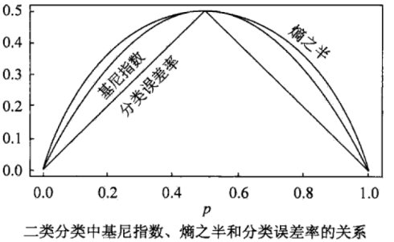

##	*Entropy*

> - （信息）熵：在概率分布上对复杂程度/多样性/不确定性/混乱程度的度量

$$
\begin{align*}
HOD(X) & = -E_P log P(x) \\
& = \sum_d^D P(x_d) log \frac 1 {P(x_d)} \\
& = - \sum_d^D p_d log p_d \\
\end{align*}
$$

> - $p_d$：随机变量各取值对应概率
> - 事件 $i$ 发生概率 $p_d=0$：约定 $p_d log(p_d)$ 为 0
> - 其中 $log$ 以 2 为底，单位为 *bit*，以 $e$ 为底，单位为 *nat*

-	信息论中，熵越高能传输越多信息
	-	可携带的信息量 = 单位消息熵 * 消息长度
	-	熵衡量系统复杂程度，提高系统确定性即削弱系统多样性，降低熵

-	概率分布包含的信息即其复杂程度（可能取值数量）
	-	考虑按照 $(p_1,\cdots,p_D)$ 分布、长度为 $N$ 的随机变量序列，其可能排列数为 $\frac {N!} {\prod_d^D (p_d N)!}$
	-	则根据 *Stirling* 公式有

		$$\begin{align*}
		log (\frac {N!} {\prod_d^D (p_d N)!}) & = log(N!)
			- \sum_d^D log((p_d N)!) \\
		& \overset {\lim_{N \rightarrow \infty}} = log(\sqrt {2\pi N}
			({\frac N e})^N) + \sum_d^D log(\sqrt {2\pi p_dN}
			({\frac {p_dN} e})^{p_dN}) \\
		& = log(\sqrt {2\pi N}) + N(logN-1) - \sum_d^D log(\sqrt {2\pi p_dN})
			- \sum_d^D p_dN (log(p_dN) - 1) \\
		& = log(\sqrt {2\pi N} + \sum_d^D log(\sqrt {2\pi p_dN}))
			+ N \sum_d^D p_d log p_d \\
		& \approx N \sum_d^D p_d log p_d
		\end{align*}$$

	-	则长度为 $N$ 的随机变量串的多样性、信息量为 $H * N$，其中 $H=\sum_d^D p_d log p_d$ 概率分布的信息熵

-	某个事件包含的信息可以用编码长度理解
	-	对概率 $p$ 事件，编码 $1/p$ 个需编码（2进制编码）长度 $log_2 \frac 1 p$
	-	则概率 $p$ 事件包含信息量可以定义为 $log \frac 1 p$，即事件包含的信息量可用表示事件需要编码的长度表示
		（底数则取决于编码元，只影响系数）
	-	则整个随机变量的信息为各事件信息量加权和

-	熵可以视为变量取值概率的加权和
	-	只依赖随机变量 $X$ 的分布，与其取值无关，可将其记为 $H(P)$
	-	由定义 $0 \leq H(P) \leq log_2 k$
		-	$H(p) = 0$：$\exists j, p_j=1$，随机变量只能取一个值，无不确定性
		-	$H(p) = log k$：$\forall j, p_j=1/k$，随机变量在任意取值概率相等，不确定性最大

> - *empirical entropy*：经验熵，熵中的概率由数据估计时（尤极大似然估计）
> - 参考链接
> > -	<https://zh.wikipedia.org/wiki/%E7%86%B5_(%E4%BF%A1%E6%81%AF%E8%AE%BA)>
> > -	<https://zhuanlan.zhihu.com/p/27876027>
> > -	<https://zhuanlan.zhihu.com/p/73710585>
> - *Stirling* 公式即用积分近似计算 $\sum logn$：<https://zhuanlan.zhihu.com/p/143992660>

###	熵的性质

-	对称性：事件取值不影响熵

-	极值性

	-	所有符号有同等机会出现的情况下，熵达到极大（琴生不等式）

		$$\begin{align*}
		H(X) & = E[log(\frac 1 {P(X)})] \leq log(E[\frac 1 {P(x)}])
			& = log(n)
		\end{align*}$$

	-	仅有一个符号确定出现的情况下，熵达到极小 0

-	*Continuity*连续性：度量连续，概率微小变化只能引起熵微小变化

-	*Normalization*规范化：$H_2(\frac 1 2, \frac 1 2) = 1$

-	*Grouping*组合法则/可加和性：熵与过程如何划分无关
	（此即要求熵形式为对数）

	-	若子系统间相互作用已知，则可以通过子系统熵值计算系统整体熵

		$$
		H(X) = H(X_1,\cdots,X_K) + \sum_{k=1}^K
			\frac {|X_k|} {|X|} H(X_k)
		$$

		> - $X_1,\cdots,X_K$：$K$ 个子系统，可以理解为将随机变量 $X$ 划分为 $K$ 种情况
		> - $H(X_1,\cdots,X_K)$：子系统相互作用熵

		-	子系统相互作用熵可以认为是，通过已知信息消除的多样性（即信息增益）
		-	子系统熵之和则是利用已知信息消除多样性之后，系统剩余混乱程度

	-	一般的，两个事件 $X,Y$ 熵满足以下计算关系

		$$\begin{align*}
		H(X, Y) & = H(X) + H(Y|X) \\
		& = H(Y) + H(X|Y) \\
		& \leqslant H(X) + H(Y) \\
		H(X|Y) & \leqslant H(X) \\
		\end{align*}$$

	-	特别的，若事件 $X, Y$ 相互独立

		$$\begin{align*}
		H(X|Y) &= H(X) \\
		H(X, Y) &= H(X) + H(Y)
		\end{align*}$$

> - 满足以上特性的熵定义必然为如下形式

	$$
	-K \sum P(x)log(P(x))
	$$

> - 在热力学、信息论等领域，熵有多种不同定义，满足熵性质的测度泛函，只能具有（*Shannon* 熵和 *Hartley* 熵）或（*von Neumann* 熵和 *Shannon* 熵）线性组合的函数形式，若不要求满足组合法则，还有 *Tsallis* 熵等

###	*Conditinal Entropy*

条件熵：随机变量 $X$ 给定条件下，随机变量 $Y$ 的**条件概率分布的熵**对 $X$ 的数学期望

$$\begin{align*}
H(Y|X) & = \sum_{i=1}^N p_i H(Y|X=x_i) \\
H(Y|x=x_i) & = - \sum_j P(y_j|x_i) log P(y_j|x_i)
\end{align*}$$

> - $P(X=x_i, Y=y_j)=p_{i,j}$：随机变量 $(X,Y)$ 联合概率分布
> - $p_i=P(X=x_i)$
> - $H(Y|X=x_i)$：后验熵

-	特别的，考虑数据集 $D$ 被分为 $D_1,\cdots,D_m$，条件经验熵可计算如下

	$$\begin{align*}
	H(D|A) & = \sum_{m=1}^M \frac {|D_m|} {|D|} H(D_m) \\
	& = -\sum_{m=1}^M \frac {|D_m|} {|D|}
		\sum_{k=1}^K \frac {|D_{m,k}|} {|D_m|}
		log_2 \frac {|D_{m,k}|} {|D_m|}
	\end{align*}$$

> - *postorior entropy*：后验熵，随机变量 $X$ 给定条件下，随机变量 $Y$ 的**条件概率分布的熵**
> - *empirical conditional entropy*：经验条件熵，概率由数据估计

###	*Infomation Gain*/*Mutual Infomation*

互信息/信息增益：（经验）熵与（经验）条件熵之差

$$\begin{align*}
g(Y|X) & = H(Y) - H(Y|X) \\
& = \sum_{x \in X} \sum_{y \in Y} P(x,y) log
	\frac {P(x,y)} {P(x)P(y)}
\end{align*}$$

-	与数据集具体分布有关、与具体取值无关
	-	绝对大小同易受熵影响，（经验）熵较大时，互信息也相对较大
	-	由于误差存在，分类取值数目较多者信息增益较大

-	可衡量变量 $X$ 对 $Y$ 预测能力、减少不确定性的能力
	-	信息增益越大，变量之间相关性越强，自变量预测因变量能力越强
	-	只能考察特征对整个系统的贡献，无法具体到特征某个取值
	-	只适合作全局特征选择，即所有类使用相同的特征集合

###	*Infomation Gain Ratio*

信息增益比：信息增益对原始信息熵的比值

$$\begin{align*}
g_R(Y|X) & = \frac {g(Y|X)} {H(X)}
\end{align*}$$

-	考虑熵大小，减弱熵绝对大小的影响

###	*Cross Entropy*

> - 信息论：基于相同事件测度的两个概率分布 $P, Q$，基于非自然（相较于真实分布 $P$）概率分布 $Q$ 进行编码，在事件集合中唯一标识事件所需 *bit*
> - 概率论：概率分布 $P, Q$ 之间差异

$$\begin{align*}
H(P, Q) & = E_P[-log Q] = \left \{ \begin{array}{l}
	-\sum_{X} P(x) logQ(x), & 离散分布 \\
	-\int_X P(x) log(Q(x)) d(r(x)), & 连续分布
\end{array} \right. \\
& = H(P) + D_{KL}(P||Q)
\end{align*}$$

> - $P(x), Q(x)$：概率分布（密度）函数
> - $r(x)$：测度，通常是 $Borel \sigma$ 代数上的勒贝格测度
> - $D_{KL}(P||Q)$：$P$ 到 $Q$ 的 *KL* 散度（$P$ 相对于 $Q$ 的相对熵）

-	信息论中，交叉熵可以看作是信息片段在错误分布 $Q$ 分布下的期望编码长度
	-	信息实际分布实际为 $P$，所以期望基于 $P$

> - 交叉熵是常用的损失函数：效果等价于 *KL* 散度，但计算方便
> - *sigmoid* 激活函数时：相较于二次损失，收敛速度更快

##	*Entropy* 衍生指标

###	*Kullback-Leibler Divergence*

*KL* 散度/相对熵：衡量概率分布 $P, Q$ 之间差异的量化指标

$$\begin{align*}
D_{KL}(P||Q) & = E_P[(-log Q(x)) - (-log P(x))] \\
& = E_P[log P(x) - log Q(x)] \\
& = \sum_{d=1}^D P(x_d) (log P(x_d) - log Q(x_d)) \\
& = \sum_{d=1} P(x_d) log \frac {P(x_d)} {Q(x_d)}
\end{align*}$$

-	*KL* 散度含义
	-	原始分布 $P$、近似分布 $Q$ 之间对数差值期望
	-	若使用观察分布 $Q$ 描述真实分布 $P$，还需的额外信息量

-	*KL* 散度不对称，分布 $P$ 度量 $Q$、$Q$ 度量 $P$ 损失信息不同
	-	从计算公式也可以看出
	-	KL散度不能作为不同分布之间距离的度量

###	*Population Stability Index*

*PSI*：衡量分布 $P, Q$ 之间的差异程度

$$\begin{align*}
PSI &= \sum_d^D (P_d - Q_d) * log \frac {P_d} {Q_d} \\
&= \sum_d^D P_d log \frac {P_d} {Q_d} +
	\sum_d^D Q_d log \frac {Q_d} {P_d} \\
&= D_{KL}(P||Q) + D_{KL}(Q||P)
\end{align*}$$

-	是 *KL* 散度的对称操作
	-	更全面的描述两个分布的差异

##	*Gini* 指数

基尼指数：可视为信息熵的近似替代

$$\begin{align*}
Gini(p) & = \sum_{k=1}^K p_k(1-p_k) \\
	& = 1 - \sum_{k=1}^K p_k^2
\end{align*}$$

> - $p$：概率分布
> - 异质性最小：*Gini* 系数为 0
> - 异质性最大：*Gini* 系数为 $1 - \frac 1 k$

-	*Gini* 指数度量分布的不纯度
	-	包含类别越多，*Gini* 指数越大
	-	分布越均匀，*Gini* 指数越大

> - 熵较 *Gini* 指数对不纯度判罚更重

> - 经济学领域的 *Gini* 系数更类似 *AUC* 值

###	与 *Entropy* 关系

$$\begin{align*}
H(X) & = -E_P log P(x) \\
& = - \sum_i^N p_i log p_i \\
& = - \sum_i^N p_i (log (1 + (p_i-1))) \\
& = - \sum_i^N p_i (p_i - 1 + \xi(p_i^{'}-1)) \\
& \approx 1 - \sum_i^N p_i^2
\end{align*}$$

-	*Gini* 指数可以视为是熵在 1 附近的一阶泰勒展开近似

###	条件 *Gini* 指数

$$
Gini(Y|X) = \sum_{k=1}^K P(X=x_k)Gini(Y|X=x_k)
$$

> - 性质类似信息增益

