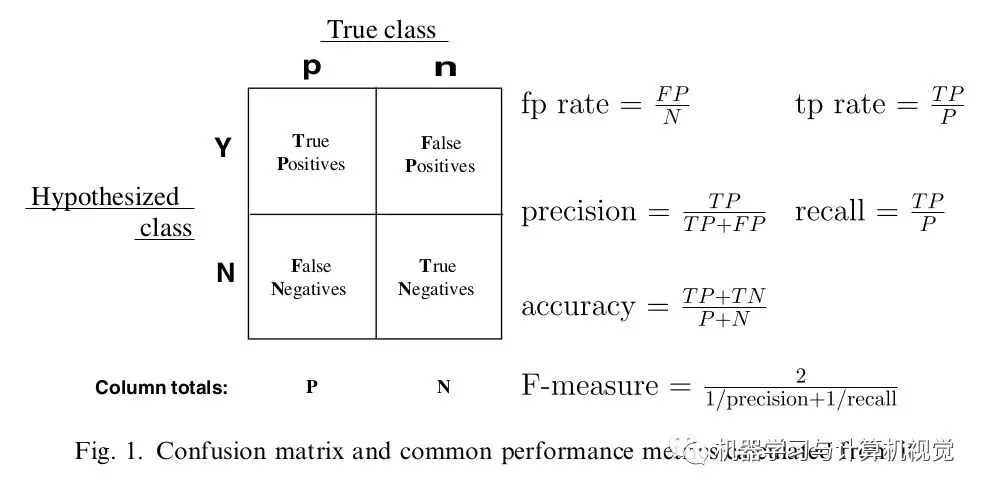

##	混淆矩阵

-	对比实际类别值、预测类别值，编制混淆矩阵
-	基于混淆矩阵，计算各类错判率、总错判率（总错判率会受到数据不平衡性的影响）

|真实情况\预测结果|正例|反例|
|------|------|------|
|正例|*TP*（真正例）|*FN*（假反例）|
|反例|*FP*（假正例）|*TN*（真反例）|



###	*F-Measure*

*F-测度*：准率率和召回率综合值，越大越好


$$
F-measure = \frac {(\beta^2 + 1) * P * R} {\beta^2 * P + R}
$$

> - $P = \frac {TP} {TP+FP}$：查准率、精确率
> - $R = \frac {TP} {TP+FN}$：查全率、召回率、覆盖率

####	F1值

*F1值*：$\beta=1$ 时的 *F测度*

$$\begin{align*}
\frac {1} {F_{1}} &= \frac {1} {2} \left( \frac {1} {P} + \frac {1} {R} \right) \\
\Rightarrow F_{1} &= \frac {2 * P * R} {P + R} = \frac {2 * TP} {样例总数 + TP - TN}
\end{align*}$$

###	*TPR*、*FPR*

-	*TPR*、*FPR* 可视为对 *TP*、*FP* 用样本数量归一化的结果
	-	样本全体中正、负样本数量往往差距很大，直接比较 *TP*、*FP* 不合理
	-	考虑使用样本正、负数量归一化，即计算正比例 *TPR*、负比例 *FPR*

-	*TPR* 越高越好，*FPR* 越低越好，但是这两个指标相互制约，两者同时增加、减小
	-	模型倾向于将样本 **判定为** 为正例，则 *TP*、*FP* 同时增加，*TPR*、*FPR* 同时变大
	-	即模型取不同阈值，会产生正相关的 *TPR*、*FPR* 的点列

###	*Recevier Operating Characteristic Curve*

*ROC* 曲线：不同 **正样本概率** 划分阈值下 *TPR*、*FPR* 绘制的折线/曲线

$$
TPR = \frac {TP} {TP+FN} \\
FPR = \frac {FP} {FP+TN}
$$

-	*ROC* 曲线即以 *FPR* 为横坐标、*TPR* 为正坐标绘制曲线
	-	*FPR* 接近 1 时，*TPR* 也接近 1，这是不可避免的
	-	而 *FPR* 接近 0 时，*TPR* 越大越好
	-	所以模型 *ROC* 曲线下方面积越大，模型判断正确效果越好

-	理解
	-	将正负样本的正样本概率值分别绘制在 `x=1`、`x=-1` 两条直线上
	-	阈值即为 `y=threshold` 直线
	-	*TPR*、*FPR* 则为 `x=1`、`x=-1` 两条直线在阈值直线上方点数量，与各直线上所有点数量比值

###	*Accuracy*

准确率、误分率：评价分类器性能一般指标

$$\begin{align*}
acc & = \frac 1 N sign(y_i = \hat y_i) \\
& = \frac {TP+TN} N \\
mis & = 1 - acc
\end{align*}$$

> - $y_i$：第 $i$ 样本实际类别
> - $\hat y_i$：第 $i$ 样本预测类别
> - $N$：样本数量

-	对给定测试集，分类器正确分类样本数与总样本数比值
-	即 *0-1* 损失函数时经验风险

##	*Area Under Curve*

*AUC* 值：*ROC* 曲线下方面积，越大越好

-	*AUC* 值实际含义：随机抽取一对正、负样本，对其中正样本的正样本预测概率值、大于负样本的正样本预测概率值的概率

	-	$=1$：完美预测，存在一个阈值可以让模型 *TPR* 为 1，*FPR* 为 0
	-	$(0.5, 1)$ ：优于随机预测，至少存在某个阈值，模型 $TPR > FPR$
	-	$=0.5$：同随机预测，无价值
	-	$[0, 0.5)$：差于随机预测，但是可以反向取预测值

###	AUC计算

-	绘制 *ROC* 曲线，计算曲线下面积
	-	给定一系列阈值（最精确时为样本数量），分别计算 *TPR*、*FPR*
	-	根据 *TPR*、*FPR* 计算 *AUC*

-	正负样本分别配对，计算正样本预测概率大于负样本比例

	$$\begin{align*}
	auc & = \frac {\sum I(P_P > P_N)} {M * N} \\
	I(P_P, P_N) & = \left \{ \begin{array}{l}
		1, & P_P > P_N, \\
		0.5, & P_P = P_N, \\
		0, & P_P < P_N
	\end{array} \right.
	\end{align*}$$

	> - $M, N$：正、负样本数量

-	*Mann-Witney U* 检验：即正、负样本分别配对的简化公式

	$$
	auc = \frac {\sum_{i \in Pos} rank(i) - \frac {M * (M+1)} 2} {M * N}
	$$

	> - $Pos$：正样本集合
	> - $rank(i)$：样本 $i$ 的按正样本概率排序的秩（对正样本概率值相同样本，应将秩加和求平均保证其秩相等）

###	*Weighted-AUC*

*WAUC*：给 **每个样本** 赋权，计算统计量时考虑样本权重

-	*FPR*、*TPR* 绘图

	$$\begin{align*}
	WTPR & = \frac {\sum_{i \in Pos} w_i I(\hat y_i=1)}
		{\sum_{i \in Pos} w_i} \\
	WFPR & = \frac {\sum_{j \in Neg} w_j I(\hat y_j=1)}
		{\sum_{j \in Neg} w_j}
	\end{align*}$$

	> - $WTPR, WFPR$：加权 *TPR*、加权 *FPR*
	> - $\hat y_i$：样本预测类别
	> - $w_i$：样本权重

-	*Mann-Witney U* 检验：考虑其意义，带入权重即可得

	$$\begin{align*}
	auc = \frac {\sum_{i \in Pos} w_i * rank(i) -
		\sum_{i \in Pos} w_i * rank_{pos}(i)}
		{\sum_{i \in Pos} w_i * \sum_{j \in Neg} w_j}
	\end{align*}$$

	> - $rank_{pos}(i)$：正样本内部排序，样本$i$秩
	> - $Neg$：负样本集合

###	多分类 *AUC*

-	*Micro-AUC*：将每个类别视为样本标签，计算全体样本的正标签、负标签的 *AUC*
	-	$n$ 个样本的 $m$ 维标签展平， 则其中有 $n$ 个正样本、$n * (m-1)$ 个负样本
	-	$n$ 个样本的 $m$ 个分类器共 $n * m$ 个得分展平
	-	使用以上预测得分、标签计算 *AUC*

	```python
	# one-vs-rest分类器得分
	y_score = classifer.transform(X_test)
	# 展平后计算fpr、tpr
	fpr_micro, tpr_micro, threshhold_micro = \
		skilearn.metrics.roc_curve(y_test.ravel(), y_score.ravel())
	# 利用fpr、tpr计算auc
	auc_micro = skilearn.metrics.auc(fpr_micro, tpr_micro)

	# 等价于直接调用
	auc_micro = skilearn.metrics.roc_auc_score(y_test, y_score, average="micro")
	```

-	*Macro-AUC*：对各类别，分别以计算 *ROC* 曲线（即 *TPR*、*FPR*），计算平均 *ROC* 曲线得到 *AUC*
	-	对各类别分别计算 *TPR*、*FPR*，共 $m$ 组 *TPR*、*FPR*
	-	平均合并 *TPR*、*FPR*，计算 *AUC*
		-	方法1：合并 *FPR*、去除重复值，使用 $m$ 组 *TPR*、*FPR* 分别求合并后 *FPR* 插值

			```python
			# 分别计算各类别fpr、tpr
			fprs, tprs = [0] * n_classes, [0] * n_classes
			for idx in range(n_classes):
				fprs[idx], tprs[idx], _ = sklearn.metrics.ruc_curve(
					y_test[:, i], y_score[:, i])
			# 合并fpr
			all_fpr = np.unique(np.concatenate(fprs))
			mean_tpr = np.zeros_like(all_fpr)
			# 计算合并后fpr插值
			for idx in range(n_classes):
				mean_tpr += scipy.interp(all_fpr, fpr[idx], tpr[idx])
			mean_tpr /= n_classes
			auc_macro = sklearn.metrics.auc(all_fpr, mean_tpr)

			# 但是和以下结果不同
			auc_macro = sklearn.metrics.roc_auc_score(fprs)
			```

> - 以上分类器均为 *one-vs-rest* 分类器，$m$ 个类别则 $m$ 个分类器、每个样本 $m$ 个得分

##	*Squared Error*

###	*Mean Squared Error*

*MSE*：均方误差（偏差）

$$
MSE = \frac {1} {n} \sum_{i=1}^{n} (y_{i} - \hat{y_{i}})^{2}
$$

###	$R^2$

$$\begin{align*}
R^2 & = 1 - \frac {SSE} {SST} = \frac {SSR} {SST} \\
R^2_{adj} & = 1 - \frac {1 - R^2} {n - p - 1}
\end{align*}$$

> - $n, p$：样本量、特征数量
> - $SSE$：残差平方和
> - $SSR$：回归平方和、组内平方和
> - $SST$：离差平方和
> - $R^2_{adj}$：调整的$R^2$

###	*Akaike Information Criterion*

*AIC* ：赤池信息准则

$$\begin{align*}
AIC & = -2log(L(\hat \theta, x)) + 2p \\
& = nln(SSE/n) + 2p
\end{align*}$$

> - $n, p$：样本量、特征数量
> - $\theta$：带估参数
> - $L(\theta, x)$：似然函数
> - $SSE$：残差平方和

###	*Bayesian Information Criterion*

*BIC*：贝叶斯信息准则

$$\begin{align*}
BIC & = -2log(L(\hat \theta, x)) + ln(n)p \\
& = nln(SSE/n) + ln(n)p
\end{align*}$$

###	$C_p$

$$\begin{align*}
C_p & = \frac {SSE} {\hat {\sigma^2}} - n + 2p \\
& = (n - m - 1) \frac {SSE_p} {SSE_m} - n + 2p
\end{align*}$$

> - $p$：选模型特征子集中特征数量
> - $m$：所有特征数量
> - $SSE_p$：选模型中残差平方和
> - $SSE_m$：全模型中残差平方和

