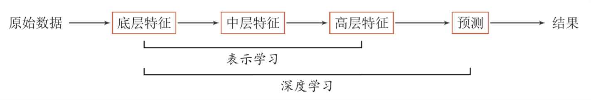

#	Data Science

##	*Statistic*

*frequentist and Bayesian*传统统计：数学分支，概率论和优化
的交集

-	分析方法：验证式分析

	-	统计建模：基于数据构建统计模型，并验证假设

	-	并运用模型对数据进行预测、分析

-	理论依据：模型驱动，严格的数理支撑

	-	理论体系：概率论、统计学、信息论、计算理论、最优化
		理论、计算机学科等多个领域的交叉学科，并在发展中形成
		独自的理论体系、方法论

	-	基本假设：同类数据具有一定的统计规律性，可以用概率
		统计方法加以处理，推断总体特征，如：随机变量描述数据
		特征、概率分布描述数据统计规律

-	分析对象：样本为分析对象

	-	从数据出发，提取数据特征、抽象数据模型、发现数据知识
		，再回到对数据的分析与预测

	-	数据多种多样，包括数字、文字、图像、音视频及其组合

	-	假设数据独立同分布产生

	-	训练数据集往往是人工给出的

-	是数据科学其他分支的理论基础

##	*Data Mining*

-	从现有的信息中提取数据的*pattern*、*model*，即精选最重要
	、可理解的、有价值的信息

	-	核心目的在于找到**数据变量之间的关系**
	-	**不是证明假说的方法，而是构建假说的方法**
	-	**大数据**的发展，传统的数据分析方式无法处理大量
		“不相关”数据

-	常用技术

	-	*cluster analysis*：聚类分析，揭示数据内在结构
	-	*classification*：判别分析，数据预测
	-	*regression/decision trees*：决策树，模型图形化展示
	-	*neural networks*：神经网络

-	联系

	-	本质上看起来像是ML、AI的基础
	-	会使用大量机器学习算法，但是特定的环境、目的和ML不同

-	建模一般策略：类似机器学习
	-	将数据视为高维空间中的点，在高维空间中找到分类面、
		回归面

##	*Artificial Intelligence*

-	研究如何创造智能agent，并不一定涉及学习、归纳，既可以研究
	让电脑像智能agent一样行为，也可以是设计更好的捕鼠夹

-	但是大部分情况下，**智能**需要从过去的经验中进行归纳，
	所以AI中很大一部分是ML

##	*Machine Learning*

机器学习：从有限观测数据中学习一般性规律，并将规律应用到
未观测样本中进行预测
（最基本的就是在不确定中得出结论）

-	分析方法：归纳式、探索式分析
-	理论依据：数据驱动，从数据中中学习知识，
-	分析对象：对样本要求低，样本往往不具有随机样本的特征
-	机器学习建模：不假设，通过对高维空间的搜索，找到数据隐藏
	规律的恰当概括

###	*Shallow Learning*

浅层学习：不涉及特征学习，特征抽取依靠人工经验、特征转换方法

-	传统机器学习可以视为浅层学习
-	步骤
	-	数据预处理
	-	特征提取
	-	特征转换
	-	预测

###	*Deep Learning*

深度学习：将原始数据特征通过多步特征转换得到更高层次、抽象
的特征表示，进一步输入到预测函数得到最终结果

-	主要目的是从数据中自动学习到**有效的特征表示**
	-	替代人工设计的特征，避免“特征”工程
	-	模型深度不断增加，特征表示能力越强，后续预测更容易

-	相较于“浅层学习”，需要解决的关键问题是贡献度分配问题
	-	从某种意义上说，深度学习也可以视为强化学习
	-	内部组件不能直接得到监督信息，需要通过整个模型的最终
		监督信息得到，有延时

-	目前深度学习模型主要是神经网络模型
	-	神经网络可以使用反向传播算法，较好的解决贡献度分配
		问题

> - *credit assignment problem*：贡献度分配问题，系统中不同
	组件、参数对最终系统输出结果的贡献、影响

> - 深度：原始数据进行**非线性特征转换的次数**，将深度学习
	系统看作有向图结构，深度可以看作是从输入节点到输出节点
	经过最长路径长度

###	*Representing Learning*

表示学习：自动学习有效特征、提高最终机器学习模型性能的学习

-	好的学习标准

	-	较强的表示能力：同样大小向量可以表示更多信息
	-	简化后续学习任务：需要包含更高层次语义信息
	-	具有一般性，是任务、领域独立的：期望学到的表示可以
		容易迁移到其他任务

-	要学习好的高层语义（分布式表示），需要从底层特征开始，
	经过多步非线程转换得到

	-	深层结构的优点式可以增加特征重用性，指数级增加表示
		能力
	-	所以表示学习的关键是构建具有一定深度、多层次特征表示

-	传统机器学习中也有关于特征学习的算法，如：主成分分析、
	线性判别分析、独立成分分析

	-	通过认为设计准则，用于选取有效特征
	-	特征学习、最终预测模型的学习是分开进行的，学习到的
		特征不一定可以用于提升最终模型分类性能

> - *Semantic Gap*：语义鸿沟，输入数据底层特征和高层语义信息
	之间不一致性、差异性

####	表示

-	*Local Representation*：局部表示，离散表示/符号表示
	-	通常可以表示为*one-hot*向量形式
		-	每个特征作为高维局部表示空间中轴上点
	-	不足
		-	*one-hot*维数很高、不方便扩展
		-	不同特征取值相似度无法衡量

-	*Distributed Representation*：分布式表示
	-	通常可以表示为**低维、稠密**向量
		-	分散在整个低维嵌入空间中中
	-	表示能力强于局部表示
		-	维数低
		-	容易计算相似度

> - 神经网络可以用于将高维局部空间$R^{|V|}$映射到非常低维
	分布式表示空间$R^d$

> - *embedding*：嵌入，将一个度量空间中对象映射到另一个低维
	度量空间，并尽可能**保持不同对象之间拓扑关系**，如NLP中
	词嵌入

###	*End-to-End Learning*

端到端学习/训练：学习过程中不进行分模块、分阶段训练，直接
优化任务的总体目标

-	不需要给出不同模块、阶段功能，中间过程不需要认为干预
-	训练数据为“输入-输出”对形式，无需提供其他额外信息
-	和深度学习一样，都是要解决“贡献度分配”问题
	-	大部分神经网络模型的深度学习可以看作是端到端学习

