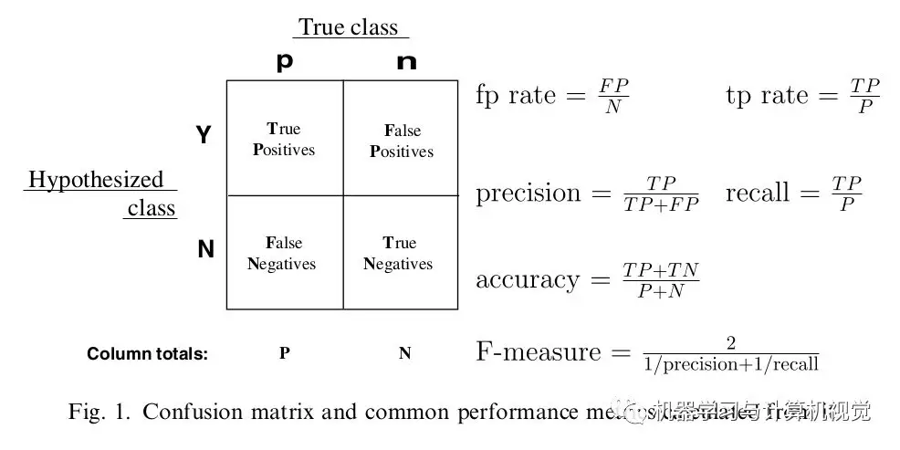

#	模型评估

##	评估方向

###	模型误差

给定损失函数时，基于损失函数的误差显然评估学习方法的标准

-	回归预测模型：模型误差主要使用*MSE*
-	分类预测模型：模型误差主要是分类错误率*ERR=1-ACC*

> - 模型训练时采用损失函数不一定是评估时使用的

####	*Training Error*

训练误差：模型在训练集上的误差，损失函数$L(Y, F(X)$
（随机变量）均值

$$
e_{train} = R_{emp}(\hat f) = \frac 1 N \sum_{i=1}^N
	L(y_i, \hat {f(x_i)})
$$

> - $\hat f$：学习到的模型
> - $N$：训练样本容量

-	训练时采用的损失函数和评估时一致时，训练误差等于经验风险

-	训练误差对盘对给定问题是否容易学习是有意义的，但是本质上
	不重要

-	模型训练本身就以最小化误差为标准，如：最小化MSE、最大化
	预测准确率，一般偏低，不能作为模型预测误差的估计

-	训练误差随模型复杂度增加单调下降（不考虑模型中随机因素）

####	*Test Error*

测试误差：模型在测试集上的误差，损失函数$L(Y, f(X))$
（随机变量）均值

$$
e_{test} = \frac 1 {N^{'}} \sum_{i=1}^{N^{'}}
	L(y_i,\hat {f(x_i)})
$$

> - $\hat f$：学习到的模型
> - $N$：测试样本容量

-	测试误差反映了学习方法对未知测试数据集的预测能力，是模型
	*generalization ability*的度量，可以作为模型误差估计

-	测试误差随模型复杂度增加呈U型

	-	偏差降低程度大于方差增加程度，测试误差降低
	-	偏差降低程度小于方差增加程度，测试误差增大

-	训练误差小但测试误差大表明模型过拟合，使测试误差最小的
	模型为理想模型

###	模型复杂度

> - *approximation error*：近似误差，模型偏差，代表模型对
	训练集的拟合程度
> - *estimation error*：估计误差，模型方差，代表模型对训练集
	波动的稳健性

-	模型复杂度越高

	-	低偏差：对训练集的拟合充分

	-	高方差：模型紧跟特定数据点，受其影响较大，预测结果
		不稳定

	-	远离真实关系，模型在来自同系统中其他尚未观测的数据
		集上预测误差大

-	而训练集、测试集往往不完全相同

	-	复杂度较高的模型（过拟合）在测试集上往往由于其高方差
		效果不好，而建立模型最终目的是用于预测未知数据

	-	所以要兼顾偏差和方差，通过不同建模策略，找到恰当
		模型，其复杂度不太大且误差在可接受的水平

	-	使得模型更贴近真实关系，泛化能力较好

> - 简单模型：低方差高偏差
> - 复杂模型：低偏差高方差

> - 模型复杂度衡量参*data_science/loss*

####	*Over-Fitting*

过拟合：学习时选择的所包含的模型复杂度大（参数过多），导致
模型对已知数据预测很好，对未知数据预测效果很差

-	若在假设空间中存在“真模型”，则选择的模型应该逼近真模型
	（参数个数相近）

-	一味追求对训练集的预测能力，复杂度往往会比“真模型”更高

####	解决方法

-	减少预测变量数量

	-	最优子集回归：选择合适评价函数（带罚）选择最优模型

	-	验证集挑选模型：将训练集使用*抽样技术*分出部分作为
		*validation set*，使用额外验证集挑选使得损失最小的
		模型

		> - 抽样技术参见*sampling*

	-	正则化（罚、结构化风险最小策略）

		-	岭回归：平方损失，$L_2$范数
		-	LASSO：绝对值损失，$L_1$范数
		-	Elastic Net

-	减弱变量特化程度：仅适合迭代求参数的方法

	-	*EarlyStop*：提前终止模型训练
	-	*Dropout*：每次训练部分神经元

###	模型信息来源

-	训练数据包含信息
-	模型形成过程中提供的先验信息
	-	模型：采用特定内在结构（如深度学习不同网络结构）、
		条件假设、其他约束条件（正则项）
	-	数据：调整、变换、扩展训练数据，让其展现更多、更有用
		的信息

##	*Generalization Ability*

泛化能力：方法学习到的模型对未知数据的预测能力

-	是学习方法本质上重要的性质

-	测试误差衡量学习方法的泛化能力不可靠，其依赖于测试集，
	而测试集有限

-	*generalization error*：泛化误差，即模型（期望）风险函数
	
	-	反映了学习方法的泛化能力
	-	进一步发，学习方法的泛化能力往往是通过研究泛化误差的
		概率上界进行

###	*Generalization Error Bound*

泛化误差上界：泛化误差的**概率**上界

-	是样本容量函数，样本容量增加时，泛化上界趋于0
-	是假设空间容量函数，假设空间容量越大，模型越难学习，泛化
	误差上界越大

###	二分类问题

定理：对二分类问题，假设空间为有限个函数的集合
$F={f_1, f_2, \cdots, f_d}$时，对任意函数$f \in F$，至少
以概率$1 - \sigma$，以下不等式成立

$$
R(f) \leqslant \hat{R(f)} + \epsilon(d, N, \sigma)
$$

> - $\hat{R(f)}$：训练误差，则训练误差小其泛化误差（上界）
	也较小（决定性基底，用经验估计期望）
> - $\epsilon(d, N, \sigma) = \sqrt {\frac 1 {2N} (logd + log \frac 1 {\sigma})}$
	：是样本量$N$递减函数、假设空间容量$d$的递增函数
	（在给定把握$1-\sigma$下，用经验估计期望的波动）
> - 不等式右端即为左端泛化误差$R(f)$上界

证明：
-	$\hat{R(f)}$是N个独立随机变量$L(Y, f(X))$的样本均值，
	$R_(f)$是N个独立随机变量$L(Y, f(X))$期望

-	若损失函数值取值于$[0,1]$，由Hoeffding不等式
	$$
	P(R(f) - \hat{R(f)} \geqslant \epsilon) \geqslant
		exp(-2N\epsilon^2)
	$$

-	假设空间$F$为有限集，有
	$$
	\begin{align*}
	P(\exists f \in F: R(f) - \hat{R(f)} \geq \epsilon) & =
		P(\bigcup_{f \in F} \{R(f) - \hat{R(f)} \geq \epsilon\}) \\
	& \leq \sum_{f \in F} P(R(f) - \hat{R(f)} \geq \epsilon) \\
	& \leq dexp(-2N\epsilon^2)
	\end{align*}
	$$

-	即$\forall f \in F$，有
	$$
	P(R(f) - \hat{R(f)} < \epsilon) \geq 1 -
		dexp(-2N\epsilon^2)
	$$

-	令$\sigma = dexp(-2N\epsilon^2)$，得证

##	*Classification*/*Tagging*

-	分类问题：输出变量$Y$为有限个离散变量
-	标注问题：输入$X^{(1)}, X^{(2)}, \cdots, X^{(n)}$、输出
	$Y^{(1)}, Y^{(2)}, \cdots, Y^{(n)}$**均为变量序列**

###	混淆矩阵

-	对比实际类别值、预测类别值，编制混淆矩阵
-	基于混淆矩阵，计算各类错判率、总错判率（总错判率会
	受到数据不平衡性的影响）

|真实情况\预测结果|正例|反例|
|------|------|------|
|正例|*TP*（真正例）|*FN*（假反例）|
|反例|*FP*（假正例）|*TN*（真反例）|

###	预测准确率

*accuracy*：准确率，评价分类器性能一般指标

$$acc = \frac {TP+TN} N$$

-	对给定测试集，分类器正确分类样本数与总样本数比值
-	0-1损失函数时经验风险

###	F-Measure

F-测度：准率率和召回率综合值

$$
F-measure = \frac {(\beta^2 + 1) * P * R} {\beta^2 * P + R}
$$

> - $P = \frac {TP} {TP+FP}$：查准率、精确率
> - $R = \frac {TP} {TP+FN}$：查全率、召回率、覆盖率

-	越大越好

####	F1值

F1值：$\beta=1$时的F测度

$$
\frac {1} {F_{1}} = \frac {1} {2}
	\left( \frac {1} {P} + \frac {1} {R} \right) \\
\Rightarrow F_{1} = \frac {2 * P * R} {P + R}
	= \frac {2 * TP} {样例总数 + TP - TN}
$$

###	ROC曲线

*Recevier Operating Characteristic Curve*

1.	将预测概率降序排序
2.	取分位点上概率值（即依次取不同的阈值）作为判断1/0的阈值
3.	计算*FPR*、*TPR*，绘制ROC曲线，计算ROC曲线下的面积AUC

$$
TPR = \frac {TP} {TP+FN} \\
FPR = \frac {FP} {FP+TN}
$$

-	TPR越高越好，FPR越低越好，但是这两个指标相互制约，两者
	同时增加、减小
	-	模型倾向于将样本**判定为**为正例，则TP、FP同时增加、
		TPR、FPR同时变大
	-	即模型取不同阈值，会产生正相关的TPR、FPR的点列

-	ROC曲线即以FPR为横坐标、TPR为正坐标绘制曲线
	-	FPR接近1时，TPR也接近1，这是不可避免的
	-	而FPR接近0时，TPR越大越好
	-	所以模型ROC曲线下方面积越大，模型判断正确效果越好

-	AUC值：ROC曲线下方面积，越大越好
	-	*=1*：完美预测，存在一个阈值可以让模型TPR为1，FPR为0
	-	*0.5~1*：优于随机预测，至少存在某个阈值，模型TPR>FPR
	-	*=0.5*：同随机预测，无价值
	-	*0~0.5*：差于随机预测，但是可以反向取预测值

###	Gini指数

概率分布p的基尼指数

$$\begin{align*}
Gini(p) & = \sum_{k=1}^K p_k(1-p_k) \\
	& = 1 - \sum_{k=1}^K p_k^2
\end{align*}$$

-	异质性最小时Gini系数为0
-	异质性最大时Gini系数为$1 - \frac 1 k$

####	条件Gini指数

条件Gini指数

$$
Gini(Y|X) = \sum_{k=1}^K P(X=x_k)Gini(Y|X=x_k)
$$

###	*Entropy*

熵：则是在概率分布上对随机变量X的不确定性/混乱程度的度量

> - 信息熵：信息消除不确定性的度量

$$
\begin{align*}
H(X) & = -E_P log P(x) \\
& = \sum_i^N P(x_i) log \frac 1 {P(x_i)} \\
& = - \sum_i^N p_i log p_i \\
\end{align*}
$$

> - $u_i$：随机变量各个取值
> - $p_i$：随机变量各取值对应概率
> - 事件i发生概率$p_i=0$：约定$p_i log(p_i)$为0
> - 其中$log$以2为底，单位为*bit*，以e为底，单位为*nat*

-	熵只依赖随机变量$X$的分布，与其取值无关，所以也可以将其
	熵记为$H(P)$

-	由定义$0 \leq H(P) \leq log_2 k$
	-	$H(p) = 0$：$\exists j, p_j=1$，随机变量只能取
		一个值，无不确定性
	-	$H(p) = log k$：$\forall j, p_j=1/k$，随机变量
		在任意取值概率相等，不确定性最大

> - *empirical entropy*：经验熵，熵中的概率由数据估计时
	（尤极大似然估计）

####	熵的性质

-	一般的
	$$\begin{align*}
	H(X, Y) & = H(X) + H(Y|X) \\
	H(X, Y) & = H(Y) + H(X|Y) \\
	H(X|Y) & \leqslant H(x) \\
	H(X, Y) & \leqslant H(X) + H(Y) \\
	\end{align*}$$

-	特别的，若X、Y相互独立
	$$
	H(X, Y) = H(X) + H(Y)
	$$

####	*Conditinal Entrophy*

条件熵：随机变量X给定条件下，随机变量Y的**条件概率分布的熵**
对X的数学期望

$$\begin{align*}
H(Y|X) & = \sum_{i=1}^N p_i H(Y|X=x_i) \\
H(Y|x=x_i) & = - \sum_j P(y_j|x_i) log P(y_j|x_i)
\end{align*}$$

> - $P(X=x_i, Y=y_j)=p_{i,j}$：随机变量$(X,Y)$联合概率分布
> - $p_i=P(X=x_i)$
> - $H(Y|X=x_i)$：后验熵

> - *postorior entropy*：后验熵，随机变量X给定条件下，随机
	变量Y的**条件概率分布的熵**
> - *empirical conditional entropy*：经验条件熵，概率由数据
	估计

####	*Mutual Infomation*/*Infomation Gain*

互信息/信息增益：（经验）熵与（经验）条件熵之差

$$\begin{align*}
g(Y|X) & = H(Y) - H(Y|X) \\
& = \sum_{x \in X} \sum_{y \in Y} p(x,y) log
	\frac {p(x,y)} {p(x)p(y)}
\end{align*}$$

-	和具体分布、数据集有关
-	（经验）熵较大时，互信息也相对较大

> - *infomation gain ratio*：信息增益比
	$$\begin{align*}
	g_R(Y|X) & = \frac {g(Y|X)} {H(X)}
	\end{align*}$$

####	*Cross Entropy*

> - 信息论：基于相同事件测度的两个概率分布$p, q$，基于非自然
	（相较于真实分布$p$）概率分布$q$进行编码，在事件集合中
	唯一标识事件所需bit
> - 概率论：概率分布$p, q$之间差异

$$\begin{align*}
H(p, q) & = E_p[-log q] = \left \{ \begin{array}{l}
	= -\sum_{x} p(x) logq(x), & 离散分布 \\
	= -\int_X P(x) log(Q(x)) d(r(x)), & 连续分布
\end{array} \right. \\
& = H(p) + D_{KL}(p||q)
\end{align*}$$

> - $q(x)$：离散非自然概率分布
> - $Q(x)$：连续非自然概率分布密度函数
> - $r(x)$：测度，通常是$Borel \sigma$代数上的勒贝格测度
> - $D_{KL}(p||q)$：$p$到$q$的KL散度（$p$相对于$q$的相对熵）

-	交叉熵是常用的损失函数：效果等价于KL散度，但计算方便

> - sigmoid激活函数时：相较于二次损失，收敛速度更快

####	*Kullback-Leibler Divergence*

KL散度/相对熵：概率分布$p, q$之间差异量化指标

$$\begin{align*}
D_{KL}(p||q) & = E_p[log p(x) - log q(x)] \\
& = \sum_{i=1}^N p(x_i) (log p(x_i) - log q(x_i)) \\
& = \sum_{i=1} p(x_i) log \frac {p(x_i)} {q(x_i)}
\end{align*}$$

-	KL散度表示：原始分布$p$、近似分布$q$之间对数差值期望
-	KL散度不对称，分布$p$度量$q$、$q$度量$p$损失信息不同
	-	从计算公式也可以看出
	-	KL散度不能作为不同分布之间距离的度量

###	误分率

$$
1 - \hat p_{m, k(m)} = \frac 1 {n_m}
	\sum_{x_i \in R_m} I(y_i \neq k(m))
$$

###	KLP统计量

###	卡方统计量

卡方统计量：通过观察实际与理论值的偏差确定理论正确与否

-	假设两个变量确实独立，观察实际值、理论值偏差程度
-	若偏差足够小，认为误差是自然的样本误差，两者确实独立
-	若偏差大到一定程度，误差不可能由偶然、测量精度导致，认为
	两者相关

####	说明

-	将模型预测结果视为实际分布、先验分布（均匀分布）视为理论
	分布

-	若模型预测结果同先验分布差别很大，说明模型有效，且卡方
	统计量值越大说明预测效果越好

##	*Regression*

-	回归问题

###	方差

回归树中输出变量取值异质性测度

$$
R(t) = \frac 1 {N - 1} \sum_{i=1}^N (y_i(t) - \bar{y}(t)^2) \\
\delta R(t) = R(t) - (\frac {N_r} N R(t_r) + \frac {N_l} N (R(t_l))
$$

###	均方误差（偏差）

$$
MSE = \frac {1} {n} \sum_{i=1}^{n} (y_{i} - \hat{y_{i}})^{2}
$$

基于最小化MSE原则

$$
\begin{align*}
E(Y - \hat{Y}) &= E[f(x) + \epsilon - \hat{f}(X)]^{2} \\
	&= E([f(X) - \hat{f}(X)])^{2} + Var(\epsilon) \\
	&= E_{\tau}[\hat{y}_{0} - E_{\tau}(\hat{y})]^{2} +
		[E_{\tau}(\hat{y}_{0}) - f(x_{0})]^{2} +
		Var(\epsilon) \\
	&= Var_{\tau}(\hat{y}_{0})+ Bias^{2}(\hat{y}_{0}) + Var(\epsilon)\\
\end{align*}
$$

###	$R^2$

$$\begin{align*}
R^2 & = \frac {SSR} {SST}\\
R^2_{adj} & = 1 - \frac {1 - R^2} {n - p - 1}
\end{align*}$$

> - $n, p$：样本量、特征数量
> - $SSR$：回归平方和、组内平方和
> - $SST$：离差平方和
> - $R^2_{adj}$：调整的$R^2$

###	*Akaike Information Criterion*

AIC：赤池信息准则

$$\begin{align*}
AIC & = -2log(L(\hat \theta, x)) + 2p \\
& = nln(SSE/n) + 2p
\end{align*}$$

> - $n, p$：样本量、特征数量
> - $\theta$：带估参数
> - $L(\theta, x)$：似然函数
> - $SSE$：残差平方和

###	*Bayesian Information Criterion*

BIC：贝叶斯信息准则

$$\begin{align*}
BIC & = -2log(L(\hat \theta, x)) + ln(n)p \\
& = nln(SSE/n) + ln(n)p
\end{align*}$$

###	$C_p$

$$\begin{align*}
C_p & = \frac {SSE} {\hat {\sigma^2}} - n + 2p
& = (n - m - 1) \frac {SSE_p} {SSE_m} - n + 2p
\end{align*}$$

> - $p$：选模型特征子集中特征数量
> - $m$：所有特征数量
> - $SSE_p$：选模型中残差平方和
> - $SSE_m$：全模型中残差平方和

