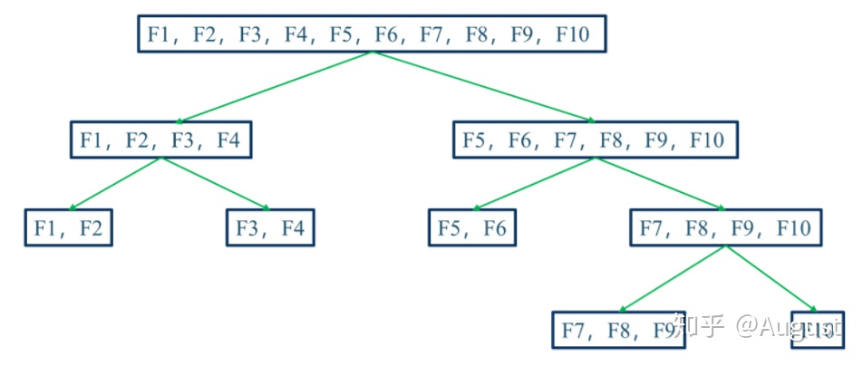

##	数值化：分类->数值

###	*Ordinal Encoding*

序号编码：使用一位序号编码类别

-	一般用于处理类别间具有大小关系的数据
	-	编码后依然保留了大小关系

###	*One-hot Encoding*

独热编码：采用N位状态位对N个可能取值进行编码

-	一般用于处理类别间不具有大小关系的特征

-	独热编码后**特征表达能力变差**，特征的预测能力被人为拆分为多份
	-	通常只有部分维度是对分类、预测有帮助，需要借助特征选择降低维度

> - 在经典统计中，为避免完全多重共线性，状态位/哑变量会比取值数量少 1

####	优点

-	能处理非数值属性
-	一定程度上扩充了特征
-	编码后向量时稀疏向量：可以使用向量的稀疏存储节省空间
-	能够处理缺失值：高维映射方法中增加维度表示缺失

####	缺点

-	*k-NN* 算法：高维空间两点间距离难以有效衡量

-	逻辑回归模型：参数数量随维度增加而增大，增加模型复杂度，容易出现过拟合

-	决策树模型
	-	产生样本切分不平衡问题，切分增益非常小
		-	每个特征只有少量样本是 1，大量样本是 0
		-	较小的拆分样本集占总体比例太小，增益乘以所占比例之后几乎可以忽略
		-	较大拆分样本集的几乎就是原始样本集，增益几乎为 0
	-	影响决策树的学习
		-	决策树依赖数据统计信息，独热编码将数据切分到零散小空间上，统计信息不准确、学习效果差
		-	独热编码后特征表达能力边人为拆分，与其他特征竞争最优划分点失败，最终特征重要性会比实际值低

###	*Binary Encoding*

二进制编码：先用序号编码给每个类别赋予类别 *ID*，然后将类别 *ID* 对应二进制编码作为结果

-	本质上利用二进制类别 *ID* 进行哈希映射，得到 *0/1* 特征向量
-	特征维度小于独热编码，更节省存储空间

###	*Weight of Evidence Encoding*

*WOE* 编码：以分类变量各取值的 *WOE* 值作为编码值

$$\begin{align*}
WOE_i & = log(\frac {\%B_i} {\%G_i}) \\
& = log(\frac {\#B_i / \#B_T} {\#G_i / \#G_T})
\end{align*}$$

> - $\%B_i, \%G_i$：分类变量取第 $i$ 值时，预测变量为 *B* 类、*G* 类占所有 *B* 类、*G* 类比例
> - $\#B_i, \#B_T$：分类变量取第 $i$ 值时，预测变量为 *B* 类占所有 *B* 类样本比例
> - $\#G_i, \#G_T$：分类变量取第 $i$ 值时，预测变量为 *G* 类占所有 *G* 类样本比例

-	*WOE* 编码是有监督的编码方式，可以衡量分类变量各取值中
	-	*B* 类占所有 *B* 类样本比例、*G* 类占所有 *G* 类样本比例的差异
	-	*B* 类、*G* 类比例，与所有样本中 *B* 类、*G* 类比例的差异

-	*WOE* 编码值能体现分类变量取值的预测能力，变量各取值 *WOE* 值方差越大，变量预测能力越强
	-	*WOE* 越大，表明该取值对应的取 *B* 类可能性越大
	-	*WOE* 越小，表明该取值对应的取 *G* 类可能性越大
	-	*WOE* 接近 0，表明该取值预测能力弱，对应取 *B* 类、*G* 类可能性相近

####	优势

-	相较于 *one-hot* 编码
	-	特征数量不会增加，同时避免特征过于稀疏、维度灾难
	-	避免特征筛选过程中，一部分特征取值被筛选，一部分被遗弃，造成特征不完整
	-	将特征规范到**同一尺度**的数值变量，同时也便于分析特征间相关性

-	在 *LR* 模型中，*WOE* 编码线性化赋予模型良好的解释性
	-	*WOE* 编码本身即可反应特征各取值贡献
	-	可以用于给评分卡模型中各分箱评分

##	分类化/离散化：数值->分类

-	分类型变量本质上无法建模，因为取值从含义上无法进行数值计算
-	将数值型映射为分类型，往往只是中间步骤，最终会将分类型取值映射回数值型

> - 若分箱数量为 2，也被成为是二元化/布尔化

###	离散化综述

-	模型使用离散特征、连续特征，是“海量离散特征+简单模型”、“少量连续特征+复杂模型”的权衡
	-	**海量离散特征+简单模型**：难点在于特征工程，成功经验可以推广，可以多人并行研究
	-	**少量连续特征+复杂模型**：难点在于模型调优，不需要复杂的特征工程

-	一般的，连续特征对预测结果影响不会突变，合理的离散化不应造成**大量信息丢失**
	-	且若特征存在突变，模型将难以拟合（线性模型尤其）
	-	反而更应该离散化为多个分类特征，方便引入非线性

-	事实上，根据Cover定理，离散化增加特征维度类似于投影至高维，更可能得到较优模型（也更容易过拟合）
	-	极限角度，对所有特征、取值均离散化，则可以得到完全可分模型（除特征完全一样分类不同）

####	描述角度

-	*supervised vs. unsupervised*：是否使用分类信息指导离散化过程
	-	无监督
		-	如：等距、等频划分
		-	无法较好的处理异常值、不均匀分布
	-	有监督
		-	利用分类信息寻找合适切分点、间隔
		-	根据使用分类信息的方式有许多种

-	*dynamic vs. static*：离散化、分类是否同时进行

-	*global vs. local*：在特征空间的局部还是全局进行离散化

-	*spliting vs. merging*/*top-down vs. bottom-up*：自顶向下划分还是自底向上合并

-	*direct vs. incremental*：直接根据超参数确定分箱数量还是逐步改善直到中止准则

####	典型过程

-	*sort*：排序
-	*evaluate*：评估分割点
-	*split or merge*：划分、合并
-	*stop*：停止离散化

####	评价

-	*Simplicity*：可用切分点数量衡量简单性
-	*Consistency*：可以通过**最小不一致数量**衡量一致性
	-	不一致：样本具有相同的特征取值，但分类不同
	-	分箱最小不一致数量则为，箱内样本数量减最大类别数量
-	*Accuracy*：可通过分类器进行交叉验证的准确率衡量

####	优势

-	方便工业应用、实现
	-	离散特征的增加、减少容易，方便模型迭代
	-	特征离散化处理缺失值、异常值更方便，可直接将其映射为某取值
	-	数值化后可指定取值类型，如：*one-hot*编码为为稀疏向量
		-	內积速度快
		-	存储方便
		-	容易扩展

-	方便引入历史经验
	-	可以自由调整离散化结果，结合机器学习和历史经验得到最终的离散化结果

-	模型更稳健
	-	模型不再拟合特征具体值，而是拟合某个概念，能够对抗数据扰动，更稳健
	-	对异常数据鲁棒性更好，降低模型过拟合风险
	-	某些场合需要拟合参数值更少，降低模型复杂度

-	（引入）非线性提升模型表达能力
	-	利用经验、其他信息将数值特征分段，相当于**引入非线性**，提升线性模型表达能力
	-	方便引入交叉特征，提升模型表达能力

####	适合场景

-	离散化特征更适合 *LR* 等线性模型
	-	如下离散化优势：方便引入非线性等
	-	模型中所有特征都会被考虑，考虑细节、个体（包括 $L_1$ 范数也是被考虑后剔除）

-	*GBDT* 等树、抽样模型则不适合
	-	特征离散化后，由于抽样误差的存在，可能存在某些离散特征对**样本预测能力非常强**，非线性模型容易给这些特征更大权重，造成过拟合
		-	如：刚好抽取的 1000 个样本中某离散特征取值为 1 者全为正样本
	-	树模型每次使用一个特征划分节点，特征数量较多不利于模型训练
		-	若单个离散化特征预测能力不强，由于树深度限制，只有少量特征被作为划分依据，模型可能不收敛、表达能力更差
		-	若单个离散化特征预测能力强，连续特征也应该也有较好效果

###	无监督

-	无监督分箱仅仅考虑特征自身数据结构，没有考虑特征与目标之间的关系

####	等频/等距/经验分箱

-	分箱逻辑
	-	等频分箱：排序后按数量等分
		-	避免离散化后特征仍然为长尾分布、大量特征集中在少量组内
		-	对数据区分能力弱
	-	等距分箱：取值范围等分
	-	经验分箱

-	分箱数量、边界超参需要人工指定
	-	根据业务领域经验指定
	-	根据模型指定：根据具体任务训练分箱之后的数据集，通过超参数搜索确定最优分桶数量、边界

-	分箱经验、准则
	-	若组距过大，组内属性取值差距过大
		-	逻辑上分类不能够代表组内全部样本，组内取值影响可能完全不同
	-	若组距过小，组内样本过少
		-	随机性太强，不具备统计意义上说服力
		-	特征影响跳变过多

####	聚类分箱

-	*K-Means* 聚类
-	层次聚类

> - 聚类过程中需要保证分箱有序

###	有监督

####	*Binning：1R* 分箱

-	分箱逻辑、步骤
	-	将样本排序，从当前位置开始
		-	初始化：以允许的最少样本作为一箱，将箱内最多类别作为箱标签
		-	扩展：若下个样本类别与箱标签相同，则划至箱内
	-	重复以上，得到多个分箱
	-	将相邻具有相同标签的箱合并，得到最终分箱结果

####	*Splitting*

-	基于信息熵的 *split*，具体划分依据如下
	-	*ID3*：信息增益
	-	*C4.5*：信息增益比
	-	*D2*：
	-	*Minimum Description Length Principle*：描述长度

####	Merge分箱

-	基于依赖相关的 *merge*，具体划分依据如下
	-	*Chimerge*：使用卡方值衡量两个相邻区间是否具有类似分布，若具有类似分布则将其合并

#####	具体算法

> - 输入：目标分箱数量 $N$
-	初始化
	-	将变量升序排列
	-	为减少计算量，若初始分箱数量大于阈值 $N_{max}$，则利用等频分箱进行粗分箱
	-	缺失值单独作为一个分箱
-	合并区间
	-	计算每对相邻区间的卡方值
	-	将卡方值最小区间合并
	-	重复以上直至分箱数量不大于 $N$
-	分箱后处理
	-	合并纯度为 1（只含有某类样本）的分箱
	-	删除某类样本占比超过 95% 的分箱
	-	若缺失值分箱各类样本占比同非缺失值分箱，则合并

