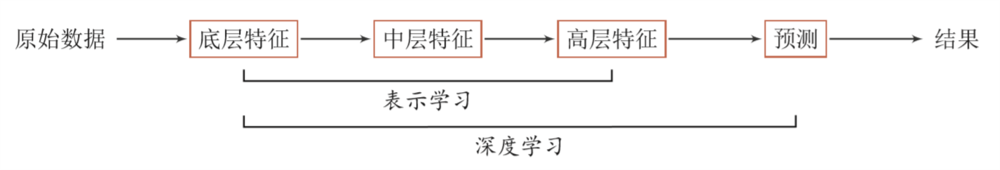

##	名词

###	*Statistic - Frequentist and Bayesian*

统计：数学分支，概率论和优化的交集，是数据科学其他分支的理论基础

-	分析方法：验证式分析
	-	统计建模：基于数据构建统计模型，并验证假设
	-	模型预测：运用模型对数据进行预测、分析

-	理论依据：模型驱动，严格的数理支撑
	-	理论体系
		-	概率论、信息论、计算理论、最优化理论、计算机学科等多个领域的交叉学科
		-	并在发展中形成独自的理论体系、方法论
	-	基本假设：同类数据具有一定的统计规律性，可以用概率统计方法加以处理，推断总体特征，如
		-	随机变量描述数据特征
		-	概率分布描述数据统计规律

-	分析对象：以样本为分析对象
	-	从数据出发，提取数据特征、抽象数据模型、发现数据知识，再回到对数据的分析与预测
	-	数据多种多样，包括数字、文字、图像、音视频及其组合
	-	假设数据独立同分布产生
	-	训练数据集往往是人工给出的

###	*Data Mining*

-	从现有的信息中提取数据的 *pattern*、*model*，即精选最重要、可理解的、有价值的信息
	-	核心目的在于找到 **数据变量之间的关系**
	-	**不是证明假说的方法，而是构建假说的方法**
	-	**大数据** 的发展，传统的数据分析方式无法处理大量“不相关”数据

-	常用技术
	-	*cluster analysis*：聚类分析，揭示数据内在结构
	-	*classification*：判别分析，数据预测
	-	*regression/decision trees*：决策树，模型图形化展示
	-	*neural networks*：神经网络

-	联系
	-	本质上看起来像是 *ML*、*AI* 的基础
	-	会使用大量机器学习算法，但是特定的环境、目的和ML不同

-	建模一般策略：类似机器学习
	-	将数据视为高维空间中的点，在高维空间中找到分类面、回归面

###	*Artificial Intelligence*

-	研究如何创造智能 *agent*，并不一定涉及学习、归纳
-	但是大部分情况下，**智能** 需要从过去的经验中进行归纳，所以 *AI* 中很大一部分是 *ML*

##	*Machine Learning*

机器学习：从有限观测数据中学习一般性规律，并将规律应用到未观测样本中进行预测（最基本的就是在不确定中得出结论）

-	分析方法：归纳式、探索式分析
-	理论依据：数据驱动，从数据中中学习知识，
-	分析对象：对样本要求低，样本往往不具有随机样本的特征
-	机器学习建模：不假设，通过对高维空间的搜索，找到数据隐藏规律的恰当概括

###	*Shallow Learning*

浅层学习：不涉及特征学习，特征抽取依靠人工经验、特征转换方法

-	传统机器学习可以视为浅层学习

-	步骤
	-	数据预处理
	-	特征提取
	-	特征转换
	-	预测

###	*Deep Learning*

深度学习：将原始数据特征通过多步特征转换得到更高层次、抽象的特征表示，进一步输入到预测函数得到最终结果

-	主要目的是从数据中自动学习到**有效的特征表示**
	-	替代人工设计的特征，避免“特征”工程
	-	模型深度不断增加，特征表示能力越强，后续预测更容易

-	相较于浅层学习：需要解决的关键问题是**贡献度分配问题**
	-	从某种意义上说，深度学习也可以视为强化学习
	-	内部组件不能直接得到监督信息，需要通过整个模型的最终监督信息得到，有延时

-	目前深度学习模型主要是神经网络模型
	-	神经网络可以使用反向传播算法，较好的解决贡献度分配问题

> - *credit assignment problem*：贡献度分配问题，系统中不同组件、参数对最终系统输出结果的贡献、影响

> - 深度：原始数据进行**非线性特征转换的次数**，将深度学习系统看作有向图结构，深度可以看作是从输入节点到输出节点经过最长路径长度

###	*Representing Learning*

表示学习：自动学习有效特征、提高最终机器学习模型性能的学习

-	好的学习标准
	-	较强的表示能力：同样大小向量可以表示更多信息
	-	简化后续学习任务：需要包含更高层次语义信息
	-	具有一般性，是任务、领域独立的：期望学到的表示可以容易迁移到其他任务

-	要学习好的高层语义（分布式表示），需要从底层特征开始，经过多步非线程转换得到
	-	深层结构的优点式可以增加特征重用性，指数级增加表示能力
	-	所以表示学习的关键是构建具有一定深度、多层次特征表示

-	传统机器学习中也有关于特征学习的算法，如：主成分分析、线性判别分析、独立成分分析
	-	通过认为设计准则，用于选取有效特征
	-	特征学习、最终预测模型的学习是分开进行的，学习到的特征不一定可以用于提升最终模型分类性能

> - *Semantic Gap*：语义鸿沟，输入数据底层特征和高层语义信息之间不一致性、差异性

####	表示

-	*Local Representation*：局部表示，离散表示/符号表示
	-	通常可以表示为 *one-hot* 向量形式
		-	每个特征作为高维局部表示空间中轴上点
	-	不足
		-	*one-hot* 维数很高、不方便扩展
		-	不同特征取值相似度无法衡量

-	*Distributed Representation*：分布式表示
	-	通常可以表示为 **低维、稠密** 向量
		-	分散在整个低维嵌入空间中中
	-	表示能力强于局部表示
		-	维数低
		-	容易计算相似度

> - 神经网络可以用于将高维局部空间 $R^{|V|}$ 映射到非常低维分布式表示空间 $R^d$

###	*End-to-End Learning*

端到端学习/训练：学习过程中不进行分模块、分阶段训练，直接优化任务的总体目标

-	不需要给出不同模块、阶段功能，中间过程不需要认为干预
-	训练数据为“输入-输出”对形式，无需提供其他额外信息
-	和深度学习一样，都是要解决“贡献度分配”问题
	-	大部分神经网络模型的深度学习可以看作是端到端学习

##	*Learning Components*

###	*Model*/*Hypothesis*/*Opimizee*/*Learner*/*Learning Algorithm*

模型/假说/优化对象/学习器/学习算法：待学习的条件概率分布 $P(Y|X)$、决策函数 $Y=f(X)$

-	概率模型：适合用条件概率分布 $P(Y|X)$ 表示的模型
-	非概率模型：用决策函数 $Y=f(x)$ 表示的模型

> - *learner*：某类模型的总称
> - *hypothesis*：训练好的模型实例，有时也被强调作为学习器应用在某个样本集（如训练集）上得到的结果
> - *learning algorithm*：模型、策略、算法三者的模型总体

####	*Hypothesis Space*

假设空间：特征空间（输入空间）到输出空间的映射集合

-	假设空间可以定义为决策函数/条件概率的集合，通常是由参数向量 $\theta$ 决定的函数/条件分布族
	-	假设空间包含所有可能的条件概率分布或决策函数
	-	假设空间的确定意味着学习范围的确定

-	概率模型假设空间可表示为：$F=\{P|P_{\theta}(Y|X), \theta \in R^n\}$

-	非概率模型假设空间可表示为：$F=\{f|Y=f(x),\Theta \in R^n \}$

> - 以下大部分情况使用决策函数，同时也可以代表概率分布

###	*Strategy*/*Goal*

策略/目标：从假设空间中，根据 *evaluation criterion* 选择最优模型，使得其对已知训练数据、未知训练数据在给定评价准则下有最优预测

-	选择合适策略，监督学习问题变为经验风险、结构风险函数 **最优化问题**

-	在某些学习方法中，最优化问题目标函数也有可能不是风险函数，如：*SVM*，是和模型紧密相关的损失函数，但逻辑是一样的

####	*Empirical Risk Minimiation*

*ERM*：经验风险最小化策略认为，经验风险最小模型就是最优模型

-	按经验风险最小化求最优模型，等价于求最优化问题

	$$
	\min_{f \in F} \frac 1 N \sum_{i=1}^N L(y_i, f(x_i))
	$$

-	样本容量足够大时，经验风险最小化能保证有较好的学习效果，现实中也被广泛采用

####	*Structural Risk Minimization*

*SRM*：结构风险最小化，为防止过拟合提出的策略

-	结构化风险最小化策略认为结构风险最小的模型是最优模型，则求解最优模型等价于求解最优化问题

	$$
	arg \min_{f \in F} \frac 1 N \sum_{i=1}^N L(y_i, f(x_i)) + \lambda J(f)
	$$

-	结构风险小需要经验风险与模型复杂度同时小，此时模型往往对训练数据、未知的测试数据都有较好的预测

-	结构化风险最小策略符合 *Occam's Razor* 原理

> - *Occam's Razor*：奥卡姆剃刀原理，在所有可能选择的模型中，能够很好的解释已知数据并且十分简单才是最好的模型

###	*Algorithm*/*Optimizer*

算法/优化器：学习模型（选择、求解最优模型）的具体计算方法
（求解最优化问题）

-	如果最优化问题有显式解析解，比较简单

-	但通常解析解不存在，需要用数值计算方法求解
	-	保证找到全局最优解
	-	高效求解

##	*Supervised Learning*

监督学习：学习一个模型，使得模型能够对任意给定输入、输出，做出好的预测

-	从给定的、有限的、用于学习的 *train data* $T=\{(x_1,y_1), (x_2,y_2), \cdots, (x_N, y_N)\}$ 中学习

-	预测 “未知” *test data* $T=\{(x_1,y_1), (x_2,y_2), \cdots, (x_N^{'}, y_N^{'})\}$

###	数据

-	*input space*：输入空间 $\chi$，所有输入 $X$ 可能取值的集合
-	*output space*：输出空间 $\gamma$，所有输出 $Y$ 可能取值集合
-	*feature space*：特征空间，表示输入实例 *feature vector* 存在的空间
	-	特征空间每维对应一个特征
	-	模型实际上是定义在特征空间上的
	-	特征空间是输入空间的象集，有时等于输入空间

###	学习方法分类

####	*Generative Approach*

生成方法：由数据学习联合概率分布 $P(X, Y)$，然后求出条件概率分布 $P(Y|X)$ 作为 *generative model*

-	方法学习给定输入X产生输出Y的生成关系（联合概率分布）
-	*generative model*：生成模型，由生成方法学习到的模型 $P(Y|X) = \frac {P(X, Y)} {P(X}$
	-	朴素贝叶斯法
	-	隐马尔可夫模型

-	特点
	-	可以还原联合概率分布 $P(X, Y)$
	-	生成方法学习收敛速度快，样本容量增加时，学习到的模型可以快速收敛到真实模型
	-	存在隐变量时，仍可以使用生成方法学习

####	*Discriminative Approach*

判别方法：由数据直接学习决策函数 $f(x)$、条件概率分布 $P(Y|X)$ 作为 *discriminative model*

-	判别方法关心的是对给定输入 $X$，预测输出$Y$

-	*discriminative model*：判别模型
	-	*KNN*
	-	感知机
	-	决策树
	-	逻辑回归
	-	最大熵模型
	-	支持向量机
	-	提升方法
	-	条件随机场

-	特点
	-	直接学习条件概率、决策函数
	-	直面预测，学习准确率更高
	-	可以对数据进行各种程度抽象、定义特征、使用特征，简化学习问题

###	问题分类

-	*well-posed problem*：好解问题，指问题解应该满足以下条件
	-	解存在
	-	解唯一
	-	解行为随着初值**连续变化**

-	*ill-posed problem*：病态问题，解不满足以上三个条件

####	*Classification*

分类问题：输出变量$Y$为有限个离散变量

-	学习过程：根据已知训练数据集，利用有效学习方法学习分类器 $P(Y|X))$、$Y=F(X)$
-	分类过程：利用学习的分类器对新输入实例进行分类
-	可用学习方法
	-	*KNN*
	-	感知机
	-	朴素贝叶斯
	-	决策树
	-	决策列表
	-	逻辑回归
	-	支持向量机
	-	提升方法
	-	贝叶斯网络
	-	神经网络

-	不存在分类能力弱于随机预测的分类器（结论取反）

####	*Tagging*

标注问题：输入、输出 **均为变量序列**

-	可认为是分类问题的一个推广、更复杂 *structure prediction* 简单形式
-	学习过程：利用已知训练数据集构建条件概率分布模型 $P(Y^{(1)}, Y^{(2)}, \cdots, Y^{(n)}|X^{(1)}, X^{(2)}, \cdots, X^{(n)})$
	> - $X^{(1)}, X^{(2)}, \cdots, X^{(n)}$：每个输入序列
	> - $Y^{(1)}, Y^{(2)}, \cdots, Y^{(n)}$：所有可能标记
-	标注过程：按照学习到的条件概率分布，标记新的输入观测序列
-	可用模型
	-	隐马尔可夫模型
	-	条件随机场

####	*Regression*

回归问题：输入（自变量）、输出（因变量）均为连续变量

-	回归模型的拟合等价于函数拟合：选择函数曲线很好的拟合已知数据，且很好的预测未知数据
-	学习过程：基于训练数据构架模型（函数）$Y=f(X)$
	-	最常用损失函数是平方损失函数，此时可以使用最小二乘求解
-	预测过程：根据学习到函数模型确定相应输出

##	*Unsupervised Learning*

无监督学习：没有给定实现标记过的训练示例，自动对输入的数据进行分类

-	主要目标：预训练一般模型（称识别、编码）网络，供其他任务使用
-	目前为止，有监督模型一般比无监督的预训练模型表现得好
	-	主要原因：有监督模型对数据的 **特性编码** 更好

###	问题分类

####	*Clustering* 聚类

-	*Hierarchy Clustering*
-	*K-means*
-	*Mixture Models*
-	*DBSCAN*
-	*OPTICS Algorithm*

####	*Anomaly Detection* 异常检测

-	*Local Outlier Factor*

####	*Neural Networks* 神经网络

-	*Auto-encoders*
-	*Deep Belief Nets*
-	*Hebbian Learning*
-	*Generative Adversarial Networks*
-	*Self-organizing Map*

####	隐变量学习

-	*Expectation-maximization Algorithm*
-	*Methods of Moments*
-	*bind signal separation techniques*
	-	*Principal Component analysis*
	-	*Independent Component analysis*
	-	*Non-negative matrix factorization*
	-	*Singular Value Decomposition*

##	*Semi-Supervised Learning*

半监督学习：利用少量标注数据和大量无标注数据进行学习的方式

-	可以利用大量无标注数据提高监督学习的效果

##	*Reinforcement Learning*

强化学习：从与环境交互中不断学习的问题、以及解决这类问题的方法

-	强化学习问题可以描述为：智能体从与环境的交互中不断学习以完成特定目标

-	强化学习的关键问题：**贡献度分配问题**
	-	每个动作不能直接得到监督信息，需要通过整个模型的最终 监督信息得到，且具有时延性
	-	给出的监督信息也非“正确”策略，而是策略的延迟回报，并通过调整策略以取得最大化期望回报

