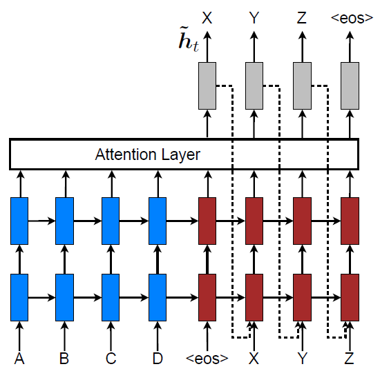
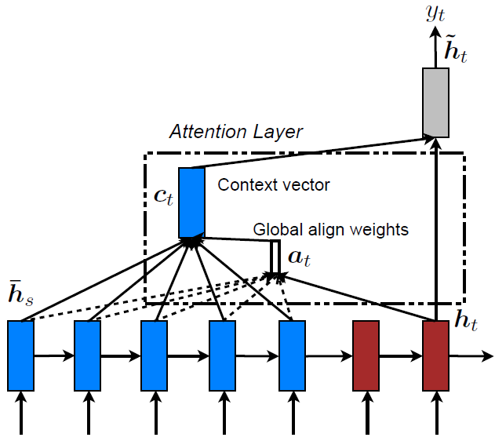
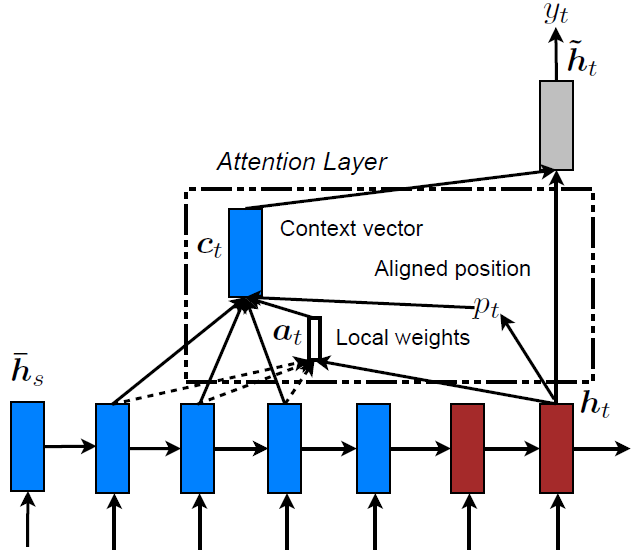
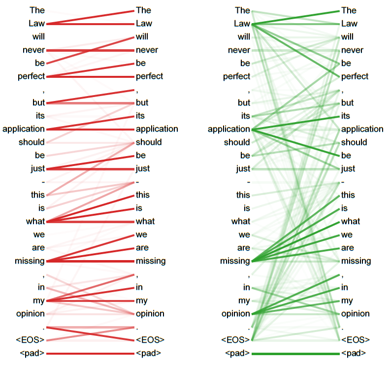
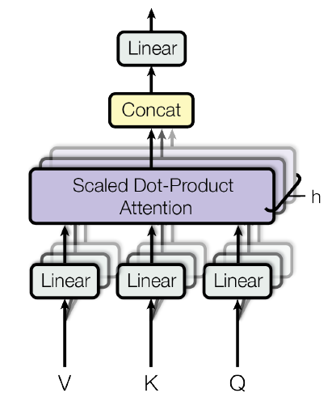

##	Attention Machanism

注意力机制：将*query*、*key-value*映射至输出的权重生成机制

$$
Attention(Q, K, V) = \phi(f_{Att}(Q, K), V)
$$

> - $V_{L * d_v}$：value矩阵，**信息序列矩阵**
> - $K_{L * d_k}$：key矩阵，大部分情况即为$V$
> - $Q_{L * d_k}$：query矩阵，其他环境信息
> - $L, d_k, d_v$：输入序列长度、key向量维度、value向量维度
> - key、value向量为$K, V$中行向量

-	合理分配注意力，优化输入信息来源
	-	给重要特征分配较大权
	-	不重要、噪声分配较小权

-	在不同模型间学习对齐
	-	attention机制常联合Seq2Seq结构使用，通过隐状态对齐
	-	如：图像至行为、翻译

###	Attention Model

> - Attenion机制一般可以细化如下

$$\begin{align*}
c_t & = \phi(\alpha_t, V) \\

\alpha_{t} & = softmax(e_t) \\
& = \{ \frac {exp(e_{t,j})} {\sum_{k=1}^K exp(e_{t,k})} \} \\

e_t & = f_{Att}(K, Q)
\end{align*}$$

> - $c_t$：*context vector*，注意力机制输出上下文向量
> - $e_{t,j}$：$t$时刻$i$标记向量注意力得分
> - $\alpha_{t,i}$：$t$时刻$i$标记向量注意力权重
> - softmax归一化注意力得分

-	$f_{Att}$：计算各标记向量注意力得分
	-	*additive attention*
	-	*multiplicative/dot-product attention*：
	-	*local attention*

	> - 其参数需联合整个模型训练、输入取决于具体场景

-	$\phi_{Att}$：根据标记向量注意力权重计算输出上下文向量
	-	*stochastic hard attention*
	-	*deterministic soft attention*

-	$Q$可能包括很多信息
	-	Decoder结构输出、Encoder结构输入
	-	$W$待训练权重矩阵
	-	LSTM、RNN等结构隐状态

###	Additive Attention

-	单隐层前馈网络（MLP）

	$$
	e_{t,j} = v_a^T f_{act}(W_a [h_{t-1}; g_j])
	$$

	> - $h_{t-1}$：输出结构隐状态
	> - $g_j$：输入结构隐状态
	> - $W_a, v_a$：待训练参数
	> - $f_{act}$：激活函数$tanh$、$ReLU$等

###	Multiplicative/Dot-product Attention

$$
e_{t,j} = \left \{ \begin{array}{l}
	h_{t-1}^T g_j, & dot \\
	h_{t-1}^T W_a g_j, & general \\
	W_a h_{t-1}, & location
\end{array} \right.
$$

-	相较于加法attention实际应用中更快、空间效率更高
	（可以利用高度优化的矩阵乘法运算）

> - [MLP](https://arxiv.org/abs/1502.03044)
> - [內积形式](https://arxiv.org/abs/1508.04025)

####	Tricks

-	将输出作为输入引入，考虑上一次输出影响

	

-	*Scaled Dot-Product Attention*

	$$
	f_{Att} = \frac {Q K^T} {\sqrt{d_k}}
	$$

	-	避免內积随着key向量维度$d_k$增大而增大，导致softmax
		中梯度过小

###	Stochastic Hard Attention

*hard attention*：随机抽取标记向量作为注意力位置

-	注意力位置视为中间one-hot隐向量，每次只关注某个标记向量

-	模型说明
	-	$f_{Att}$为随机从标记向量$a$中抽取一个
	-	$\alpha$视为多元伯努利分布参数，各分量取值表示对应
		标记向量被抽中概率，此时上下文向量也为随机变量

$$\begin{align*}
p(s_{t,i}=1) & = \alpha_{t,i} \\
c_t & = V s
\end{align*}$$

> - $s$：注意力位置，中间隐one-hot向量，服从$\alpha$指定的
	多元伯努利分布
> - $h_i$：第$i$上下文向量

####	参数训练

-	参数$\alpha$不可导、含有中间隐变量$s$，考虑使用EM算法
	思想求解

	$$\begin{align*}
	log p(y) & = log \sum_s p(s) p(y|s) \\
	& \geq \sum_s p(s) log p(y|s) := L_s \\

	\frac {\partial L_s} {\partial W} & = \sum_s [
		\frac {\partial p(s)} {\partial W} + \frac 1 {p(y|s)}
		\frac {\partial p(y|s)} {\partial W}] \\
	& = \sum_s p(s) [\frac {\partial log p(y|s)} {\partial W} +
		log p(y|s) \frac {\partial log p(s|a)} {\partial W}]
	\end{align*}$$

	> - $L_s$：原对数似然的函数的下界，以其作为新优化目标
	> - $W$：参数

-	用蒙特卡罗采样方法近似求以上偏导

	-	$s$按多元伯努利分布抽样$N$次，求$N$次偏导均值

		$$
		\frac {\partial L_s} {W} \approx \frac 1 N \sum_{n=1}^N
			[\frac {\partial log p(y|\tilde s_n)} {\partial W} +
			log p(y|\tilde s_n) \frac {\partial log
			p(\tilde s_n|a)} {\partial W}]
		$$

		> - $\tilde s_n$：第$n$次抽样结果

	-	可对$p(y|\tilde s_n)$进行指数平滑减小估计方差

###	Deterministic Soft Attention

*soft attention*：从标记向量估计上下文向量期望

-	考虑到所有上下文向量，所有标记向量加权求和上下文向量
-	模型说明
	-	$f_{Att}$计算所有标记向量注意力得分
	-	$\alpha$可视为个标记向量权重

$$
E_{p(s_t)} [c_t] = \sum_{i=1}^L \alpha_{t,i} a_i
$$

-	模型光滑可微：可直接用反向传播算法训练

###	Local Attention

*local attention*：从所有标记向量中选取部分计算soft attention

-	可以视为hard、soft attention结合
	-	hard attention选取标记向量子区间，避免噪声干扰
	-	soft attention加权求和，方便训练

####	子区间选取

> - 为目标$t$选取对齐位置$p_t$，得到子区间$[p_t-D, p_t+D]$
	（$D$为经验选取）

-	*monotonic alignment*：直接设置$p_t=t$

-	*predictive alignment*：

	$$
	p_t = S sigmoid(v_p^T tanh(W_p h_t))
	$$

	> - $W_p, v_p$：待学习参数

> - 可以使用高斯分布给注意力权重加权，强化$p_t$附近标记向量
	（根据经验可以设置$\sigma = \frac D 2$）
	$$
	\alpha_{t,j} = softmax(e_{t,j}) exp(-\frac {(j - p_t)^2}
		{2\sigma^2})
	$$

###	Self Attention

*Self Attention*/*Intra-Attention*：关联同一序列内不同位置、
以学习序列表示的attenion机制

-	类似卷积、循环结构
	-	将不定长的序列映射为等长的另一序列
	-	从序列中提取高层特征

-	特点
	-	类似卷积核，多个self attention可以完全并行
	-	无需循环网络多期传递信息，输入序列同期被处理
	-	可使用local attention机制限制计算复杂度

###	Multi-Head Attention

*Multi-Head Attention*：从相同输入、输出序列学习多个
attention机制

$$\begin{align*}
MultiHead(X) & = Concat(head1, ..., head_h) W^O \\
head_i & = Attention(QW_i^Q, KW_i^K, VW_i^V)
\end{align*}$$

> - $Q, K, V$：元信息矩阵，据此训练多组query、key-value，
	一般就是原始输入序列矩阵

-	可以并行训练，同时从序列中提取多组特征

