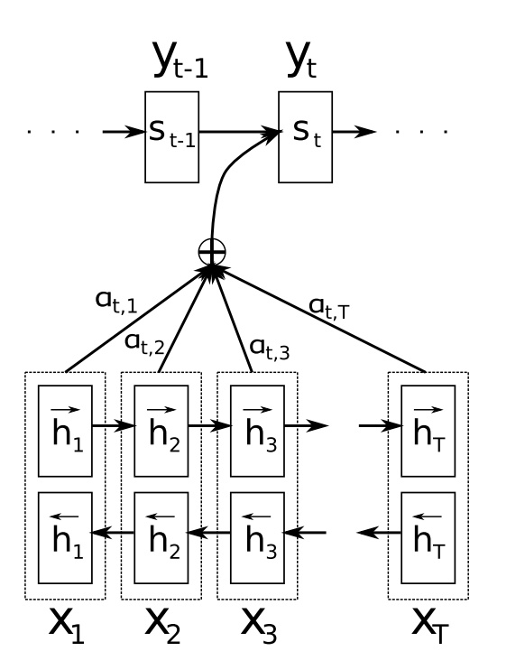

##	Seq2Seq

*Seq2Seq*/*Encoder-Decoder*：允许任意长度序列输入、输出学习

$$\begin{align*}
p(y_1, \cdots, y_{T^{'}} | x_1, \cdots, x_T) & = \prod_{t=1}^T
	p(y_t|c, y_1, \cdots, y_{t-1}) \\

c & = q(\{h_1, \cdots, h_T\}) \\

h_t & = f(x_t, h_{t-1})
\end{align*}$$

> - $T^{'} \neq T$：输出序列长度、输入序列长度
> - $p(y_t|\cdots)$：一般为softmax函数计算字典中各词概率
> - $c$：定长向量
> - $h_t$：隐状态
> - $q$：将隐状态映射为定长向量存储信息，如：
	$q(\cdots) = h_T$
> - $f$：根据输入映射为隐状态，如：RNN、LSTM

###	实现策略

> - *encoder*：将输入序列映射为定长向量
> - *decoder*：将该定长向量映射为目标输出
	（通过将联合概率有序分解来定义翻译概率）

-	RNN：以**内部隐状态作为定长向量**存储输入信息
	-	理论上可实现在定长向量中存储相关信息、再解码
	-	但由于长时梯度消失，实际难以训练

-	LSTM：类似RNN在内部隐状态中存储信息
	-	学习长时依赖更有效、容易训练

##	Seq2Seq with Attention

-	采用LSTM、RNN结构的Seq2Seq结构很难将输入序列转化为定长
	向量而保存所有有效信息
	-	序列末尾对定长向量影响更大，难以学习长距离依赖
	-	随着输入序列长度增加，预测效果显著下降

-	使用Attention机制的Seq2Seq无需多期迭代传递信息，不存在
	长距离依赖

###	BiRNN2RNN with Attention

$$\begin{align*}
p(y_t | y_1, \cdots, y_{t-1}, x) & = g(y_{t-1}, s_t, c_t) \\

s_t & = f(s_{t-1}, y_{t-1}, c_t) \\

c_t & = \sum_{j=t}^T \alpha_{j=1}^T \alpha_{t,j} h_j \\

\alpha_{t,j} & = softmax(e_{t,j}) \\
& = \frac {exp(e_{t,j})} {\sum_{k=1}^T exp(e_{t,k})} \\

e_{t,j} & = a(s_{t-1}, h_j)
\end{align*}$$

> - $y_t$：当前$t$时刻输出
> - $p(y_t|\cdots)$：$t$时刻输出条件概率
> - $s_t$：解码器$t$时刻隐状态
> - $h_j$：编码器$j$时刻隐状态
> - $c_t$：*expected annotation*，对输出$t$的上下文向量
> - $T$：输入序列长度
> - $e_{t,j}, \alpha_{t,j}$：输入$j$对输出$t$重要性，反映
	模型注意力分布
> - $a$：*alignment model*，输入输出相关性模型，同整个系统
	联合训练的前向神经网络，attention机制核心

-	编码器：*Bi-RNN*
-	解码器：attention机制加权的RNN

