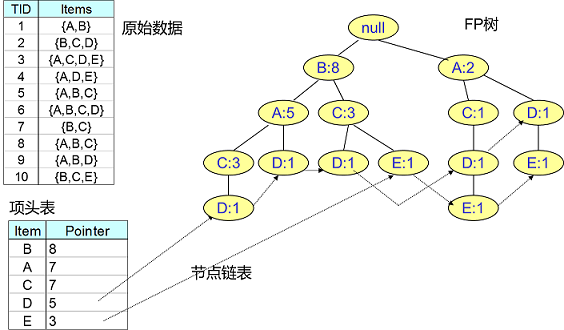
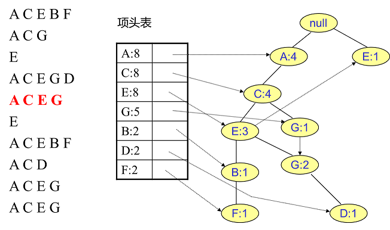

##	频繁项集

> - 频繁项集：频繁出现项集合（无序）
> - 频繁项序列：频繁出现项序列（有序）

-	相关关联规则算法：数据量大时，无法直接发现频繁项集
-	频繁项集评估标准

###	评估标准

-	支持度：数据关联出现概率，关联数据在数据集中出现次数占
	总数据集比重

	$$
	Support(X, Y) = P(XY) = \frac {num(XY)} {num(All)}
	$$

	-	支持度高数据不一定构成频繁项集，但支持度数据肯定不能
		不构成频繁项集

-	置信度：数据出现条件概率，某个数据出现、另一数据出现概率

	$$
	Confidence(X \Leftarrow Y) = P(X|Y) = \frac {P(XY)} {P(Y)}
	$$

-	提升度：数据之间关联关系，某数据出现、另一数据出现概率同
	其总体出现概率之比

	$$\begin{align*}
	Lift(X \Leftarrow Y) & = \frac {P(X|Y)} {P(X)} \\
	& = \frac {Confidence(X \Leftarrow)}{P(X)} \\
	& = \frac {P(XY)} {P(X)P(Y)}
	\end{align*}$$

	-	提升度大于1则为有效的强关联规则，否则为无效的强关联
		规则
	-	若X、Y不相关，则提升度为1

> - 选择频繁数据集，一般需要自定义评估标准：自定义支持度、
	自定义支持度和置信度组合

##	Apriori

Apriori算法

-	以支持度作为评估标准，找出数据集中**最大的**频繁$k$项集
	-	找到符合支持度标准的频繁$k$项集
	-	迭代直到无法找到项数更大的频繁项集

###	算法

> - 输入：数据集合D、支持度阈值$\alpha$
> - 输出：最大的频繁K项集

-	置$k=1$，扫描整个数据集，以所有出现过数据作为候选1项集
-	挖掘候选$k$项集
	-	扫描数据、计算候选$k$项集支持度
	-	去除支持度低于阈值$\alpha$的项集得到频繁$k$项集
		-	若频繁$k$项集只包含1项，直接返回
		-	若频繁$k$项集为空，返回频繁$k-1$项集
	-	基于频繁$k$项集连接、生成候选$k+1$项集
	-	置$k=k+1$

> - 需要频繁扫描数据、效率低
> - 频繁项集的子项集肯定也是频繁项集

##	FPTree/FPGrowth

FPTree：对Apriori算法改进，不在需要多次扫描数据

-	FPTree引入部分数据结构以临时存储数据

	

	-	项头表：按频繁1项集出现频数降序排列的表
	-	FP Tree：包含原始数据、频数的多叉树
	-	节点链表：链接项头表中频繁1项集、FPTree中相应节点
		的链表

-	特点：效率高
	-	只需要扫描两次数据
	-	使用多叉树存储临时数据，利用高频频繁项集

###	算法

-	建立项头表
	-	扫描数据，得到所有1项集频数、剔除支持度低于阈值者，
		并按支持度（频数）降序排列
	-	第二次扫描数据，剔除每条数据中非频繁1项集、
		**在每条数据内部**按支持度降序排列

	

-	建立FPTree：逐条读取处理后排序后数据，依次插入树中
	-	每条数据中排序靠前者为祖先节点
	-	若有**直系公共祖先**则公共祖先节点计数+1
	-	新节点通过链表和项头表链接

	

-	挖掘FPTree：对项表头中每项，找到其条件模式基
	-	将子树中每个节点计数置为叶子节点计数和，则子树中节点
		取值即为其与当前项组合出现频数/支持度
	-	删除（当前子树内）支持度/频数低于支持度阈值$\alpha$
		节点
	-	剩余节点项、当前项组合即为相应频繁$k$项集

	

	> - 条件模式基：节点**作为叶子节点**所对应的FP子树

##	Prefix-Projected Pattern Growth

*PrefixSpan*：前缀投影模式挖掘

-	以支持度为标准，挖掘数据集中**频繁序列**
	-	每条数据为若干项集组成的序列，**序列内项集间有序**
	-	为方便，每条数据序列中项集中的项已排序

> - 可以将每条数据序列整体视为串
> - 频繁序列：频繁出现**子序列**

###	算法

> - 输入：序列数据集$S$、支持度$\alpha$
> - 所有满足阈值要求的频繁序列

-	找出所有长度1前缀（即所有项）、对应投影
	-	计数、剔除持度小于阈值$\alpha$者，得到频繁1项序列
	-	置$k=1$

-	对每个长度为$k$前缀递归挖掘
	-	若前缀对应投影为空，返回
	-	若前缀对应投影中所有项支持度均小于阈值$\alpha$，返回
	-	同满足阈值要求阈值$\alpha$要求项合并，得到新前缀
	-	置$k=k+1$

> - *prefix*：前缀，正在处理的子序列
> - *projected*：投影，各数据序列中位于前缀之后子串
?串
