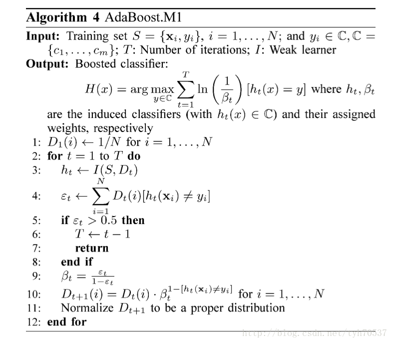
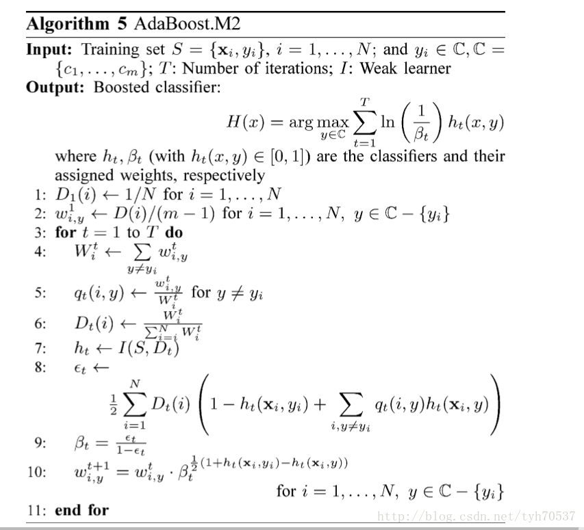

##	AdaBoost

通过改变训练样本权重，学习多个分类器，并将分类器进行线性
组合，提高分类性能

-	对离群点、奇异点敏感
-	对过拟合不敏感

###	Boosting实现

> - 改变训练数据权值或概率分布：提高分类错误样本权值、降低
	分类正确样本权值

> - 弱分类器组合：加权多数表决，即加大分类误差率小的弱分类器
	权值，使其在表决中起更大作用；减小分类误差率大的弱分类器
	权值，使其在表决中起更小作用

###	步骤

> - 输入：训练数据集$T=\{(x_1, y_1), \cdots, (x_N, y_N)\}$，
	弱分类器算法$G(x)$
> > -	$x_i \in \mathcal{X \subset R^n}$
> > -	$y_i \in \mathcal{Y} = \{-1, +1 \}$
> - 输出：最终分类器$G(x)$

-	初始化训练数据权值分布：
	$D_1=(w_{11}, \cdots, w_{1N}), w_{1i}=\frac 1 N$

-	对$m=1,2,\cdots,M$（即训练M个弱分类器）

	-	使用具有**权值分布**$D_m$的训练数据学习，得到基本
		分类器

		$$
		G_m(x):\mathcal{X} \rightarrow \{-1, +1\}
		$$

	-	计算$G_m(x)$在训练数据集上的**分类误差率**

		$$\begin{align*}
		e_m & = P(G_m(x_i)) \neq y_i) \\
			& = \sum_{i=1}^N w_{mi}I(G_m(x_i) \neq y_i) \\
			& = \sum_{G_m(x_i) \neq y_i} w_{mi}
		\end{align*}$$

	-	计算$G_m(x)$组合为最终分类器时权重

		$$
		\alpha = \frac 1 2 log \frac {1-e_m} {e_m}
		$$

		> - $\alpha_m$表示就简单分类器$G_m(x)$在最终分类器中
			的重要性，随$e_m$减小而增加
			（弱分类器保证$e_m \leq 1/2$）

	-	更新训练集权值分布
		$$\begin{align*}
		D_{m+1} & = (w_{m+1,1}, \cdots, w_{m+1,N}) \\
		w_{m+1,i} & = \frac {w_{mi}} {Z_m}
			exp(-\alpha y_i G_m(x_i)) = \left \{
			\begin{array}{l}
				\frac {w_mi} {Z_m} e^{-\alpha_m},
					& G_m(x_i) = y_i \\
				\frac {w_mi} {Z_m} e^{\alpha_m},
					& G_m(x_i) \neq y_i \\
			\end{array} \right. \\
		Z_m & = \sum_{i=1}^N w_{mi} exp(-\alpha_m y_i G_m(x_i))
		\end{align*}$$

		> - $Z_m$：规范化因子，是第m轮调整后的权值之和，其
			使得$D_{m+1}$成为概率分布
		> - 误分类样本权值相当于被放大
			$e^{2\alpha_m} = \frac {e_m} {1 - e_m}$倍

-	构建基本分类器线性组合
	$$
	f(x) = \sum_{m=1}^M \alpha_m G_m(x)
	$$
	得到最终分类器
	$$
	G(x) = sign(f(x)) = sign(\sum_{m=1}^M \alpha_m G_m(x))
	$$

	> - 这里$\alpha_m$没有规范化，和不为1，规范化没有必要
	> - $f(x)$符号决定分类预测结果，绝对值大小表示分类确信度

> - AdaBoost中分类器学习和之后的分类误差率“无关”，基分类器
	学习算法中的loss不是分类误差率，可以是其他loss，只是需要
	考虑训练数据的权值分布
> > -	好像基学习器的loss就要是和集成部分调权的loss一致
#todo
> > -	**按权值分布有放回的抽样**，在抽样集上进行训练
> > -	各样本loss按权重加权，类似分类误差率中加权

###	训练误差边界

AdaBoost算法最终分类器的训练误差边界为

$$
\frac 1 N \sum_{i=1}^N I(G(x_i) \neq y_i) \leq
	\frac 1 N \sum_i exp(-y_if(x_i)) = \prod_m Z_m
$$

-	$G(x_i) \neq y_i$时，$y_if(x_i)<0$，所以
	$exp(-y_i f(x_i)) \geq 1$，则不等式部分可证

-	$$\begin{align*}
	\frac 1 N \sum_i exp(-y_i f(x_i))
		& = \frac 1 N \sum_i exp(-\sum_{m=1}^M
			\alpha_m y_i G_m(x_i)) \\
		& = \sum_i (w_{1,i} \prod_{m=1}^M
			exp(-\alpha_m y_i G_m(x_i))) \\
		& = \sum_i (Z_1 w_{2,i} \prod_{m=2}^M
			exp(-\alpha_m y_i G_m(x_i))) \\
		& = \prod_{m=1}^M Z_i \sum_i w_{M+1,i} \\
		& = \prod_{m=1}^M Z_i
	\end{align*}$$

> - AdaBoost训练误差边界性质的关键：权重调整与基本分类器权重
	调整**共系数**（形式不完全一样）
> - 这也是AdaBoost权重调整设计的依据，方便给出误差上界

####	二分类训练误差边界

$$
\prod_{m=1}^M Z_m = \prod_{m=1}^M (2\sqrt{e_m(1-e_m)})
	= \prod_{m=1}^M \sqrt{(1-4\gamma_m^2)}
	\leq exp(-2\sum_{m=1}^M \gamma_m^2)
$$

> - $\gamma_m = \frac 1 2 - e_m$

-	$$\begin{align*}
	Z_m & = \sum_{i=1}^N w_{m,i} exp(-\alpha y_i G_m(x_i)) \\
		& = \sum_{y_i = G_m(x_i)} w_{m,i}e^{-\alpha_m} +
			\sum_{y_i \neq G_m(x_i)} w_{m,i}e^{\alpha_m} \\
		& = (1-e_m)e^{-\alpha_m} + e_m e^{\alpha_m} \\
		& = 2\sqrt{e_m(1-e_m)} \\
		& = \sqrt{1-4\gamma^2}
	\end{align*}$$

-	由$\forall x \in [0, 0.5], e^{-x} > \sqrt{1-2x}$可得，
	$\sqrt{1-4\gamma_m^2} \leq exp(-2\gamma_m^2)$

> - 二分类AdaBoost误差边界性质的关键：$\alpha$的取值，也是
	前向分步算法（损失函数）要求
> - 若存$\gamma > 0$，对所有m有$\gamma_m \geq \gamma$，则
	$$
	\frac 1 N \sum_{i=1}^N I(G(x_i) \neq y_i) \neq
		exp(-2M\gamma^2)
	$$
	即AdaBoost的训练误差是**指数下降**的
> - 分类器下界$\gamma$可以未知，AdaBoost能适应弱分类器各自
	训练误差率，所以称为*adptive*

##	*Adaboost.M1*

Adaboost.M1是原版AdaBoost的多分类升级版，基本思想同Adaboost

###	Boosting实现

-	基分类器组合方式

	-	仍然是加权投票，且投票权重同Adaboost
	-	出于多分类考虑，没有使用`sign`符号函数

-	改变训练数据权值或概率分布：和Adaboost形式稍有不同，但
	相对的错误分类样本提升比率完全相同

	-	被上个分类器错误分类样本，权值保持不变
	-	被上个分类器正确分类样本，权值缩小比例是Adaboost平方

###	步骤

-	输入
	-	训练集：$T={x_i, y_i}, i=1,\cdots,N; y_i \in C, C=\{c_1, \cdots, c_m\}$
	-	训练轮数：T
	-	弱学习器：I

-	输出：提升分类器
	$$
	H(x) = \arg\max_{y \in C} \sum_{m=1}^M
		ln(\frac 1 {\beta_m}) [h_m(x) = y]
	$$

	> - $h_t, h_t(x) \in C$：分类器
	> - $\beta_t$：分类器权重

###	误分率上界

> - 对弱学习算法产生的伪损失$\epsilon_1,\cdots,\epsilon_t$，
	记$\gamma_t = 1/2 \epsilon_t$，最终分类器$h_{fin}$误分率
	上界有
	$$
	\frac 1 N |\{i: h_{fin}(x_i) \neq y_i \}| \leq
		\prod_{t-1}^T \sqrt {1-4\gamma^2} \leq
		exp(-2 \sum_{t-1}^T \gamma^2)
	$$

###	特点

Adaboost.M1和Adaboost基本上没有区别

-	类别数目为2的Adaboost.M1就是Adaboost
-	同样无法处理对误分率高于0.5的情况，甚至在多分类场合，
	误分率小于0.5更加难以满足
-	理论误分率上界和Adaboost相同

##	*Adaboost.M2*

AdaboostM2是AdaboostM1的进阶版，更多的利用了基分类器信息

-	要求基学习器能够输出更多信息：输出对样本分别属于各类别
	的置信度向量，而不仅仅是最终标签
-	要求基分类器更加精细衡量错误：使用伪损失代替误分率
	作为损失函数

###	*Psuedo-Loss*

$$\begin{align*}
L & = \frac 1 2 \sum_{(i,y) \in B} D_{i,y}
	(1 - h(x_i, y_i) + h(x_i, y)) \\
& = \frac 1 2 \sum_{i=1}^N D_i (1 - h(x_i, y_i) +
	\sum_{y \neq y_i} (w_{i,y} h(x_i, y)))
\end{align*}$$

> - $D$：权重分布（行和为1，但不满足列和为1）
> > -	$D_{i,y}$：个体$x_i$中错误标签$y$的权重，代表从个体
		$x_i$中识别出错误标签$y$的重要性
> - $B = \{(i, y)|y \neq y_i, i=1,2,\cdots,N \}$
> - $w$：个体各错误标签权重边际分布
> - $h(x, y)$：模型$h$预测样本$x$为$y$的置信度
> > -	$h(x_i,y_i)$：预测正确的置信度
> > -	$h(x_i,y), y \neq y_i$：预测$x_i$为错误分类$y$置信度

-	伪损失函数同时考虑了样本和**标签**的权重分布
-	通过改变此分布，能够更明确的关注难以预测的个体标签，
	而不仅仅个体

###	Boosting实现

-	改变数据权值或者概率分布

	-	使用*psuedo-loss*替代误分率，以此为导向改变权值
	-	对多分类每个错误分类概率分别计算错误占比，在此基础上
		分别计算

-	基分类器组合方式：同Adaboost.M1

###	步骤

###	训练误差上界

> - 对弱学习算法产生的伪损失$\epsilon_1,\cdots,\epsilon_t$，
	记$\gamma_t = 1/2 \epsilon_t$，最终分类器$h_{fin}$误分率
	上界有

$$
\frac 1 N |\{i: h_{fn}(x_i) \neq y_i \}| \leq
	(M-1) \prod_{t-1}^T \sqrt {1-4\gamma^2} \leq
	(M-1) exp(-2 \sum_{t-1}^T \gamma^2)
$$

###	特点

-	基于伪损失的Adaboost.M2能够提升稍微好于随机预测的分类器

-	Adaboosting.M2能够较好的解决基分类器对噪声的敏感性，但是
	仍然距离理论最优*Bayes Error*有较大差距，额外误差主要
	来自于
	-	训练数据
	-	过拟合
	-	泛化能力

-	控制权值可以有效的提升算法，减小最小训练误差、过拟合
	、泛化能力

	-	如对权值使用原始样本比例作为先验加权

-	其分类结果不差于AdaBoost.M1（在某些基分类器、数据集下）

