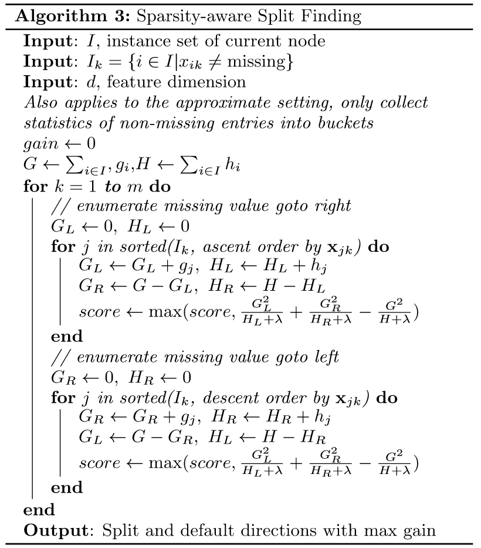
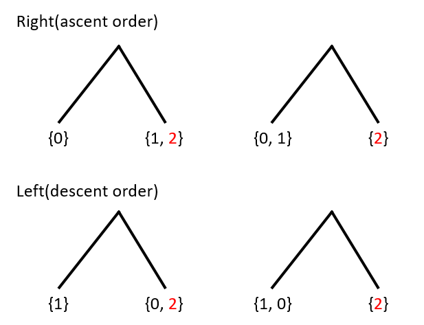
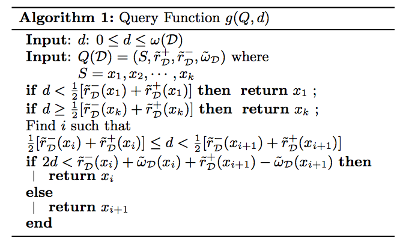

##	Gredient Boosting

*GB*：（利用）梯度提升，将提升问题视为优化问题，前向分步算法
利用最速下降思想实现

-	一阶展开拟合损失函数，沿负梯度方向迭代更新
	-	损失函数中，模型的样本预测值$f(x)$是因变量
	-	即$f(x)$应该沿着损失函数负梯度方向变化
	-	即下个基学习器应该以负梯度方向作为优化目标，即负梯度
		作为**伪残差**

	> - 类似复合函数求导

-	对基学习器预测值求解最优加权系数
	-	最速下降法中求解更新步长体现
	-	前向分布算法中求解基学习器权重

###	损失函数

基学习器拟合目标：损失函数的负梯度在当前模型的值

$$
-\left [ \frac {\partial L(y, \hat y_i)}
	{\partial y_i} \right ]_{\hat y_i=\hat y_i^{(t-1)}}
$$

####	平方损失

平方损失：$L(y, f(x)) = \frac 1 2 (y - f(x))^2$（回归）

-	第m-1个基学习器伪残差为

	$$
	r_{m,i} = y_i - f_{m-1}(x_i), i=1,2,\cdots,N
	$$

	> - $N$：样本数量

-	第m个基学习器为

	$$\begin{align*}
	h_m & = \arg\min_h \sum_{i=1}^N \frac 1 2
		(y_i - (f_{m-1}(x_i) + h(x)))^2 \\
	& = \arg\min_h \sum_{i=1}^N \frac 1 2
		(C_{m,i} - h(x))^2 \\
	C_{m,i} & = y_i - f_{m-1}(x_i)
	\end{align*}$$

-	第m轮学习器组合为

	$$
	f_m = f_{m-1} + \alpha_m h_m
	$$

	> - $\alpha_m$：学习率，留给之后基模型学习空间

	-	这里只是形式上表示模型叠加，实际上树模型等不可加，
		应该是模型预测结果叠加

####	指数损失

指数损失：$L(y, f(x)) = e^{-y f(x)}$（分类）

-	第m-1个基学习器伪残差

	$$
	r_{m,i} = -y_i e^{-y_i f_{m-1}(x_i)}, i=1,2,\cdots,N
	$$

-	基学习器、权重为

	$$\begin{align*}
	h_m & = \arg\min_h \sum_{i=1}^N exp(-y_i(f_{m-1}(x_i)
		+ \alpha f(x_i))) \\
	& = \arg\min_h \sum_{i=1}^N C_{m,i}
		exp(-y_i \alpha f(x_i)) \\
	C_{m,i} & = exp(-y_i f_{m-1}(x_i))
	\end{align*}$$

-	第m轮学习器组合为

	$$
	f_m = f_{m-1} + \alpha_m h_m
	$$

###	步骤

> - 输入：训练数据集$T=\{(x_1, y_1), \cdots, (x_N, y_N)\}$，
	损失函数$L(y, f(x))$
> > -	$x_i \in \mathcal{X \subset R^n}$
> > -	$y_i \in \mathcal{Y} = \{-1, +1 \}$
> - 输出：回归树$\hat f(x)$

-	初始化模型
	$$
	\hat y_i^{(0)} = \arg\min_{\hat y} \sum_{i=1}^N
		L(y_i, \hat y)
	$$

-	对$m=1,2,\cdots,M$（即训练M个若分类器）

	-	计算伪残差
		$$
		r_i^{(t)} = -\left [ \frac {\partial L(y, \hat y_i)}
			{\partial y_i} \right ]_{\hat y_i=\hat y_i^{(t-1)}}
		$$

	-	基于$\{(x_i, r_i^{(t)})\}$生成基学习器$h_t(x)$

	-	计算最优系数
		$$
		\gamma = \arg\min_\gamma \sum_{i=1}^N
			L(y_i, \hat y_i^{(t-1)} + \gamma h_t(x_i))
		$$

	-	更新预测值
		$$
		\hat y_i^{(t)} = \hat y_i^{(t-1)} + \gamma_t h_t (x)
		$$

-	得到最终模型

	$$
	\hat f(x) = f_M(x) = \sum_{t=1}^M \gamma_t h_t(x)
	$$

###	Gradient Boosted Desicion Tree

*GBDT*：梯度提升树，以回归树为基学习器的梯度提升方法

-	GBDT会累加所有树的结果，本质上是回归模型（毕竟梯度）
	-	所以一般使用CART回归树做基学习器
	-	当然可以实现分类效果

-	损失函数为平方损失（毕竟回归），则相应伪损失/残差

	$$
	r_{t,i} = y_i - f_{t-1}(x_i), i=1,2,\cdots,N
	$$

####	特点

-	准确率、效率相较于RF有一定提升
-	能够灵活的处理多类型数据
-	Boosting类算法固有的基学习器之间存在依赖，难以并行训练
	数据，比较可行的并行方案是在每轮选取最优特征切分时，并行
	处理特征

##	XGBoost

*Extreme Gradient Boost*/*Newton Boosting*：前向分步算法利用
Newton法思想实现

-	二阶展开拟合损失函数
	-	损失函数中，模型的样本预测值$\hat y_i$是因变量
	-	将损失函数对$\hat y_i$二阶展开拟合
	-	求解使得损失函数最小参数

-	对基学习器预测值求解最优加权系数
	-	阻尼Newton法求解更新步长体现
	-	前向分布算法中求解基学习器权重
	-	削弱单个基学习器影响，让后续基学习器有更大学习空间

###	损失函数

-	第t个基分类器损失函数

	$$\begin{align*}
	obj^{(t)} & = \sum_{i=1}^N l(y_i, \hat y_i^{(t)}) +
		\Omega(f_t) \\

	& = \sum_i^N l(y_i, \hat y_i^{(t-1)} + f_t(x_i)) +
		\Omega(f_t) \\

	& \approx \sum_{i=1}^N [l(y_i, \hat y^{(t-1)}) + g_i
		f_t(x_i) + \frac 1 2 h_i f_t^2(x_i)] + \Omega(f_t) \\

	& = \sum_{i=1}^N [l(y_i, \hat y^{(t-1)}) + g_i f_t(x_i) +
		\frac 1 2 h_i f_t^2(x_i)] + \gamma T_t +
		\frac 1 2 \lambda \sum_{j=1}^T {w_j^{(t)}}^2 \\

	\Omega(f_t) & = \gamma T_t + \frac 1 2 \lambda
		\sum_{j=1}^T {w_j^{(t)}}^2
	\end{align*}$$

	> - $f_t$：第t个基学习器
	> - $f_t(x_i)$：第t个基学习器对样本$x_i$的取值
	> - $g_i = \partial_{\hat y} l(y_i, \hat y^{t-1})$
	> - $h_i = \partial^2_{\hat y} l(y_i, \hat y^{t-1})$
	> - $\Omega(f_t)$：单个基学习器的复杂度罚
	> - $T_t$：第t个基学习器参数数量，即$L_0$罚
	> > -	线性回归基学习器：回归系数数量
	> > -	回归树基学习器：叶子节点数目
	> - $\gamma$：基学习器$L_0$罚系数，模型复杂度惩罚系数
	> - $w_j = f_t$：第t个基学习器参数值，即$L_2$罚
	> > -	线性回归基学习器：回归系数值
	> > -	回归树基学习器：叶子节点
	> - $\lambda$：基学习器$L_2$罚系数，模型贡献惩罚系数
	> - $\approx$：由二阶泰勒展开近似

-	对损失函数进行二阶泰勒展开（类似牛顿法）拟合原损失函数，
	同时利用一阶、二阶导数求解下个迭代点

-	正则项以控制模型复杂度
	-	降低模型估计误差，避免过拟合
	-	$L_2$正则项也控制基学习器的学习量，给后续学习器留下
		学习空间

###	树基学习器

XGBoost Tree：以回归树为基学习器的XGBoost模型

-	模型结构说明
	-	基学习器类型：CART
	-	叶子节点取值作惩罚：各叶子节点取值差别不应过大，否则
		说明模型不稳定，稍微改变输入值即导致输出剧烈变化
	-	树复杂度惩罚：叶子结点数量

-	XGBoost最终损失（结构风险）有

	$$\begin{align*}
	R_{srm} & = \sum_{i=1}^N l(y_i, \hat y_i) +
		\sum_{t=1}^M \Omega(f_t)
	\end{align*}$$

	> - $N, M$：样本量、基学习器数量
	> - $\hat y_i$：样本$i$最终预测结果

####	损失函数

-	以树作基学习器时，第$t$基学习器损失函数为

	$$\begin{align*}
	obj^{(t)} & = \sum_{i=1}^N l(y_i, \hat y_i^{(t)}) +
		\Omega(f_t) \\

	& \approx \sum_{i=1}^N [l(y_i, \hat y^{(t-1)}) + g_i
		f_t(x_i) + \frac 1 2 h_i f_t^2(x_i)] + \gamma T_t
		+ \frac 1 2 \lambda \sum_{j=1}^T {w_j^{(t)}}^2 \\

	& = \sum_{j=1}^{T_t} [(\sum_{i \in I_j} g_i) w_j^{(t)} +
		\frac 1 2 (\sum_{i \in I_j} h_i + \lambda)
		{w_j^{(t)}}^2] + \gamma T_t + \sum_{i=1}^N
		l(y_i, \hat y^{(t)}) \\

	& = \sum_{j=1}^{T_t} [G_i w_j^{(t)} + \frac 1 2
		(H_j + \lambda){w_j^{(t)}}^2] + \gamma T_t +
		\sum_{i=1}^N l(y_i, \hat y^{(t)}) \\

	& = \sum_{j=1}^{T_t} [G_i w_j^{(t)} + \frac 1 2
		(H_j + \lambda)(w_j^{(t)})^2] + \gamma T_t +
		\sum_{i=1}^N l(y_i, \hat y^{(t)}) \\

	\end{align*}$$

	> - $f_t, T_t$：第t棵回归树、树叶子节点
	> - $f_t(x_i)$：第t棵回归树对样本$x_i$的预测得分
	> - $w_j^{(t)} = f_t(x)$：第t棵树中第j叶子节点预测得分
	> - $g_i = \partial_{\hat y} l(y_i, \hat y^{t-1})$
	> - $h_i = \partial^2_{\hat y} l(y_i, \hat y^{t-1})$
	> - $I_j$：第j个叶结点集合
	> - $G_j = \sum_{i \in I_j} g_i$
	> - $H_j = \sum_{i \in I_j} h_i$

	-	对回归树，正则项中含有$(w_j^{(t)})^2$作为惩罚，能够
		和损失函数二阶导合并，不影响计算

	-	模型复杂度惩罚项惩罚项是针对树的，定义在叶子节点上，
		而平方损失是定义在样本上，合并时将其改写

-	第t棵树的整体损失等于**其各叶子结点损失加和**，且
	各叶子结点取值之间独立

	-	则第t棵树各叶子结点使得损失最小的最优取值如下
		（$G_j, H_j$是之前所有树的预测得分和的梯度取值，在
		当前整棵树的构建中是定值，所以节点包含样本确定后，
		最优取值即可确定）

		$$
		w_j^{(*)} = -\frac {\sum_{i \in I_j} g_i}
			{\sum_{i \in I_j} h_i + \lambda}
		= -\frac {G_j} {H_j + \lambda}
		$$

	-	整棵树结构分数（最小损失）带入即可得

		$$
		obj^{(t)} = -\frac 1 2 \sum_{j=i}^M \frac {G_j^2}
			{H_j + \lambda} + \gamma T
		$$

	-	则在结点分裂为新节点时，树损失变化量为

		$$
		l_{split} = \frac 1 2 \left [
		\frac {(\sum_{i \in I_L} g_i)^2} {\sum_{i \in I_L h_i}
			+ \lambda} +
		\frac {(\sum_{i \in I_R} g_i)^2} {\sum_{i \in I_R h_i}
			+ \lambda} -
		\frac {(\sum_{i \in I} g_i)^2} {\sum_{i \in I h_i} +
			\lambda}
		\right ] - \gamma
		$$

		> - $I_L, I_R$：结点分裂出的左、右结点

-	则最后应根据树损失变化量确定分裂节点、完成树的分裂，精确
	贪心分裂算法如下

	[!xgb_exact_greedy_algorithm_for_split_finding](imgs/xgb_exact_greedy_algorithm_for_split_finding.png)

	-	对于连续型特征需遍历所有可能切分点
		-	对特征排序
		-	遍历数据，计算上式给出的梯度统计量、损失变化

	-	不适合数据量非常大、或分布式场景

####	模型细节

-	*shrinkage*：对新学习的树使用系数$\eta$收缩权重
	-	类似SGD中学习率，降低单棵树的影响，给后续基模型留下
		学习空间

-	*column subsampling*：列抽样
	-	效果较传统的行抽样防止过拟合效果更好
		（XGB也支持行抽样）
	-	加速计算速度

###	XGB树分裂算法

> - 线性回归作为基学习器时，XGB相当于L0、L2正则化的
	Logistic回归、线性回归

####	近似分割算法

XGB近似分割算法：根据特征分布选取分位数作为候选集，将连续
特征映射至候选点划分桶中，统计其中梯度值、计算最优分割点

[!xgb_approximate_algorithm_for_split_finding](imgs/xgb_approximate_algorithm_for_split_finding.png)

-	全局算法：在树构建初始阶段即计算出所有候选分割点，之后
	所有构建过程均使用同样候选分割点
	-	每棵树只需计算一次分割点的，步骤少
	-	需要计算更多候选节点才能保证精度

-	局部算法：每次分裂都需要重新计算候选分割点
	-	计算步骤多
	-	总的需要计算的候选节点更少
	-	适合构建较深的树

> - 分位点采样算法参见
	*ml_model/model_enhancement/gradient_boost*

####	Sparsity-aware Split Finding

稀疏特点分裂算法：为每个树节点指定默认分裂方向，缺失值对应
样本归为该方向

-	仅处理非缺失值，算法复杂度和随无缺失数据集大小线性增加，
	减少计算量

-	按照升许、降序分别扫描样本两轮，以便将缺失值样本分别归为
	两子节点，确定最优默认分裂方向

	

###	XGB系统设计

####	Column Block for Parallel Learning

> - 建树过程中最耗时的部分为寻找最优切分点，而其中最耗时部分
	为数据排序

XGB对每列使用block结构存储数据

-	每列block内数据为CSC压缩格式
	-	特征排序一次，之后所有树构建可以复用（忽略缺失值）
	-	存储样本索引，以便计算样本梯度
	-	方便并行访问、处理所有列，寻找分裂点

-	精确贪心算法：将所有数据（某特征）放在同一block中
	-	可同时对所有叶子分裂点进行计算
	-	一次扫描即可得到所有叶子节点的分割特征点候选者统计
		数据

-	近似算法：可以使用多个block、分布式存储数据子集
	-	对local策略提升更大，因为local策略需要多次生成分位点
		候选集

####	Cache-aware Access

> - 列block结构通过索引获取数据、计算梯度，会导致非连续内存
	访问，降低CPU cache命中率

-	精确贪心算法：使用*cache-aware prefetching*
	-	对每个线程分配连续缓冲区，读取梯度信息存储其中，再
		统计梯度信息
	-	对样本数量较大时更有效

-	近似算法：合理设置block大小为block中最多的样本数
	-	过大容易导致命中率低、过小导致并行化效率不高

####	Blocks for Out-of-core Computation

-	数据量过大不能全部存放在主存时，将数据划分为多个block
	存放在磁盘上，使用独立线程将block读入主存
	（这个是指数据划分为块存储、读取，不是列block）

-	磁盘IO提升
	-	*block compression*：将block按列压缩，读取后使用额外
		线程解压
	-	*block sharding*：将数据分配至不同磁盘，分别使用线程
		读取至内存缓冲区

##	分位点采样算法--XGB

###	Quantile Sketch

####	样本点权重

> - 根据已经建立的$t-1$棵树可以得到数据集在已有模型上误差，
	采样时根据误差对样本分配权重，对误差大样本采样粒度更大

-	将树按样本点计算损失改写如下

	$$
	\sum_{i=1}^N \frac 1 2 h_i(f_t(x_i) - \frac {g_i} {h_i})^2
		+ \Omega(f_t) + constant
	$$

-	则对各样本，其损失为$f_t(x_i) - \frac {g_i} {h_i}$
	平方和$h_i$乘积，考虑到$f_t(x_i)$为样本点在当前树预测
	得分，则可以
	-	将样本点损失视为“二次损失”
	-	将$\frac {g_i} {h_i}$视为样本点“当前标签”
	-	相应将$h_i$视为**样本点权重**

-	样本权重取值示例
	-	二次损失：$h_i$总为2，相当于不带权
	-	交叉熵损失：$h_i=\hat y(1-\hat y)$为二次函数，
		则$\hat y$接近0.5时权重取值大，此时该样本预测值
		也确实不准确，符合预期

####	Rank函数

-	记集合$D=\{(x_1, h_1), \cdots, (x_n, h_n)\}$

-	定义rank函数$r_D: R \rightarrow [0, +\infty)$如下

	$$
	r_D(z) = \frac 1 {\sum_{(x, h) \in D} h}
		\sum_{(x, h) \in D, x < z} h
	$$

	-	即集合$D$中权重分布中给定取值分位数
	-	即取值小于给定值样本加权占比，可视为加权秩

####	分位点抽样序列

-	分位点抽样即为从集合$D$特征值中抽样，找到升序点序列
	$S = \{s_1, \cdots, s_l\}$满足

	$$
	|r_D(s_j - r_D(s_{j+1})| < \epsilon
	$$

	> - $\epsilon$：采样率，序列长度$l = 1/\epsilon$
	> - $s_1 = \min_{i} x_i$：特征最小值
	> - $s_l = \max_{i} x_i$：特征最大值

	> - 各样本等权分位点抽样已有成熟方法，加权分位点抽样方法
		为XGB创新，如下

###	Weighted Quantile Sketch

####	Formalization

-	记$D_k=\{(x_{1,k}, h_1), \cdots, (x_{n,k}, h_n)\}$为各
	训练样本第$k$维特征、对应二阶导数

	-	考虑到数据点可能具有相同$x, h$取值，$D_k$为可能包含
		重复值的multi-set

-	对于多重集$D$，额外定义两个rank函数

	$$\begin{align*}
	r_D^{-}(y) & = \sum_{(x,h) \in D, x<y} h \\
	r_D^{+}(y) & = \sum_{(x,h) \in D, x \leq y} h
	\end{align*}$$

	定义相应权重函数为

	$$
	w_D(y) = r_D^{+}(y) - r_D^{-}(y) =
		\sum_{(x,h) \in D, x=y} h
	$$

-	多重集$D$上全部权重和定义为

	$$
	w(D) = \sum_{(x, w) \in D} w
	$$

####	Quantile Summary of Weighted Data

-	定义加权数据上的quantile summary为
	$Q(D)=(S, \tilde r_D^{+}, \tilde r_D^{-}, \tilde w_D)$

	-	$S$为$D$中特征取值抽样升序序列，其最小、最大值分别
		为$D$中特征最小、最大值

	-	$\tilde r_D^{+}, \tilde r_D^{-}, \tilde w_D$为定义在
		$S$上的函数，满足

		$$\begin{align*}
		\tilde r_D^{-}(x_i) & \leq r_D^{-}(x_i) \\
		\tilde r_D^{+}(x_i) & \leq r_D^{+}(x_i) \\
		\tilde w_D(x_i) & \leq w_D(x_i) \\
		\tilde r_D^{-}(x_i) + \tilde w_D(x_i) & \leq
			\tilde r_D^{-}(x_{i+1}) \\
		\tilde r_D^{+}(x_i) + \tilde w_D(x_i) & \leq
			\tilde r_D^{+}(x_{i+1}) \\
		\end{align*}$$

-	$Q(D)$满足如下条件时，称为
	$\epsilon$-approximate quantile summary

	$$
	\forall y \in D_X, \tilde r_D^{+}(y) - \tilde r_D(y) -
		\tilde w_D(y) \leq \epsilon w(D)
	$$

	-	即对任意$y$的秩估计误差在$\epslion$之内

> - $\phi-quantile$：秩位于$\phi * N$的元素（一般向下取整）
> - $\epsilon-\phi-quantile$：秩位于区间
	$[(\phi-\epsilon)*N, (\phi+\epsilon)*N]$的元素

####	构建$\epsilon$-Approximate Qunatile Summary

-	初始化：在小规模数据集
	$D=\{(x_1,h_1), \cdots, (x_n,h_n)\}$上构建初始
	初始quantile summary
	$Q(D)=(S, \tilde r_D^{+}, \tilde r_D^{-}, \tilde w_D)$
	满足

	$$\begin{align*}
	\tilde r_D^{-}(x_i) & \leq r_D^{-}(x_i) \\
	\tilde r_D^{+}(x_i) & \leq r_D^{+}(x_i) \\
	\tilde w_D(x_i) & \leq w_D(x_i)
	\end{align*}$$

	-	即初始化$Q(D)$为0-approximate summary

-	*merge operation*：记
	$Q(D_1)=(S_1, \tilde r_{D_1}^{+}, \tilde r_{D_1}^{-}, \tilde w_{D_1})$、
	$Q(D_2)=(S_2, \tilde r_{D_2}^{+}, \tilde r_{D_2}^{-}, \tilde w_{D_2})$、
	$D = D_1 \cup D_2$，则归并后的
	$Q(D)=(S, \tilde r_D^{+}, \tilde r_D^{-}, \tilde w_D)$
	定义为

	$$\begin{align*}
	S & S_1 \cup S_2 \\
	\tilde r_D^{-}(x_i) & = \tilde r_{D_1}^{-}(x_i) +
		\tilde r_{D_2}^{-}(x_i) \\
	\tilde r_D^{+}(x_i) & = \tilde r_{D_1}^{+}(x_i) +
		\tilde r_{D_2}^{+}(x_i) \\
	\tilde w_D(x_i) & = \tilde w_{D_1}(x_i) +
		\tilde w_{D_2}(x_i)
	\end{align*}$$

-	*prune operation*：从给定
	$Q(D)=(S, \tilde r_D^{+}, \tilde r_D^{-}, \tilde w_D)$，
	（其中$S = \{x_1, \cdots, x_k \}$），构建新的summary
	$\acute Q(D)=(\acute S, \tilde r_D^{+}, \tilde r_D^{-}, \tilde w_D)$
	
	-	仅定义域从$S$按如下操作抽取
		$\acute S=\{\acute x_1, \cdots, \acute x_{b+1}\}$

		$$
		\acute x_i = g(Q, \frac {i-1} b w(D))
		$$

	-	$g(Q, d)$为查询函数，对给定quantile summary $Q$、
		秩$d$返回秩最接近$d$的元素

		

