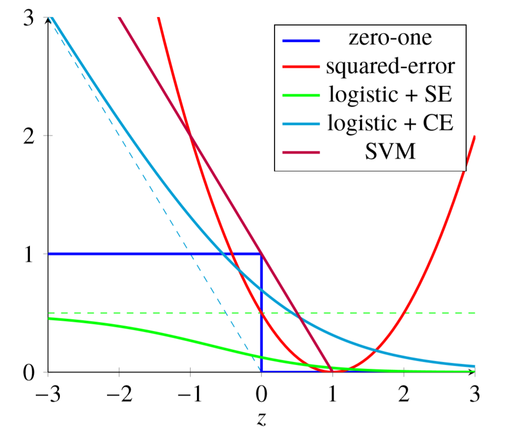

##	损失函数

-	损失函数可以视为**模型与真实的距离**的度量
	-	因此损失函数设计关键即，寻找可以代表模型与真实的距离的统计量
	-	同时为求解方便，应该损失函数最好应满足导数存在

###	Surrogate Loss

代理损失函数：用优化方便的损失函数代替难以优化的损失函数，间接达到优化原损失函数的目标

-	如 0-1 损失难以优化，考虑使用二次损失、交叉熵损失替代

###	损失函数设计

-	对有监督学习：**真实** 已知，可以直接设计损失函数

-	对无监督学习：**真实** 未知，需要给定 **真实标准**
	-	*NLP*：需要给出语言模型
	-	*EM* 算法：熵最大原理

##	常用损失函数

###	0-1 Loss

$$
L(y, f(x)) = \left \{ \begin{array}{l}
	1, & y \neq f(x) \\
	0, & y = f(x)
\end{array} \right.
$$

-	0-1 损失函数梯度要么为 0、要么不存在，无法通过梯度下降方法优化 0-1 损失

-	适用场合
	-	二分类：*Adaboost*
	-	多分类：*Adaboost.M1*

###	*Quadratic* / *Squared Error Loss*

$$
L(y, f(x)) = \frac 1 2 (y - f(x))^2
$$

-	平方错误损失函数可导，可以基于梯度下降算法优化损失函数

-	适用场合
	-	回归预测：线性回归
	-	分类预测：0-1 二分类（根据预测得分、阈值划分）

###	*Logistic SE*

-	平方损失用于二分类时存在如下问题（模型输出无限制）
	-	若模型对某样本非常确信为正例，给出大于1预测值
	-	此时模型会进行不必要、开销较大的优化

-	考虑对模型输出进行 *sigmoid* 变换后作为预测值，再应用平方错误损失函数

	$$
	L(y, f(x)) = \frac 1 2 (y - \sigma(f(x)))^2
	$$

	-	*Logistic SE* 损失函数曲线对 0-1 损失拟合优于平方损失
	-	但负区间存在饱和问题，损失最大只有 0.5

###	*Cross Entropy*

交叉熵损失

$$\begin{align*}
L(y, f(x)) & = -ylog(f(x)) \\
& = - \sum_{k=1}^K y_k log f(x)_k
\end{align*}$$

> - $y$：样本实际值
> - $f(x)$：各类别预测概率
> - $K$：分类数目

-	交叉熵损失综合二次损失、*logistic SE* 优势，以正样本为例
	-	预测值较大时：损失接近 0，避免无效优化
	-	预测值较小时：损失偏导趋近于 -1，不会出现饱和现象

-	$y$ 为 *one-hot* 编码时实际值时
	-	分类问题仅某分量为 1：此时交叉熵损失同对数损失（负对数极大似然函数）
	-	标签问题则可有分量为 1

-	适合场合
	-	多分类问题
	-	标签问题

### *Hinge Loss*

$$\begin{align*}
L(y, f(x)) & = [1 - yf(x)]_{+} \\
[z]_{+} & = \left \{ \begin{array}{l}
	z, & z > 0 \\
	0, & z \leq 0
\end{array} \right.
\end{align*}$$

> - $y \in \{-1, +1\}$

-	合页损失函数：0-1 损失函数的上界，效果类似交叉熵损失函数
	-	要求分类不仅正确，还要求确信度足够高损失才为 0
	-	即对学习有更高的要求

-	适用场合
	-	二分类：线性支持向量机

###	收敛速度对比

-	指数激活函数时：相较于二次损失，收敛速度更快

-	二次损失对 $w$ 偏导

	$$
	\frac {\partial L} {\partial w} = (\sigma(z) - y) \sigma^{'}(z) x
	$$

	> - $\sigma$：*sigmoid*、*softmax* 激活函数
	> - $z = wx + b$

	-	考虑到 *sigmoid* 函数输入值绝对值较大时，其导数较小
	-	激活函数输入 $z=wx+b$ 较大时，$\sigma^{'}(z)$ 较小，更新速率较慢

-	*Softmax* 激活函数时，交叉熵对 $w$ 偏导

	$$\begin{align*}
	\frac {\partial L} {\partial w} & = -y\frac 1 {\sigma(z)}
		\sigma^{'}(z) x \\
	& = y(\sigma(z) - 1)x
	\end{align*}$$

-	特别的，对 *sigmoid* 二分类

	$$\begin{align*}
	\frac {\partial L} {\partial w_j} & = -(\frac y {\sigma(z)}
		- \frac {(1-y)} {1-\sigma(z)}) \sigma^{'}(z) x \\
	& = -\frac {\sigma^{'}(z) x} {\sigma(z)(1-\sigma(z))}
		(\sigma(z) - y) \\
	& = x(\sigma(z) - y)
	\end{align*}$$

	-	考虑 $y \in \{(0,1), (1,0)\}$、$w$ 有两组
	-	带入一般形式多分类也可以得到二分类结果

##	不常用损失函数

###	*Absolute Loss*

绝对损失函数

$$
L(y, f(x)) = |y-f(x)|
$$

-	适用场合
	-	回归预测

###	*Logarithmic Loss*

对数损失函数（负对数极大似然损失函数）

$$
L(y, P(y|x)) = -logP(y|x)
$$

-	适用场合
	-	多分类：贝叶斯生成模型、逻辑回归

###	*Exponential Loss*

指数函数函数

$$
L(y, f(x)) = exp\{-yf(x)\}
$$

-	适用场合
	-	二分类：前向分步算法

###	*Pseudo Loss*

伪损失：考虑个体损失 $(x_i, y_i)$ 如下，据此构造伪损失

-	$h(x_i, y_i)=1, \sum h(x_i, y)=0$：完全正确预测
-	$h(x_i, y_i)=0, \sum h(x_i, y)=1$：完全错误预测
-	$h(x_i, y_i)=1/M$：随机预测（M为分类数目）

$$
L(y, f(x)) = \frac 1 2 \sum_{y^{(j)} \neq f(x)} w_j (1 - f(x, y) + f(x, y^{(j)}))
$$

> - $w_j$：样本个体错误标签权重，对不同个体分布可不同
> - $f(x, y^{(j)})$：分类器将输入 $x$ 预测为第 $j$ 类 $y^{(j)}$ 的置信度

-	伪损失函数考虑了预测 **标签** 的权重分布
	-	通过改变此分布，能够更明确的关注难以预测的个体标签，而不仅仅个体

-	伪损失随着分类器预测准确率增加而减小
	-	分类器 $f$ 对所有可能类别输出置信度相同时，伪损失最大达到 0.5，此时就是随机预测
	-	伪损失大于 0.5 时，应该将使用 $1-f$

-	适用场景
	-	多分类：*Adaboost.M2*

