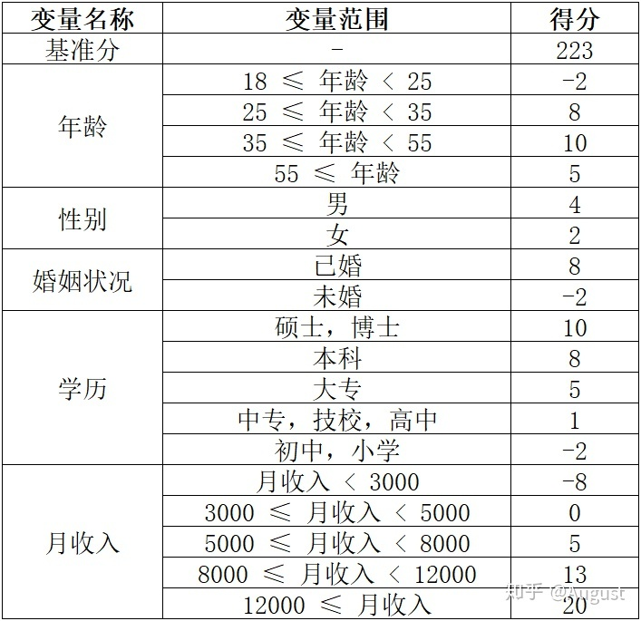
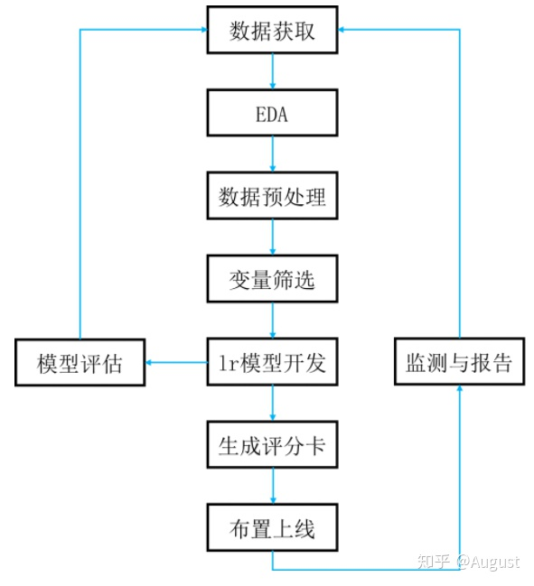

##	评分卡模型

评分卡模型

-	评分卡模型在不同业务阶段体现的方式、功能不一样，按照借贷
	用户的借贷时间可以分为
	-	申请评分卡*Application Score Card*：贷前申请评分卡，
		A卡
	-	行为评分卡*Behavior Score Card*：贷中行为评分卡，B卡
	-	催收评分卡*Collection Score Card*：贷后催收评分卡，
		C卡

-	用户的总评分等于基于分加上客户各个属性的评分
	-	对用户评分的有效性为1个月左右
	-	同时假设用户短期内属性变化不大，不会跨越箱边界，保证
		模型稳定性

##	评分卡开发流程

###	预处理

###	特征分箱

-	特征分箱
	-	有效处理特征缺失值、异常值
	-	数据和模型更稳定
	-	将所有特征统一为分类型变量
	-	简化逻辑回归模型，降低过拟合风险，提高模型泛化能力
	-	分箱后变量才可以使用标准评分卡格式，根据变量取值分段
		评分

-	WOE编码：参见*ml_techniques/data_handling/todo*

###	特征筛选

####	单变量Filter

-	可量化评价
	-	预测能力
		-	WOE值/IV值
		-	RF、GBDT计算特征重要度
	-	特征之间线性相关性：可用特征*WOE*编码替代原始变量
		计算，一般保留相关性高特征对中预测能力更强者
		-	VIF
		-	Pearson相关系数
	-	缺失率
		-	删除缺失率超过某阈值的变量
		-	剩余变量中缺失值、异常值作为一种状态，即将其作为
			变量的一个取值/箱

	> - 这里可设置宽、严两组阈值，分两步进行变量筛选，避免
		相关性、RF特征重要度非单变量指标剔除过多特征

-	直观评价
	-	简单性：容易生成、使用
	-	强壮性：不容易绕过
	-	业务上可解释性

####	Wrapper/Embeded

-	Stepwise LR
-	LASSO LR

###	模型训练

-	WOE编码特征
	-	LR模型中特征权重应该全为正值，否则
		-	同数据WOE值体现的逻辑相违背
		-	负值权重特征存在较严重共线性
-	one-hot编码特征
	-	同特征下个分箱单独作为独立变量取值
		-	权重灵活性更大，模型效果可能较好
		-	变量数量多，需要样本数量大，模型效果可能较差
			（随机解法）
	-	各特征分箱之间无联系，难以通过模型剔除某个变量

###	模型评价

-	KS
-	AUC
-	PSI/CSI

###	导出得分

> - 评分卡得分即LR模型内线性模型的结果

-	原始得分
	-	one-hot编码：LR模型系数
	-	WOE编码：LR模型系数（权重）、WOE值之积

-	*PDO*：违约翻倍得分
	-	用于缩放原始得分
	-	得分减少$\frac {PDO} {ln2}$时，用户违约odds翻倍

> - 还有些处理会加上基础得分、以变量为组加上基础得分

