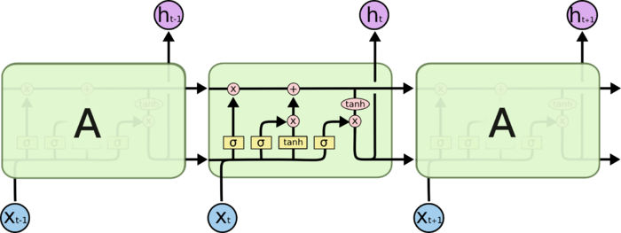
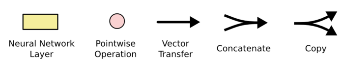
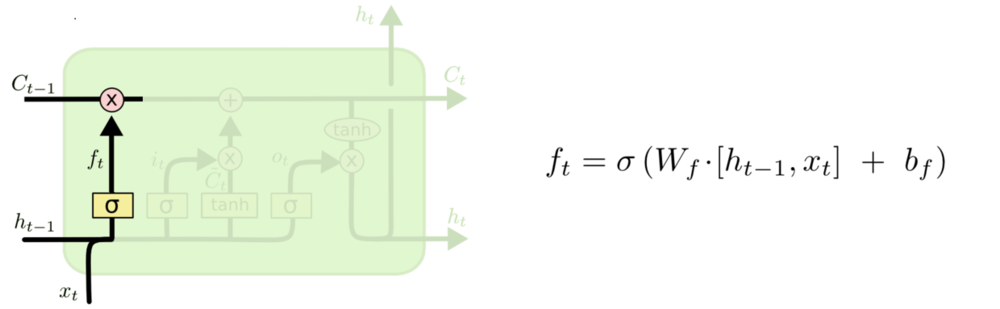

##	Long Short Term Memory

*LSTM*：通过刻意设计、默认可以学习长期依赖信息的RNN网络

-	LSTM中每个重复的模块（层）称为细胞
	-	细胞结构经过特殊设计，相较于准RNN简单细胞结构能较好
		保留长时信息

-	多个LSTM细胞可以组成*block*，其中细胞**门权值共享**
	-	block中各个细胞状态不同
	-	这个是同时刻、不同层的真权值共享，类似CNN中的卷积核
	-	减少参数个数，效率更高

> - *long term memory*：长期记忆，参数
> - *short term memory*：短期记忆，数据流
> - *long short term memory*：长[的]短期记忆，细胞状态

###	LSTM标准细胞结构

$$ \beign{align*}
i^{(t)} & = \sigma(W_i[x^{(t)}, h^{(t-1)}], b_i), & input gate \\
f^{(t)} & = \sigma(W_f[x^{(t)}, h^{(t-1)}], b_f), & forget gate \\
o^{(t)} & = \sigma(W_o[x^{(t)}, h^{(t-1)}], b_o), & output gate \\
\tilde C^{(t)} & = tanh((W_c[x^{(t)}, h^{(t)}])), & memory alternates \\
C^{(t)} & = f^{(t)} \odot c^{(t-1)} + i^{(t)} \odot c^{(t)}, & new memory \\
h^{(t)} & = o^{(t)} \odot tanh(c^{(t)}), & output
\end{align*}$$

> - $W_i, b_i, W_f, b_f, W_o, b_o$：输入门、遗忘门、输出门
	参数
> - $\odot$：逐项乘积
> - $x_t$：第$t$期输入
> - $i^{(t)}$：输出门权重，决定需要更新的信息
> - $f^{(t)}$：遗忘门权重，决定需要遗忘的信息
> - $o^{(t)}$：输出门权重，决定需要输出的信息
> - $h^{(t-1)}$：第$t-1$期细胞状态输出
> - $\tilde C_t$：第$t$期更新备选内容
> - $C^{(t)}$：第$t$期更新完成后细胞状态

-	输入、遗忘、输出门特点
	-	当期输入$x^{(t)}$、上期输出$h^{(t-1)}$作为输入
	-	sigmoid作为激活函数，得到$[0,1]$间**控制、权重**向量
		-	*1*：完全保留
		-	*0*：完全舍弃

-	细胞状态、输出特点
	-	tanh作激活函数，得到$[-1,1]$间**信息**向量
		-	$h^{(t-1)}, x^t$：备选更新信息输入
		-	$C^{(t-1)}$：输出信息输入
	-	与门限权重逐项乘积确定最终遗忘、输入、输出

	> - 细胞状态选择（候选、输出）都是使用双曲正切激活，应该
		是为了有正由负

####	Gates

-	*Forget Gate*：遗忘门，决定要从细胞状态中舍弃的信息

	

-	*Input Gate*：输入门，决定向细胞状态中保留的信息

	

-	*Ouput Gate*：输出门，决定从细胞状态中输出的信息

	

####	Cell State

细胞状态：LSTM中最重要的核心思想

-	随着时间流动，承载之前所有状态信息，代表长期记忆
	-	类似于传送带，直接在整个链上运行，只有少量**线性交互**
	-	信息其上流派很容易保持不变
	-	通过“三个门”保护、控制

-	LSTM可以保证长短时记忆可以理解为
	-	$C_t$中历史信息比重由$f^{(t)}$确定
	-	$f^{(t)}$趋近于1时历史信息能较好的保留

###	Gated Recurrent Unit

$$\begin{align*}
r^{(t)} & = \sigma(W_r [h^{(t-1)}, x^{(t)}] + b_r), & reset gate \\
z^{(t)} & = \sigma(W_z [h^{(t-1)}, x^{(t)}] + b_z), & update gate \\
\tilde h^{(t)} &= tanh(W_h [r^{(t)} h^{(t-1)}, x^{(t)}]),
	& memory alternates\\
h^{(t)} & = (1 - z^{(t)}) \odot h^{(t-1)} + z^{(t)} \odot \tilde h^{(t)},
	& new memory
\end{align*}$$

> - $W_r, b_r, W_z, b_z$：重置门、更新门参数
> - $h^{(t)}$：原细胞状态、隐层输出合并
> - $\tilde{h}_t$：第$t$期更新备选信息
> - $r^{(t)}$：重置门权重输出，重置上期状态$h_{t-1}$再作为更新
	门输入
> - $z^{(t)]$：更新门权重输出，当期状态$h_t$中$h_{t-1}$、
	$\tilde{h}_t$占比（遗忘、更新的结合）

-	合并细胞状态、隐层输出
-	合并遗忘门、输出门为更新门

###	其他变体结构

####	*Vanilla LSTM*

> - *Peephole Connection*：细胞状态也作为3个门中sigmoid的
	输入，影响控制向量的生成

####	*Coupled Input and Forget Gate*

> - $1-f_i$代替$i_t$，结合遗忘门、输入门

####	结构比较

在Vanilla LSTM基础上的8个变体在TIMIT语音识别、手写字符识别、
复调音乐建模三个应用中比较

> - *No Input Gate*：NIG，没有输入门
> - *No Forget Gate*：NFG，没有遗忘门
> - *No Output Gate*：NOG，没有输出门
> - *No Input Acitivation Function*：NIAF，输入门没有tanh
	激活
> - *No Output Activation Function*：NOAF，输出门没有tanh
	激活
> - *No Peepholes*：NP，普通LSTM
> - *Coupled Input and Forget Gate*：CIFG，遗忘、输出门结合
> - *Full Gate Recurrence*：FGR，所有门之间有回路

-	Vanilla LSTM效果均良好，其他变体没有性能提升

-	细胞结构

	-	遗忘门、输入门是最重要的部分
		-	遗忘门对LSTM性能影响十分关键
		-	输出门对限制无约束细胞状态输出必要
	-	CIFG、NP简化结构，单对结果没有太大影响

-	超参

	-	学习率、隐层数量是LSTM主要调节参数
		-	两者之间没有相互影响，可以独立调参
		-	学习率可以可以使用小网络结构独立校准
	-	动量因子影响不大
	-	高斯噪声的引入有损性能、增加训练时间

?时间

