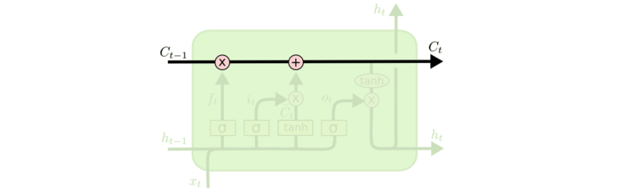

#	Long Short Term Memory

##	*Long Short Term Memory*

*LSTM*：通过刻意设计、默认可以学习长期依赖信息的RNN网络

-	LSTM中每个重复的模块（层）称为细胞

> - *long term memory*：长期记忆，参数
> - *short term memory*：短期记忆，数据流
> - *long short term memory*：长[的]短期记忆，细胞状态

###	结构

相较于标准RNN中简单的细胞结构，LSTM中细胞结构经过特殊设计

####	*Cell State*

细胞状态：LSTM中最重要的核心思想

-	随着时间流动，承载之前所有状态信息，代表长期记忆
-	类似于传送带，直接在整个链上运行，只有少量**线性交互**
-	信息其上流派很容易保持不变
-	通过“三个门”保护、控制

####	Gates

-	tanh处理$h_{t-1}, x_t$、$C_{t-1}$得到备选输入、输出流

-	sigmoid处理$h_{t-1}, x_t$，得到介于$0-1$之间控制向量，
	与输入、输出流做*point wise*点乘确定最终遗忘、输入、输出

	-	*1*：完全保留
	-	*0*：完全舍弃

-	多个LSTM细胞可以组成*block*，其中细胞**门权值共享**

	-	block中各个细胞状态还是不同的
	-	这个是真权值共享，类似CNN中的卷积核
	-	减少参数个数，效率更高

#####	*Forget Gate*

遗忘门：决定要从细胞状态中舍弃的信息

> - $C_{t-1}$：第$t$期更新前细胞状态
> - $h_{t-1}$：第$t-1$期细胞状态输出
> - $x_t$：第$t$期输入
> - $f_t$：决定保留/遗忘的信息

#####	*Input Gate*

输入门：决定向细胞状态中保留的信息

> - $\tilde{C}_t$：第$t$期更新备选内容
> - $i_t$：决定需要更新的信息
> - $C_t$：第$t$期更新完成后细胞状态

#####	*Ouput Gate*

输出门：决定从细胞状态中输出的信息

> - $o_t$：决定需要输出的信息
> - $h_t$：第$t$期输出信息

###	变体结构

####	*Vanilla LSTM*

> - *Peephole Connection*：细胞状态也作为3个门中sigmoid的
	输入，影响控制向量的生成

####	*Coupled Input and Forget Gate*

> - $1-f_i$代替$i_t$，结合遗忘门、输入门

####	*Gated Recurrent Unit*

> - $h_{t-1}$：原细胞状态、隐层状态合并

> - $r_t$：*reset gate*输出，重置上期状态$h_{t-1}$再作为更新
	门输入

> - $\tilde{h}_t$：第$t$期更新备选信息

> - $z_t$：*update gate*输出，当期状态$h_t$中$h_{t-1}$、
	$\tilde{h}_t$占比（遗忘、更新的结合）

####	结构比较

在Vanilla LSTM基础上的8个变体在TIMIT语音识别、手写字符识别、
复调音乐建模三个应用中比较

> - *No Input Gate*：NIG，没有输入门
> - *No Forget Gate*：NFG，没有遗忘门
> - *No Output Gate*：NOG，没有输出门
> - *No Input Acitivation Function*：NIAF，输入门没有tanh
	激活
> - *No Output Activation Function*：NOAF，输出门没有tanh
	激活
> - *No Peepholes*：NP，普通LSTM
> - *Coupled Input and Forget Gate*：CIFG，遗忘、输出门结合
> - *Full Gate Recurrence*：FGR，所有门之间有回路

-	Vanilla LSTM效果均良好，其他变体没有性能提升

-	细胞结构

	-	遗忘门、输入门是最重要的部分
		-	遗忘门对LSTM性能影响十分关键
		-	输出门对限制无约束细胞状态输出必要
	-	CIFG、NP简化结构，单对结果没有太大影响

-	超参

	-	学习率、隐层数量是LSTM主要调节参数
		-	两者之间没有相互影响，可以独立调参
		-	学习率可以可以使用小网络结构独立校准
	-	动量因子影响不大
	-	高斯噪声的引入有损性能、增加训练时间

