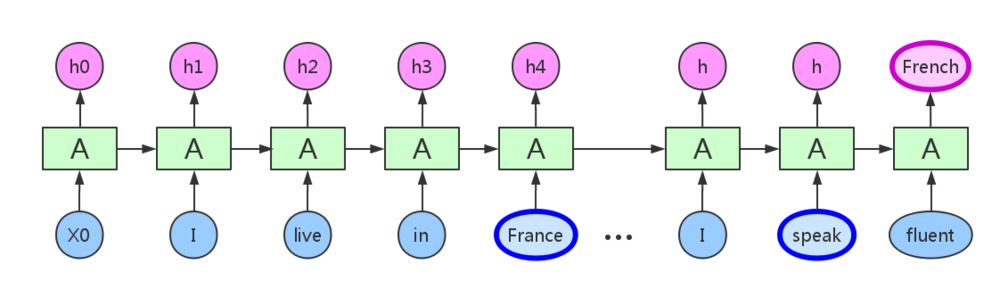

#	Recurrent Neural Network

##	Recurrent Neural Network

RNN：处理前后数据有关联的序列数据

> - 左侧：为折叠的神经网络，右侧：按时序展开后的网络
> - $h$：循环隐层，其中神经元之间有权连接，随序列输入上一期
	隐层会影响下一期
> - $o$、$y$：输出预测值、实际值
> - $L$：损失函数，随着时间累加

-	序列往往长短不一，难以拆分为独立样本通过普通DNN训练

###	结构

> - 普通的DNN：固定大小输入得到固定输出
> - 单个输入、序列输出：输入图片，得到描述文字序列
> - 序列输入、单个输出：情感分析
> - 异步序列输入、输出：机器翻译
> - 同步序列输入、输出：视频帧分类

####	权值连接

-	循环隐层内神经元之间也建立权连接，即**循环**

	-	基础神经网络只在层与层之间建立权值连接是RNN同普通DNN
		最大不同之处

-	循环隐层中神经元只会和其**当前层中神经元**建立权值连接

	-	即不受上期非同层神经元影响
	-	循环隐层中神经元$t$期状态$h^{(t)}$由当期输入、
		$h^{(t-1)}$共同决定

> - *Gated Feedback RNN*：循环隐层会对下期其他隐层产生影响
	

####	逻辑结构

> - RNN网络实际结构是线性、折叠的，逻辑结构则是展开的结构，
	考虑RNN性质应该在展开的逻辑结构中考虑

-	序列输入
	-	实际结构：依次输入
	-	逻辑结构：里是整体作为一次输入、才是一个样本，损失、
		反向传播都应该以完整序列为间隔

-	权值共享
	-	实际结构：不同期的权值实际是同一组
	-	逻辑结构：称为**权值共享**

-	重复模块链
	-	实际结构：同一个模块
	-	逻辑结构：不同期模块之间信息流动形成链式形式

####	信息传递

> - RNN循环层中信息只能由上一期直接传递给下一期

-	输入、输出相关信息间隔较近时，普通RNN可以胜任

	

-	当间隔很长，RNN理论上虽然能够处理，但由于梯度消失问题，
	实际上长期依赖会消失，需要LSTM网络

	

###	*Forward Propogation*

-	$h^{(t)} = \sigma(z^{(t)}) = \sigma(Ux^{(t)} + Wh^{(t-1)} +b )$
	> - $\sigma$：RNN激活函数，一般为$tanh$
	> - $b$：循环隐层偏置

-	$o^{(t)} = Vh^{(t)} + c$
	> - $c$：输出层偏置

-	$\hat{y}^{(t)} = \sigma(o^{(t)})$
	> - $\sigma$：RNN激活函数，分类时一般时$softmax$

###	*Back-Propogation Through Time*

*BPTT*：训练RNN的常用方法

> - 本质仍然是BP算法，但是RNN处理序列数据，损失随期数累加，
	即计算梯度时使用最终损失$L = \sum_{t=1}^\tau L^{(t)}$

> - 对循环层中参数，梯度沿着期数反向传播，第t期反向传播时，
	需要逐级求导

-	序列整体作为一次输入，进行一次反向传播
-	理论上可以漂亮的解决序列数据的训练，但是和DNN一样有梯度
	消失的问题，尤其是序列很长时，所以一般不能直接应用

####	非循环层

-	$\frac{\partial L}{\partial c}$
	$$\begin{align*}
	\frac{\partial L}{\partial c} & = \sum_{t=1}^{\tau}
		\frac{\partial L^{(t)}}{\partial c}
	& = \sum_{t=1}^{\tau}\frac{\partial L^{(t)}}
		{\partial o^{(t)}} \frac{\partial o^{(t)}}{\partial c}
	& = \sum_{t=1}^{\tau}\hat{y}^{(t)} - y^{(t)}
	\end{align*}$$

	> - $L^{(t)} = \frac 1 2 (\hat{y}^{(t)} - y^{(t)})^2$：
		使用平方损失

-	$\frac{\partial L}{\partial V}$

	$$\begin{align*}
	\frac{\partial L}{\partial V} & = \sum_{t=1}^{\tau}
		\frac{\partial L^{(t)}}{\partial V}
	& = \sum_{t=1}^{\tau} \frac{\partial L^{(t)}}
		{\partial o^{(t)}} \frac{\partial o^{(t)}}{\partial V}
	& = \sum_{t=1}^{\tau}(\hat{y}^{(t)} - y^{(t)})
		(h^{(t)})^T
	\end{align*}$$

####	循环层

> - 为方便定义：
	$\delta^{(t)} = \frac {\partial L} {\partial h^{(t)}}$

-	$\delta^{(t)}$
	$$\begin{align*}
	\delta^{(t)} & = \frac {\partial L} {\partial h^{(t)}} \\
		& = \frac{\partial L}{\partial o^{(t)}}
			\frac{\partial o^{(t)}}{\partial h^{(t)}} +
			\frac{\partial L}{\partial h^{(t+1)}}
			\frac{\partial h^{(t+1)}}{\partial h^{(t)}}
		& = V^T(\hat{y}^{(t)} - y^{(t)}) +
			W^T\delta^{(t+1)}diag(1-h^{(t+1)})^2)
	\end{align*}$$

	> - $\frac{\partial h^{(t+1)}}{\partial h^{(t)}} = diag(1-h^{(t+1)})^2)$
		：$tanh(x)$梯度性质
	> - $h^{(t)}(t<\tau)$梯度：被后一期影响（反向传播），需递推

-	$\delta^{(\tau)}$

	$$\begin{align*}
	\delta^{(\tau)} & = \frac{\partial L}{\partial o^{(\tau)}}
		\frac{\partial o^{(\tau)}}{\partial h^{(\tau)}}
	& = V^T(\hat{y}^{(\tau)} - y^{(\tau)})
	\end{align*}$$

	> - $\tau$期后没有其他序列，可以直接求出

-	$\frac{\partial L}{\partial W}$

	$$\begin{align*}
	\frac{\partial L}{\partial W} & = \sum_{t=1}^{\tau}
		\frac{\partial L}{\partial h^{(t)}}
		\frac{\partial h^{(t)}}{\partial W}
	& = \sum_{t=1}^{\tau}diag(1-(h^{(t)})^2)
		\delta^{(t)}(h^{(t-1)})^T
	\end{align*}$$

	> - 需要由$\sigma^{(t)}$累加得到

-	$\frac{\partial L}{\partial b}$

	$$\begin{align*}
	\frac{\partial L}{\partial b} & = \sum_{t=1}^{\tau}
		\frac{\partial L}{\partial h^{(t)}}
		\frac{\partial h^{(t)}}{\partial b}
	& = \sum_{t=1}^{\tau} diag(1-(h^{(t)})^2)\delta^{(t)}
	\end{align*}$$

-	$\frac{\partial L}{\partial U}$
	$$\begin{align*}
	\frac{\partial L}{\partial U} & = \sum_{t=1}^{\tau}
		\frac{\partial L}{\partial h^{(t)}}
		\frac{\partial h^{(t)}}{\partial U}
	& = \sum_{t=1}^{\tau}diag(1-(h^{(t)})^2)
		\delta^{(t)}(x^{(t)})^T
	\end{align*}$$

