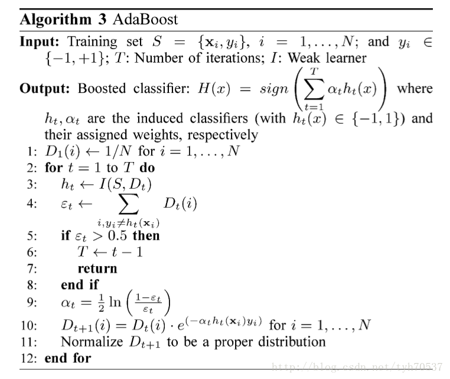
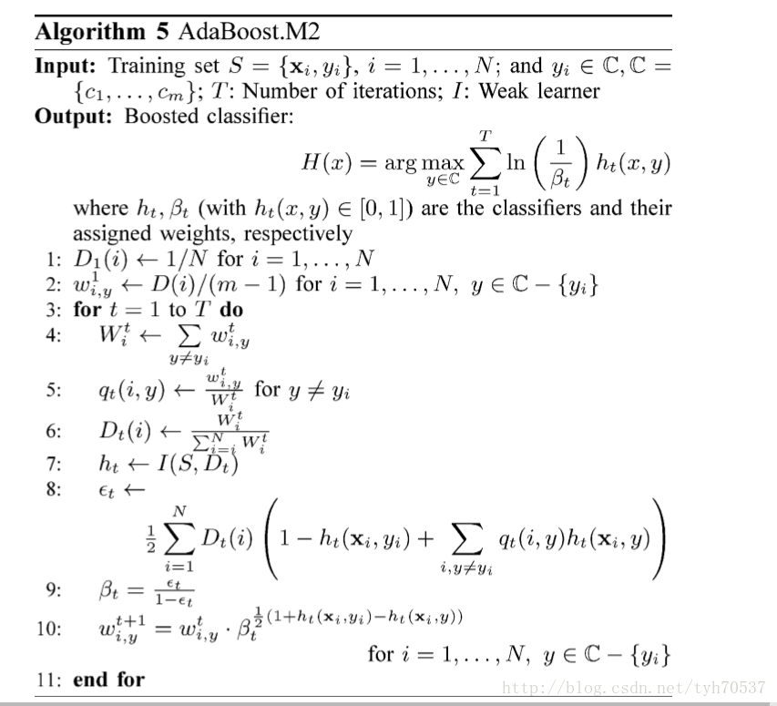
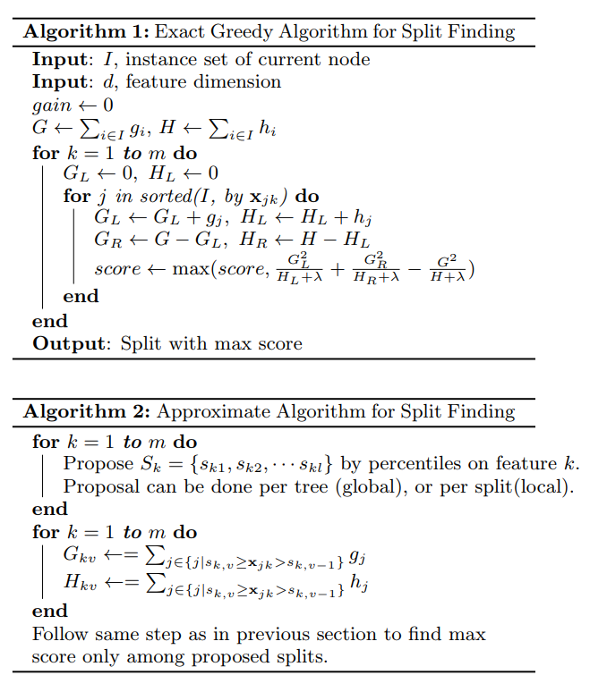

##	Boosting概述

提升方法：将弱可学习算法**提升**为强可学习算法的组合元算法

-	涉及栈泛化
-	模型：属于加法模型（即基函数的线性组合）
	-	**各模型之间存在依赖关系**
-	求解算法：前向分步算法
#todo

###	分类Boosting

> - **依次**学习多个基分类器
> - 每个基分类器**依之前分类结果调整权重**
> - **堆叠**多个分类器提高分类准确率

-	boosting通过组合多个误分率略好于随机猜测的分类器得到
	误分率较小的分类器，因此boosting适合这两类问题

	-	个体之间难度有很大不同，boosting能够更加关注较难的
		个体
	-	学习器对训练集敏感，boosting驱使学习器在趋同的、
		“较难”的分布上学习，此时boosting就和bagging一样能够
		使得模型更加稳健（但原理不同）

-	boosting能减小预测方差、偏差、过拟合

	-	直觉上，使用在不同的样本上训练的基学习器加权组合，
		本身就能减小学习器的随机变动

	-	基于同样的理由，boosting同时也能减小偏差

	-	过拟合对集成学习有些时候有正面效果，其带来多样性，
		使模型泛化能力更好，前提是样本两足够大，否则小样本
		仍然无法提供多样性

###	回归Boosting

> - **依次**训练多个基学习器
> - 每个基学习器以**之前学习器拟合残差**为目标
> - **堆叠**多个学习器减少整体损失

-	boosting组合模型整体损失（结构化风险）

	$$
	R_{srm} = \sum_{i=1}^N l(y_i, \hat y_i) +
		\sum_{t=1}^M \Omega(f_t)
	$$

	> - $l$：损失函数
	> - $f_t$：基学习器
	> - $\Omega(f_t)$：单个基学习器的复杂度罚
	> - $N, M$：样本数目、学习器数目

-	基学习器损失

	$$
	obj^{(t)} = \sum_{i=1}^N l(y_i, \hat y_i^{(t)}) +
		\Omega(f_t)
	$$

####	最速下降法

使用线性函数拟合$l(y_i, \hat y_i^{(t)})$

$$\begin{align*}
obj^{(t)} & = \sum_i^N l(y_i, \hat y_i^{(t-1)} + f_t(x_i)) +
	\Omega(f_t) \\
& \approx \sum_{i=1}^N [l(y_i, \hat y^{(t-1)}) + g_i f_t(x_i)]
	+ \Omega(f_t)
\end{align*}$$

> - $g_i = \partial_{\hat y} l(y_i, \hat y^{t-1})$

-	一次函数没有极值
-	将所有样本损失视为向量（学习器权重整体施加），则负梯度
	方向损失下降最快，考虑使用负梯度作为伪残差

####	Newton法

使用二次函数拟合$l(y_i, \hat y_i^{(t)}$

$$\begin{align*}
obj^{(t)} & = \sum_i^N l(y_i, \hat y_i^{(t-1)} + f_t(x_i)) +
	\Omega(f_t) \\
& \approx \sum_{i=1}^N [l(y_i, \hat y^{(t-1)}) + g_i f_t(x_i)
	+ \frac 1 2 h_i f_t^2(x_i)] + \Omega(f_t) \\
\end{align*}$$

> - $h_i = \partial^2_{\hat y} l(y_i, \hat y^{t-1})$

-	二次函数本身有极值
-	可以结合复杂度罚综合考虑，使得每个基学习器损失达到最小

###	Boosting&Bagging

-	基分类器足够简单时，boosting表现均显著好于bagging
	-	仅靠单次决策（单个属性、属性组合）分类

-	使用C4.5树作为基分类器时，boosting仍然具有优势，但是不够
	有说服力

> - 结论来自于*Experiments with a New Boosting Algorithm*

###	*Additional Model*

-	加法模型：将模型**视为**多个基模型加和而来

	$$
	f(x) = \sum_{m=1}^M \beta_m b(x;\theta_m)
	$$

	> - $b(x;\theta_m)$：基函数
	> - $\theta_m$：基函数的参数
	> - $\beta_m$：基函数的系数

-	策略：在给定训练数据、损失函数$L(y,f(x))$的条件下，学习
	加法模型$f(x)$成为经验风险极小化问题

	$$
	\arg\min_{\beta_m, \theta_m} \sum_{i=1}^N
		L(y_i, \sum_{m=1}^M \beta_m b(x_i;\theta_m))
	$$

###	*Forward Stagewise Algorithm*

前向分步算法：从前往后，每步只学习**加法模型**中一个基函数
及其系数，逐步逼近优化目标函数，简化优化复杂度
#todo

-	即每步只求解优化

	$$
	\arg\min_{\beta, \theta} \sum_{i=1}^N
		L(y_i, \hat f_m(x_i) + \beta b(x_i;\theta))
	$$

	> - $\hat f_m$：前m轮基函数预测值加和

####	步骤

> - 输入：训练数据集$T={(x_1,y_1), \cdots, (x_N,y_N)}$，损失
	函数$L(y,f(x))$，基函数集$\{b(x;\theta)\}$
> - 输出：加法模型$f(x)$

-	初始化$f_0(x)=0$

-	对$m=1,2,\cdots,M$，加法模型中M个基函数

	-	极小化损失函数得到参数$\beta_m, \theta_m$
		$$
		(\beta_m, \theta_m) = \arg\min_{\beta, \theta}
			\sum_{i=1}^N L(y_i, f_{m-1}(x_1) +
			\beta b(x_i; \theta))
		$$

	-	更新
		$$
		f_m(x) = f_{m-1}(x) + \beta_m b(x;y_M)
		$$

-	得到加法模型
	$$
	f(x) = f_M(x) = \sum_{i=1}^M \beta_m b(x;\theta_m)
	$$

##	AdaBoost

通过改变训练样本权重，学习多个分类器，并将分类器进行线性
组合，提高分类性能

-	对离群点、奇异点敏感
-	对过拟合不敏感

###	Boosting实现

> - 改变训练数据权值或概率分布：提高分类错误样本权值、降低
	分类正确样本权值

> - 弱分类器组合：加权多数表决，即加大分类误差率小的弱分类器
	权值，使其在表决中起更大作用；减小分类误差率大的弱分类器
	权值，使其在表决中起更小作用

###	步骤

> - 输入：训练数据集$T=\{(x_1, y_1), \cdots, (x_N, y_N)\}$，
	弱分类器算法$G(x)$
> > -	$x_i \in \mathcal{X \subset R^n}$
> > -	$y_i \in \mathcal{Y} = \{-1, +1 \}$
> - 输出：最终分类器$G(x)$

-	初始化训练数据权值分布：
	$D_1=(w_{11}, \cdots, w_{1N}), w_{1i}=\frac 1 N$

-	对$m=1,2,\cdots,M$（即训练M个弱分类器）

	-	使用具有**权值分布**$D_m$的训练数据学习，得到基本
		分类器

		$$
		G_m(x):\mathcal{X} \rightarrow \{-1, +1\}
		$$

	-	计算$G_m(x)$在训练数据集上的**分类误差率**

		$$\begin{align*}
		e_m & = P(G_m(x_i)) \neq y_i) \\
			& = \sum_{i=1}^N w_{mi}I(G_m(x_i) \neq y_i) \\
			& = \sum_{G_m(x_i) \neq y_i} w_{mi}
		\end{align*}$$

	-	计算$G_m(x)$组合为最终分类器时权重

		$$
		\alpha = \frac 1 2 log \frac {1-e_m} {e_m}
		$$

		> - $\alpha_m$表示就简单分类器$G_m(x)$在最终分类器中
			的重要性，随$e_m$减小而增加
			（弱分类器保证$e_m \leq 1/2$）

	-	更新训练集权值分布
		$$\begin{align*}
		D_{m+1} & = (w_{m+1,1}, \cdots, w_{m+1,N}) \\
		w_{m+1,i} & = \frac {w_{mi}} {Z_m}
			exp(-\alpha y_i G_m(x_i)) = \left \{
			\begin{array}{l}
				\frac {w_mi} {Z_m} e^{-\alpha_m},
					& G_m(x_i) = y_i \\
				\frac {w_mi} {Z_m} e^{\alpha_m},
					& G_m(x_i) \neq y_i \\
			\end{array} \right. \\
		Z_m & = \sum_{i=1}^N w_{mi} exp(-\alpha_m y_i G_m(x_i))
		\end{align*}$$

		> - $Z_m$：规范化因子，是第m轮调整后的权值之和，其
			使得$D_{m+1}$成为概率分布
		> - 误分类样本权值相当于被放大
			$e^{2\alpha_m} = \frac {e_m} {1 - e_m}$倍

-	构建基本分类器线性组合
	$$
	f(x) = \sum_{m=1}^M \alpha_m G_m(x)
	$$
	得到最终分类器
	$$
	G(x) = sign(f(x)) = sign(\sum_{m=1}^M \alpha_m G_m(x))
	$$

	> - 这里$\alpha_m$没有规范化，和不为1，规范化没有必要
	> - $f(x)$符号决定分类预测结果，绝对值大小表示分类确信度

> - AdaBoost中分类器学习和之后的分类误差率“无关”，基分类器
	学习算法中的loss不是分类误差率，可以是其他loss，只是需要
	考虑训练数据的权值分布
> > -	好像基学习器的loss就要是和集成部分调权的loss一致
#todo
> > -	**按权值分布有放回的抽样**，在抽样集上进行训练
> > -	各样本loss按权重加权，类似分类误差率中加权

###	训练误差边界

AdaBoost算法最终分类器的训练误差边界为

$$
\frac 1 N \sum_{i=1}^N I(G(x_i) \neq y_i) \leq
	\frac 1 N \sum_i exp(-y_if(x_i)) = \prod_m Z_m
$$

-	$G(x_i) \neq y_i$时，$y_if(x_i)<0$，所以
	$exp(-y_i f(x_i)) \geq 1$，则不等式部分可证

-	$$\begin{align*}
	\frac 1 N \sum_i exp(-y_i f(x_i))
		& = \frac 1 N \sum_i exp(-\sum_{m=1}^M
			\alpha_m y_i G_m(x_i)) \\
		& = \sum_i (w_{1,i} \prod_{m=1}^M
			exp(-\alpha_m y_i G_m(x_i))) \\
		& = \sum_i (Z_1 w_{2,i} \prod_{m=2}^M
			exp(-\alpha_m y_i G_m(x_i))) \\
		& = \prod_{m=1}^M Z_i \sum_i w_{M+1,i} \\
		& = \prod_{m=1}^M Z_i
	\end{align*}$$

> - AdaBoost训练误差边界性质的关键：权重调整与基本分类器权重
	调整**共系数**（形式不完全一样）
> - 这也是AdaBoost权重调整设计的依据，方便给出误差上界

####	二分类训练误差边界

$$
\prod_{m=1}^M Z_m = \prod_{m=1}^M (2\sqrt{e_m(1-e_m)})
	= \prod_{m=1}^M \sqrt{(1-4\gamma_m^2)}
	\leq exp(-2\sum_{m=1}^M \gamma_m^2)
$$

> - $\gamma_m = \frac 1 2 - e_m$

-	$$\begin{align*}
	Z_m & = \sum_{i=1}^N w_{m,i} exp(-\alpha y_i G_m(x_i)) \\
		& = \sum_{y_i = G_m(x_i)} w_{m,i}e^{-\alpha_m} +
			\sum_{y_i \neq G_m(x_i)} w_{m,i}e^{\alpha_m} \\
		& = (1-e_m)e^{-\alpha_m} + e_m e^{\alpha_m} \\
		& = 2\sqrt{e_m(1-e_m)} \\
		& = \sqrt{1-4\gamma^2}
	\end{align*}$$

-	由$\forall x \in [0, 0.5], e^{-x} > \sqrt{1-2x}$可得，
	$\sqrt{1-4\gamma_m^2} \leq exp(-2\gamma_m^2)$

> - 二分类AdaBoost误差边界性质的关键：$\alpha$的取值，也是
	前向分步算法（损失函数）要求
> - 若存$\gamma > 0$，对所有m有$\gamma_m \geq \gamma$，则
	$$
	\frac 1 N \sum_{i=1}^N I(G(x_i) \neq y_i) \neq
		exp(-2M\gamma^2)
	$$
	即AdaBoost的训练误差是**指数下降**的
> - 分类器下界$\gamma$可以未知，AdaBoost能适应弱分类器各自
	训练误差率，所以称为*adptive*

##	*Adaboost.M1*

Adaboost.M1是原版AdaBoost的多分类升级版，基本思想同Adaboost

###	Boosting实现

-	基分类器组合方式

	-	仍然是加权投票，且投票权重同Adaboost
	-	出于多分类考虑，没有使用`sign`符号函数

-	改变训练数据权值或概率分布：和Adaboost形式稍有不同，但
	相对的错误分类样本提升比率完全相同

	-	被上个分类器错误分类样本，权值保持不变
	-	被上个分类器正确分类样本，权值缩小比例是Adaboost平方

###	步骤

-	输入
	-	训练集：$T={x_i, y_i}, i=1,\cdots,N; y_i \in C, C=\{c_1, \cdots, c_m\}$
	-	训练轮数：T
	-	弱学习器：I

-	输出：提升分类器
	$$
	H(x) = \arg\max_{y \in C} \sum_{m=1}^M
		ln(\frac 1 {\beta_m}) [h_m(x) = y]
	$$

	> - $h_t, h_t(x) \in C$：分类器
	> - $\beta_t$：分类器权重

###	误分率上界

> - 对弱学习算法产生的伪损失$\epsilon_1,\cdots,\epsilon_t$，
	记$\gamma_t = 1/2 \epsilon_t$，最终分类器$h_{fin}$误分率
	上界有
	$$
	\frac 1 N |\{i: h_{fin}(x_i) \neq y_i \}| \leq
		\prod_{t-1}^T \sqrt {1-4\gamma^2} \leq
		exp(-2 \sum_{t-1}^T \gamma^2)
	$$

###	特点

Adaboost.M1和Adaboost基本上没有区别

-	类别数目为2的Adaboost.M1就是Adaboost
-	同样无法处理对误分率高于0.5的情况，甚至在多分类场合，
	误分率小于0.5更加难以满足
-	理论误分率上界和Adaboost相同

##	*Adaboost.M2*

AdaboostM2是AdaboostM1的进阶版，更多的利用了基分类器信息

-	要求基学习器能够输出更多信息：输出对样本分别属于各类别
	的置信度向量，而不仅仅是最终标签
-	要求基分类器更加精细衡量错误：使用伪损失代替误分率
	作为损失函数

###	*Psuedo-Loss*

$$\begin{align*}
L & = \frac 1 2 \sum_{(i,y) \in B} D_{i,y}
	(1 - h(x_i, y_i) + h(x_i, y)) \\
& = \frac 1 2 \sum_{i=1}^N D_i (1 - h(x_i, y_i) +
	\sum_{y \neq y_i} (w_{i,y} h(x_i, y)))
\end{align*}$$

> - $D$：权重分布（行和为1，但不满足列和为1）
> > -	$D_{i,y}$：个体$x_i$中错误标签$y$的权重，代表从个体
		$x_i$中识别出错误标签$y$的重要性
> - $B = \{(i, y)|y \neq y_i, i=1,2,\cdots,N \}$
> - $w$：个体各错误标签权重边际分布
> - $h(x, y)$：模型$h$预测样本$x$为$y$的置信度
> > -	$h(x_i,y_i)$：预测正确的置信度
> > -	$h(x_i,y), y \neq y_i$：预测$x_i$为错误分类$y$置信度

-	伪损失函数同时考虑了样本和**标签**的权重分布
-	通过改变此分布，能够更明确的关注难以预测的个体标签，
	而不仅仅个体

###	Boosting实现

-	改变数据权值或者概率分布

	-	使用*psuedo-loss*替代误分率，以此为导向改变权值
	-	对多分类每个错误分类概率分别计算错误占比，在此基础上
		分别计算

-	基分类器组合方式：同Adaboost.M1

###	步骤

###	训练误差上界

> - 对弱学习算法产生的伪损失$\epsilon_1,\cdots,\epsilon_t$，
	记$\gamma_t = 1/2 \epsilon_t$，最终分类器$h_{fin}$误分率
	上界有

$$
\frac 1 N |\{i: h_{fn}(x_i) \neq y_i \}| \leq
	(M-1) \prod_{t-1}^T \sqrt {1-4\gamma^2} \leq
	(M-1) exp(-2 \sum_{t-1}^T \gamma^2)
$$

###	特点

-	基于伪损失的Adaboost.M2能够提升稍微好于随机预测的分类器

-	Adaboosting.M2能够较好的解决基分类器对噪声的敏感性，但是
	仍然距离理论最优*Bayes Error*有较大差距，额外误差主要
	来自于
	-	训练数据
	-	过拟合
	-	泛化能力

-	控制权值可以有效的提升算法，减小最小训练误差、过拟合
	、泛化能力

	-	如对权值使用原始样本比例作为先验加权

-	其分类结果不差于AdaBoost.M1（在某些基分类器、数据集下）

##	*Gredient Boosting*

*GB*：（利用）梯度提升，将提升问题视为优化问题，前向分步算法
利用最速下降思想实现

-	一阶展开拟合损失函数，沿负梯度方向迭代更新
	-	损失函数中，模型的样本预测值$f(x)$是因变量
	-	即$f(x)$应该沿着损失函数负梯度方向变化
	-	即下个基学习器应该以负梯度方向作为优化目标，即负梯度
		作为**伪残差**

	> - 类似复合函数求导

-	对基学习器预测值求解最优加权系数
	-	最速下降法中求解更新步长体现
	-	前向分布算法中求解基学习器权重

###	损失函数

-	基学习器拟合目标：损失函数的负梯度在当前模型的值

	$$
	-\left [ \frac {\partial L(y, \hat y_i)}
		{\partial y_i} \right ]_{\hat y_i=\hat y_i^{(t-1)}}
	$$

-	平方损失$L(y, f(x)) = \frac 1 2 (y - f(x))^2$（回归）

	-	第m-1个基学习器伪残差为

		$$
		r_{m,i} = y_i - f_{m-1}(x_i), i=1,2,\cdots,N
		$$

		> - $N$：样本数量

	-	基学习器、权重为

		$$\begin{align*}
		\alpha_m, f_m & = \arg\min_{\alpha, f} \sum_{i=1}^N
			\frac 1 2 (y_i - (f_{m-1}(x_i) + \alpha f(x)))^2 \\
		& = \frac 1 2 (C_{m,i} - \alpha f(x))^2 \\
		C_{m,i} & = y_i - f_{m-1}(x_i)
		\end{align*}$$

-	对指数损失$L(y, f(x)) = e^{-y f(x)}$（分类）

	-	第m-1个基学习器伪残差

		$$
		r_{m,i} = -y_i e^{-y_i f_{m-1}(x_i)}, i=1,2,\cdots,N
		$$

	-	基学习器、权重为

		$$\begin{align*}
		\alpha_m, f_m & = \arg\min_{\alpha, f} \sum_{i=1}^N
			exp(-y_i(f_{m-1}(x_i) + \alpha f(x_i))) \\
		& = \arg\min_{\alpha, f} \sum_{i=1}^N C_{m,i}
			exp(-y_i \alpha f(x_i)) \\
		C_{m,i} & = exp(-y_i f_{m-1}(x_i))
		\end{align*}$$

###	步骤

> - 输入：训练数据集$T=\{(x_1, y_1), \cdots, (x_N, y_N)\}$，
	损失函数$L(y, f(x))$
> > -	$x_i \in \mathcal{X \subset R^n}$
> > -	$y_i \in \mathcal{Y} = \{-1, +1 \}$
> - 输出：回归树$\hat f(x)$

-	初始化模型
	$$
	\hat y_i^{(0)} = \arg\min_{\hat y} \sum_{i=1}^N
		L(y_i, \hat y)
	$$

-	对$m=1,2,\cdots,M$（即训练M个若分类器）

	-	计算伪残差
		$$
		r_i^{(t)} = -\left [ \frac {\partial L(y, \hat y_i)}
			{\partial y_i} \right ]_{\hat y_i=\hat y_i^{(t-1)}}
		$$

	-	基于$\{(x_i, r_i^{(t)})\}$生成基学习器$h_t(x)$

	-	计算最优系数
		$$
		\gamma = \arg\min_\gamma \sum_{i=1}^N
			L(y_i, \hat y_i^{(t-1)} + \gamma h_t(x_i))
		$$

	-	更新预测值
		$$
		\hat y_i^{(t)} = \hat y_i^{(t-1)} + \gamma_t h_t (x)
		$$

-	得到最终模型

	$$
	\hat f(x) = f_M(x) = \sum_{t=1}^M \gamma_t h_t(x)
	$$

##	*XGBoost*

*Extreme Gredient Boost*/*Newton Boosting* *GB*：前向分步
算法利用Newton法思想实现

-	二阶展开拟合损失函数
	-	损失函数中，模型的样本预测值$\hat y_i$是因变量
	-	将损失函数对$\hat y_i$二阶展开拟合
	-	求解使得损失函数最小参数

-	对基学习器预测值求解最优加权系数
	-	阻尼Newton法求解更新步长体现
	-	前向分布算法中求解基学习器权重
	-	削弱单个基学习器影响，让后续基学习器有更大学习空间

###	损失函数

-	第t个基分类器损失函数

	$$\begin{align*}
	obj^{(t)} & = \sum_{i=1}^N l(y_i, \hat y_i^{(t)}) +
		\Omega(f_t) \\

	& = \sum_i^N l(y_i, \hat y_i^{(t-1)} + f_t(x_i)) +
		\Omega(f_t) \\

	& \approx \sum_{i=1}^N [l(y_i, \hat y^{(t-1)}) + g_i
		f_t(x_i) + \frac 1 2 h_i f_t^2(x_i)] + \Omega(f_t) \\

	& = \sum_{i=1}^N [l(y_i, \hat y^{(t-1)}) + g_i f_t(x_i) +
		\frac 1 2 h_i f_t^2(x_i)] + \gamma T_t +
		\frac 1 2 \lambda \sum_{j=1}^T {w_j^{(t)}}^2 \\

	\Omega(f_t) & = \gamma T_t + \frac 1 2 \lambda
		\sum_{j=1}^T {w_j^{(t)}}^2
	\end{align*}$$

	> - $f_t$：第t个基学习器
	> - $f_t(x_i)$：第t个基学习器对样本$x_i$的取值
	> - $g_i = \partial_{\hat y} l(y_i, \hat y^{t-1})$
	> - $h_i = \partial^2_{\hat y} l(y_i, \hat y^{t-1})$
	> - $\Omega(f_t)$：单个基学习器的复杂度罚
	> - $T_t$：第t个基学习器参数数量，即$L_0$罚
	> > -	线性回归基学习器：回归系数数量
	> > -	回归树基学习器：叶子节点数目
	> - $\gamma$：基学习器$L_0$罚系数
	> - $w_j = f_t$：第t个基学习器参数值，即$L_2$罚
	> > -	线性回归基学习器：回归系数值
	> > -	回归树基学习器：叶子节点
	> - $\lambda$：基学习器$L_2$罚系数
	> - $\approx$由二阶泰勒展开近似

	-	包括正则项以控制模型复杂度
		-	降低模型估计误差，避免过拟合
		-	$L_2$正则项也控制基学习器的学习量，给后续学习器
			留下学习空间

		> - 线性回归作为基学习器时，XGB相当于L0、L2正则化的
			Logistic回归、线性回归

	-	对损失函数进行二阶泰勒展开（类似牛顿法），同时利用
		一阶、二阶导数求解下个迭代点

-	则XGBoost最终损失（结构风险）定义如下

	$$\begin{align*}
	R_{srm} & = \sum_{i=1}^N l(y_i, \hat y_i) +
		\sum_{t=1}^M \Omega(f_t)
	\end{align*}$$

	> - $N, M$：样本量、基学习器数量
	> - $\hat y_i$：样本$i$最终预测结果

###	步骤

> - $\eta$：*shrinkage*，对基学习器乘上缩减系数，削弱单个
	基学习器的影响，让后续基学习器有更大学习空间
> > -	对树：每轮迭代会将叶子结点权值乘上缩减系数

##	*CatBoost*
#todo

##	前向分布算法&Boosting

###	AdaBoost&前向分步算法

AdaBoost（基分类器loss使用分类误差率）是前向分步算法的特例，
是由基本分类器组成的加法模型，损失函数是指数函数

-	基函数为基本分类器时加法模型等价于AdaBoost的最终分类器
	$f(x) = \sum_{m=1}^M \alpha_m G_m(x)$

-	前向分步算法的损失函数为指数函数$L(y,f(x))=exp(-yf(x))$
	时，学习的具体操作等价于AdaBoost算法具体操作

	-	假设经过m-1轮迭代，前向分步算法已经得到

		$$\begin{align*}
		f_{m-1}(x) & = f_{m-2}(x) + \alpha_{m-1}G_{m-1}(x) \\
			& = \alpha_1G_1(x) + \cdots +
			\alpha_{m-1}G_{m-1}(x)
		\end{align*}$$

	-	经过第m迭代得到$\alpha_m, G_m(x), f_m(x)$，其中

		$$\begin{align*}
		(\alpha_m, G_m(x)) & = \arg\min_{\alpha, G}
				\sum_{i=1}^N exp(-y_i(f_{m-1}(x_i) +
				\alpha G(x_i))) \\
			& = \arg\min_{\alpha, G} \sum_{i=1}^N \bar w_{m,i}
				exp(-y_i \alpha G(x_i))
		\end{align*}$$

		> - $\bar w_{m,i}=exp(-y_i f_{m-1}(x_i))$：不依赖
			$\alpha, G$

	-	$\forall \alpha > 0$，使得损失最小应该有
		（提出$\alpha$）

		$$\begin{align*}
		G_m^{*}(x) & = \arg\min_G \sum_{i=1}^N \bar w_{m,i}
				exp(-y_i f_{m-1}(x_i)) \\
			& = \arg\min_G \sum_{i=1}^N \bar w_{m,i}
				I(y_i \neq G(x_i))
		\end{align*}$$

		此分类器$G_m^{*}$即为使得第m轮加权训练误差最小分类器
		，即AdaBoost算法的基本分类器

	-	又根据

		$$\begin{align*}
		\sum_{i=1}^N \bar w_{m,i} exp(-y_i \alpha G(x_i)) & =
			\sum_{y_i = G_m(x_i)} \bar w_{m,i} e^{-\alpha} +
			\sum_{y_i \neq G_m(x_i)} \bar w_{m,i} e^\alpha \\
		& = (e^\alpha - e^{-\alpha}) \sum_{i=1}^N (\bar w_{m,i}
			I(y_i \neq G(x_i))) + e^{-\alpha}
			\sum_{i=1}^N \bar w_{m,i}
		\end{align*}$$

		带入$G_m^{*}$，对$\alpha$求导置0，求得极小值为

		$$\begin{align*}
		\alpha_m^{*} & = \frac 1 2 log \frac {1-e_m} {e_m} \\
		e_m & = \frac {\sum_{i=1}^N (\bar w_{m,i}
				I(y_i \neq G_m(x_i)))}
			{\sum_{i=1}^N \bar w_{m,i}} \\
		& = \frac {\sum_{i=1}^N (\bar w_{m,i}
				I(y_i \neq G_m(x_i)))} {Z_m} \\
		& = \sum_{i=1}^N w_{m,i} I(y_i \neq G_m(x_i))
		\end{align*}$$

		> - $w_{m,i}, Z_M$同AdaBoost中

		即为AdaBoost中$\alpha_m$

	-	对权值更新有

		$$
		\bar w_{m+1,i} = \bar w_{m,i} exp(-y_i \alpha_m G_m(x))
		$$

		与AdaBoost权值更新只相差规范化因子$Z_M$

_M$

