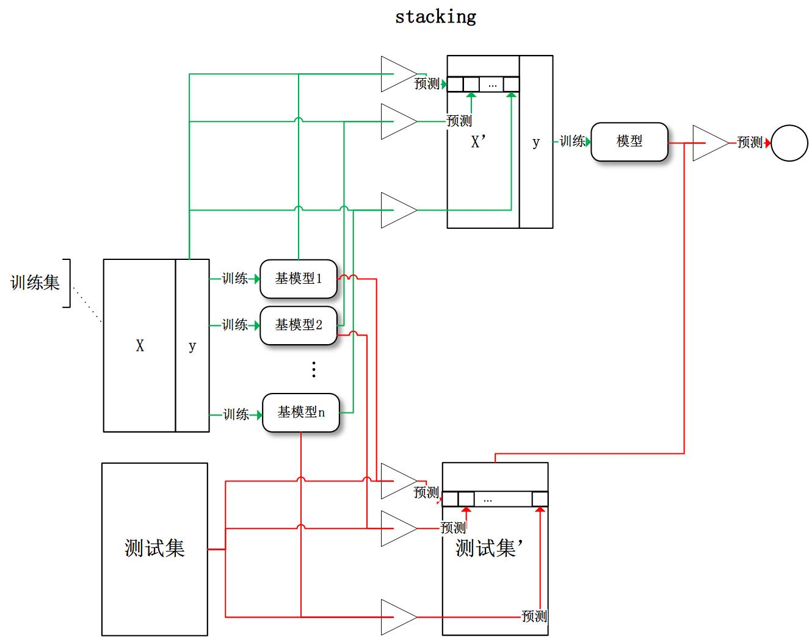
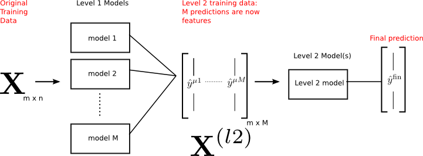
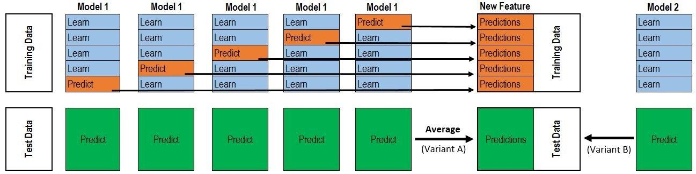

##	Stacked Generalization

堆栈泛化：使用**多种模型**分别训练训练，将其结果叠加作为下层
模型的输入，最终得到预测输出

-	属于异源集成模型，可以视为

	-	复合函数

		

	-	短路网络

		

> - 从某种意义上，复杂模型都是stacking

###	思想

-	不同模型侧重于获取数据不同方面的特征
	-	使用基学习器抽取数据特征进行表示学习，提取不同角度的
		数据高维特征
	-	考虑到使用全量训练数据训练、预测作为下层模型输入会
		导致过拟合，可使用K折交叉验证避免过拟合
	-	有些基学习器只使用适合其部分特征训练
		-	GBDT、DNN适合低维稠密特征

-	元学习器组合多个基学习器的输出
	-	从数据高维特征学习数据模式，具有更好的泛化能力，避免
		过拟合

###	算法

> - 输入：模型$M_1, M_2, \cdots, M_d$、训练特征：$X_{n*m}$、
	训练标签$Y_{n}$、测试特征$X^{'}$
> - 输出：stacking模型、预测标签

-	将训练数据K折划分，对第$i$轮划分

	-	使用模型$M_1, M_2, \cdots, M_d$分别在相应训练集
		$[X[:n_i,:], X[n_{i+1}:,:]]$、
		$[Y[:n_i], Y[n_{i+1}:]]$上训练
	-	在相应验证集$X[n_i:n_{i+1}, :]$上验证、并记录验证
		结果
	-	将验证集验证结果叠加得到部分样本新特征
		$N[n_i: n_{i+1}, d]$

-	将K轮划分得到的部分新特征拼接得到训练集的完整新特征
	$N_{n * d}$，将新特征作为输入，训练下层模型，得到最终
	stacking模型

-	将测试特征如上作为输入经过两层模型预测，得到最终预测结果

> - 以上以2层stacking为例，有深层stacking

##	常用模型

###	基学习器

-	交叉项、原始特征本身也可以视为线性基学习器学习到的特征

> - 具体模型参见
	*ml_specification/rec_system/ctr_stacking_models*

####	GBDT

> - 各树中各节点对应元学习器一维输入特征

-	适合低维稠密通用特征，对输入特征分布没有要求

-	GBDT树根据熵增益（Gini系数增益）划分节点，每条路径
	都代表一定区分能力
	-	以叶子节点（路径）作为特征，相当于自动进行特征
		转换、组合、选择、离散化，得到**高维组合特征**

-	GDBT相较于单棵树、或RF更适合stacking
	-	单棵树表达能力弱，无法表达多个有区分性特征组合，
		集成模型可将样本映射为多个特征
	-	GBDT拟合残差意味着各树对样本区分度不同，对各特征
		区别对待更合理

####	DNN

-	适合普通稠密特征、embedding特征
-	模型表达能力强，能抽取有良好分布数据的深层次特征，提高
	模型准确性、泛化能力
-	容易扩充其他类别特征，如：图片、文字

###	元学习器

-	LR
	-	适合低维稀疏特征，可对所有特征离散化以引入非线性

-	FM
	-	适合低维稀疏特征
	-	LR基础上自动组合二阶交叉项

-	Linear：训练模型、对训练结果线性加权

�

