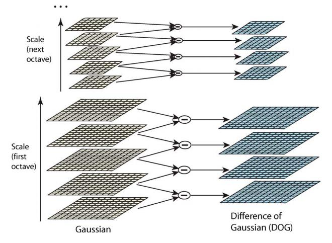

##	*Scale-Invariant Feature Transform*

*SIFT*：通过求图中*interest/corner point*、及其*scale*和
*orientation*描述子得到特征，并进行图像特征点匹配

-	SIFT是检测局部特征的算法
	-	实质：在不同尺度空间查找关键点，计算关键点大小、方向
		、尺度信息，进而组成对关键点得描述
	-	SIFT查找的关键点为突出、稳定的特征点，不会因光照、
		仿射变换、噪声等因素而改变
		-	角点
		-	边缘点
		-	暗区亮点
		-	亮区暗点
	-	匹配过程就是对比特征点过程
		

-	优点
	-	稳定性：具有旋转、尺度、平移、视角、亮度不变性，
		利于对目标特征信息进行有效表达
	-	独特性：信息量丰富，适合海量特征数据中进行匹配
	-	多量性：少数物体也可以产生大量SIFT特征向量
	-	可扩展性：可以方便同其它形式特征向量联合
	-	对参数调整稳健性好：可以根据场景调整特征点数量进行
		特征描述、方便特征分析

-	缺点
	-	不借助硬件加速、专门图像处理器难以实现

###	构建尺度空间

图像的尺度空间：解决如何对图像在所有尺度下描述的问题

-	思想：对原始图像进行尺度变换，获得多尺度空间下图像表示
	序列，**模拟图像数据的多尺度特征**
	-	对序列进行尺度空间主轮的提取
	-	以主轮廓作为特征向量，实现边缘、角点检测、不同分辨率
		上**稳定关键点**提取

-	对高斯金字塔生成的O组、L层不同尺度图像，$(O, L)$就构成
	高斯金字塔的尺度空间

	-	即以高斯金字塔组$O$、层$L$作为坐标
	-	给定一对$(o,l)$即可唯一确定一幅图像

####	图像金字塔

图像金字塔：以**多分辨率解释**图像的结构

-	通过对原始图像进行**多尺度像素采样**方式生成N个不同
	分辨率的图像
	-	图像分辨率从下至上逐渐减小
	-	直至金字塔顶部只包含一个像素

-	获取图像金字塔步骤
	-	利用低通滤波器平滑图像
	-	对平滑图像进行采样
		-	上采样：分辨率逐渐升高
		-	下采样：分辨率逐渐降低

####	高斯金字塔

高斯金字塔：由很多组图像金字塔构成，每组金字塔包含若干层

-	同一组金字塔中
	-	每层图像尺寸相同
	-	仅高斯平滑系数$\sigma$不同，后一层图像是前一层$k$倍

-	不同组金字塔中
	-	后一组图像第一个图像是前一组倒数第三个图像二分之一
		采样
	-	图像大小是前一组一半

#####	构建过程

-	构建第1组图像金字塔

	-	第1层：将原图扩大一倍得到

	-	第2层：第1层图像经过高斯卷积得到

		> - SIFT算子中，高斯平滑参数$\sigma=1.6$

	-	第k层：

		-	$\sigma$乘以比例系数得到新平滑因子
			$\sigma = k\sigma$，
		-	使用平滑因子平滑第k层图像得到

	-	不断重复得到L层图像

-	构建第k组图像金字塔

	-	第1层：将第k-1组金字塔倒数第3层做比例因子为2的降采样
		得到

	-	之后同第1组图像金字塔

-	不断重复得到O组图像金字塔，共计O * L个图像

####	*Difference of Gaussian*

*DOG*金字塔：差分金字塔

-	DOG金字塔第0组第k层由高斯金字塔第0组第k+1层减去第k层得到
	-	DOG金字塔每组比高斯金字塔少一层
	-	按高斯金字塔逐组生成$O * (L-1)$个差分图像

-	DOG图像包含大量信息（需要归一化才能人眼可见）
	-	在不同DOG层（即不同模糊程度、不同尺度）都存在的特征
		即SIFT要提取的稳定特征
	-	后续SIFT特征点都是在DOG金字塔中进行

###	空间极值点检测

空间极值点检测：关键点初步查探

-	寻找DOG图像极值点：每个像素点和其所有相邻点比较
	-	需要同时比较**图像域、尺度空间域**相邻点
	-	保证关键点在尺度空间、二维图像空间上都是局部极值点

-	对二维图像空间，对中心点
	-	图像域：与3 * 3领域内8个点比较
	-	**同组尺度空间**：和上下两层图像中2 * 9个点比较

-	极值点是在不同尺度空间下提取的，保证了关键点尺度不变性

###	精确定位

稳定关键点精确定位

-	DOG值对噪声、边缘敏感，需要对局部极值进一步筛选，去除
	不稳定、错误检测极值点

-	构建高斯金字塔时采用下采样图像，需要求出下采样图像中
	极值点对应在原始图像中确切位置

###	方向信息分配

稳定关键点方向信息分配

-	为关键点分配方向信息赋予关键点旋转不变性

-	通过对稳定关键点求梯度实现方向分配

####	计算方式

-	梯度幅度值

	$$
	m(x, y) = \sqrt {(L(x+1,y) - L(x-1,y))^2 +
		(L(x,y+1) - L(x,y-1))^2}
	$$

-	梯度方向

	$$
	\theta(x,y) = tan^{-1} (\frac {L(x,y+1) - L(x,y-1)}
		{L(x+1,y) - L(x-1,y)})
	$$

-	通过梯度方向直方图给出关键点梯度方向

	

	-	计算关键点为中心领域内所有点梯度方向，在0~360度范围
	-	把所有梯度方向划分到36个区域，每个方向代表10度
	-	累计每个方向关键点数目，生成梯度方向直方图
	-	将直方图中峰值代表方向作为关键点主方向
	-	若存在相当于峰值80%大小的方向，则作为辅方向
		-	辅方向可以增强匹配的鲁棒性

		> - Lowe指出：大概15%关键点具有辅方向，且这些关键点
			对稳定匹配起关键作用

###	关键点描述

关键点描述：以数学方式定义关键点的过程，包括关键点周围对其
有贡献的领域点

-	对关键点周围像素区域分块
	-	计算块内梯度直方图
	-	生成具有独特性的向量，作为对该区域图像信息的抽象表述

-	如下图

	

	-	将关键点周围分为2 * 2块
	-	对每块所有像素点梯度做高斯加权（softmax拉开差距？）
	-	每块最终取8个方向，得到2 * 2 * 8维向量，作为中心
		关键点数学描述

> - Lowe实验表明：采用4 * 4 * 8共128维描述子表征关键点，
	综合效果最好
	

###	特征点匹配

特征点匹配：计算两组特征点128维描述向量的欧式距离

-	欧式距离越小、相似度越高，小于指定阈值时既可认为匹配成功

##	*Speeded Up Robust Feature*

SURF特征：对SIFT算法的改进，降低了时间复杂度，提高了稳健性

-	主要是简化SIFT一些运算
	-	高斯二阶维分模型简化，卷积平滑操作仅需要转换为加减
		运算
	-	最终生成特征向量维度从128维减少为64维

##	*Brief*

##	*Oriented Brief*

*ORB*：Brief算法改进版

-	比SIFT算法快100倍

