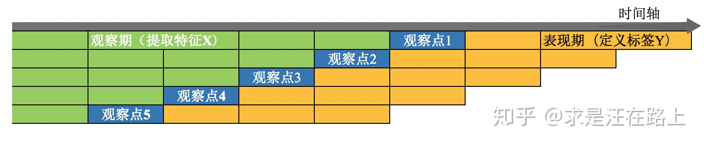
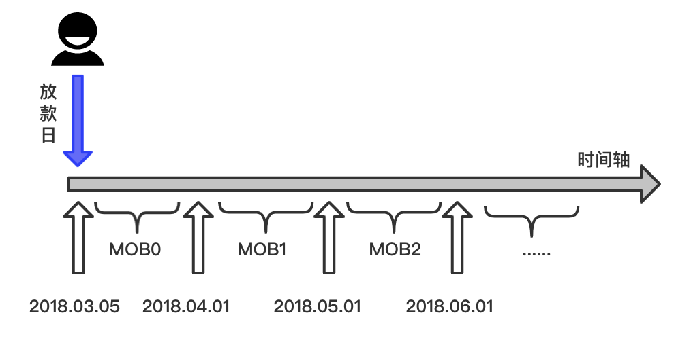
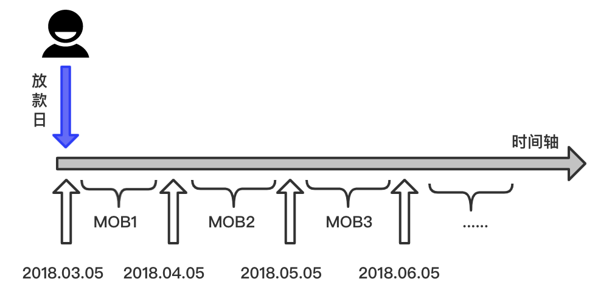
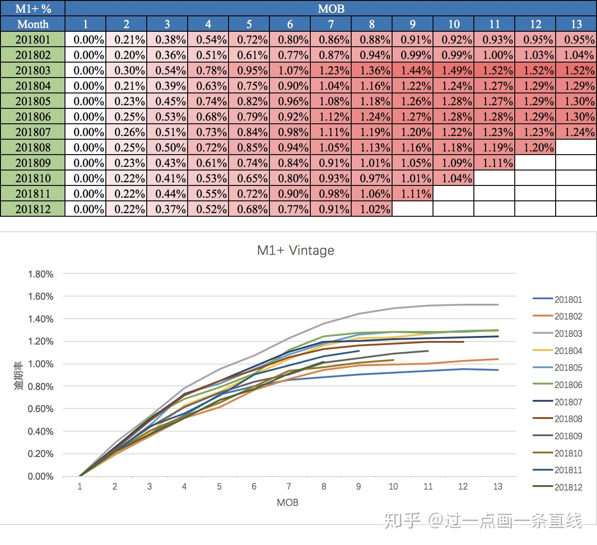
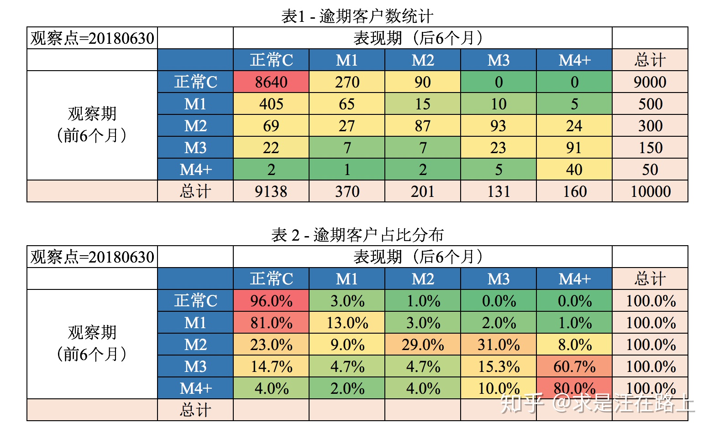
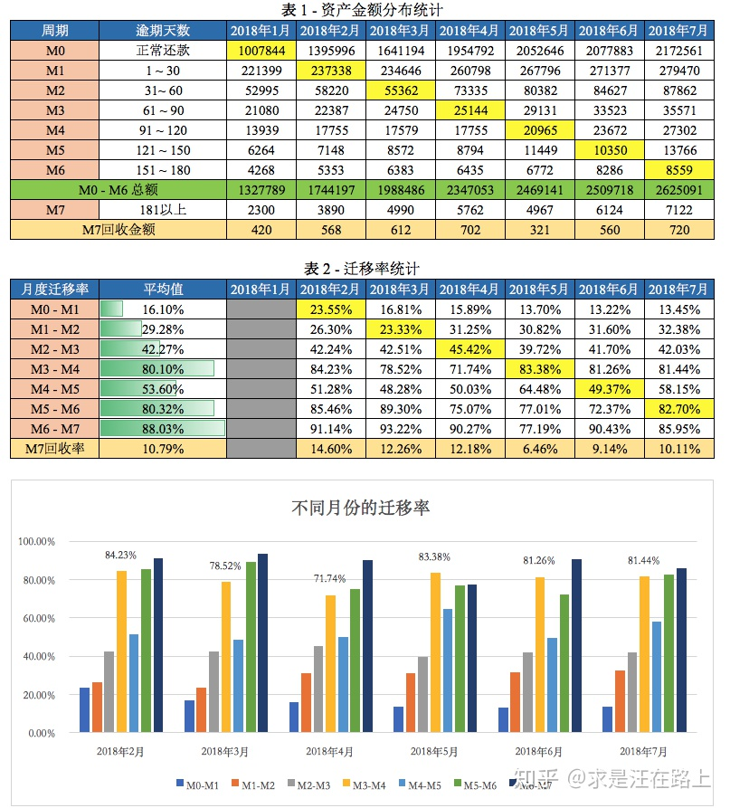

##	数据质量

###	特征数据挖掘

-	确定分析目标
-	假设分析
	-	对问题提出可能的假设
	-	评估假设的分析过程
-	特征获取、关联分析
	-	找出信息片段之间直接、间接联系
	-	已知信息片段，寻找直接、间接联系的信息片段
-	假设验证、模式归纳
	-	根据分析结论评估假设
	-	归纳规律特点

###	统计类特征构造

-	*RFM* 特征框架思想是构造统计类特征的基础
	-	*Recency*：最近一次间隔
	-	*Frequency*：最近一段时间次数
	-	*Monetary*：最近一段时间金额

-	结合业务统计、分析数据
	-	了解数据采集逻辑
	-	定义观察期有效性
		-	不同用户的数据厚薄程度（实际观察期长短）可能不同

-	统计类特征构造方式
	-	数量统计类特征
	-	占比统计类特征
		-	去除量纲影响
		-	衡量用户行为偏好：时间偏好、类别偏好
	-	趋势统计类特征
		-	一般通过斜率衡量变化趋势
	-	稳定性衍生特征
		-	变异系数

###	特征变量评估

-	*compliant* 合规性
	-	法律允许
	-	来源可靠
-	*stable* 稳定性
	-	数据采集稳定性
	-	特征变量稳定性
		-	数据源采集稳定是变量稳定性的基本前提
		-	变量是模型的基础，数据不稳定必然导致模型稳定性差
-	*available* 可得性
	-	数据未来是否可以继续采集、计算
	-	涉及产品设计流程、用户授权协议、合规需求、模型应用环节
		-	业务流程更改导致埋点数据弃用、数据采集后移
		-	RFM特征时间窗口支持
-	*interpretable* 可解释性
	-	数据是否具有明确、清晰的业务含义，便于理解
-	*logical* 逻辑性
	-	不容易绕过，逻辑上应该被采用

####	外部数据业务指标

> - 外部数据：三方平台根据自身业务场景所积累的数据，经脱敏
	加工后对外输出，主要包括上述的信贷类数据、消费类数据

-	性价比
	-	结合技术、业务效果、数据价格，综合计算性价比
	-	计价方式
-	覆盖范围
	-	覆盖率
	-	查得率：能匹配用户数/总用户数

####	名单类数据

-	自身效果评估
	-	混淆矩阵
		-	*TPR*、*FPR*
		-	准确率/误拒率
	-	提升度
		-	拒绝样本中坏样本提升度
		-	通过样本中好样本提升度
	-	通过率、拒绝率
-	对比/增量效果评估：和其他数据源比较
	-	有效差异率：查得命中 / 其他通过且为坏样本
	-	无效差异率：查得命中 / 其他拒绝

> - 线下带标签场景的评估

####	数据描述

-	*Exploratory Data Distribution* 数据分布
	-	样本与总体分布应大致相同，则样本分布应保持稳定，因此
		各特征统计值更应保持稳定
	-	按照自然月、特征维度，分析特征统计值变动
-	*Missing Rate* 缺失率
	-	缺失成因：随机缺失、系统性缺失
	-	缺失变动：特征缺失率持续升高，则预期未来数据采集率
		下降
-	*Unique Value*
	-	若某固定值占比过高，则变量区别度往往很低
-	特殊值检查
	-	缺失值如何表示
	-	零值的业务含义

####	稳定性

-	*PSI*：测试集、训练集间
	-	比较训练集、测试集变量的波动性
	-	无法反应细节原因，还需要 *EDD* 上分析

####	信息量

-	*Coefficient of Variation* 变异系数
	-	过小则区分度差
	-	过大可能不稳定
-	*IV* 值
	-	评估变量预测能力
	-	IV值过高时注意信息泄露问题
-	*RF/XGB* 特征重要性
	-	适合快速筛选特征
	-	此重要性只有**全局可解释性**，无法对单个案例做出解释

####	信息重复

-	*Variable Cluster* 变量聚类：评估聚类意义上变量的“接近”程度
	-	层次聚类
-	*Linear Correlation* 线性相关性：评估变量间的线性相关性
	-	*Pearson Correlation Coefficient*
	-	变量若通过WOE方式参与建模，则可以使用WOE值计算相关系数
-	*Multicollinearity* 多重共线性
	-	*VIF*
-	变量显著性
	-	*p-value*

> - 建模（线性）中应该避免是**参与建模**的变量之间过强的线性相关，所以应该检查的是**参与建模**变量之间的线性相关
> - 变量衍生值、原始值相关性不一致是衍生非线性导致，不应减弱使用衍生值变量检查的合理性

###	样本数据质量

-	代表性（狭义）
	-	数理统计最基本逻辑链是通过样本推断总体，因此样本对总体代表性决定推断上限
	-	根据标目标客群、好坏比例采样、赋权
		-	简单随机抽样，保持内部真实客群、好坏比例
		-	客群分层抽样，适应不同客群
		-	好坏不等比抽样，建模之后再按权重还原，充分捕捉
			坏样本特征
-	稳定性
	-	可用各 *Vintage* 内坏占比、*lift* 值、*odds* 等指标 *PSI* 衡量
	-	样本稳定性决定推断结果稳定性
	-	样本客群应该足够稳定，受节假日、周期影响小
-	连续性
	-	样本时间连续便于建模中划分训练集、测试集（避免数据穿越）

###	特征分类

-	还款能力
	-	收入：自填、三方
	-	负债：内部负债、外部负债、多头借贷
	-	学历：自填、三方

-	还款意愿
	-	申贷行为：申贷记录、贷前贷后申贷行为变化
	-	履约行为：还款记录、逾期记录
	-	催记行为：催收记录

##	贷前数据

-	主动数据/表填信息：客户主动提供
-	被动数据：主动采集

###	资质、标签类数据

-	客观数据：无第三方欺诈情况下可信
	-	性别
	-	年龄
	-	身份证号
	-	手机号
	-	手机号在多少个平台用户的通讯录中有存储
	-	手机号归属地
	-	户籍地址
	-	户籍地址是否来自非城市：除一线城市外，用身份证
		地址是否包含“村”判断
	-	银行卡号
	-	银行卡发卡行
	-	签发机关

-	主观数据：不可信，可对这部分数据做交叉验证，检查是否前后矛盾
	-	紧急联系人号码
	-	紧急联系人消息
	-	紧急联系人是否为平台用户
	-	学历
	-	工作
	-	月收入
	-	公司
	-	负债
	-	地址
	-	紧急联系人手机号归属地是否和账户手机号归属地一致
	-	手机联系人手机号归属地是否和申请人户籍地一致

###	信贷类数据

-	人行征信报告
-	三方征信数据：通过各机构贷前审批、贷后管理等记录
	-	收入数据
	-	负债数据
		-	多头负债
		-	共债
	-	多头借贷数据
	-	黑名单
	-	信用评分
	-	原始数据（极少）

###	生活行为类数据

-	消费行为：资金用途，是否专款专用、不良用途
	-	信用卡、借记卡账单和流水
	-	电商消费记录数据
-	收入能力：收入直接影响还款能力
	-	流动资产：工资、公积金
	-	固定资产
-	出行行为数据
-	短信通道：识别内容，提取放款、逾期、催收等特征
-	支付通道：通过支付代扣记录，提取用户收入、支出等
	现金流
-	手机输入法：识别内容，提取全方位信息

###	设备行为类数据/埋点数据

-	埋点数据量庞大而杂乱
	-	需要结合业务逻辑分析，从账户角度思考，挖掘有用的特征

-	行为类数据为弱金融属性数据，多用于交叉验证
	-	GPS与手机号归属地一致
	-	IP与GPS所在城市是否一致
	-	IP与手机号归属地是否一致
	-	工作时间的LBS是否与公司地址一致
	-	非工作时间的LBS是否与家庭地址一致

> - 埋点数据：在有需要的位置采集相应的信息
> - <https://zhuanlan.zhihu.com/p/53812343>

####	设备特征

-	设备恒定特征
	-	是否root
	-	是否hook
	-	是否为实体手机
	-	是否为一键新机
	-	是否为二手手机：欺诈更倾向于使用二手手机
		-	系统文件
		-	是否恢复出厂设置
	-	品牌
	-	价格
	-	操作系统
	-	设备迁移方向

-	设备易变特征
	-	传感器参数：在互联网反欺诈中，常用于侦测非实体手机，
		而金融场景中更多是真机
		-	角度传感器
		-	压力传感器
	-	电压、电量：手机电压、电量呈上升趋势，表示账户资金
		需求更急迫

####	行为数据

-	活动轨迹：取决于埋点的精细程度
	-	夜间申请
	-	User-agent
	-	点击次数
		-	申请前次数低于大盘：账户对产品了解，意图明显
		-	授信后点击次数过高：账户对产品有犹豫
	-	激活+粘贴
		-	正常申请流程中较少存在中途退出申请的必要
		-	而中介更可以多次切换应用，复制粘贴
	-	截图
		-	中介更有可能截图制作教程、展示流程等
	-	时间间隔：更适合作为欺诈模型参数
		-	注册到申请
		-	登录到申请
		-	各申请步骤
		-	申请到完成
		-	授信到用信
		-	上次申请与本次申请时间间隔
	-	切换设备登陆
	-	身份证提交次数

-	内容偏好

####	环境信息

-	LBS信息：可以提高观察粒度保证容错率
	-	GPS所在城市
	-	LBS是否在非城市
	-	同LBS是否多个申请
	-	LBS周围是否多个申请
-	网络信息
	-	网络类型：Wifi/4g/3g
	-	相同Wifi MAC的申请人数
	-	Wifi名称是否命中风险关键词
-	IP地址
	-	相同IP的申请人数
	-	IP所在城市
	-	IP是否来自数据中心

##	贷中、贷后指标

###	贷中数据维度

-	内部信贷行为数据
	-	申贷行为
		-	历史申贷记录
		-	贷前、贷后申贷行为
	-	还款
		-	分期期数
		-	首期逾期天数
		-	当前月正常拆分扣款总次数
		-	当前3个月内还款最大金额
		-	历史最大逾期天数
		-	首次成功还款时间距离当前时间
	-	催收
		-	催收记录
	-	履约历史
		-	提前还款：资金充足、重视信用记录
		-	习惯性逾期：手头紧张、不够重视信用记录
-	活跃行为
	-	失联
	-	用户登录
-	账户特征
	-	授信额度使用率
	-	代偿余额

###	时间窗口

-	*Observation Point*观察点：账户申请的时间段，该时间段内
	客户可能用于建模
	-	从风控应用角度，观察点即对账户授信审核的时点，此时
		能够获得所有信息只能在观察点前的观察期

-	*Observation Window*观察期：构造特征的事件窗口
	-	观察期选择依赖用户数据的厚薄程度，数据越厚，可提取
		信息越全面、可靠

-	*Performance Window*表现期：定义好坏标签的时间窗口
	-	风险需通过一定时间窗口才能表现，即信贷风险具有滞后性
	-	表现期越长
		-	信用风险暴露越彻底
		-	也意味着观察期离当前越远，用以提取样本特征的历史
			数据越陈旧，建模样本和未来样本差异越大
	-	应当选择合适的表现期以**覆盖足够多的坏客户**

####	说明

-	表现期的选择
	-	对信用卡场景的稳定客群、长期限产品，可用滚动率、账龄
		分析确定表现期、好坏
	-	但对小额信贷产品，实务中一般结合产品期限，沿用常用
		指标，如：表现期设置为产品期限一半

-	建模样本窗口选择
	-	特征覆盖度：保证数据厚薄程度相同
	-	客群没有大幅变动
		-	特征
		-	标签：逾期、出催等

###	*Month on Book*/*MOB<N>*：账龄

-	统一观察点账龄：统计信息为观察点实时信息，但会导致
	订单表现期不同
	-	*MOB0*：放款日至当月月底
	-	*MOB1*：放款后第二个完整月份
	-	*MOB2*：放款后第三个完整月份

	

-	统一表现期账龄：保证订单表现期相同
	-	*MOB1*：放款日开始30天
	-	*MOB2*：放款日开始30天至60天

	

###	逾期、不良

-	*Payment Delinquency*：逾期
	-	*First Payment Delinquency*/*FPDx*：首期逾期（天数）
	-	*Current Payment Delinquency*/*CPDx*：当前逾期
	-	*Historical Payment Delinquency*/*HPDx*：历史逾期
-	*Day Past Due*/*DPDx*：逾期天数

####	逾期期数

-	*C*/*M0*：当前未逾期
-	*M1*：DPD1 - DPD30
-	*M6*：逾期151-180日
-	*M7*/*Bad Debts*：逾期180日以上

> - 对信用卡场景而言，*M0*为账单日到还款日之前，而对信贷
	场景，*M0*没有对应时间段

####	逾期率

-	两种计算口径
	-	逾期率 = 逾期订单数 / 总订单数
	-	逾期率 = 逾期订单金额 / 总订单金额
-	逾期口径调整
	-	逾期统计时间窗口：历史、当年
	-	逾期后还上
	-	担保、代偿
	-	多期逾期是否计算剩余未还
-	总数调整
	-	统计时间窗口：历史、当年
	-	已发放还是余额
-	客观反映风控、资产质量的观察期选择
	-	*Coincidental Delinquency*：固定观察时点，以截至
		观察时点前逾期金额、余额计算
	-	*Lagged Deliquency*：按照账龄分析方法，将各月份
		逾期金额、金额计算真实逾期率

####	不良率

-	不良率 = （次级+可疑+损失）/ 总
	-	次级、可疑、损失在银行内有明确规定，但不完全按照逾期
		天数划分
	-	同体系内内比较不良可行，但和不同体系间没有可比较性

####	*Expected Loss*

$$
EL = PD * LGD * EAD
$$

-	*Expected Loss*预期损失

-	*Probabilty of Default*违约概率
	-	资产质量越差，违约概率越高
	-	可以把对应逾期状态至呆账状态，各状态间迁移率链式相乘
		得到违约概率

-	*Loss Given Default*违约损失率：账户违约后，能够回收的
	本金比例

-	*Bad Debt Reserve*坏账准备金/拨备
	-	把未偿清金额按照一定准备金比例储备，用于覆盖预期的
		未来呆账损失
	-	应该等于预期损失

##	资产质量分析

> - 资产质量：根据逾期天数将资产划分为不同等级

||账龄分析|滚动率分析|迁移率分析|
|-----|-----|-----|-----|
|观察点|多个观察点|单个观察点|多个观察点|
|观察窗口|观察点后各期|观察点前后一段期限|观察点后各期|
|工具|Vintage曲线|迁移矩阵|迁移率|
|分析要素|各观察点、各期逾期情况|各逾期状态间迁移情况|各期、各逾期状态下沉情况|

###	Vintage Analysis

账龄分析：对不同时点资产分别跟踪，按照账龄长短对齐后对比，
分析不同时点贷款贷后质量

-	用途
	-	确定账户成熟期/稳定期
		-	以逾期率趋于稳定所需时间作为判断客户好、坏区分
			所需时间
		-	辅助定义表现期/成熟期
	-	确定资产质量
		-	以曲线平缓处对应逾期率衡量资产质量
	-	分析变化规律：分析逾期率变化情况
		-	前几期逾期率上升快：短期风险未能控制，欺诈风险高
		-	曲线一直上升：信用风险识别能差
	-	分析影响因素（资产质量），指导风控策略调整
		-	风控策略收紧放松
		-	客群变化
		-	市场环境
		-	政策法规等

> - *vintage*起源于葡萄酒品质分析，*vintage*即指代葡萄酒的
	批次标签，每年对各批次抽样、记录即得到*vintage*曲线

###	Roll Rate Analysis

滚动率分析：利用观察期、表现期违约程度的状态转移矩阵分析
违约程度变化情况

-	滚动率分析步骤
	-	准备
		-	确定数据源：一般为还款计划表
		-	定义逾期状态
	-	统计观察期：以观察点为截至时间，统计客户在观察期最长
		逾期期数，并据此对用户分级C、M1、M2等
	-	统计表现期：以观察点起始，统计客户在表现期内最长逾期
		数，并据此对用户分级C、M1、M2等
	-	根据以上数据绘制列联表、计算频率
	-	为排除观察点选择影响，选择多个观察点重复以上

-	滚动率分析用途
	-	分析客户好坏程度、变化情况，确定客户好坏界限

###	Flow Rate Analysis

迁移率分析：利用违约程度变化计算迁移率，分析违约程度变化规律

-	*Flow Rate*迁移率：资产等级**下滑**的比例
	-	迁移率 = 前等级逾期金额到下一等级逾期金额的转化率
		-	*M0-M1* = 当月进入M1余额 / 上月末M0余额

-	核心假设
	-	处于某一逾期状态的账户，一个月之后，必然从良为非逾期
		账户，或恶化为下一级逾期账户
	-	状态不会有跃迁，所以一期仅有一组下沉迁移率

-	迁移率分析步骤
	-	准备
		-	确定数据源：一般为还款计划表
		-	定义逾期状态
	-	计算各月份、各逾期状态之间迁移率
	-	计算不同月份平均迁移率
	-	根据平均迁移率和不良资产回收率，计算净坏账损失率

-	作用
	-	展示账户整个生命周的变化轨迹
		-	预测未来坏账损失：各级迁移率乘积得到最终损失率
		-	计算坏账计提标准、资产拨备
	-	观察迁移率发展轨迹
		-	分析贷款催收率、催收力度
		-	监控坏账发展倾向和催收效果
	-	确定好坏客户标准
		-	即选择迁移率较高的状态作为划分点

