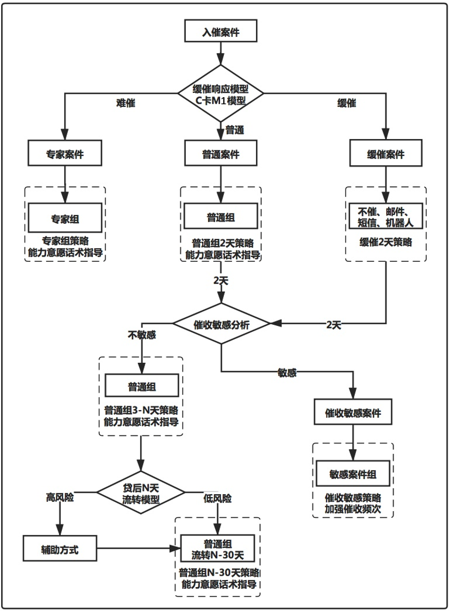
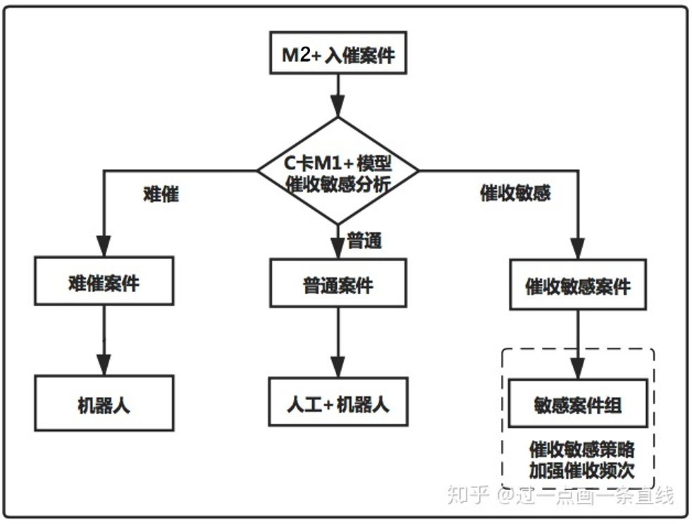

##	互金风控

-	互金相对传统金融风控有更多挑战
	-	模型迭代速度要求高
		-	互金市场波动剧烈
		-	长尾劣质客群更不稳定，容易导致样本波动
	-	数据源采集种类更多
		-	弱相关数据更多，处理难度更大
		-	政策合规要求，数据采集和使用更规范

-	风控技术无关强弱，关键只在于“是否有效”
	-	时机选择
	-	制度安排及辅助
	-	背后所驱动的支撑逻辑

-	风控领域，大数据等技术的应用场景和方向
	-	自动化，尽量减少人工干预，减少主观臆断
	-	实现“差异化”，客制化产品设计
		-	补全客户画像
		-	挖掘客户需求
	-	精准度，需要模型驱动
		-	交易成本评估
		-	差异化定价
		-	反欺诈
	-	创新型评估
		-	底层数据共享

###	风控策略

-	风控策略本质是规则集的逻辑组合
	-	在贷前审批阶段减少风险事件发生
	-	挽回风险事件发生的造成的损失
	-	筛选用户：过滤高风险用户t保留低风险用户
	-	对客群分级实行个性化审批流程，提高审批效率

-	广义看，策略也是一种模型
	-	模型通过算法挖掘数据学习规律、构造特征；而策略则是
		结合具体业务场景，依赖人工经验对客群细分，如决策树、
		笛卡尔积分群
	-	模型往往经过长时间稳定性验证，只有出现明显衰减时才会
		触发迭代；策略上线、下线灵活，可以根据近期样本灵活
		调整
	-	模型需要在策略中应用才能发挥效果

###	风险控制

-	信用风险：侧重风险管理，在风险和收益之间寻求平衡，追求
	利润最大化
	-	通过金融属性数据识别客户还款能力、意愿

-	欺诈风险：侧重严防拒绝，属于欺诈必然拒绝
	-	跟进欺诈风险事件，快速响应

-	反欺诈和信用顺序各有优劣，但是应该都做完之后得到综合授信
	决策
	-	反欺诈在后：欺诈后需要人工核验，处于成本考虑后置
	-	信用在后：希望进入模型的数据更真实，否则会欺骗模型
		造成错误决策

##	模型风险

> - 模型：应用统计、经济、金融或数学理论、技术和假设将输入
	数据处理为定量估计的量化方法、系统或途径

-	模型风险来源
	-	模型自身错误：模型设计、开发以及IT实施时发生的错误
		-	统计理论应用错误
		-	目标变量错误
		-	样本选择错误
		-	变量挑选、衍生错误
		-	算法错误
		-	在信息系统中执行与开发不一致
	-	模型被不恰当的使用
		-	模型套用
		-	市场环境、消费者行为习惯发生重大变化

-	美国监管部门围绕“有效挑战”指导原则，建立模型风险监管体系
	-	动力：挑战者必须在组织上相对独立于模型开发者，有正向
		激励挑战
	-	胜任力：挑战者具备相关专业知识和技能
	-	影响力：挑战者必须具备权威、组织内地位，来自更管理层
		的承诺和支持，保障被挑战方对其意见有足够重视

> - <https://mp.weixin.qq.com/s/95MVhXgyG9h5KqRphP14cA>

###	风险监管体系框架

-	第一防线
	-	模型开发者：开发、上线、使用、监控和维护模型，配合
		模型验证部门的独立验证工作
	-	管理维护者
	-	使用者
-	第二防线
	-	模型验证部门：独立验证模型
	-	模型风险监管部门：草拟、执行模型风险管理政策
-	第三防线
	-	内部审计：评估模型风险管理是否完整、严谨、有效
-	外部防线：政府监管
	-	美联储
	-	美国货币监理署

###	风险监管具体要求

####	*Model Inventory*模型清单

-	模型状态
-	模型目的、设计的目的产品、预期和实际使用的场景、使用限制
-	输入数据、组件的类型和来源
-	输出及其预期用途
-	模型运行状态、更新时间、政策例外
-	开发、验证负责人
-	已完成和计划当中的验证目的
-	有效期

####	*Model Development*模型开发

-	明确模型目的
	-	设计、理论、逻辑的研究支持
	-	模型组件、算法的优缺点
	-	与其他理论方法的比较
-	评估数据质量
	-	证明数据、信息适合模型
	-	替代数据需证明、记录
	-	对必要的数据跟踪分析，尤其是外部数据、新客群、
		新产品
-	测试确保符合预期
	-	准确性
	-	鲁棒性
	-	稳定性

####	*Model Implementatioin and Model Use*

-	模型实施的需要有严谨的校验规范，保证上线模型与开发模型
	一致
	-	结果（包括中间结果）一致
	-	底层数据一致
	-	计算逻辑一致
-	模型使用可以进一步评估模型性能
	-	模型使用者反馈模型使用情况、业务契合度
	-	业务经理评估模型背后的方法、假设
	-	其他利益不相关部门建议
-	模型的业务决策报表应清晰易懂
	-	决策者和建模者知识背景可能不同
	-	需要包含足够的输入、输出示例，充分展示模型各个维度

####	*Model Validation*

-	模型验证须由专业、独立的模型验证团队执行
	-	有动力
	-	有胜任力
	-	有影响力
-	验证范围须包括模型所有组件
	-	输入
	-	处理
	-	报告
-	验证的严格性、复杂性应与以下相适应
	-	模型使用量
	-	模型复杂性
	-	模型重要性
	-	业务规模和复杂性

#####	模型验证分类

-	*Initial Validation*初始验证：首次使用前的验证
	-	根据模型的缺陷选择是否接受
	-	由于其他原因无法验证，应该记录在案，并通过其他补偿性
		控制减轻模型不确定性

-	*On-going Validation*持续验证：模型投入使用后持续进行的
	验证
	-	跟踪已知问题并识别任何新的问题
	-	确保市场、产品、风险敞口、活动、客户、业务实践不会
		造成新的模型问题

-	*Model Review*定期复查
	-	确定模型是否正常工作且现有的验证活动是否足够

#####	验证框架要素

-	概念健全性评估：模型设计、构造的质量
	-	审查相关文件与实践证据，确保模型设计、建造中使用的
		方法、判断、变量选择有充分信息、经过仔细考虑，且与
		已发表的研究和成功行业实践一致

-	结果分析，比较模型输出与实际结果，分析模型性能
	-	各种量化、非量化的测试分析技术都有弱点，应根据模型
		选择适当、一系列结果分析
	-	量化结果有助于评估判断专家判断的质量、新旧模型性能
		差距
	-	结果分析应持续进行
	-	除用保留样本（训练样本时间段内）分析模型性能外，还
		需要使用训练样本时间段外样本进行*back-testing*

-	敏感性分析，检查模型的稳定性、鲁棒性

####	*Model Monitoring*

-	模型监控频率应与模型性质、新数据或建模方法的可用性，涉及
	的风险程度相匹配

-	开发阶段发现的模型局限应在持续监控中定期评估

-	*Processing Verification*过程检验，检查所有模型组件是否
	按设计运行
-	*Benchmarking*基准检验，与外部数据、模型进行比较

##	贷后管理

-	入催：当前逾期
	-	忘记还款日逾期：轻微提醒即还款
	-	习惯性逾期：轻微提醒、人工催收提醒即还款
	-	资金困难，还款能力低：普遍回款率低
		-	多头借贷高负债：还款意愿低，需要较强催收策略
		-	暂时失去收入能力：还款意愿不差，但出催时间较久
	-	有还款能力但不还：需较强催收策略提高还款意愿
	-	欺诈：首逾，贷后没有解决办法

-	出催：结清逾期账单

###	AB-Test划分客户

-	步骤
	-	为各类客户设置有针对性的特别催收策略
	-	结合模型、规则初步初步设置筛选条件
		-	筛选出该类型客户
		-	将该类型客户分群A、B组
	-	在A组应用一般催收策略、在B组应用针对性策略，比较策略
		出催效果
		-	针对性策略确定情况下，评估客户筛选条件
		-	客户筛选条件给定的条件下，评估针对性策略

###	M1客户

-	对大部分公司的客群而言，M1阶段出催概率最大
	-	此阶段较为重要，可设置多个模型重点学习不同客群规律
	-	对不同客群施行不同催收策略，提高出催成功率

-	缓催响应人群：出于遗忘造成的逾期
	-	在较短的缓催期内，简单的催收动作、或不催收即出催，
		降低人力成本
		-	不催
		-	短信提醒
		-	邮件提醒
		-	机器人催收
	-	对缓冲人群内部，可以通过不断*AB-Test*细分缓催人群
		-	在不同时间段设置不同缓催方式
		-	为不同人群设置不同缓催方式

-	非缓催人群
	-	按出催难易程度，区分为普通案件、专家案件（难催用户）
		-	难催客户入催早期还款概率远高于后期，在入催初期
			即交由经验丰富
	-	对还款能力、还款意愿分析，应用不同话术和催收策略
		-	还款能力、还款意愿分析主要是根据特征变量设置
		-	对还款能力差而还款意愿强的客户，可通过延期等方式
			提升用户体验
		-	对还款意愿弱的客户，通过催收动作提高还款意愿
	-	对催收敏感程度分析
		-	对催收动作敏感的人群，即催收动作越强，还款概率
			越高，可以加强催收频率

###	M2+客户

-	M2+客户催出概率较低
	-	若无特殊原因影响，发生过M2+用户需要重点关注
		-	委外处理会损失资金
		-	通过模型预测更易出催的客户，精细化人力管理
	-	为精细化催收可以构建多个阶段模型
		-	样本充足的情况下可以分别构建M2、M3模型
		-	样本不够时，则可以构建M2+模型，不断积累决策、
			建模样本
	-	分析出催难易程度、催出敏感程度不同的客群，施行不同
		催收策略

