##	深度学习CTR

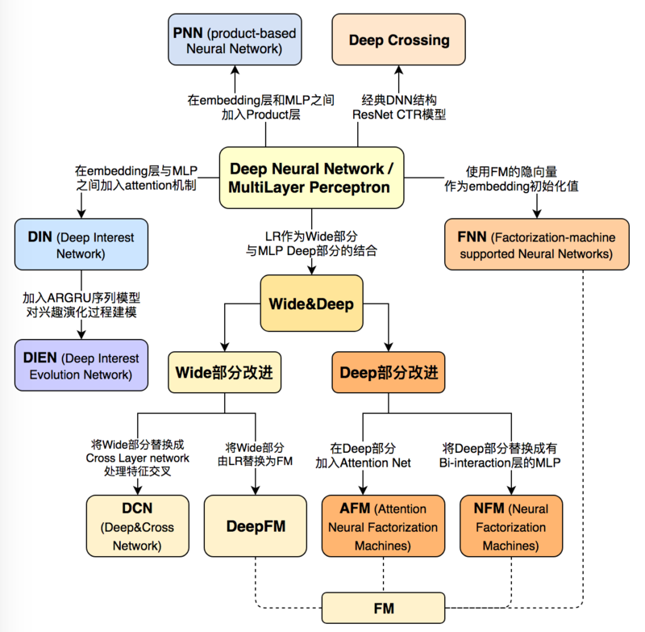

##	Deep Crossing

*Deep Crossing*：深度学习CTR模型最典型、基础性模型

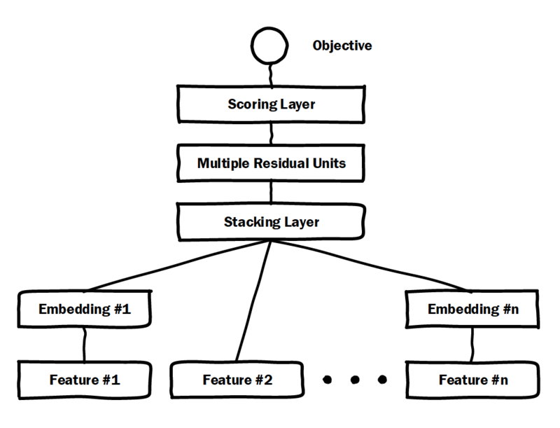

> - *multiple residual units*：残差网络

##	Factorization Machine based Neural Network

*FNN*：使用FM隐层作为embedding向量，避免完全从随机状态训练
embedding

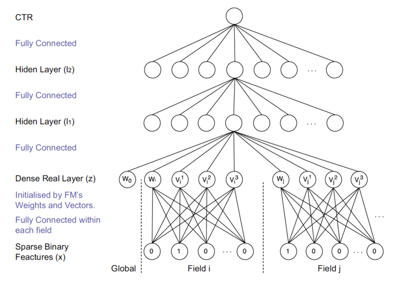

-	输入特征为高维稀疏特征，embeddingd层与输入层连接数量大、
	训练效率低、不稳定

-	提前训练embedding提高模型复杂度、不稳定性

##	Product-based Neural Network

*PNN*：在embedding层、全连接层间加入*product layer*，完成
针对性特征交叉

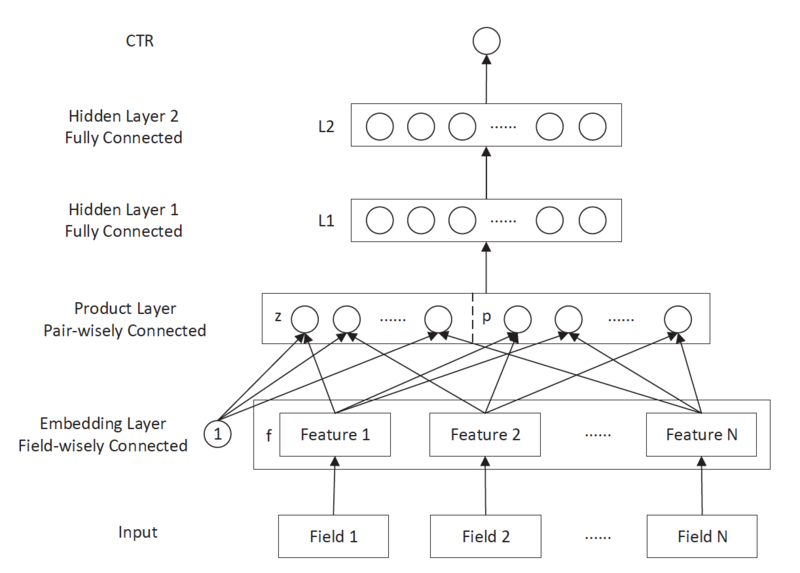

> - *product layer*：在不同特征域间进行特征组合，定义有
	inner、outer product以捕捉不同的交叉信息，提高表示能力

> - 传统DNN中通过多层全连接层完成特征交叉组合，缺乏针对性
> > -	没有针对不同特征域进行交叉
> > -	不是直接针对交叉特征设计

##	Wide&Deep Network

*Wide&Deep*：结合深层网络、广度网络平衡记忆、泛化

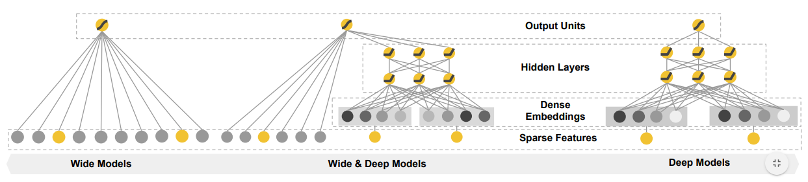

> - *deep models*：基于稠密embedding前馈神经网络
> - *wide models*：基于稀疏特征、特征交叉、特征转换线性模型

-	基于记忆的推荐通常和用户已经执行直接相关；基于泛化的推荐
	更有可能提供多样性的推荐

> - *memorization*：记忆，学习频繁出现的物品、特征，从历史
	数据中探索相关性
> - *generalization*：泛化，基于相关性的transitivity，探索
	较少出现的新特征组合

> - <https://arxiv.org/pdf/1606.07792.pdf>
> - wide&deep系模型应该都属于stacking集成

###	Google App Store实现

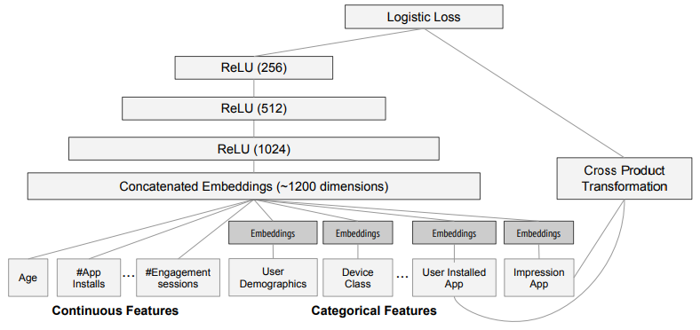

$$
P(Y=1|x) = \sigma(w_{wide}^T[x, \phi(x)] + w_{deep}^T
	\alpha^{l_f} + b)
$$

-	wide部分：*cross product transformation*
	-	输入
		-	已安装Apps
		-	impression Apps
		-	特征工程交叉特征
	-	优化器：带L1正则的FTRL

-	Deep部分：左侧DNN
	-	输入
		-	类别特征embedding：32维
		-	稠密特征
		-	拼接：拼接后1200维
			（多值类别应该需要将embedding向量平均、极大化）
	-	优化器：AdaGrad
	-	隐层结构
		-	激活函数relu优于tanh
		-	3层隐层效果最佳
		-	隐层使用塔式结构

##	DeepFM

*DeepFM*：用FM替代*wide&deep*中wide部分，提升其表达能力

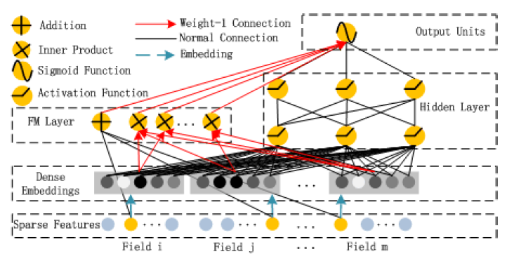

> - *Dense Embeddings*：FM中各特征隐向量，FM、DNN公用
> - *FM Layer*：FM內积、求和层

$$\begin{align*}
y_{FM} & = <w, x> + \sum_i \sum_j <v_i, v_j> x_i x_j + b \\
\hat y_{DeepFM} & = \sigma(y_{FM} + y_{DNN})
\end{align*}$$

-	特点（和Wide&Deep关键区别）
	-	wide部分为FM
		（deep&wide中wide部分有特征交叉，但依靠特征工程实现）
	-	FM、DNN部分共享embedding层

-	同时组合wide、二阶交叉、deep三部分结构，增强模型表达能力
	-	FM负责一阶特征、二阶特征交叉
	-	DNN负责更高阶特征交叉、非线性

###	实现

-	DNN部分隐层
	-	激活函数relu优于tanh
	-	3层隐层效果最佳
	-	神经元数目在200-400间为宜，略少于Wide&Deep
	-	在总神经元数目固定下，constant结构最佳

-	embedding层
	-	实验中维度为10

##	Deep&Cross Network

*Deep&Cross*：用cross网络替代*wide&deep*中wide部分，提升其
表达能力

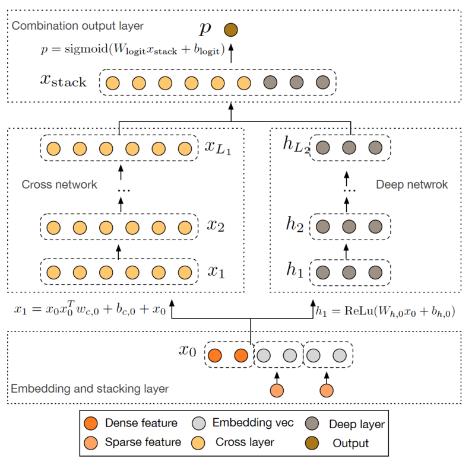

-	特点（和WDL、DeepFM区别）
	-	使用交叉网络结构提取高阶交叉特征
		-	无需特征工程（WDL）
		-	不局限于二阶交叉特征（DeepFM）

-	交叉网络可以使用较少资源提取高阶交叉特征

<https://arxiv.org/pdf/1708.05123.pdf>

###	交叉网络

交叉网络：以有效地方式应用显式特征交叉，由多个交叉层组成

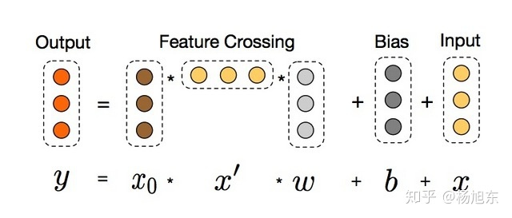

$$\begin{align*}
x_{l+1} & = f(x_l, w_l, b_l) + x_l \\
& = x_0 x_l^T w_l + b_l + x_l
\end{align*}$$

> - $x_l$：第$l$交叉层输出
> - $w_l, b_l$：第$l$交叉层参数

-	借鉴残差网络思想
	-	交叉层完成特征交叉后，会再加上其输入
	-	则映射函数$f(x_l, w_l, b_l)$即拟合残差

-	特征高阶交叉
	-	每层$x_0 x_l^T$都是特征交叉
	-	交叉特征的阶数随深度$l$增加而增加，最高阶为$l+1$

-	复杂度（资源消耗）
	-	随输入向量维度、深度、线性增加
	-	受益于$x_l^T w$为标量，由结合律无需存储中间过程矩阵

##	Nueral Factorization Machine

*NFM*：用带二阶交互池化层的DNN替换FM中二阶交叉项，提升FM的
非线性表达能力

$$\begin{align*}
\hat y_{NFM}(x) & = w_0 + \sum_{i=1}^m w_i x_i + f_{DNN}(x) \\
& = w_0 + \sum_{i=1}^m + h^T f_{\sigma}(f_{BI}(\varepsilon_x))
\end{align*}$$

> - $f_{DNN}(x)$：多层前馈神经网络，包括*Embedding Layer*、
	*Bi-Interaction Layer*、*Hidden Layer*、
	*Prediciton Layer*
> - $h^T$：DNN输出层权重

###	模型结构

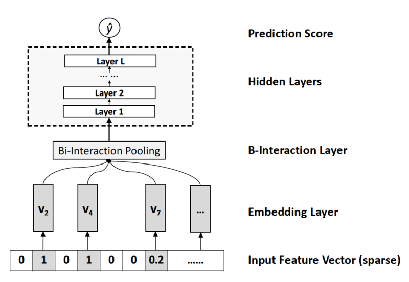

####	*Embedding Layer*

全连接网络：将每个特征映射为稠密向量表示

$$
\varepsilon_x = \{x_1v_1, x_2v_2, \cdots, x_mv_m\}
$$

> - $v_i$：$k$维embedding向量

-	只需要考虑非0特征，得到一组特征向量
-	特征向量会乘以特征值以反映真实值特征
	（一般embedding特征取0/1，等价于查表）

####	*Bi-Interaction Layer*

BI层：将一组embedding向量转换为单个向量

$$\begin{align*}
f_(BI)(\varepsilon_x) & = \sum_{i=1} \sum_{j=i+1}
	x_i v_i \odot x_j v_j \\
& = \frac 1 2 (\|\sum_{i=1}^m x_i v_i\|_2^2 -
	\sum_{i=1}^m \|x_i v_i\|_2^2)
\end{align*}$$

> - $\odot$：逐元素乘积

-	没有引入额外参数，可在线性时间$\in O(kM_x)$内计算
-	可以捕获在低层次二阶交互影响，较拼接操作更
	informative，方便学习更高阶特征交互

> - 将BI层替换为拼接、同时替换隐层为塔型MLP（残差网络）
	则可以得到*wide&deep*、*DeepCross*
> - 拼接操作不涉及特征间交互影响，都交由后续深度网络学习
	，实际操作中比较难训练

####	*Hidden Layer* 

隐层：普通多层嵌套权重、激活函数

$$
f_{\sigma} = \sigma_l(\beta_l (\cdot 
	\sigma_1(\beta_l f_{BI}(\varepsilon_X) + b_1)) + b_l)
$$

> - $l=0$没有隐层时，$f_{\sigma}$原样输出，取$h^T$为
	全1向量，即可得FM模型

##	Attentional Factorization Machines

*AFM*：引入Attention网络替换FM中二阶交互项，学习交互特征的
重要性，剔除无效的特征组合（交互项）

$$\begin{align*}
\hat y_{AFM} & = w_0 + \sum_{i=1}^m w_i x_i +
	f_{AFM}(\varepsilon) \\
& = w_0 + \sum_{i=1}^m w_i x_i + p^T \sum_{i=1}^m \sum_{j=i+1}^m
	a_{i,j} (v_i \odot v_j) x_i x_j
\end{align*}$$

> - $\varepsilon$：隐向量集，同上
> - $p^T$：Attention网络输出权重

###	模型结构

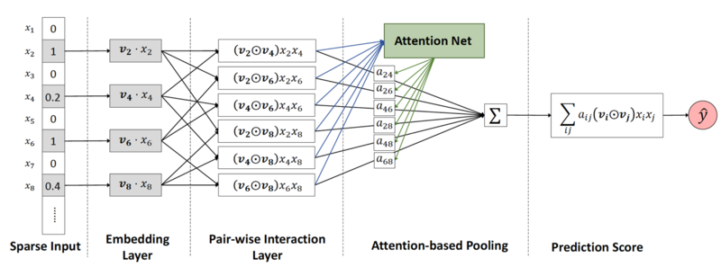

####	*Pair-Wise Interaction Layer*

成对交互层：将m个embedding向量扩充为$m(m-1)/2$个交互向量

$$
f_{PI}(\varepsilon) = \{(v_i \odot v_j) x_i x_j\}_{(i,j) \in R_X}
$$

> - $R_X = \{(i,j) | i \in X, j \in X, j > i \}$
> - $v_i$：$k$维embedding向量

####	*Attention-based Pooling*

注意力池化层：压缩交互作用为单一表示时，给交互作用赋不同权重

$$\begin{align*}
f_{Att}(f_{PI}(\varepsilon)) = \sum_{(i,j) \in R_X}
	a_{i,j} (v_i \odot v_j) x_i x_j
\end{align*}$$

> - $a_{i,j}$：交互权重$w_{i,j}$的注意力得分
> - $\odot$：逐元素乘积

-	考虑到特征高维稀疏，注意力得分不能直接训练，使用MLP
	*attention network*参数化注意力得分

	$$\begin{align*}
	a_{i,j}^{'} & = h^T ReLU(W((v_i \odot v_j) x_i x_j) + b) \\
	a_{i,j} & = \frac {exp(a_{i,j}^{'})}
		{\sum_{(i,j) \in R_X} exp(a_{i,j}^{'})}
	\end{align*}$$

	> - $W \in R^{t*k}, b \in R^t, h \in R^T$：模型参数
	> - $t$：attention network隐层大小

##	Deep Interest Network

*DIN*：融合Attention机制作用于DNN

###	模型结构

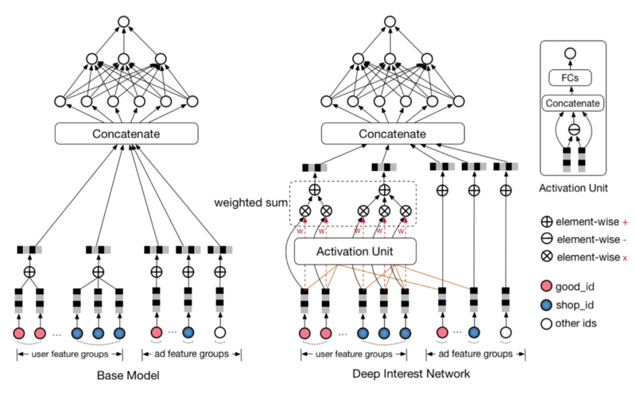

####	*activation unit*

激活单元

$$\begin{align*}
v_U(A) & = f_{au}(v_A, e_1, e_2, \cdots, e_H) \\
& = \sum_{j=1}^H a(e_j, v_A) e_j \\
& = \sum_{j=1}^H w_j e_j
\end{align*}$$

> - 相较于上个结构仅多了直接拼接的用户、上下文特征
	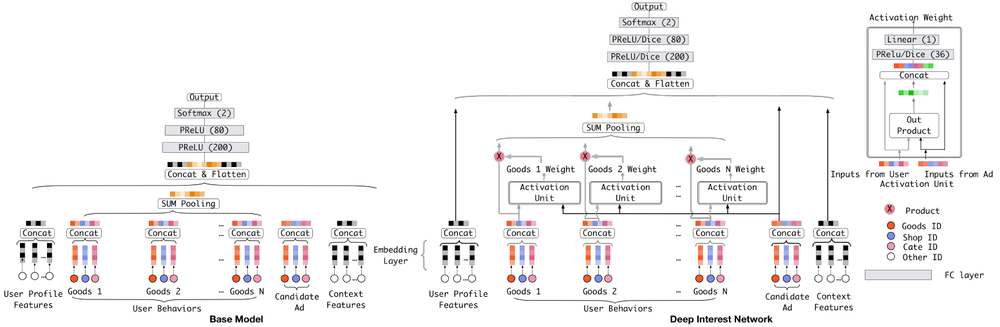

###	模型训练

####	Mini-batch Aware Regularization

> - 以Batch内参数平均近似$L_2$约束

$$\begin{align*}
L_2(W) & = \sum_{i=1}^M \sum_{j=1}^B \sum_{(x,y) \in B_j}
	\frac {I(x_i \neq 0)} {n_i} \|W_i\|_2^2 \\
& \approx \sum_{i=1}^M \sum_{j=1}^B \frac {\alpha_{j,i}} {n_i}
	\|W_i\|_2^2
\end{align*}$$

> - $W \in R^{K * M}, W_i$：embedding字典、第$i$embedding
	向量
> - $K, M$：embedding向量维数、特征数量
> - $B, B_j$：batch数量、第$j$个batch

-	则参数迭代

	$$
	W_i \leftarrow w_j - \eta[\frac 1 {|B_j|} \sum_{(x,y) \in B_j}
		\frac {\partial L(p(x), y)} {\partial W_j} + \lambda
		\frac {\alpha_{j,i}} {n_i} W_i]
	$$

####	Data Adaptive Activation Function

$$\begin{align*}
f(x) & = \left \{ \begin{array}{l}
		x, & x > 0 \\
		\alpha x, & x \leq 0
	\end{array} \right. \\
& = p(x) * x + (1 - p(x)) * x \\
p(x) & = I(x > 0)
\end{align*}$$

PReLU在0点处硬修正，考虑使用其他对输入自适应的函数替代，以
适应不同层的不同输入分布

$$
p(x)  \frac 1 {1 + exp(-\frac {x - E[x]} {\sqrt{Var[x] + \epsilon}})}
$$

##	Deep Interest Evolution Network

*DIEN*：引入序列模型AUGRU模拟行为进化过程

###	模型结构

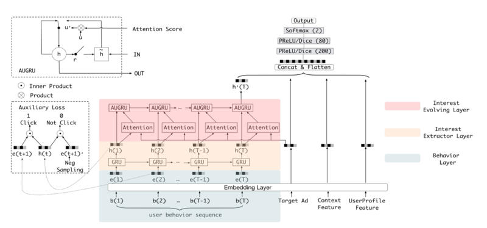

-	*Interest Extractor Layer*：使用GRU单元建模历史行为依赖
	关系

?
	关系

