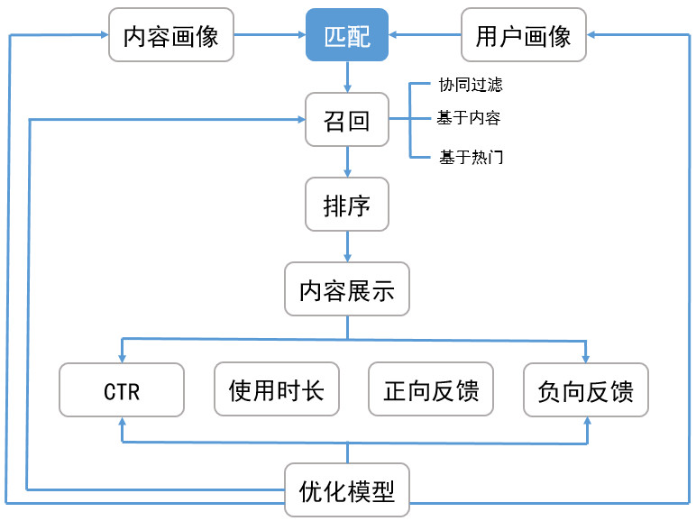

##	推荐系统架构

###	Matching

召回算法Match：包含多个渠道的召回模型，希望从资源库中选取
多样性偏好内容，缩小排序目标

-	协同过滤
-	主题模型
-	内容召回
-	热点召回

###	Ranking

排序：对多个召回渠道内容打分、排序、选出最优的少量结果

-	若召回结果仍包含大量数据，可以考虑分为两个阶段
	-	粗排：进一步剔除召回结果
	-	精排：对粗排结果再次打分、排序，得到最终推荐结果

##	Collaborative Filtering-Based Recommendation

基于协同过滤推荐算法：推荐算法中主流

-	模型一般为n个物品、m个用户的表
	-	只有部分用户、物品之间有评分数据
	-	要用已有部分稀疏数据预测空白物品、数据之间评分关系，
		推荐高评分物品

-	无需太多特定领域的知识，可通过基于统计的机器学习算法得到
	较好推荐效果，可以分为
	-	基于用户
	-	基于物品
	-	基于模型

> - 现在指推荐算法一般指协同过滤，其他基于内容、规则、人口
	统计信息等都被包含/忽略

###	User-based

基于用户协同过滤：主要考虑用户之间相似度，找出相似用户、相似
用户喜欢的物品，预测目标用户对对应物品的评分，推荐高评分物品

-	特点：（相较于Item-Based）推荐**更社会化**
	-	反映用户所在小型兴趣群体中物品热门程度
	-	可帮助用户找到**新类别、惊喜**物品

-	适合场景
	-	用户数量较少、变化慢场合，否则更新、计算用户相似度矩阵
		代价大
	-	时效性强、用户个性化兴趣不明显领域
	-	无需给出推荐解释
	-	示例
		-	新闻推荐：注重热门、时效、item更新快
		-	热点视频推荐

-	方法
	-	基于规则：大众型推荐方法，如：最多用户点击、浏览
	-	基于人口统计信息：简单根据用户基本信息发现用户相关
		程度、推荐
	-	混合推荐
		-	结合多个推荐算法，集成算法推荐结果
		-	复杂度高

###	Item-Based Collaborative Filtering

基于项目协同过滤：考虑物品和物品之间的相似度，找到目标用户
对某些物品的评分，预测用户对相似度高的类似物品评分，推荐高
评分相似物品

-	特点：（相较于User-Based）推荐**更个性化**
	-	反映用户自身的兴趣传承
	-	可帮助用户深入挖掘自身兴趣
	-	准确度一般
	-	推荐多样性弱，难以带来惊喜

-	适合场景
	-	物品数量较少、变化慢场合，否则更新、计算物品相似度
		矩阵代价大
	-	长尾物品丰富、个性化需求不明显
	-	需要向用户给出推荐理由
	-	示例
		-	电商
		-	电影：兴趣持久、更个性化

###	Model-Based Collaborative Filtering

基于模型：目前最主流的协同过滤类型

-	关联算法：找出用户-物品数据里频繁出现的项集，作频繁集
	挖掘，推荐频繁集、序列中其他物品
	-	*Apriori*
	-	*FPTree*
	-	*PrefixSpan*

-	聚类算法：按照用户、物品基于一定距离度量聚类，推荐高评分
	同类物品、同类人群
	（类似于基于用户、物品协同过滤）
	-	*K-means*
	-	*BIRCH*
	-	*DBSCAN*
	-	*Spectral Clustering*

-	分类算法：使用分类模型划分物品
	-	逻辑回归
	-	朴素贝叶斯

-	回归算法：使用回归模型给物品预测打分，较分类更平滑
	-	线性回归
	-	决策树
	-	SVM

-	矩阵分解：对用户-物品评分矩阵进行分解
	-	FunkSVD
	-	BiasSVD
	-	SVD++

> - 还有基于图模型、神经网络等新模型
> - 还有依赖于自然语言处理NLP，通过挖掘文本内容特征，得到
	用户的偏好，进而做推荐，同样可以找到用户独特的小众喜好

