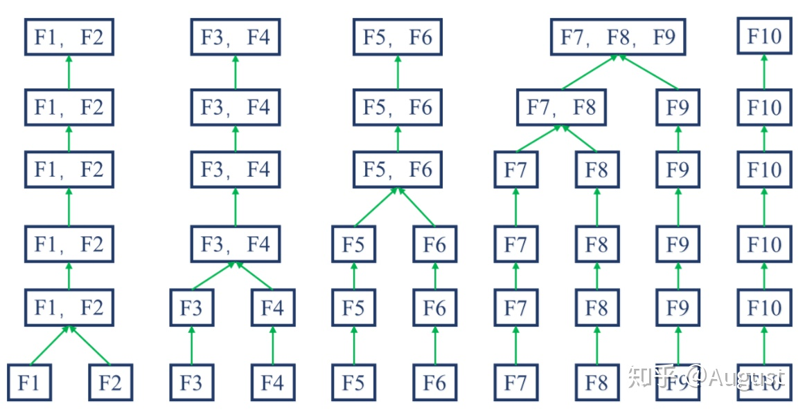

##	*Ordinal Encoding*

序号编码：使用一位序号编码类别

-	一般用于处理类别间具有大小关系的数据
	-	编码后依然保留了大小关系

##	*One-hot Encoding*

独热编码：采用N位状态位对N个可能取值进行编码

-	一般用于处理类别间不具有大小关系的特征

-	独热编码后**特征表达能力变差**，特征的预测能力被人为拆分
	为多份
	-	通常只有部分维度是对分类、预测有帮助，需要借助特征
		选择降低维度

###	优点

-	能处理非数值属性
-	一定程度上扩充了特征
-	编码后向量时稀疏向量：可以使用向量的稀疏存储节省空间
-	能够处理缺失值：高维映射方法中增加维度表示缺失

###	缺点

-	k-NN算法：高维空间两点间距离难以有效衡量

-	逻辑回归模型：参数数量随维度增加而增大，增加模型复杂度，
	容易出现过拟合

-	决策树模型
	-	产生样本切分不平衡问题，切分增益非常小
		-	每个特征只有少量样本是1，大量样本是0
		-	较小的拆分样本集占总体比例太小，增益乘以所占比例
			之后几乎可以忽略
		-	较大拆分样本集的几乎就是原始样本集，增益几乎为0
	-	影响决策树的学习
		-	决策树依赖数据统计信息，独热编码将数据切分到零散
			小空间上，统计信息不准确、学习效果差
		-	独热编码后特征表达能力边人为拆分，与其他特征竞争
			最优划分点失败，最终特征重要性会比实际值低

##	*Binary Encoding*

二进制编码：先用序号编码给每个类别赋予类型ID，然后将类别ID
对应二进制编码作为结果

-	本质上利用二进制类别ID进行哈希映射，得到0/1特征向量
-	特征维度小于独热编码，更节省存储空间

##	二元化

二元化：将数值型属性转换为布尔型属性

-	通常用于假设属性取值分布为伯努利分布
-	方法：对特征指定阈值，特征值大于等于阈值取1，否则取0
	-	阈值是关键超参数，取值需要结合模型、具体任务选择

##	*Weight of Evidence Encoding*

WOE编码：以分类变量各取值的WOE值作为编码值

$$\begin{align*}
WOE_i & = log(\frac {\%B_i} {\%G_i}) \\
& = log(\frac {\#B_i / \#B_T} {\#G_i / \#G_T})
\end{align*}$$

> - $\%B_i, \%G_i$：分类变量取第$i$值时，预测变量为B类、G类占
	所有B类、G类比例
> - $\#B_i, \#B_T$：分类变量取第$i$值时，预测变量为B类占所有
	B类样本比例
> - $\#G_i, \#G_T$：分类变量取第$i$值时，预测变量为G类占所有
	G类样本比例

-	WOE编码是有监督的编码方式，可以衡量分类变量各取值中
	-	B类占所有B类样本比例、G类占所有G类样本比例的差异
	-	B类、G类比例，与所有样本中B类、G类比例的差异

-	WOE编码值能体现分类变量取值的预测能力，变量各取值WOE值
	方差越大，变量预测能力越强
	-	WOE越大，表明该取值对应的取B类可能性越大
	-	WOE越小，表明该取值对应的取G类可能性越大
	-	WOE接近0，表明该取值预测能力弱，对应取B类、G类可能性
		相近

###	优势

-	相较于*one-hot*编码
	-	特征数量不会增加，同时避免特征过于稀疏、维度灾难
	-	避免特征筛选过程中，一部分特征取值被筛选，一部分被
		遗弃，造成特征不完整
	-	将特征规范到**同一尺度**的数值变量，同时也便于分析
		特征间相关性

-	在LR模型中，WOE编码线性化赋予模型良好的解释性
	-	WOE编码本身即可反应特征各取值贡献
	-	可以用于给评分卡模型中各分箱评分

##	直方图化

直方图化：将连续的数值属性转换为离散的数值点

-	连续特征一般对预测结果影响不会突变，合理的离散化不会造成
	他特征传递信息能力丢失
	-	另外这也是线性模型的基本假设，若特征存在突变，线性
		模型同样难以拟合
	-	此时应该离散化为多个分类特征，方便引入非线性

-	一般**等频分组**而不是等距分组
	-	避免离散化后特征仍然为长尾分布、大量特征集中在少量桶
		中，对数据区分能力弱
	-	当然也可以根据经验划分区间、指定各组取值

###	优势

-	模型更稳健
	-	对异常值更稳健

-	特征取值可以指定为整形
	-	方便计算、存储
	-	尤其适合树类模型，方便节点划分

###	分桶

分桶：离散化/直方图化常用方法

-	步骤
	-	将样本在连续特征上取值从小到大排列
	-	从小到大依次选择分桶边界，其中分桶数量以及每个桶大小
		都是超参数
	-	根据样本特征取值划分为相应桶内
-	桶数量、边界超参需要人工指定
	-	根据业务领域经验指定
	-	根据模型指定：根据具体任务训练分桶之后的数据集，通过
		超参数搜索确定最优分桶数量、边界
-	分桶经验、准则
	-	桶小大必须足够小：桶内属性取值对样本标记影响在不大
		范围内
	-	桶大小必须足够大：每个桶内有足够样本，否则随机性太大
		，不具有统计意义上说服力
	-	**等频分桶**：桶内样本尽量分布均匀

##	离散化

离散化：将连续的数值属性转换为分类属性

-	一般**等频分组**而不是等距分组
	-	避免离散化后特征仍然为长尾分布、大量特征集中在少量桶
		中，对数据区分能力弱

-	模型使用离散特征、连续特征，是“海量离散特征+简单模型”、
	“少量连续特征+复杂模型”的权衡
	-	**海量离散特征+简单模型**：难点在于特征工程，成功
		经验可以推广，可以多人并行研究
	-	**少量连续特征+复杂模型**：难点在于模型调优，不需要
		复杂的特征工程

###	优势

> - 将连续特征分桶，每个桶对应新分类变量不同取值

-	方便工业应用、实现
	-	离散特征的增加、减少容易，方便模型迭代
	-	特征离散化处理缺失值、异常值更方便
	-	离散后特征可以用*one-hot*编码为为稀疏向量
		-	內积速度快
		-	存储方便
		-	容易扩展

-	方便引入历史经验
	-	可以自由调整离散化结果，结合机器学习和历史经验得到
		最终的离散化结果

-	模型更稳健
	-	模型不再拟合特征具体值，而是拟合某个概念，能够对抗
		数据扰动，更稳健
	-	对异常数据鲁棒性更好，降低模型过拟合风险
	-	某些场合需要拟合参数值更少，降低模型复杂度

-	（引入）非线性提升模型表达能力
	-	利用经验、其他信息将数值特征分段，相当于
		**引入非线性**，提升线性模型表达能力
	-	方便引入交叉特征，提升模型表达能力

###	适合场景

-	离散化特征更适合LR等线性模型
	-	如下离散化优势：方便引入非线性等
	-	模型中所有特征都会被考虑，考虑细节、个体
		（包括$L_1$范数也是被考虑后剔除）

-	GBDT等非线性模型则不适合
	-	特征离散化后，由于抽样误差的存在，可能存在某些离散
		特征对**样本预测能力非常强**，非线性模型容易给这些
		特征更大权重，造成过拟合
		-	如：刚好抽取的1000个样本中某离散特征取值为1者
			全为正样本
	-	树模型每次使用一个特征划分节点，特征数量较多不利于
		模型训练
		-	若单个离散化特征预测能力不强，由于树深度限制，
			只有少量特征被作为划分依据，模型可能不收敛、表达
			能力更差
		-	若单个离散化特征预测能力强，连续特征也应该也有
			较好效果

##	无监督分箱

> - 等频分箱：将特征排序之后，将自变量等分为K部分，每个部分
	作为一个分箱
> - 等距分箱：将特征排序之后，将自变量取值范围等分为K部分，
	每个部分作为一个分箱
> - 聚类分箱：用K-means、层次聚类方法将特征聚为K类，聚类过程
	中需要保证分箱有序

-	无监督分箱仅仅考虑特征自身数据结构，没有考虑特征与目标
	之间的关系，因此无监督分箱不一定会带来性能提升

##	有监督分箱

###	Split分箱

-	Split分箱：自上而下、基于分裂的数据离散化方法
	-	类似决策树使用IG、Gini指数、IV值等作为划分点选择指标

###	Merge分箱

-	Merge分箱：自底向上、基于合并的数据离散化方法

####	Chimerge

-	Chimerge：使用卡方值衡量两个相邻区间是否具有类似分布，
	若具有类似分布则将其合并

#####	具体算法

> - 输入：目标分箱数量$N$
-	初始化
	-	将变量升序排列
	-	为减少计算量，若初始分箱数量大于阈值$N_{max}$，则
		利用等频分箱进行粗分箱
	-	缺失值单独作为一个分箱
-	合并区间
	-	计算每对相邻区间的卡方值
	-	将卡方值最小区间合并
	-	重复以上直至分箱数量不大于$N$
-	分箱后处理
	-	合并纯度为1（只含有某类样本）的分箱
	-	删除某类样本占比超过95%的分箱
	-	若缺失值分箱各类样本占比同非缺失值分箱，则合并

