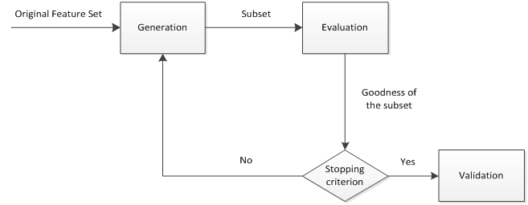

##	*Feature Selection*

特征选择：从特征集合中选择**最具统计意义**的特征子集

> - *relevant feature*：相关特征，对当前学习任务有用的属性、
	特征
> > -	特征选择最重要的是确保不丢失重要特征
> - *irrelevant feature*：无关特征，对当前学习任务无用的
	属性、特征
> - *redundant feature*：冗余特征，包含的信息可以由其他特征
	中推演出来
> > -	冗余特征通常不起作用，剔除可以减轻模型训练负担
> > -	若冗余特征恰好对应完成学习任务所需要的中间概念，则
		是有益的，可以降低学习任务的难度

-	特征选择会降低模型预测能力，因为被剔除特征中可能包含有效
	信息
	-	保留尽可能多特征，模型性能会提升，模型更复杂、计算
		复杂度同样提升
	-	剔除尽可能多特征，模型性能会下降，模型更简单、降低
		计算复杂度

-	特征选择原因
	-	维数灾难问题：仅需要选择一部分特征构建模型，可以减轻
		维数灾难问题，从此意义上特征选择和降维技术有相似动机
	-	剔除无关特征可以降低学习任务难度，简化模型、降低计算
		复杂度

-	特征选择方法可以分解为
	-	特征子集搜索
	-	特征子集评价：能判断划分之间差异的机制都能作为
		特征子集的准则

###	特征选择过程

-	*generation procedure*：产生过程，搜索特征子集
-	*evaluation function*：评价函数，评价特征子集优劣
-	*stopping criterion*：停止准则，与评价函数相关的阈值，
	评价函数达到与阈值后可以停止搜索
-	*validation procedure*：验证过程，在验证数据集上验证选择
	特征子集的有效性

###	特征子集搜索

-	遍历：从初始特征集合选择包含所有重要信息的特征子集
	-	适合没有先验（问题相关领域）知识的情况
	-	特征数量稍多会出现组合爆炸

-	迭代：产生候选子集、评价优劣，基于评价结果产生下个候选
	子集
	-	不断迭代，直至**无法找到更好的后续子集**
	-	需要评价得子集数量较少
	-	可能无法找到最优子集

####	迭代搜索

-	给定特征$A=\{A_1, A_2, \cdots, A_d\}$，将每个特征视为
	候选子集（每个子集只有一个元素），对d个候选子集进行评价

-	在上轮选定子集中加入特征，选择包含两个特征的最优候选子集

-	假定在$k+1$轮时，最优特征子集不如上轮最优的特征子集，则
	停止生成候选子集，将上轮选定特征子集作为特征选择结果

> - *Forward Feature Elimination*：前向特征选择，逐渐增加
	相关特征
> - *Backward Feature Elimination*：后向特征选择，从完整特征
	集合开始，每次尝试去掉无关特征，逐渐剔除特征
> - *Bidirectional Feature Elimination*：双向特征选择，结合
	前向、后向搜索
> > -	每轮逐渐增加选定的相关特征，特征在后续迭代中确定不会被
		去除，同时减少无关特征

##	特征子集评价

特征子集评价：能判断划分之间差异的机制都能作为特征子集的选择
准则

-	方差
	-	方差越大，特征对预测值区分能力越强

-	相关系数
	-	Pearson积矩相关系数
	-	Kendell秩相关系数
	-	Spearman秩相关系数
	-	卡方统计量

-	距离指标

-	划分增益
	-	Gini指数
	-	IG信息增益/互信息
	-	信息增益比

##	*Filter*

过滤式：对数据集进行的特征选择过程与后续学习器无关，即设计
统计量过滤特征，不考虑后续学习器问题

-	通过分析特征子集内部特点衡量特征优劣，描述自变量、目标
	变量的关联

-	特点
	-	时间效率高
	-	对过拟合问题较稳健
	-	倾向于选择**单个**、**冗余**特征，没有考虑特征之间
		相关性

###	单特征过滤

单特征过滤：直接选择合适特征子集评价标准处理各特征，选择满足
要求特征

###	*Relief: Relavant Features*

Relief方法：设置相关统计量度量特征重要性

-	特征子集对应统计量中每个分量对应一个初始特征，特征子集
	重要性由子集中每个特征对应的相关统计量分量之和决定

-	特征选择方法
	-	指定阈值k：选择比k大的相关统计量分量对应特征
	-	指定特征个数m：选择相关统计量分量最大的m个特征

> - 只适合二分类问题，扩展变体*Relief-F*可以处理多分类问题

##	*Wrapper*

包裹式：把最终要使用的**学习器性能作为特征子集评价标准**，
为给定学习器选择最有利其性能、特化的特征子集

-	优点
	-	直接针对特定学习器进行优化
	-	考虑了特征之间的关联性，通常训练效果较过滤式好
-	缺点
	-	特征选择过程中需要多次训练学习器，计算效率较低
	-	观测数据较少时容易过拟合

###	*Las Vegas Wrapper*

*LVW*：在*Las Vegas Method*框架下使用随机策略进行子集搜索，
以最终分类器误差作为特征子集评价标准

-	包含停止条件控制参数T，避免每次子集评价训练特征子集开销
	过大
-	若初始特征数量很多、T设置较大、每轮训练时间较长，算法
	执行很长时间都不会停止
	-	LVM可能无法得到解（拉斯维加斯算法本身性质）

###	递归特征消除法

递归特征消除法：使用基模型进行多轮训练，每轮训练消除若干权值
系数的特征，再基于特征集进行下一轮训练

###	Stepwise变量选择

-	前向变量选择
-	后向变量选择
-	前向-后向变量选择
-	最优子集选择

##	*Embeded*

嵌入式：将特征选择、学习器训练过程融合，在同一优化过程中同时
完成，即学习器训练过程中自动进行特征选择

-	优点：兼具筛选器、封装器的优点
-	缺点：需要明确**好的选择**

###	正则化约束

$L_1$、$L_2$范数：主要用于线性回归、逻辑回归、SVM等算法

-	Ridge：$L_2$范数
-	Lasso：$L_1$范数
	-	除降低过拟合风险，还容易获得稀疏解
	-	参数$\lambda$越大，稀疏性越大，被选择特征越少
-	SVM、逻辑回归
	-	参数$c$越小，稀疏性越大，被选择特征越少

> - 参见*ml_techniques/#todo*

###	决策树

决策树思想：决策树自上而下选择分裂特征就是特征选择

-	所有树结点划分属性根据先后顺序组成的集合就是选择出来的
	特征子集

> - 参见*ml_models/unlinear_models/decision_tree*

###	神经网络

神经网络：训练时同时处理贡献度问题，不重要特征权重被剔除

