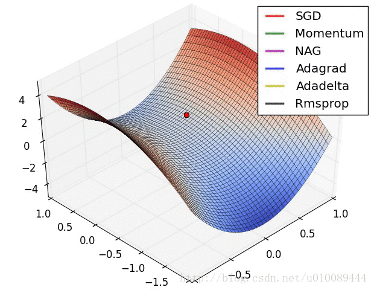

##	参数估计思路

对任意估计都可以找到合适损失函数（目标函数），使得其为损失
最小化的实例

-	所以大部分估计都可以使用迭代方法求解
-	只是有些估计本身容易得到解析解，所以不常用迭代方法

###	矩估计

-	需要**建立参数和总体矩的关系**：除非参数本身即为样本矩，
	否则基本无应用价值
-	应用场合
	-	均值：二次损失
		$\mathop{\arg\min}_{\mu} \sum_{i=1}^N (x_i - \mu)^2$
	-	方差：二次损失？？

###	极大似然估计

-	需要知道总体**概率分布形式**
-	应用场合
	-	估计回归参数：对数损失
		$\mathop{\arg\min}_{\beta} \sum_{i=1}^N lnP(y_i|x_i, \beta)$

###	最小二乘估计

-	需要模型**满足一定条件**估计性质才比较好
-	应用场合
	-	估计回归参数：平方损失
		$\mathop{\arg\min}_{\beta} \sum_{i=1}^N (y_i - f(x_i, \beta))^2$

###	带罚

-	调节损失函数（目标函数），需要和其他类型估计联合使用
-	应用场合
	-	岭回归：平方损失+$L_2$正则化
		$\mathop{\arg\min}_{\beta} \sum_{i=1}^N (y_i - f(x_i, \beta))^2 + \|\beta\|$
	-	LASSO：平方损失+$L_1$正则化
		$\mathop{\arg\min}_{\beta} \sum_{i=1}^N (y_i - f(x_i, \beta))^2 + \|\beta\|_1$

###	随机模拟

-	需要**设计随机模拟实验**估计参数
-	应用场合
	-	蒙特卡洛类似算法：随机化损失

###	迭代求解

-	损失函数定义不同

	-	包含样本量数量不同
	-	惩罚项设置不同

-	异步更新参数

	-	同时求解参数数量
	-	参数升维

-	更新方向

	-	梯度
	-	海瑟矩阵
	-	次梯度

-	更新方式

	-	叠加惯性
	-	动态学习率

##	样本量

###	*全局估计*

$$
\theta^{(t)} = \theta^{(t-1)} - \eta \bigtriangledown_\theta
	L_{total}(\theta_{(t-1)})
$$

> - $\theta^{(t)}$：第t步迭代完成后待估参数
> - $\eta$：学习率
> - $L_{total}(\theta) = \sum_{i=1}^N L(\theta, x_i, y_i)$：
	训练样本整体损失
> - $N$：训练样本数量

同时考虑所有训练样本

-	若损失函数有解析解、样本量不大，可**一步更新（计算）**
	完成（传统参数估计场合）
	-	矩估计
	-	最小二乘估计
	-	极大似然估计

-	无法一步更新完成者则需要迭代
	-	样本量较大场合
	-	并行计算

###	*Mini-Batch*

$$
\theta^{(t)} = \theta^{(t-1)} - \eta \bigtriangledown_\theta
	L_{batch}(\theta^{(t-1)})
$$

> - $L_{batch}(\theta)=\sum_{i \in B} L(\theta, x_i, y_i)$：
	当前batch整体损失
> - $B$：当前更新步中，样本组成的集合batch

每次使用部分训练样本更新参数（极小化目标函数）

-	优点

	-	适合样本量较大、无法使用样本整体估计使用

	-	一定程度能避免局部最优（随机batch可能越过局部极值）

	-	开始阶段收敛速度快

-	缺点

	-	受限于每次只使用单batch中样本更新参数，*batch-size*
		较小时，结果可能不稳定，往往很难得到最优解

	-	无法保证良好的收敛性，学习率小收敛速度慢，学习率过大
		则损失函数可能在极小点反复震荡

	-	对所有参数更新应用相同学习率，没有对低频特征有优化
		（更的学习率）

	-	依然容易陷入局部极小值

-	超参数

	-	选择适当学习率$\alpha$困难，太小学习率收敛速率缓慢，
		学习率过大则会造成较大波动

		-	可以采用模拟退火算法，在训练过程中调整学习率大小
			，即达到一定迭代次数、损失函数小于阈值时，减小
			学习速率

	-	`batch-size`太小时结果容易不稳定、波动较大，难以
		收敛

-	应用场合：基本所有模型估计中都有应用

> - batch-size为1时就是*Stochastic Gradient Descent*，但是
	SGD速度太慢、结果不稳定，一般不采用

##	异步更新参数

###	Changing Direction

每次更新**一个或几个**待估参数 

-	优点（某些算法）

	-	良好的并行特性：能够同时更新多个参数
		-	*Alternating Direction Method of Multipliers*

	-	采用贪心策略的算法：可能无法得到最优解

		-	前向回归
		-	深度学习：网络层次太深，有些算法采用*固化*部分
			网络结构，估计剩余部分

	-	能够平衡全局、局部：得到较好的解

		-	LARS

-	应用场合

	-	适合待估参数较少、同时估计较慢，待估参数较多可能更新
		速度慢，往往需要多次迭代更新参数
	-	一般用在机器学习算法中比较多

##	叠加惯性

模拟物体运动时惯性：指数平滑更新步

###	*Momemntum*

冲量方法：在**原始更新步**上叠加上次更新步，类似指数平滑

$$
v^{(t)} = \gamma v^{(t-1)} + (1 - \gamma) \eta
	\bigtriangledown_\theta L(\theta^{(t-1)}) \\
\theta^{(t)} = \theta^{(t-1)} - v^{(t)}
$$

> - $v^{(t)}$：第$t$步时第k个参数更新步
> - $L(\theta)$：往往是batch损失函数

-	更新参数时，一定程度**保持**上次更新方向
-	可以在一定程度上保持稳定性，学习速度更快
-	能够越过部分局部最优解

###	*Nesterov Momentum*

*NGA*：在使用冲量修正最终方向基础上，使用冲量对当前
**参数位置**进行修正，即使用“未来”位置计算梯度

-	先使用冲量更新一步
-	再在更新后位置计算新梯度进行第二步更新

$$
v^{(t)} = \gamma v^{(t-1)} + \eta \bigtriangledown_\theta
	L(\theta^{(t-1)} - \gamma v^{(t-1)}) \\

\theta^{(t)} = \theta^{(t-1)} - v^{(t)}
$$

##	动态学习率

-	数据比较稀疏时，adaptive方法效果较好

###	*Vanilla Gradient Descent*

每次迭代减小学习率$\eta$

$$
\eta^{(t)} = \frac \eta {\sqrt {t+1}} \\

\theta^{(t)} = \theta^{(t-1)} - \eta^{(t)}
	\bigtriangledown_\theta L(\theta^{(t-1)})
$$

-	学习率逐渐减小，避免学习后期参数在最优解附近反复震荡

###	*Adagrad*

*adaptive gradient*：训练中**不同参数**学习率随着迭代次数、
梯度动态变化，使得参数收敛更加平稳

$$
v^{(t)}_k = \bigtriangledown_{\theta_k} L(\theta^{(t-1)}) \\

\theta^{(t)}_k = \theta^{(t-1)}_k - \frac \eta
	{\sqrt {\sum_{i=0}^{t-1} (v^{(i)}_k)^2 + \epsilon}}
	v^{(t)}_k
$$

> - $\epsilon$：fuss factor，避免分母为0
> - $\theta^{(t)}_k$：第t轮迭代完成后待估参数第k个分量
	（之前未涉及参数间不同，统一为向量）

-	特点

	-	较大梯度参数真正学习率会被拉小；较小梯度真正学习率
		参数被拉小幅度较小
	-	可以和异步更新参数结合使用，给不常更新参数更大学习率

-	缺点

	-	在训练后期，分母中梯度平方累加很大，学习步长趋于0，
		收敛速度慢（可能触发阈值，提前结束训练）

###	*RMSprop*

*root mean square prop*：指数平滑更新学习率分母

$$
v^{(t)}_k = \bigtriangledown_{\theta_k} L(\theta^{(t-1)}) \\

\theta^{(t)}_k = \theta^{(t-1)}_k - \frac \eta
	{\sqrt { \gamma \sum_{i=1}^{t-1}(v^{(i)}_k)^2 +
		(1 - \gamma)((v^{(t)})^2 + \epsilon}
	} v^{(t)}
$$

-	赋予当前梯度更大权重，减小学习率分母，避免学习速率下降
	太快

###	*Adam*

*adptive moment estimation*：指数平滑更新步、学习率分母

$$
\begin{align*}
v^{(t)}_k & = \gamma_1 v^{(t-1)}_k + (1 - \gamma_1)
	\bigtriangledown_{\theta_k} L(\theta^{(t-1)}) \\
s^{(t)}_k & = \gamma_2 s^{(t-1)}_k + (1 - \gamma_2)
	\bigtriangledown_{\theta_k} L(\theta^{(t-1)})^2 \\

\hat{v^{(t)}_k} & = \frac {v^{(t)}_k} {1 - \gamma_1^t} \\
\hat{s^{(t)}_k} & = \frac {s^{(t)}_k} {1 - \gamma_2^t} \\

\theta^{(t)}_k & = \theta^{(t-1)}_k - \frac \eta
	{\sqrt{\hat{s^{(t)}_k} + \epsilon}} \hat{v^{(t)}_k}
\end{align*}
$$

> - $\gamma_1$：通常为0.9
> - $\gamma_2$：通常为0.99
> - $\hat{v^{(t)}_k} = \frac {v^{(t)}_k} {1 - \gamma_1^t}$
	：权值修正，使得过去个时间步，小批量随机梯度权值之和为1

-	利用梯度的一阶矩$v^{(t)}$、二阶矩$s^{(t)}$动态调整每个
	参数学习率

-	类似于*mommentum*、*RMSprop*结合

-	经过偏执矫正后，每次迭代学习率都有确定范围，参数比较平稳

###	*Adadelta*

指数平滑更新学习率（分子）、学习率分母

$$
\begin{align*}
s^{(t)}_k & = \gamma_1 s^{(t-1)}_k + (1 - \gamma_1)
	\bigtriangledown_{\theta_k} L(\theta^{(t-1)})^2 \\

\hat{v^{(t)}_k} & = \sqrt {\frac {\Delta \theta^{(t-1)}_k + \epsilon}
	{s^{(t)}_k + \epsilon}}
	\bigtriangledown_{\theta_k} L(\theta^{(t-1)})^2 \\

\Delta \theta^{(t)}_k & = \gamma_1 \Delta \theta^{(t-1)}_k +
	(1 - \gamma_1) \hat{v^{(t)}_k}^2 \\

\theta^{(t)}_k & = \theta^{(t)}_k - \hat{v^{(t)}_k}
\end{align*}
$$

> - $s, \Delta \theta$共用超参$\gamma_1$

-	在*RMSprop*基础上，使用$\sqrt {\Delta \theta}$作为学习率
-	$\hat v$：中超参$\gamma_1$在分子、分母“抵消”，模型对
	超参不敏感

