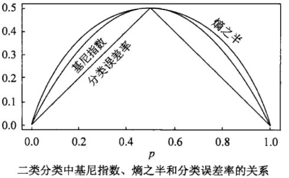

##	统计量

统计量：统计理论中对数据进行分析、检验的变量

-	传统的统计量具有显式解析表达式
	-	均值：数据之和除数量
	-	中位数：数据中间者

-	统计量同样可以理解为和数据相关**优化问题的解**
	-	均值：离差平方和最小
	-	中位数：划分均匀

	> - 优化问题目标本身也是统计量

##	Gini指数

基尼指数

$$\begin{align*}
Gini(p) & = \sum_{k=1}^K p_k(1-p_k) \\
	& = 1 - \sum_{k=1}^K p_k^2
\end{align*}$$

> - $p$：概率分布
> - 异质性最小：Gini系数为0
> - 异质性最大：Gini系数为$1 - \frac 1 k$

-	Gini指数度量分布的不纯度
	-	包含类别越多，Gini指数越大
	-	分布越均匀，Gini指数越大

> - 熵较Gini指数对不纯度判罚更重

###	条件Gini指数

条件Gini指数

$$
Gini(Y|X) = \sum_{k=1}^K P(X=x_k)Gini(Y|X=x_k)
$$

> - 性质类似信息增益

##	Entropy

熵：则是在概率分布上对随机变量X的不确定性/混乱程度的度量

> - 信息熵：信息消除不确定性的度量

$$
\begin{align*}
H(X) & = -E_P log P(x) \\
& = \sum_i^N P(x_i) log \frac 1 {P(x_i)} \\
& = - \sum_i^N p_i log p_i \\
\end{align*}
$$

> - $u_i$：随机变量各个取值
> - $p_i$：随机变量各取值对应概率
> - 事件i发生概率$p_i=0$：约定$p_i log(p_i)$为0
> - 其中$log$以2为底，单位为*bit*，以e为底，单位为*nat*

-	熵只依赖随机变量$X$的分布，与其取值无关，所以也可以将其
	熵记为$H(P)$

-	由定义$0 \leq H(P) \leq log_2 k$
	-	$H(p) = 0$：$\exists j, p_j=1$，随机变量只能取
		一个值，无不确定性
	-	$H(p) = log k$：$\forall j, p_j=1/k$，随机变量
		在任意取值概率相等，不确定性最大

> - *empirical entropy*：经验熵，熵中的概率由数据估计时
	（尤极大似然估计）

###	熵的性质

-	一般的
	$$\begin{align*}
	H(X, Y) & = H(X) + H(Y|X) \\
	H(X, Y) & = H(Y) + H(X|Y) \\
	H(X|Y) & \leqslant H(x) \\
	H(X, Y) & \leqslant H(X) + H(Y) \\
	\end{align*}$$

-	特别的，若X、Y相互独立
	$$
	H(X, Y) = H(X) + H(Y)
	$$

###	*Conditinal Entrophy*

条件熵：随机变量X给定条件下，随机变量Y的**条件概率分布的熵**
对X的数学期望

$$\begin{align*}
H(Y|X) & = \sum_{i=1}^N p_i H(Y|X=x_i) \\
H(Y|x=x_i) & = - \sum_j P(y_j|x_i) log P(y_j|x_i)
\end{align*}$$

> - $P(X=x_i, Y=y_j)=p_{i,j}$：随机变量$(X,Y)$联合概率分布
> - $p_i=P(X=x_i)$
> - $H(Y|X=x_i)$：后验熵

> - *postorior entropy*：后验熵，随机变量X给定条件下，随机
	变量Y的**条件概率分布的熵**
> - *empirical conditional entropy*：经验条件熵，概率由数据
	估计

###	*Mutual Infomation*/*Infomation Gain*

互信息/信息增益：（经验）熵与（经验）条件熵之差

$$\begin{align*}
g(Y|X) & = H(Y) - H(Y|X) \\
& = \sum_{x \in X} \sum_{y \in Y} p(x,y) log
	\frac {p(x,y)} {p(x)p(y)}
\end{align*}$$

-	与数据集具体分布有关、与具体取值无关
	-	绝对大小同易受熵影响，（经验）熵较大时，互信息也相对
		较大
	-	由于误差存在，分类取值数目较多者信息增益较大

-	可以衡量定性变量间相关性
	-	信息增益越大，变量之间相关性越强，自变量预测因变量
		能力越强
	-	只能考察特征对整个系统的贡献，无法具体到特征某个取值
	-	只适合作全局特征选择，即所有类使用相同的特征集合

####	*Infomation Gain Ratio*

信息增益比

$$\begin{align*}
g_R(Y|X) & = \frac {g(Y|X)} {H(X)}
\end{align*}$$

-	考虑熵大小，减弱熵绝对大小的影响

###	*Cross Entropy*

> - 信息论：基于相同事件测度的两个概率分布$p, q$，基于非自然
	（相较于真实分布$p$）概率分布$q$进行编码，在事件集合中
	唯一标识事件所需bit
> - 概率论：概率分布$p, q$之间差异

$$\begin{align*}
H(p, q) & = E_p[-log q] = \left \{ \begin{array}{l}
	= -\sum_{x} p(x) logq(x), & 离散分布 \\
	= -\int_X P(x) log(Q(x)) d(r(x)), & 连续分布
\end{array} \right. \\
& = H(p) + D_{KL}(p||q)
\end{align*}$$

> - $q(x)$：离散非自然概率分布
> - $Q(x)$：连续非自然概率分布密度函数
> - $r(x)$：测度，通常是$Borel \sigma$代数上的勒贝格测度
> - $D_{KL}(p||q)$：$p$到$q$的KL散度（$p$相对于$q$的相对熵）

-	交叉熵是常用的损失函数：效果等价于KL散度，但计算方便

> - sigmoid激活函数时：相较于二次损失，收敛速度更快

###	*Kullback-Leibler Divergence*

KL散度/相对熵：概率分布$p, q$之间差异量化指标

$$\begin{align*}
D_{KL}(p||q) & = E_p[log p(x) - log q(x)] \\
& = \sum_{i=1}^N p(x_i) (log p(x_i) - log q(x_i)) \\
& = \sum_{i=1} p(x_i) log \frac {p(x_i)} {q(x_i)}
\end{align*}$$

-	KL散度表示：原始分布$p$、近似分布$q$之间对数差值期望
-	KL散度不对称，分布$p$度量$q$、$q$度量$p$损失信息不同
	-	从计算公式也可以看出
	-	KL散度不能作为不同分布之间距离的度量

##	卡方统计量

卡方统计量：通过观察实际与理论值的偏差确定理论正确与否

$$
\mathcal{X}^2 = \sum \frac {(A - E)^2} E
$$

> - $A$：自变量、因变量组合对应频数观察值
> - $E$：自变量、因变量组合对应频数期望值

-	将模型预测结果视为实际分布、先验分布（均匀分布）视为理论
	分布

-	卡方检验：检验定性变量之间相关性，假设两个变量确实独立，
	观察实际值、理论值偏差程度判断变量之间相关性

	-	若偏差足够小，认为误差是自然的样本误差，两者确实独立
	-	若偏差大到一定程度，误差不可能由偶然、测量精度导致，
		认为两者相关

-	若模型预测结果同先验分布差别很大，说明模型有效，且卡方
	统计量值越大表示预测把握越大

###	特点

-	由于随机误差存在，卡方统计量容易夸大频数较小的特征影响
-	只存在少数类别中特征的卡方统计量值可能很小，容易被排除，
	而往往这类词对分类贡献很大

