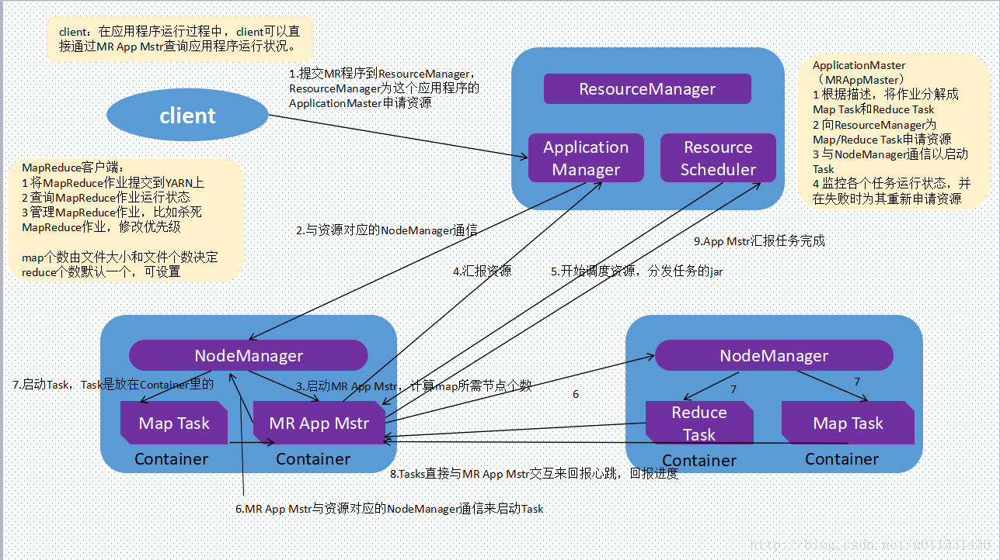

#	MapReduce YARN

##	MapReduce1.0组件

MapReduce1.0是指Hadoop1.0中组件，不是指MapReduce计算模型

###	优势

-	方便扩展：能够运行在普通服务器构成的超大规模集群上

-	IO瓶颈：通过将IO分散在大规模集群的各个节点上，可以提高
	数据装载速度（大规模数据时只有部分数据可以状态在内存中）

###	局限

-	MapReduce计算模型问题（参见*MapReduce计算模型*）

-	数据处理延迟大
	-	MapReduce作业在Map阶段、Reduce阶段执行过程中，需要
		把中间结果存盘
	-	在MR作业间也需要通过磁盘实现作业间的数据交换

-	资源利用率低
	-	任务调度方法远未达到优化资源利用率的效果，给每个
		TaskTracker分配任务的过程比较简单

###	资源分配

-	每个TaskTracker拥有一定数量的slots，每个活动的Map、
	Reduce任务占用一个slot

-	JobTracker把任务分配给最靠近数据、有slot空闲TT

-	不考虑Task运算量大小，所有Task视为相同，如果有某个TT
	当前负载过高，会影响整体的执行

-	也可以通过Speculative Execution模式，在多个slave上
	启动同一个任务，只要其中有一个任务完成即可

###	执行引擎

MapReduce执行引擎运行在HDFS上

-	JobTracker：运行在NameNode上
	-	分解客户端提交的job为数据处理tasks，分发给集群里相关
		节点上的TaskTacker运行
	-	发送任务原则：尽量把任务推送到离数据最近的节点上，
		甚至推送到数据所在的节点上运行

-	TaskTracker：运行在DataNode上
	-	在节点上执行数据处理map、reduce tasks
	-	可能需要从其他DataNode中获取需要数据

##	MapRedudce2.0

###	Shuffle

Shuffle：系统执行排序的过程

-	为了确保MapReduce的输入是按键排序的

####	Map端

每个Map Task都有一个内存缓冲区用于存储map输出结果，缓冲区
快满时需要将缓冲区数据以临时文件方式存放到磁盘中，整个Task
结束后再对此Map Task产生所有临时作合并，生成最终正式输出文件
，等待Reduce Task拉数据

##	YARN

Yet Another Resource Negotiator，通用任务、集群资源分配框架
，面向*Hadoop*的编程模型

###	YARN优势

####	扩展性

-	YARN将classic/MapReduce1中Jobtracker职能划分为多个独立
	实体，改善了其面临的扩展瓶颈问题

-	MapReduce现在只是批数据处理框架，是YARN支持的数据处理
	框架的一种，独立于资源管理层，单独演化、改进

-	YARN精妙的设计可以让不同的YARN应用在同一个集群上共存，
	如一个MapReduce应用可以同时作为MPI应用运行，提高可管理性
	、集群利用率

####	高效率

-	ResourceManager是单独的资源管理器

-	Job Scheduler指负责作业调度

-	根据资源预留要求、公平性、Service Level Agreement等标准
	，优化整个集群的资源利用

####	一般性

YARN是通用资源管理框架，在其上可以搭建多种数据处理框架

-	批处理：MapReduce
-	交互式处理：Tez
-	迭代处理：Spark
-	实时流处理：Storm
-	图数据处理：GraphLab/Giraph

###	YARN中实体

####	ResourceManager

RM物理上对应主节点，逻辑上管理集群上的资源使用，其功能由
Scheduler、ApplicationManager协调完成

-	AppplicatonManager：接受、监控任务

	-	接受客户端提交的job

	-	判断启动该job的ApplicationMaster所需的资源

	-	监控ApplicationMaster的状态，并在失败时重启其

-	Scheduler：分配资源、调度

	-	Schedular计算启动ApplicationManager提交的job的AM所需
		资源，将资源封装成Container

	-	然后根据调度算法调度，在某个NM上启动job的AM

	-	不提供失败重启、监控功能

	-	Scheduler收到AM任务完成汇报之后，回收资源、向RM返回
		执行结果

	-	调度算法可自定以，YARN根据不同场景提供
		-	FIFO Scheduler
		-	Capacity Scheduler
		-	Fair Scheduler

####	NodeManager

NM物理上对应计算节点，逻辑上**监控、管理**当前节点资源

-	仅仅抽象本节点资源（cpu、内存、磁盘、网络等），并且定时
	像RM的Scheduler汇报

-	接受并处理AM的tasks启动、停止等请求

####	ApplicationMaster

AM管理集群上运行任务生命周期

-	每个job都有一个专用的AM

-	AM启动后会计算job所需资源，并向Scheduler申请资源

-	AM运行在job运行期间，负责整个job执行过程的监控

	-	NM分配完任务container后，AM开始监控这些containers
		、tasks状态
	-	任务失败则回收资源重新生成
	-	成功则释放资源
	-	任务执行完毕后回报Scheduler

####	Containers

YARN为将来的资源隔离提出的框架，是一组资源的集合，每个task
对应一个container，只能在container中运行

-	容器有特定的内存分配范围

	-	容器内存最小值即为内存分配单位，内存最大值也应该是
		内存分配单位整数倍

	-	根据任务所需资源多少分配给容器整数倍内存单位，但是
		如果任务所需内存大于容器内存最大值，运行时可能会报错

-	由NM确保task使用的资源不会超过分配的资源

-	注意
	-	AM并不运行于container中，真正的task才运行在container

###	Job运行过程

####	作业提交

-	从RM获取新的作业ID
-	作业客户端检查作业输出说明，计算输入分片（也可以配置
	在集群中产生分片）
-	将作业资源复制到HDFS
-	调用RM上的`submitApplication`方法提交作业

####	作业初始化

1.	RM收到调用`submitApplication`消息后，将请求传递给
	内部scheduler，scheduler分配一个container
2.	NM在RM的管理下在容器中启动应用程序的master进程AM，
	其对作业进行初始化
3.	AM创建多个簿记对象用于接受任务进度、完成报告，保持
	对作业进度的跟踪
4.	AM接受来自共享文件系统的在客户端计算的输入分片，对
	每个分片创建一个map对象，及由`mapreduce.job.reduces`
	属性确定的多个reduce任务对象
5.	AM根据任务大小决定如何运行job，如果在新容器中分配、
	运行任务的开销大于并行运行时的开销，AM会在单个节点
	上运行，这样的作业称为*uberized*
6.	AM在任何tasks执行之前通过job的`setup`方法设置job的
	`OutputCommiter`，建立作业输出目录
	
####	任务分配

1.	若作业不适合作为*uber*任务运行，AM为该作业中所有map
	、reduce任务向RM请求容器
2.	请求附着heart beat，包括每个map任务的数据本地化信息
	，特别是输入分片所在的主机、机架信息，scheduler据此
	做调度决策
	-	理想化情况下任务分配到数据本地化节点
	-	否则优先使用机架本地化
3.	请求同时指定了任务内存需求，YARN中的资源分为更细粒度
	，task可以请求最小到最大限制范围、任意最小值倍数的
	内存容量

####	任务执行

1.	当NM的scheduler为task分配了container，AM就可以通过
	与NM通信启动容器
2.	任务由`YarnChild`执行，在执行任务之前，需要将任务
	所需资源本地化，包括作业的配置、JAR文件、所有来自
	分布式缓存的文件，然后运行map、reduce任务
3.	对于Streaming、Pipes程序，`YarnChild`启动Streaming、
	Pipes进程，使用标准输入输出、socket与其通信（以
	MapReduce1方式运行）

####	进度和状态更新

1.	task每3s通过`umbilical`接口向AM汇报进度、状态（包括
	计数器），作为job的aggregate view
2.	客户端则默认没1s查询AM接受进度更新

####	作业完成

1.	客户端每5s通过调用job的`waitForCompletion`检查作业
	是否完成，也可以通过HTTP callback完成作业
2.	作业完成后AM和task容器清理工作状态，OutputCommiter
	作业清理方法被调用

#todo：这里逻辑有问题，要删

##	MapReduce计算模型

-	分布式系统，不像一般的数据库、文件系统，无法从上至下
	、从头到尾进行求和等操作
-	需要由分散的节点不断向一个点聚拢的计算过程，即分布式系统
	上计算模型基本都是由map、reduce步骤组成

###	MapReduce

MapReduce每步数据处理流程包括两个阶段

-	*Map*：映射
	-	map过程相互独立、各mapper见不通信，所以mapreduce
		只适合处理**独立计算**的任务

-	*Reduce*：归一
	-	reduce直接处理map的输出，reduce的**键**为map输出
		**值**

####	数据处理过程

-	需要把任何计算任务转换为一系列MapReduce作业，然后依次
	执行这些作业
	
-	计算过程的各个步骤之间，各个作业输出的中间结果需要存盘，
	然后才能被下个步骤使用（因为各个步骤之间没有明确流程）

-	One Pass Computation：只需要一遍扫描处理的计算任务
	MapReduce计算模型非常有效
	
-	Multi Pass Computation：需要在数据上进行多遍扫描、处理
	的计算任务，需要执行多个MapReduce作业计算任务，因为
	多副本复制、磁盘存取，其效率不高

###	Mapred on DAG

Directed Acyclic Graph；表示数据处理流程的有向无环图

-	顶点：数据处理任务，反映一定的业务逻辑，即如何对数据进行
	转换和分析
-	边：数据在不同的顶点间的传递

###	比较

|比较方面|MapReduce|DAG|
|------|------|------|
|操作原语|map、reduce|较多|
|抽象层次|低|高|
|表达能力|差|强|
|易用性|要手动处理job之间依赖关系，易用性差|DAG本身体现数据处理流程|
|可读性|处理逻辑隐藏在代码中，没有整体逻辑|较好|

-	正是MapReduce提供操作原语少、抽象层次低，所以其表达能力
	差，同时需要用户处理更多的逻辑，易用性、可读性差

	-	复杂数据处理任务，如：机器学习算法、SQL连接查询很难
		表示用MapReduce计算默认表达

	-	操作原语多并不是DAG本身的要求，DAG本身只是有向无环图，
		只是使用DAG计算模型可以提供更多的操作原语

-	由于DAG的表达能力强于MapReduce，对某些处理逻辑，DAG
		所需作业数目小于MapReduce，消除不必要的任务

	-	DAG显著提高了数据处理效率，对小规模、低延迟和大规模、
		高吞吐量的负载均有效

	-	MapReduce需要通过把中间结果存盘实现同步，而DAG整合
		部分MapReduce作业，减少磁盘I/O

	-	reduce任务需要等待map任务全部完成才能继续，DAG优化
		数据处理流程，减少同步Barrier

-	DAG部分计算模型也由map、reduce任务构成，只是不像传统
	MapReduce计算模型中map、reduce必须成对出现

	-	或者说DAG只有一次map任务（扫描数据时），其余都是
		reduce任务？

	-	从MapReduce配置也可以看出，MapReduce可以选择基于
		`yarn`或`yarn-tez`

