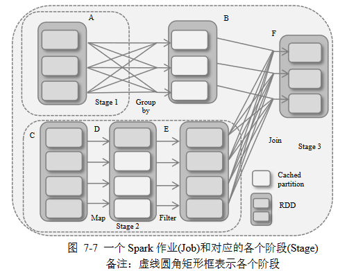
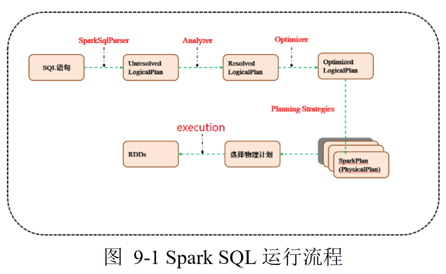

#	Spark

##	Spark特性

###	数据处理速度快

得益于Spark的内存处理技术、DAG执行引擎

####	内存计算

-	Spark尽量把数据（中间结果等）驻留在内存中，必要时才写入
	磁盘，避免I/O操作，提高处理效率

-	支持保存部分数据在内存中，剩下部分保存在磁盘中

-	数据完全驻留于内存时，数据处理达到hadoop系统的
	几十~上百倍，数据存在磁盘上时，处理速度能够达到hadoop的
	10倍左右

####	DAG执行引擎

-	Spark执行任务前，根据任务之间依赖关系生成DAG图，优化数据
	处理流程（减少任务数量）、减少I/O操作

-	除了简单的map、reduce，Spark提供了超过80个数据处理的
	Operator Primitives

-	对于数据查询操作，Spark采用Lazy Evaluation方式执行，
	帮助优化器对整个数据处力工作流进行优化

###	易用性/API支持

-	Spark使用Scala编写，经过编译后在JVM上运行

-	提供了简洁、一致的编程接口，支持各种编程语言，包括
	Scala、Java、Python、Clojure、R

-	可以使用shell程序，交互式的对数据进行查询

-	数据类型、计算表达能力：Spark可以管理各种类型的数据集，
	包括文本

###	通用性

-	Spark是通用平台，支持以DAG（有向无环图）形式表达的复杂
	数据处理流程，能够对数据进行复杂的处理操作，而不用将复杂
	任务分解成一系列MapReduce作业

-	Spark生态圈DBAS（Berkely Data Analysis Stack）包含组件，
	支持批处理、流数据处理、图数据处理、机器学习

###	兼容性

-	能够集成、操作HDFS、Amazon S3、Hive、HBase、Cassandra等
	数据源

-	能以YARN、Mesos为资源管理器，也可以使用自身资源的管理器
	独立运行

##	Spark架构

###	核心组件、相关组件

前4者为BDAS所包含的组件

####	Sparking Streaming

对实时数据流进行高吞吐、高容错的流式处理系统

-	可以对多种数据源（Kafka、Flume、Twitter、ZeroMQ），进行
	包括map、reduce、join等复杂操作

-	采用Micro Batch数据处理方式

	-	接收到的数据流，离散化为小的RDDs交由Spark引擎处理，
		数据存储在内存中能实现交互式查询，实现数据流处理、
		批处理、交互式工作一体化

	-	Micro Batch能够实现对资源更细粒度的分配，实现动态
		负载均衡

	-	故障节点任务将均匀分散至集群中，实现更快的故障恢复

-	结果也是以批量的方式生成的batch

####	Spark SQL

前身Shark即为Hive on Spark，后出于维护、优化、性能考虑放弃

-	把Spark数据集通过JDBC API暴露出来，让客户程序可以在上面
	直接执行SQL查询

-	可以把传统的BI和可视化工具连接到数据集，利用JDBC进行数据
	查询、汇总、展示

####	GraphX

图数据处理模块

-	支持图数据的并行处理

-	可利用此模块对图数据进行ExploratoryAnalysis、Iterative
	Graph Computation

	-	提供了一系列操作
		-	Sub Graph：子图
		-	Join Vertices：顶点连接
		-	Aggregate Message：消息聚集
		-	Pregel API变种

	-	经典图处理算法

		-	PageRank

-	GraphX将RDD扩展为Resilient Distributed Property Graph，
	是把属性赋予各个节点、边的有向图

####	MLLib

Spark中可扩展的机器学习模块

-	已经实现了众多算法

	-	Classification
	-	Regression
	-	Clustering
	-	Collaborative Filtering
	-	Dimensionality Reduction

-	大数据平台使得在全量数据上进行学习成为可能

-	机器学习算法往往需要多次迭代到收敛为止，Spark内存计算、
	DAG执行引擎象相较MapReduce更理想

-	由于Spark核心模块的高性能、通用性，Mahout已经放弃
	MapReduce计算模型，选择Spark作为执行引擎

####	BlinkDB

近似查询处理引擎

-	可以在大规模数据集上，交互式执行SQL查询

-	允许用户在查询精度、响应时间之间做出折中

	-	用户可以指定查询响应时间、查询结果精度要求之一
	-	BlinkDB在Data Sampple上执行查询，获得近似结果

-	查询结果会给Error Bar标签，帮助决策

####	Tachyon

基于内存的分布式文件系统

-	支持不同处理框架

	-	可在不同计算框架之间实现可靠的文件共享
	-	支持不同的上层查询处理框架，可以以极高的速度对集群
		内存中的文件进行访问

-	将workset文件缓存在内存中，避免对磁盘的存取，如果数据集
	不断被扫描、处理，数据处理速度将极大提升

###	DataStorage

-	一般使用HDFS分布式系统存储数据
-	支持Hbase、Cassandra等数据源

###	API

-	API包括：Scala API、Java API、Python API

###	ManagementFramework

Spark可以独立部署Standalone Mode、部署在YARN或Mesos等资源
管理框架上

##	数据处理流程

###	Resilient Distributed Dataset

RDD：容错的、immutable分布式数据集，分配在集群中的多个节点
中以支持并行处理，是Spark软件系统的核心概念

-	RDD是无结构的数据表，和DataFrame不同

###	RDD特性

-	RDD可以看作是数据库中的一张表

	-	可以存放任何数据类型
	-	Spark将隶属于同一RDD数据，划分为不同的Partition
	-	RDD的Partition分布到集群环境中各个节点上，有利于对
		数据进行并行处理

-	RDD采用基于Lineage的容错机制

	-	记住每个RDD从其他RDD转换而来的路径
	-	当某个RDD损坏时，Spark可以从上游RDD重新计算、创建
		其数据

-	RDD是immutable

	-	对RDD进行转换，不会修改原RDD，只是返回新RDD
	-	这也是基于Lineage容错机制的要求

###	RDD操作

RDD支持两种操作

####	Transformation

转换，返回一个新RDD，原RDD保持不变，

-	转换操作是Lazy，只有当某个**动作**被Driver Program（客户
	操作）调用DAG的动作操作时，动作操作的一系列proceeding
	转换操作才会被启动

-	典型操作包括
	-	`map`
	-	`filter`
	-	`flatMap`
	-	`groupByKey`
	-	`reduceByKey`
	-	`aggregateByKey`
	-	`pipe`
	-	`coalesce`

####	Action

动作，施加于一个RDD，通过对RDD数据集的计算返回新的结果

-	典型操作
	-	`reduce`
	-	`count`
	-	`first`
	-	`take`
	-	`countByKey`
	-	`foreach`

###	DAG

Spark中DAG可以看作由：RDD、转换操作、动作操作构成，用于表达
复杂计算

-	当需要**执行**某个操作时，将重新从上游RDD进行计算

-	也可以对RDD进行缓存、持久化，以便再次存取，获得更高查询
	速度
	-	In-mem Storage as Deserialized Java Objects
	-	In-mem Storage as Serialized Data
	-	On-Disk Storage

-	DAG工作流
	
	1.	从HDFS装载数据至两个RDD中
	2.	对RDD（和中间生成的RDD）施加一系列转换操作
	3.	最后动作操作施加于最后的RDD生成最终结果、存盘

####	宽依赖、窄依赖

DAG父子RDD各个分区间有两种依赖关系
	


-	窄依赖：每个父RDD最多被一个子RDD分区使用
	-	即单个父RDD分区经过转换操作生成子RDD分区
	-	窄依赖可以在一台机器上处理，无需Data Shuffling，
		在网络上进行数据传输

-	宽依赖：多个子RDD分区，依赖同一个父RDD分区
	-	涉及宽依赖操作
		-	`groupByKey`
		-	`reduceByKey`
		-	`sortByKey`
	-	宽依赖一般涉及Data Shuffling

####	DAG Scheduler

DAG Scheduler是Stage-Oriented的DAG执行调度器



-	使用Job、Stage概念进行作业调度
	-	作业：一个提交到DAG Scheduler的工作项目，表达成DAG，
		以一个RDD结束
	-	阶段：一组并行任务，每个任务对应RDD一个分区，是作业
		的一部分、数据处理基本单元，负责计算部分结果，

-	DAG Scheduler检查依赖类型
	-	把一系列窄依赖RDD组织成一个阶段
		-	所以说阶段中并行的每个任务对应RDD一个分区
	-	宽依赖需要跨越连续阶段
		-	因为宽依赖子RDD分区依赖多个父RDD分区，涉及
			Data Shuffling，数据处理不能在单独节点并行执行
		-	或者说阶段就是根据宽依赖进行划分

-	DAG Scheduler对整个DAG进行分析
	-	为作业产生一系列阶段、其间依赖关系
	-	确定需要持久化的RDD、阶段的输出
	-	找到作业运行最小代价的执行调度方案、根据Cache Status
		确定的运行每个task的优选位置，把信息提交给
		Task Sheduler执行

-	容错处理
	-	DAG Scheduler负责对shuffle output file丢失情况进行
		处理，把已经执行过的阶段重新提交，以便重建丢失的数据
	-	stage内其他失败情况由Task Scheduler本身进行处理，
		将尝试执行任务一定次数、直到取消整个阶段

####	Share Variable

共享变量可以是一个值、也可以是一个数据集，Spark提供了两种
共享变量

-	Broadcast Variable：广播变量缓存在各个节点上，而不随着
	计算任务调度的发送变量拷贝，可以避免大量的数据移动

-	Accumulator：收集变量
	-	用于实现计数器、计算总和
	-	集群上各个任务可以向变量执行增加操作，但是不能读取值
		，只有Driver Program（客户程序）可以读取
	-	累加符合结合律，所以集群对收集变量的累加没有顺序要求

##	Spark实体


###	Spark Context

Spark Context负责和CM的交互、协调应用

-	所有的Spark应用作为独立进程运行，由各自的SC协调
-	SC向CM申请在集群中worker创建executor执行应用

###	Driver and Worker

-	Driver：执行应用主函数、创建Spark Context的节点
-	Worker：数据处理的节点

###	Cluster Manager

Cluster Manager为每个driver中的应用分配资源

-	Spark支持三种类型的CM，在sceduling、security、monitoring
	有所不同，根据需要选择不同的CM

	-	Standalone
	-	Mesos
	-	YARN

-	CM对Spark是agnostic

##	SparkSQL

SparkSQL可以让用户

-	对结构化数据使用SQL语言进行查询分析
-	通过ETL（Extraction Transformation, Loading）工具，从
	不同格式数据源装载数据，并运行一些Ad-Hoc Query


###	实体

####	DataFrame

在数据存储层面对数据进行结构化描述的schema

-	由SchemaRDD（上个版本）发展而来，在其上增加schema层
	，以便对各个数据列命名、数据类型描述

-	可以通过DF API把过程性处理、Relational Processing
	（对表格的选择、投影、连接等操作）集成

-	DF API操作是Lazy的，使得Spark可以对关系操作、数据处理
	工作流进行深入优化

-	结构化的DF可以通过调用DF API重新转换为无结构的RDD数据集

-	可以通过不同Data Source创建DF
	-	已经存在的RDD数据集
	-	结构化数据文件
	-	JSON数据集
	-	Hive表格
	-	外部数据库表

####	SQLContext

查询处理层面通过SQLContext支持SQL查询功能

-	SparkSQL通过SQLContext对象所有关系操作包装起来
	-	SQLContext实际上是SparkContext包装生成的新对象

-	用户需要首先创建SparkSQL，然后调用其方法实现SQL查询

####	HiveContext

提供SparkContext功能一个超集，可以用HiveQL写查询，从Hive
中查询数据

####	DataSource

通过DS API可以存取不同格式保存的结构化数据

-	Parquet
-	JSON
-	Apache Avro数据序列化格式
-	JDBC DS：可以通过JDBC读取关系型数据库

####	JDBC Server

SparkSQL内置JDBC服务器，客户端据此实现对SparkSQL数据表的存取

####	Catalyst Optimizer

查询优化器

###查询执行流程



1.	Parser：对SQL语句做词法、语法解析，生成Unsolved Loggical
	Plan
	-	Unsolved Relation
	-	Unsolved Function
	-	Unsolved Attribute
	然后在后续步骤中使用不同Rule，应用到该逻辑计划上

2.	Analyzer：使用Analysis Rules，配合元数据（Session
	Catalog、Hive Metastore等，对未绑定的逻辑计划进行处理，
	转换为绑定的逻辑计划

3.	Optimizer：使用Optimization Rules，对绑定的逻辑计划，
	进行合并、列裁剪、过滤器下推等优化工作，生成优化的逻辑
	计划

4.	Planner：生成Planning Strategies，对优化的逻辑计划进行
	转换，根据统计信息、CostModel，生成可以执行的物理执行
	计划，选择最优的执行计划，得到SparkPlan

5.	SparkPlan调用`execute`方法，执行计算，对RDD进行处理，
	得到查询结果

##	MLLib

MLLib是Spark平台的机器学习库，能直接操作RDD数据集，可以和
其他BDAS其他组件无缝集成

-	MLLib是MLBase中的一部分
	-	MLLib
	-	MLI
	-	MLOptimizer
	-	MLRuntime

-	MLLib从Spark1.2开始被分为两个包
	-	`spark.mllib`：包含基于RDD的原始算法API
	-	`spark.ml`：包含基于DataFrame的高层次API
		-	可以用于构建机器学习PipLine
		-	ML PipLine API可以方便的进行数据处理、特征转换、
			正则化、联合多个机器算法，构建单一完整的机器学习
			流水线

-	MLLib算法代码可以在`examples`目录下找到，数据则在`data`
	目录下

###	Classification

-	模块：`pyspark.mlllib.classification`

####	Logistic Regression

```python
from pyspark.mllib.classification import \
	LogisticRegressionWithLBFGS, LogisticRegressionModel
from pyspark.mllib.regression import LabledPoint

def parse_point(line):
	value = [float(i) for i line.split(", \r\n\t")

data = sc.textFile("data/mllib/sample_svm_data.txt")
parsed_data = data.map(parse_point)
	# map `parse_point` to all data

model = LogisticRegressionWithLBFGS.train(parsed_data)
labels_and_preds = parsed_data.map(lambda p: (p.label, model.predict(p.features)))
train_err = labels_and_preds \
	.filter(lambda lp: lp[0] != lp[1]) \
	.count() / float(parsed_data.count())

model.save(sc, "model_path")
same_model = LogisticRegressionModel.load(sc, "model.path")
```

-	Decision Tree
-	Random Forest
-	Gradient
-	boosted tree
-	Multilaye Perceptron
-	Support Vector Machine
-	One-vs-Rest Classifier
-	Naive Bayes

###	Clustering

####	K-means

```python
import numpy as np
from pyspark.mllib.clustering import KMeans, KMeansModel

data = sc.textFile("data/mllib/kmeans_data.txt")
parsed_data = data.map(lambda line: np.array([float(i) for i in line.split()]))

cluster_model = KMeans.train(
	parsed_data,
	maxIteration=10,
	initializationMode="random"
)
def error(point):
	center = cluster_model.centers[cluster.predict(point)]
	return np.sqrt(sum([i**2 for i in (point - center)]))
WSSSE = parsed_data \
	.map(lambda point.error(point)) \
	.reduce(lambd x, y: x + y)

cluster_model.save(sc, "model_path")
same_model = KMeansModel.load(sc, "model_path")
```

####	Gaussian Mixture Model(GMM)

-	混合密度模型
	-	有限混合模型：正态分布混合模型可以模拟所有分布
	-	迪利克莱混合模型：类似于泊松过程
-	应用
	-	聚类：检验聚类结果是否合适
	-	预测：
	# todo

```md
import numpy as np
from pyspark.mllib.clustering import GussianMixture, \
	GussianMixtureModel

data = sc.textFile("data/mllib/gmm_data.txt")
parsed_data = data.map(lambda line: np.array[float(i) for i in line.strip()]))

gmm = GaussianMixture.train(parsed_data, 2)
for w, g in zip(gmm.weights, gmm.gaussians):
	print("weight = ", w,
		"mu = ", g.mu,
		"sigma = ", g.sigma.toArray())

gmm.save(sc, "model_path")
same_model = GussainMixtureModel.load(sc, "model_path")
```

####	Latent Dirichlet Allocation(LDA)

```md
from pyspark.mllib.clustering import LDA, LDAModel
from pyspark.mllib.linalg import Vectors

data = sc.textFile("data/mllib/sample_lda_data.txt")
parsed_data = data.map(lambda line: Vector.dense([float(i) for i in line.strip()]))

corpus = parsed_data.zipWithIndex() \
	.map(lambda x: [x[1], x[0]).cache()
ldaModel = LDA.train(corpus, k=3)

topics = ldaModel.topicsMatrix()

for word in range(0, ldaModel.vocabSize()):
	for topic in word:
		print(topic)

ldaModel.save(sc, "model_path")
same_model = LDAModel.load("model_path")
```


-	Disecting K-means

###	Regression

####	Linear Regression

-	耗时长、无法计算解析解（无意义）
-	使用MSE作为极小化目标函数，使用SGD算法求解

```python
from pyspark.mllib.regression import LabledPoint, \
	LinearRegressionWithSGD, LinearRegressionModel

def parse_point(line):
	value = [float(i) for i line.split(", \r\n\t")

data = sc.textFile("data/mllib/ridge-data/lpsa.data")
parsed_data = data.map(parse_point)
	# map `parse_point` to all data

model = LinearRegressionWithSGD.train(
	parsed_data,
	iteration=100,
	step=0.00000001
)
values_and_preds = parsed_data.map(lambda p:(p.label, model.predict(p.features)))
MSE = values_and_preds \
	.map(lambda vp: (vp[0] - vp[1]) ** 2) \
	.reduce(lambda x, y: x + y) / values_and_preds.count()

model.save(sc, "model_path")
	# save model
same_model = LinearRegressionModel.load(sc, "model_path")
	# load saved model
```

-	Generalized Linear Regression
-	Decision Tree Regression
-	Random Forest Regression
-	Gradient-boosted Tree Regression
-	Survival Regression
-	Isotonic Regression

###	Collaborative Filtering

##	GraphX

GraphX是Spark图形并行计算组件

-	GraphX从高层次对RDD进行扩展，增加了新的图形抽象RDD，
	边、顶点都有属性的有向图

-	GraphX提供了包括：子图、顶点连接、信息聚合等操作在内的
	基础原语，并且对的Pregel API提供了优化变量的

-	GraphX包括了正在不断增加的一系列图算法、构建方法，用于
	简化图形分析任务


