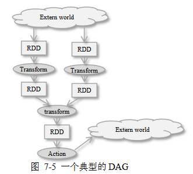

#	Resilient Distributed Dataset

##	RDD

RDD：容错的、immutable、分布式、确定可重复计算的数据集

-	RDD可分配在集群中的多个节点中以支持并行处理
	-	隶属于同一RDD数据，被划分为不同的Partition，以此为
		单位分布到集群环境中各个节点上

-	RDD是**无结构的数据表**，可以存放任何数据类型

-	RDD immutable
	-	对RDD进行转换，不会修改原RDD，只是返回新RDD
	-	这也是基于Lineage容错机制的要求

> - 是Spark软件系统的核心概念

###	RDD容错机制

-	RDD采用基于Lineage的容错机制

	-	每个RDD记住确定性操作的lineage，即从其他RDD转换而来
		的路径
	-	若所有RDD的转换操作是确定的，则最终转换数据一致，
		无论机器发生的错误
	-	当某个RDD损坏时，Spark可以从上游RDD重新计算、创建
		其数据

-	容错语义

	-	输入源文件：Spark运行在HDFS、S3等容错文件系统上，从
		任何容错数据而来的RDD都是容错的
	-	receiver：可靠接收者告知可靠数据源，保证所有数据总是
		会被恰好处理一次
	-	输出：输出操作可能会使得数据被重复写出，但文件会被
		之后写入覆盖

-	故障类型

	-	worker节点故障：节点中内存数据丢失，其上接收者缓冲
		数据丢失
	-	driver节点故障：spark context丢失，所有执行算子丢失

##	RDD操作


```scala
import org.apache.spark.rdd.RDD
```

###	Transformation

转换：从已有数据集创建新数据集

-	返回新RDD，原RDD保持不变

-	转换操作Lazy
	-	仅记录转换操作作用的基础数据集
	-	仅当某个**动作**被Driver Program（客户操作）调用DAG
		的动作操作时，动作操作的一系列proceeding转换操作才会
		被启动

|Transformation|RDD|DStream|
|-----|-----|-----|
|`map(func)`|||
|`flatMap(func)`|||
|`filter(func)`|||
|`reduceByKey(func[, numTasks])`|包含`(K, V)`键值对，返回按键聚集键值对||
|`groupByKey()`|||
|`aggregateByKey()`|||
|`pipe()`|||
|`coalesce()`|||
|`repartition(numPartitions)`|||
|`union(other)`|无||

> - `XXXByKey`：RDD中应为`(K, V)`键值对

###	Action

动作：在数据集上进行计算后返回值到驱动程序

-	施加于一个RDD，通过对RDD数据集的计算返回新的结果
	-	默认RDD会在每次执行动作时重新计算，但可以使用
		`cache`、`persist`持久化RDD至内存、硬盘中，加速下次
		查询速度

|Action|RDD|DStream|
|-----|-----|-----|
|`count()`||返回包含单元素RDD的DStream|
|`collect()`|将RDD数据聚集至本地||
|`countByValue()`|返回`(T, long)`键值对||
|`countByKey()`|||
|`first()`||返回包含单元素RDDd的DStream|
|`reduce(func)`||返回包含单元素RDD的DStream|
|`take(func)`|||
|`foreach(func)`|||
|`foreachPartition(func)`|||
|`join(other[, numTasks])`|包含`(K,V)`，与另一`(K,W)`连接||
|`cogroup(other[, numTasks])`|包含`(K,V)`、输入`(K,W)`，返回`(K, Seq(V), Seq(W)`||

> - `numTasks`：默认使用Spark默认并发数目

###	DStream RDD

```scala
// RDD级`map`：`func`以RDD为参数，自定义转换操作
def transform(func)
// RDD级`foreach`
def foreachRDD(func)

// RDD级`reduce`
def updateStateByKey[S: ClassTag](
	// `K`、`Seq[V]`：当前RDD中键`K`对应值`V`集合
	// `Option[S]`：上个RDD结束后键`K`对应状态
	updateFunc: (Iterator[(K, Seq[V], Option[S])]) => Iterator[(K, S)],
	// 分区算法

	partitioner: Partitioner,
	// 是否在接下来Streaming执行过程中产生的RDD使用相同分区算法
	remmemberPartition: Boolean,
	// 键值对的初始状态
	initRDD: RDD[(K,S)]
)
```

-	RDD分布在多个worker节点上，对不可序列化传递对象，需要在
	每个worker节点独立创建

	```scala
	dstream.foreachRDD(rdd => {
		rdd.foreachPartition(partitionOfRecords => {
			// 为每个partition创建不可序列化网络连接
			// 为每个record创建成本过高
			val connection = createNewConnnection()
			// 进一步可以维护静态连接对象池
			// val connection = ConnectionPool.getConnection()
			partitionOfRecords.foreach(record => connection.send(record))
			connection.close()
		})
	})
	```

###	DStream Window Action

|Window Action|DStream|
|-----|-----|
|`window(windowLength, slideInterval)`|基于DStream产生的窗口化批数据产生DStream|
|`countByWindow(windowLenght, slideInterval)`|返回滑动窗口数|
|`reduceByWindow(func, windowLength, slideInterval)`||
|`reduceByKeyAndWindow(func, windowLength, slidenInterval[, numTasks])`||
|`reduceByKeyAndWindow(func, invFunc, windowLength, slideInterval[, numTasks])`|须提供`invFunc`消除离开窗口RDD对reduce结果影响|
|`countByValueAndWindow(windowLength, slideInterval[, numTasks])`||

> - `windowLength`：窗口长度
> - `slideInterval`：滑动间隔

> - 以上操作默认会持久化RDD至内存，无需手动调用`persist`等方法


###	Output

|Output Operation|RDD|DStream|
|-----|-----|-----|
|`print`|打印前10条元素|每个RDD打印前10条元素|
|`saveAsObjectFile(prefix[, suffix])`|保存为序列化文件|命名为`<prefix>-TIME_IN_M.<suffix>`|
|`saveAsTextFile(prefix[, suffix])`|保存为文本文件||
|`saveAsHadoopFile(prefix[, suffix])`|保存为Hadoop文件||

###	Persistence

|Persistence|RDD|DStream|
|-----|-----|-----|
|`persist()`|||
|`cache()`|||

##	Directed Asycled Graph

Spark中DAG：可以看作由RDD、转换操作、动作操作构成，用于表达
复杂计算

-	当需要**执行**某个操作时，将重新从上游RDD进行计算

-	也可以对RDD进行缓存、持久化，以便再次存取，获得更高查询
	速度
	-	In-mem Storage as Deserialized Java Objects
	-	In-mem Storage as Serialized Data
	-	On-Disk Storage

###	DAG工作流示例



-	从HDFS装载数据至两个RDD中
-	对RDD（和中间生成的RDD）施加一系列转换操作
-	最后动作操作施加于最后的RDD生成最终结果、存盘

###	宽依赖、窄依赖


-	窄依赖：每个父RDD最多被一个子RDD分区使用
	-	即单个父RDD分区经过转换操作生成子RDD分区
	-	窄依赖可以在一台机器上处理，无需Data Shuffling，
		在网络上进行数据传输

-	宽依赖：多个子RDD分区，依赖同一个父RDD分区
	-	涉及宽依赖操作
		-	`groupByKey`
		-	`reduceByKey`
		-	`sortByKey`
	-	宽依赖一般涉及Data Shuffling

###	DAG Scheduler

*DAG Scheduler*：*Stage-Oriented*的DAG执行调度器


-	使用Job、Stage概念进行作业调度
	-	作业：一个提交到DAG Scheduler的工作项目，表达成DAG，
		以一个RDD结束
	-	阶段：一组并行任务，每个任务对应RDD一个分区，是作业
		的一部分、数据处理基本单元，负责计算部分结果，

-	DAG Scheduler检查依赖类型
	-	把一系列窄依赖RDD组织成一个阶段
		-	所以说阶段中并行的每个任务对应RDD一个分区
	-	宽依赖需要跨越连续阶段
		-	因为宽依赖子RDD分区依赖多个父RDD分区，涉及
			Data Shuffling，数据处理不能在单独节点并行执行
		-	或者说阶段就是根据宽依赖进行划分

-	DAG Scheduler对整个DAG进行分析
	-	为作业产生一系列阶段、其间依赖关系
	-	确定需要持久化的RDD、阶段的输出
	-	找到作业运行最小代价的执行调度方案、根据Cache Status
		确定的运行每个task的优选位置，把信息提交给
		Task Sheduler执行

-	容错处理
	-	DAG Scheduler负责对shuffle output file丢失情况进行
		处理，把已经执行过的阶段重新提交，以便重建丢失的数据
	-	stage内其他失败情况由Task Scheduler本身进行处理，
		将尝试执行任务一定次数、直到取消整个阶段

##	DataFrame

-	*DataFrame*：类似关系型数据库中表，数据被组织到具名列中
	-	相较于RDD是对分布式、结构化数据集的高层次抽象，提供
		特定领域的专用API进行处理
	-	静态类型安全：相较于SQL查询语句，在编译时即可发现
		语法错误

-	*Dataset*：有明确类型数据、或无明确数据类型集合，相应API
	也分为两类
	-	相较于DataFrame，也可组织半结构化数据，同样提供方便
		易用的结构化API
	-	静态类型、运行时类型安全：相较于DataFrame，集合元素
		有明确类型，在编译时即可发现分析错误

> - Spark2.0中二者API统一
> - DataFrame可视为无明确数据类型`Dataset[Row]`别名，每行是
	无类型JVM对象

###	创建方式

-	`.toDF`

	```scala
	val sqlContext = new org.apache.spark.sql.SQLContext(sc)
	import sqlContext.implicits._

	// `.toDF` + `Seq`创建
	val df = Seq(
		(1, "F", java.sql.Date.valueOf("2019-08-02")),
		(2, "G", java.sql.Date.valueOf("2019-08-01"))
	).toDF("id", "level", "date")
	// 不指定列名，则默认为`_1`、`_2`等


	// `.toDF` + `case Class`创建
	case class Person(name: String, age: Int)
	val people = sc.textFile("people.txt")
		.map(_.split(","))
		.map(p => Person(p(0),p(1).trim.toInt))
		.toDF()
	```

-	`.createDataFrame`

	```scala
	import org.apache.spark.sql.types._
	val schema = StrucType(List(
		StructField("id", IntegerType, nullable=False),
		StructField("level", StringType, nullable=False),
		StructField("date", DateType, nullable=False)
	))
	val rdd = sc.parallelize(Seq(
		(1, "F", java.sql.Date.valueOf("2019-08-02")),
		(2, "G", java.sql.Date.valueOf("2019-08-01"))
	))
	val df = sqlContext.createDataFrame(rdd, schema)
	```

-	读取文件创建

	```scala
	val df = sqlContext.read.parquet("hdfs:/peopole.parq")
	val df = spark.read.json("people.json")
	// 读取csv仅2.0版本`SparkSession`后可
	val df = spark.read.format("com.databricks.spark.csv")
		.option("header", "true")
		.option("mode", "DROPMALFORMED")
		.load("people.csv")
	```

###	三种数据集对比

-	空间、时间效率：DataFrame >= Dataset > RDD
	-	DataFrame、Dataset基于SparkSQL引擎构建，使用Catalyst
		生成优化后的逻辑、物理查询计划；无类型DataFrame相较
		有类型Dataset运行更快
	-	Spark作为编译器可以理解Dataset类型JVM对象，会使用
		编码器将其映射为Tungsten内存内部表示

-	RDD适合场景
	-	对数据集进行最基本的转换、处理、控制
	-	希望以函数式编程而不是以特定领域表达处理数据
	-	数据为非结构化，如：流媒体、字符流

-	DataFrame、Dataset使用场景
	-	需要语义丰富、高级抽象、通用平台、特定领域API
	-	需要对半结构化数据进行高级处理，如：filter、SQL查询
	-	需要编译时/运行时类型安全、Catalyst优化、内存优化


