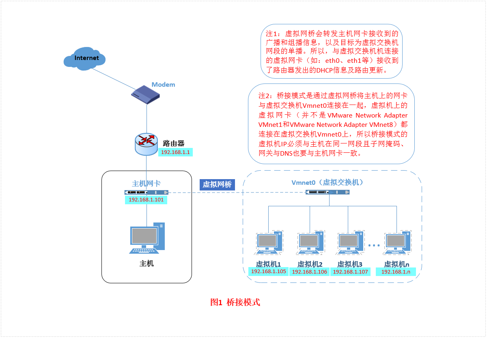

##	VMware网络模式

###	虚拟网络组件

####	虚拟交换机

*Virtual Network Editor*中默认有三个**虚拟交换机**

-	*VMnet0(Bridged)*：桥接模式下的虚拟交换机
-	*VMnet1(Host-only)*；仅主机模式下的虚拟交换机
-	*VMnet8(NAT)*：NAT模式下虚拟交换机

####	虚拟网卡

在宿主机上安装完成VMware后，在*网络适配器*中会安装有两块
虚拟网卡

-	*VMware Network Adapter VMnet1*：主机模式下虚拟网卡
-	*VMware Network Adapter VMnet8*：NAT模式下虚拟网卡

卸载虚拟网卡后，可以*Virtual Network Editor->还原默认设置*，
还原虚拟网卡

###	Bridged

桥接模式：将主机网卡同虚拟机网卡利用**虚拟网桥**进行通信

-	网络结构

	-	在桥接作用下，类似从物理主机虚拟出一个**交换机**
	-	所有桥接设置的虚拟机都连接到这个交换机的接口上
	-	物理主机也同样连接在此交换机上
	-	虚拟机就像是外部局域网中的独立主机，同宿主机逻辑上
		同等地位

-	网络连通性

	-	所以桥接下的网卡与网卡的都是交换模式的，
		**可以相互访问，不受干扰**
	-	虚拟机可以在外部网络上可见

-	机器网络配置

	-	虚拟机IP地址需要和宿主机在同一网段（外网网段）
	-	需要手动配置虚拟机配置IP地址、子网掩码
	-	若需要联网，虚拟机Gateway、DNS需要和主机一致

####	适用场景

-	利用VMware在局域网中新建虚拟服务器，位局域网提供网络服务
-	网络环境ip资源充裕

####	网络设置

-	宿主机网络连接
	-	网络连接属性中*VMware Bridge Protocal*是否勾选
		（安装VMware后一般会默认勾选）
	-	确认宿主机：IP、Gateway、DNS

-	虚拟机网络设置
	-	*编辑虚拟机设置->网络适配器->Bridged/桥接模式*

-	虚拟机网卡配置：网卡配置文件方式参见`config_file`
	-	IP地址要和宿主机IP在同一网段
	-	Gateway默认网关要和宿主机一致

###	NAT

Network Address Translation：网络地址转换，借助
**虚拟NAT设备**、**虚拟DHCP服务器**，使得虚拟机能够联网

-	网络结构

	-	主机网卡与虚拟NAT设备相连
	-	虚拟NAT设备、虚拟DHCP服务器、虚拟机共同连接在虚拟
		交换机VMnet8上
	-	VMnet8通过虚拟网卡VMware Network Adapter VMnet8和
		宿主机相连，宿主机成为双网卡主机，同时参与宿主网络
		和虚拟网络

-	网络连通性

	-	借助虚拟NAT设备连通宿主机**网卡**、虚拟机，实现了
		虚拟机通过宿主机**网卡**联网，所以虚拟机在外部网络
		不可见
	-	VNAV8连通宿主机、虚拟机，使得宿主机可以和虚拟机连通
		，要注意此时宿主机双网卡，连通虚拟局域网的网卡是虚拟
		网卡
	-	虚拟网卡只是起连通虚拟机、宿主机的作用，卸载不影响
		虚拟机连通外网

-	机器网络配置

	-	由于虚拟DHCP服务器的存在，虚拟机无需特殊配置，只需要
		启用虚拟机网卡DHCP服务即可

####	适用场景

-	虚拟系统介入互联网简单，不需要其他配置，只需要宿主机能
	访问网络即可
-	网络ip资源紧缺，且需要虚拟机能够联网

####	网络配置

-	宿主机服务设置
	-	检查宿主机*VMware DHCP Service*、*VMware NAT Service*
		服务是否启动（VMware安装一般默认启动此服务）

-	Virtual Network Eidtor配置
	-	*VMnet8*虚拟交换机默认为NAT模式
	-	配置*VMnet8->子网IP*、*VMnet8->子网掩码*
	-	配置*VMnet8->NAT设置*、*VMnet8->DHCP*参数

-	虚拟机网络配置
	-	*编辑虚拟机设置->网络适配器->NAT模式*

-	虚拟机网卡配置
	-	NAT虚拟网络有DHCP服务，只需要修改`BOOTPRPOTO=dhcp`，
		使用DHCP协议即可
	-	也可以设置静态ip，但是需要注意要在DHCP范围内

###	Host-Only

仅主机模式：将虚拟机与外网隔开，使得虚拟机成为独立系统，只和
主机相互通讯

-	网络结构：类似于NAT模式

	-	NAT模式去除了**虚拟NAT设备**
	-	使用VMware Network Adapter VMnet1虚拟网卡连接宿主机
		、VMnet1交换机
	-	虚拟局域网可以认为是单独从属当前宿主机的私有网络

-	连通性

	-	虚拟机网络、真实网络相互隔离，两者不相互连通
	-	宿主机、虚拟机相互通过虚拟网卡VNAV1相互连接
	-	事实上，可以在**宿主机中**设置，通过将主机网卡共享给
		虚拟网卡VNAV1实现虚拟机联网

####	适用场景

-	特殊的网络调试环境下，要求真实环境、虚拟环境隔离开

####	网络设置

-	虚拟机网络设置
	-	*编辑虚拟机设置->网络适配器->Host-only/仅主机模式*

-	Virtual Network Eidtor配置：类似于NAT模式，只是*VMnet1*
	虚拟交换机才默认为Host-only模式

-	虚拟机网卡配置：类似NAT模式

####	共享宿主机网卡

Host-only模式下下，虚拟局域网默认无法联网，需要将宿主机网卡
共享给给虚拟网卡VNAV8才能实现联网

-	*网络连接->属性->共享->选择VMAV1*

-	共享宿主机网卡可能会要强制修改虚拟网卡VMAV1的ip地址，
	需要根据提示在虚拟网络编辑其中修改虚拟网络的DHCP参数
	

-	然后修改虚拟网卡Gateway、DNS为VMAV1的ip地址

