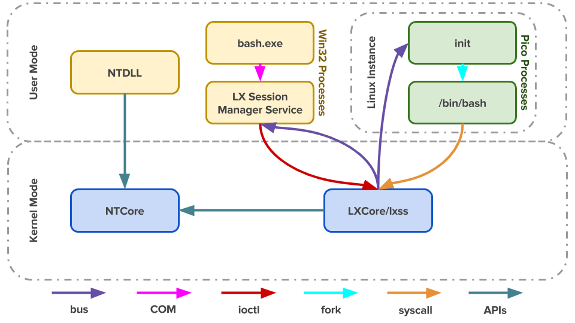

##	说明

WSL是一个兼容层，类似反过来的Wine，但更底层

-	Linux、Windows程序不兼容，是因为二者内核提供的接口不同

	-	如`ls/dir`命令
		-	在Linux下调用`getdents`内核调用
		-	在Windows下调用`NtQueryDirectoryFile`内核调用

-	WSL提供Linux内核接口，并转换为NT内核接口
	-	在WSL中执行`ls`仍然调用`getdents`
	-	WSL收到请求，将系统调用转换为NT内核接口
		`NTQueryDirectoryFile`
	-	NT内核收到WSL请求，返回执行结果
	-	WSL将结果包装后返回

-	毕相较于真正Linux系统仍然有不足

	-	*Docker*等涉及未实现的内核特性软件如法使用
	-	*Raw socket*相关相关操作容易出错
	-	*I/O*性能相对孱弱

###	Cygwin对比



-	Cygwin提供了完整的POSIX系统调用API（以运行库
	`Cygwin*.dll`形式提供，但是仍然工作在*User Mode*

	-	Cygwin将POSIX系统调用转换为Win32 API（因为其架设在
		Win32子系统上），很多内核操作（如：`fork`）受限于
		Win32实现

	-	Linux应用程序必须链接到`Cynwin*.dll`，需要修改源码
		重新编译后才能执行，这样应用程序才不会直接请求内核，
		而是调用Cygwin运行库，且编译出的可执行文件为
		Win32 PE格式封装，只能在Windows下执行

-	WSL中Linux应用程序进程被包裹在*Pico Process*中，其发出的
	所有系统调用会被直接送往*Kernel Mode*中的
	`lxcore.sys`、`lxss.sys`

	-	WSL将POSIX系统调用转换为更底层的NP API调用（WSL和
		Win32平行，直接架设在NT内核上）

	-	可以直接执行ELF格式封装的Linux可执行程序

###	启用

-	控制面板 ->
-	程序和功能 ->
-	启用或关闭windows功能 ->
-	适用于Linux的Windows子系统

###	其他

-	子系统可以替换为其他非官方支持发行版，如
	[archlinux](https://wiki.archlinux.org/index.php/Install_on_WSL_(简体中文))

-	WSL可以可以通过X Server执行GUI应用程序
	<https://news.ycombinator.com/item?id=13603451>

-	WSl官博
	-	<https://blogs.msdn.microsoft.com/wsl/>
	-	<https://blogs.msdn.microsoft.com/commandline/tag/wsl/>

##	使用

###	进入WSL

除在图形界面中点击图标，以默认参数启动，还可以在terminal
（cmd/powershell等）自定义进入WSL参数

-	`wsl.exe`：打开**默认**发行版中默认shell
-	`distroname.exe`：打开**指定**发行版中默认shell
-	`bash.exe`：打开**默认**发行版中bash shell

> - 这些应用程序默认在`path`中，可以直接执行

###	版本管理

-	`wslconfig.exe`可以用于管理多个子系统的发行版

###	WSL、Windows互操作

####	文件

-	Windows所有盘符挂载在WSL中`/mnt`目录下

-	WSL中所有数据存放在`%HOME%/AppData/Local/Packages/{linux发行包名}/LocalState/rootfs`中

	-	不要在Windows下直接修改，造成权限错误

####	命令

-	在cmd中直接调用WSL命令
	```shell
	PS> wsl [-e] ls -al
		// wsl带参数执行
	```
-	在WSL中调用Windows命令行程序（在`$PATH`中）
	```shell
	$ which ipconfig.exe
	$ ipconfig.exe
	```

-	在WSL中启动Windows应用（在`$PATH`中）
	```shell
	$ notepad.exe
	```

-	通过pipes通信
	```shell
	$ cat foo.txt | clip.exe
	PS> ipconfig | wsl grep IPv4
	```

####	端口、环境变量

-	WSL与Windows共享端口（NT内核？）
-	WSL继承Windows的部分环境变量，如：`PATH`

###	Terminal推荐

-	[wsl-terminal](https://github.com/goreliu/wsl-terminal)：
	专为WSL开发的终端模拟器，基于*mintty*、*wslbridge*，稳定
	易用

-	[ConEmu](https://conemu.github.io/)：老牌终端模拟器，
	功能强大

-	[Hyper](https://hyper.is/)：基于Electron的跨平台
	终端模拟器

####	WSL-Terminal

-	WSL-Terminal中包含一些快捷工具
	-	`tools`目录中包含一些脚本，可以通过`wscripts.exe`
		执行修改注册列表，添加一些功能
		-	添加*WSL中vim、emacs等打开*到右键菜单
		-	添加*在WSL中打开文件夹*到右键菜单
	-	`run-wsl-file.exe`可以用于在快捷执行wsl脚本，只需要
		将其选择为文件打开方式
	-	`vim.exe`可以用WSL中vim打开任何文件，当然一般是配合
		`tools/`中脚本在右键注册后使用

-	配置
	-	配置文件`etc/wsl-terminal.conf`
	-	主题文件`etc/themes/`
	-	*mintty*配置文件`etc/mintty`

> - <https://zhuanlan.zhihu.com/p/22033219>
> - 因为*wslbridge*的原因，WSL-Terminal必须在NTFS文件系统中
	使用
> - *mintty*本身依赖*cmd*，包括字体等在内配置受限于*cmd*
    <https://www.zhihu.com/question/36344262/answer/67191917>、
	<https://www.zhihu.com/question/38752831>

##	其他问题

###	文件权限问题

-	在WSL中，windows实现了两种文件系统用于支持不同使用场景

####	VolFs

VolFs：着力于在windows文件系统上提供完整的linux文件系统特性
，通过各种手段实现了对*Inodes*、*Directory Entries*、
*File Objects*、*File Descriptors*、*Special File Types*
的支持

-	为支持*Inodes*，VolFS会把文件权限等信息保存在
	*NTFS Extended Attributes*中

	-	在Windows中新建的文件缺少此扩展参数，有些编辑器也会
		在保存文件是去掉这些附加参数
	-	所以不要在Windows中修改WSL文件，否则VolFs无法正确
		获得文件metadata

-	WSL中`/`就是VolFs文件系统

> - <https://blogs.msdn.microsoft.com/wsl/2016/06/15/wsl-file-system-support/>
> - <https://blogs.msdn.microsoft.com/commandline/2018/01/12/chmod-chown-wsl-improvements/>

####	DrvFs

DrvFs：着力提供于Windows系统的互操作性，从Windows的文件权限
（即文件->属性->安全选项卡中的权限）推断出文件对应Linux权限

-	所有windows盘符挂在在WSL中`/mnt`是都使用DrvFs文件系统

-	由于DrvFs文件权限继承机制很微妙，结果就是所有文件权限
	都是**0777**

	-	所以`ls`结果都是绿色的
	-	早期DrvFs不支持metadata，在*Build 17063*之后支持
		文件写入metadata，但是需要重新挂载磁盘


-	可以通过设置DrvFs metadata设置默认文件权限

	```shell
	$ sudo umount /mnt/e
	$ sudo mount -t drvfs E: /mnt/e -o metadata
		// 此时虽然支持文件权限修改，但默认权限仍然是*0777*
	$ sudo mount -t drvfs E: /mnt/e -o metadata,uid=1000,gid=1000,umask=22,fmask=111
		// 此时磁盘中默认文件权限为*0644*
	```

> - 更合适的方式是通过`/etc/wsl.conf`配置DrvFs自动挂载属性

###	AutoMatically Configuring WSL

```cnf
 # `/etc/wsl.conf`
[automount]
 # 是否自动挂载
enabled = true
 # 是否处理`/etc/fstab`文件
mountFsTab = true
 # 挂载路径
root = /mnt/
 # DrvFs挂载选项，若需要针对不同drive配置，建议使用`/etc/fstab`
options = "metadata,umask=023,dmask=022,fmask=001"
[network]
generateHosts = true
generateResolvConf = true
[interop]
 # 是否允许WSL载入windows进程
enabled = true
appendWindowsPath = true
```

-	如果需要给不同盘符设置不同挂载参数，需要**再**修改
	`/etc/fstab`

	```cnf
	E: /mnt/e drvfs rw,relatime,uid=1000,gid=1000,metadata,umask=22,fmask=111 0 0
	```

> - Automatically Configuring WSL
> - -	<https://blogs.msdn.microsoft.com/commandline/2018/02/07/automatically-configuring-wsl/>
> -	-	<https://devblogs.microsoft.com/commandline/automatically-configuring-wsl/>


